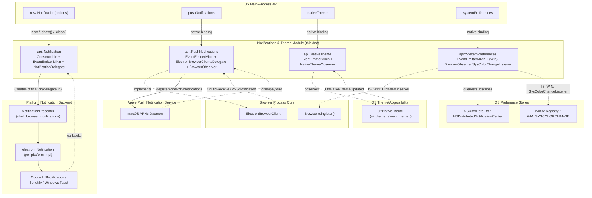
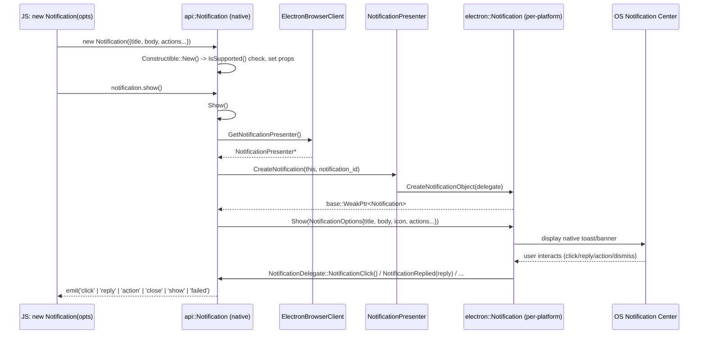
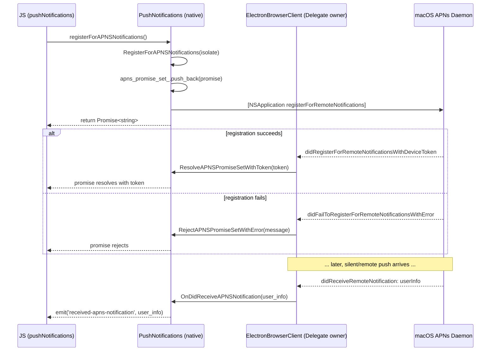
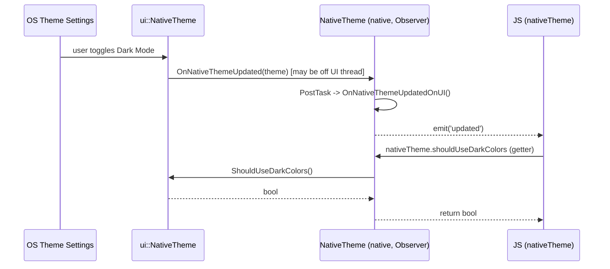
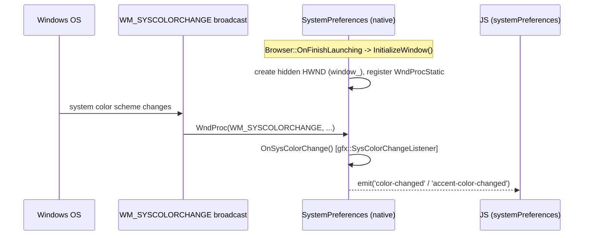

# Notifications & Theme System Integration Module

## Introduction

The **Notifications & Theme System Integration** module is the native (C++/Gin-bound)
implementation backing four independent, OS-facing JavaScript API surfaces in Electron's
main process:

- **`Notification`** — creates and displays native OS desktop notifications (toast on
  Windows, `UNNotification`/`NSUserNotification` on macOS, `libnotify` on Linux), with support
  for actions, replies, sounds, and lifecycle events.
- **`pushNotifications`** — registers the app for, and receives, Apple Push Notification
  Service (APNs) tokens and silent/remote push payloads (macOS only).
- **`nativeTheme`** — observes and controls whether the application should render using the
  OS light/dark color scheme, high-contrast mode, or forced-colors/reduced-transparency
  accessibility settings.
- **`systemPreferences`** — a grab-bag of miscellaneous OS/desktop-environment preference
  queries: accent color, media access status (camera/mic/screen), Windows registry-style
  "user defaults" equivalents on macOS, Touch ID prompts, animation settings, and Win32
  system-color-change notifications.

All four classes are defined under `shell/browser/api/` and are four of the eight
independent, single-purpose Gin-wrapped classes that make up the parent
[System Integration module](shell_browser_api_system_device_system_integration.md). They are
grouped into this single document because they share a common shape — small, mostly
stateless façades over a native OS notification/preferences subsystem — even though they have
**no compile-time dependency on one another**.

This module is a **leaf** node in the documentation tree, sibling to:

- [Input & Display System Integration](shell_browser_api_system_device_system_integration_input_display.md) — `GlobalShortcut`, `Screen`
- [Power System Integration](shell_browser_api_system_device_system_integration_power.md) — `PowerMonitor`, `PowerSaveBlocker`

---

## Purpose & Core Functionality

| Component | Header | Responsibility |
|---|---|---|
| `Notification` | `shell/browser/api/electron_api_notification.h` | Gin-constructible, event-emitting JS-facing wrapper around a platform `electron::Notification` object, obtained from a per-process `NotificationPresenter`. Surfaces notification lifecycle (`show`, `click`, `close`, `reply`, `action`, `failed`) as JS events. |
| `PushNotifications` | `shell/browser/api/electron_api_push_notifications.h` | Singleton, event-emitting object that registers for and relays Apple Push Notification Service (APNs) device tokens and remote-notification payloads on macOS, implementing `ElectronBrowserClient::Delegate` and `BrowserObserver` to hook into platform-level OS callbacks and app lifecycle. |
| `NativeTheme` | `shell/browser/api/electron_api_native_theme.h` | Singleton, event-emitting wrapper around two `ui::NativeTheme*` instances (one for native UI chrome, one for web content) that lets JS read/override the light/dark "theme source" and query accessibility color settings, observing `ui::NativeThemeObserver` callbacks. |
| `SystemPreferences` | `shell/browser/api/electron_api_system_preferences.h` | Singleton, event-emitting grab-bag object exposing platform-specific OS preference queries and subscriptions (macOS `NSDistributedNotificationCenter`/`NSNotificationCenter`/`NSWorkspaceNotificationCenter` bridging, Windows system-color-change events via a hidden message-only window, Touch ID prompting, media access status/requests). |

Each class:

- Extends `gin_helper::DeprecatedWrappable<T>` (see
  [Common Native Gin Infrastructure](Common_Native_Gin_Infrastructure.md)) so it can be
  exposed to JS as a wrapped native object.
- Mixes in `gin_helper::EventEmitterMixin<T>`, giving it Node.js `EventEmitter` semantics
  (`.emit()`) used to surface asynchronous OS callbacks (notification clicked, theme changed,
  system color changed, APNs token received, etc.) back into JavaScript.
- Is created via a static factory method — `New()`/`Create(isolate)` — following the same
  pattern used throughout the sibling
  [Input & Display](shell_browser_api_system_device_system_integration_input_display.md) and
  [Power](shell_browser_api_system_device_system_integration_power.md) sub-modules.

Unlike `GlobalShortcut`/`Screen`/`PowerMonitor`/`PowerSaveBlocker`, three of the four classes
here (`Notification`, `PushNotifications`, `SystemPreferences`) additionally hook directly
into other core Electron browser-process abstractions:

- `Notification` is also `gin_helper::Constructible<Notification>` (it is a real JS
  constructor, i.e. `new Notification(options)`, unlike the other seven singleton-style
  classes in the parent module) and `gin_helper::CleanedUpAtExit`, and implements the pure
  virtual `NotificationDelegate` interface so the platform notification backend can call back
  into it directly.
- `PushNotifications` implements `ElectronBrowserClient::Delegate` (see
  [Browser Process Core & Lifecycle](Browser_Process_Core_%26_Lifecycle.md)) so that
  platform-level APNs registration callbacks (routed through `AppDelegate`/
  `ElectronBrowserClient` on macOS) reach it, and `BrowserObserver` (private) so it can react
  to app lifecycle events.
- `SystemPreferences`, on Windows only, implements `BrowserObserver` (to receive
  `OnFinishLaunching`) and `gfx::SysColorChangeListener` (to receive `OnSysColorChange`), tying
  its lifecycle to the `Browser` singleton documented in
  [Browser Process Core & Lifecycle](Browser_Process_Core_%26_Lifecycle.md).

---

## Architecture Overview

Notification *presentation* itself (the actual libnotify/Cocoa/Toast rendering code) lives
outside this module, in
[Platform-Specific Integration → Notifications](Platform-Specific_Integration.md); the
`Notification` class documented here is the cross-platform **Gin-wrapped façade** consumed
from JS. It delegates all real display work to a `NotificationPresenter`/`electron::Notification`
pair obtained through `ElectronBrowserClient::GetNotificationPresenter()`.

---

## Component Details

### Notification

`Notification` (`shell/browser/api/electron_api_notification.h`) is the only **constructible**
(`new Notification(...)`) class in this module — all three siblings are process-wide
singletons instead.

**Key responsibilities:**

- Implements `gin_helper::Constructible<Notification>::New()` — validates that the platform
  supports notifications (`Notification::IsSupported()`) and constructs a wrapped instance
  from a JS options object via `gin::Arguments`.
- Holds notification content/config as plain data members: `title_`, `subtitle_`, `body_`,
  `icon_` (`gfx::Image`), `silent_`, `has_reply_`, `timeout_type_`, `reply_placeholder_`,
  `sound_`, `urgency_`, `actions_` (`std::vector<electron::NotificationAction>`),
  `close_button_text_`, and (Windows only) `toast_xml_` for raw custom Toast XML.
- `Show()` — obtains the process-wide `NotificationPresenter` (via
  `ElectronBrowserClient::Get()->GetNotificationPresenter()`), calls
  `CreateNotification(this, notification_id)` to obtain a `base::WeakPtr<electron::Notification>`
  in `notification_`, then calls `Show(NotificationOptions)` on it with the current property
  values packaged up.
- `Close()` — calls `Dismiss()` on the underlying native notification if it still exists.
- Implements every `NotificationDelegate` virtual callback
  (`NotificationAction`, `NotificationClick`, `NotificationReplied`, `NotificationDisplayed`,
  `NotificationDestroyed`, `NotificationClosed`, `NotificationFailed`), translating each into a
  corresponding JS event emission (`action`, `click`, `reply`, `show`, `close`, `failed`).
- Implements `gin_helper::CleanedUpAtExit::WillBeDestroyed()` to proactively tear down any
  live native notification when the process is exiting, avoiding dangling platform callbacks.

**Dependencies:**

- `electron::Notification`, `electron::NotificationDelegate`, `electron::NotificationPresenter`
  — the cross-platform native notification interfaces (see
  [Platform-Specific Integration → Notifications](Platform-Specific_Integration.md)).
- `ElectronBrowserClient::GetNotificationPresenter()` — see
  [Browser Process Core & Lifecycle](Browser_Process_Core_%26_Lifecycle.md).
- `gin_helper::Constructible<T>`, `gin_helper::CleanedUpAtExit`, `gin_helper::DeprecatedWrappable<T>`,
  `gin_helper::EventEmitterMixin<T>` — see
  [Common Native Gin Infrastructure](Common_Native_Gin_Infrastructure.md).
- `gfx::Image` for the notification icon.

### PushNotifications

`PushNotifications` (`shell/browser/api/electron_api_push_notifications.h`) is the native
backing of the `pushNotifications` JS singleton, and is macOS-specific in almost all of its
real behavior (guarded by `BUILDFLAG(IS_MAC)`), though the class itself compiles on all
platforms as an empty event-emitter shell elsewhere.

**Key responsibilities:**

- `PushNotifications::Get()` returns the process-wide singleton instance; `Create(isolate)`
  wraps it for exposure to JS.
- Maintains `apns_promise_set_` — a `std::vector<gin_helper::Promise<std::string>>` of pending
  JS promises awaiting the result of an in-flight APNs device-token registration.
- On macOS:
  - `RegisterForAPNSNotifications(isolate)` — kicks off OS-level APNs registration and returns
    a JS `Promise<string>` (the eventual device token), added to `apns_promise_set_`.
  - `UnregisterForAPNSNotifications()` — cancels an existing device-token registration.
  - `OnDidReceiveAPNSNotification(user_info)` — called by `ElectronBrowserClient` (as its
    `Delegate`) when a push payload arrives; emits it to JS as a `received-apns-notification`
    style event.
  - `ResolveAPNSPromiseSetWithToken(token)` / `RejectAPNSPromiseSetWithError(message)` —
    resolve or reject every pending promise in `apns_promise_set_` in response to the OS-level
    registration outcome.
- Implements `BrowserObserver` privately to tie its lifecycle to app startup/shutdown timing.

**Dependencies:**

- `ElectronBrowserClient::Delegate` — see
  [Browser Process Core & Lifecycle](Browser_Process_Core_%26_Lifecycle.md); `PushNotifications`
  registers itself as the delegate so `ElectronBrowserClient` can forward native
  `application:didReceiveRemoteNotification:` and related `AppDelegate` callbacks to it.
- `BrowserObserver` — see [Browser Process Core & Lifecycle](Browser_Process_Core_%26_Lifecycle.md).
- `gin_helper::Promise<std::string>` — see
  [Common Native Gin Infrastructure](Common_Native_Gin_Infrastructure.md).
- `gin_helper::EventEmitterMixin<PushNotifications>`, `gin_helper::DeprecatedWrappable<PushNotifications>`.

### NativeTheme

`NativeTheme` (`shell/browser/api/electron_api_native_theme.h`) is the native backing of the
`nativeTheme` JS singleton, wrapping Chromium's `ui::NativeTheme` for both native UI chrome and
web content rendering.

**Key responsibilities:**

- Holds two raw, non-owning pointers: `ui_theme_` and `web_theme_` (both `ui::NativeTheme*`),
  representing the theme used for native OS widgets/chrome vs. the theme used for rendering
  web content — these may diverge (e.g. an app can force web content dark while native UI
  follows the OS).
- `SetThemeSource(ThemeSource)` / `GetThemeSource()` — lets JS force `light`, `dark`, or
  `system` (the default, following the OS) theme; on macOS, additionally calls
  `UpdateMacOSAppearanceForOverrideValue()` to propagate the choice to the native
  `NSApplication` appearance.
- Query methods surfaced to JS: `ShouldUseDarkColors()`, `ShouldUseHighContrastColors()`,
  `ShouldUseDarkColorsForSystemIntegratedUI()`, `ShouldUseInvertedColorScheme()`,
  `InForcedColorsMode()`, `GetPrefersReducedTransparency()`.
- Implements `ui::NativeThemeObserver::OnNativeThemeUpdated(theme)` (private), which reposts
  to the UI thread via `OnNativeThemeUpdatedOnUI()` and emits an `updated` event to JS whenever
  the OS-level theme changes (e.g. user toggles dark mode in system settings).
- Provides a custom `gin::Converter<ui::NativeTheme::ThemeSource>` specialization so the
  `ThemeSource` enum round-trips cleanly between V8 strings (`"system"`/`"light"`/`"dark"`) and
  the native enum.

**Dependencies:**

- `ui::NativeTheme`, `ui::NativeThemeObserver` — Chromium's cross-platform theme abstraction
  (`//ui/native_theme`).
- `gin_helper::EventEmitterMixin<NativeTheme>`, `gin_helper::DeprecatedWrappable<NativeTheme>`.
- Custom `gin::Converter` specialization — see
  [Gin Converters](Common_Native_Gin_Infrastructure.md).

### SystemPreferences

`SystemPreferences` (`shell/browser/api/electron_api_system_preferences.h`) is the largest and
most heavily `#if`-gated class in this module — its API surface differs substantially between
Windows, macOS, and other platforms (Linux gets only the small cross-platform surface).

**Key responsibilities (cross-platform):**

- `GetAnimationSettings(isolate)` — returns OS animation-preference flags (e.g. reduced
  motion), available on all platforms.

**Windows- and macOS-shared (`IS_WIN || IS_MAC`):**

- `GetAccentColor()` (static) / `GetColor(thrower, name)` — query the OS accent/system color
  palette.
- `GetMediaAccessStatus(thrower, media_type)` — queries camera/microphone/screen-recording
  permission status.

**Windows-only:**

- `InitializeWindow()` — creates a hidden message-only `HWND` (`window_`, `atom_`, `instance_`)
  purely to receive `WM_SYSCOLORCHANGE` and related broadcast messages via a static
  `WndProcStatic`/`WndProc` pair.
- Implements `gfx::SysColorChangeListener::OnSysColorChange()` to emit a `color-changed` /
  `accent-color-changed` style event to JS whenever Windows system colors change.
- Implements `BrowserObserver::OnFinishLaunching(launch_info)` (private, from
  [Browser Process Core & Lifecycle](Browser_Process_Core_%26_Lifecycle.md)) to defer
  window/listener initialization until the app has finished launching.

**macOS-only:**

- A rich notification-subscription API bridging three distinct native Cocoa notification
  centers, each with its own subscribe/unsubscribe/post triplet:
  - `NSDistributedNotificationCenter` — `SubscribeNotification` / `UnsubscribeNotification` / `PostNotification`.
  - `NSNotificationCenter` (local) — `SubscribeLocalNotification` / `UnsubscribeLocalNotification` / `PostLocalNotification`.
  - `NSWorkspaceNotificationCenter` — `SubscribeWorkspaceNotification` / `UnsubscribeWorkspaceNotification` / `PostWorkspaceNotification`.
  - All three share a common private implementation, `DoSubscribeNotification`/
    `DoUnsubscribeNotification`, parameterized by a `NotificationCenterKind` enum.
- `GetUserDefault` / `SetUserDefault` / `RemoveUserDefault` / `RegisterDefaults` — read/write
  `NSUserDefaults`-backed preferences by name and type.
- `IsSwipeTrackingFromScrollEventsEnabled()`, `AccessibilityDisplayShouldReduceTransparency()`,
  `GetSystemColor(thrower, name)`, `GetEffectiveAppearance(isolate)` — miscellaneous
  accessibility/appearance queries.
- `CanPromptTouchID()` / `PromptTouchID(isolate, reason)` — Touch ID biometric authentication,
  returning a JS `Promise`.
- `IsTrustedAccessibilityClient(prompt)` (static) — checks/prompts for Accessibility API trust.
- `AskForMediaAccess(isolate, media_type)` — requests camera/mic permission, returning a JS
  `Promise`.

**Dependencies:**

- (Windows) `Browser`, `BrowserObserver` — see
  [Browser Process Core & Lifecycle](Browser_Process_Core_%26_Lifecycle.md).
- (Windows) `gfx::SysColorChangeListener`, `gfx::ScopedSysColorChangeListener` — `//ui/gfx`.
- `gin_helper::ErrorThrower`, `gin_helper::EventEmitterMixin<SystemPreferences>`,
  `gin_helper::DeprecatedWrappable<SystemPreferences>` — see
  [Common Native Gin Infrastructure](Common_Native_Gin_Infrastructure.md).
- `base::Value::Dict` — used pervasively for structured `user_info` payloads passed to/from
  macOS notification callbacks.

---

## Data Flow

### Notification Lifecycle (Construct → Show → Native Callback → JS Event)

### PushNotifications: APNs Registration (macOS)

### NativeTheme: OS Theme Change Propagation

### SystemPreferences: Windows System Color Change

---

## Component Interaction (Class Relationships)

```mermaid
classDiagram
    class Notification {
        -u16string title_
        -u16string subtitle_
        -u16string body_
        -gfx::Image icon_
        -bool silent_
        -bool has_reply_
        -vector~NotificationAction~ actions_
        -WeakPtr~electron::Notification~ notification_
        -raw_ptr~NotificationPresenter~ presenter_
        +static IsSupported() bool
        +static New(thrower, args) Handle~Notification~
        +static FillObjectTemplate(isolate, tmpl)
        -Show()
        -Close()
        +NotificationAction(index)
        +NotificationClick()
        +NotificationReplied(reply)
        +NotificationDisplayed()
        +NotificationDestroyed()
        +NotificationClosed()
        +NotificationFailed(error)
        +WillBeDestroyed()
    }

    class NotificationDelegate { <<interface>> }
    class Constructible~T~ { <<template>> }
    class CleanedUpAtExit { <<interface>> }
    class DeprecatedWrappable~T~ { <<template>> }
    class EventEmitterMixin~T~ { <<template>> }

    Notification ..|> NotificationDelegate
    Notification --|> Constructible
    Notification --|> CleanedUpAtExit
    Notification --|> DeprecatedWrappable
    Notification --|> EventEmitterMixin
    Notification --> "0..1" NativeNotification : notification_ (weak)

    class NativeNotification {
        <<electron::Notification>>
    }

    class PushNotifications {
        -vector~Promise~string~~ apns_promise_set_
        +static Get() PushNotifications*
        +static Create(isolate) Handle~PushNotifications~
        +OnDidReceiveAPNSNotification(user_info)  [macOS]
        +ResolveAPNSPromiseSetWithToken(token)  [macOS]
        +RejectAPNSPromiseSetWithError(msg)  [macOS]
        -RegisterForAPNSNotifications(isolate) Promise~string~  [macOS]
        -UnregisterForAPNSNotifications()  [macOS]
    }

    class ElectronBrowserClientDelegate { <<interface>> }
    class BrowserObserver { <<interface>> }

    PushNotifications ..|> ElectronBrowserClientDelegate
    PushNotifications ..|> BrowserObserver : private
    PushNotifications --|> DeprecatedWrappable
    PushNotifications --|> EventEmitterMixin

    class NativeTheme {
        -raw_ptr~ui::NativeTheme~ ui_theme_
        -raw_ptr~ui::NativeTheme~ web_theme_
        +static Create(isolate) Handle~NativeTheme~
        +SetThemeSource(source)
        +GetThemeSource() ThemeSource
        +ShouldUseDarkColors() bool
        +ShouldUseHighContrastColors() bool
        +ShouldUseInvertedColorScheme() bool
        +InForcedColorsMode() bool
        +GetPrefersReducedTransparency() bool
        -OnNativeThemeUpdated(theme)
        -OnNativeThemeUpdatedOnUI()
    }

    class NativeThemeObserver { <<interface>> }

    NativeTheme ..|> NativeThemeObserver : private
    NativeTheme --|> DeprecatedWrappable
    NativeTheme --|> EventEmitterMixin

    class SystemPreferences {
        -string current_color_  [Windows]
        -HWND window_  [Windows]
        +static Create(isolate) Handle~SystemPreferences~
        +static GetAccentColor() string  [Win/Mac]
        +GetColor(thrower, name) string  [Win/Mac]
        +GetMediaAccessStatus(thrower, type) string  [Win/Mac]
        +GetAnimationSettings(isolate) Value
        +InitializeWindow()  [Windows]
        +OnSysColorChange()  [Windows]
        +OnFinishLaunching(launch_info)  [Windows]
        +CanPromptTouchID() bool  [macOS]
        +PromptTouchID(isolate, reason) Promise  [macOS]
        +AskForMediaAccess(isolate, type) Promise  [macOS]
        -DoSubscribeNotification(name, cb, kind) int  [macOS]
        -DoUnsubscribeNotification(id, kind)  [macOS]
    }

    class SysColorChangeListener { <<interface>> }

    SystemPreferences ..|> BrowserObserver : private, Windows only
    SystemPreferences ..|> SysColorChangeListener : private, Windows only
    SystemPreferences --|> DeprecatedWrappable
    SystemPreferences --|> EventEmitterMixin
```

---

## Integration with the Broader System

- **Parent module:** [System Integration](shell_browser_api_system_device_system_integration.md),
  itself nested under [System & App-Level Services API](shell_browser_api_system_device.md).
- **Sibling modules:**
  - [Input & Display System Integration](shell_browser_api_system_device_system_integration_input_display.md) — `GlobalShortcut`, `Screen`
  - [Power System Integration](shell_browser_api_system_device_system_integration_power.md) — `PowerMonitor`, `PowerSaveBlocker`
- **Platform notification rendering:**
  [Platform-Specific Integration → Notifications](Platform-Specific_Integration.md) —
  supplies the concrete `electron::Notification`/`NotificationPresenter` implementations
  (`CocoaNotification`/`NotificationPresenterMac`, `LibnotifyNotification`/
  `NotificationPresenterLinux`, `WindowsToastNotification`/`NotificationPresenterWin`) that the
  `api::Notification` façade in this module delegates to. It also defines
  `PlatformNotificationService`, the Web Notifications (`content::PlatformNotificationService`)
  bridge used for notifications originating from web content rather than the `Notification` JS
  constructor.
- **Browser process lifecycle:**
  [Browser Process Core & Lifecycle](Browser_Process_Core_%26_Lifecycle.md) — supplies
  `ElectronBrowserClient` (owner of the process-wide `NotificationPresenter` and the delegate
  slot used by `PushNotifications`) and the `Browser`/`BrowserObserver` singleton used by
  `PushNotifications` and, on Windows, `SystemPreferences`.
- **Native binding infrastructure:**
  [Common Native Gin Infrastructure](Common_Native_Gin_Infrastructure.md) — supplies
  `DeprecatedWrappable`, `EventEmitterMixin`, `Constructible`, `CleanedUpAtExit`,
  `Handle<T>`, `Promise<T>`, `ErrorThrower`, and `ObjectTemplateBuilder`, used across all four
  classes in this module.
- **Chromium platform abstractions:** `ui::NativeTheme`/`ui::NativeThemeObserver` (`//ui/native_theme`)
  for `NativeTheme`; `gfx::SysColorChangeListener` (`//ui/gfx`) for `SystemPreferences` on
  Windows.

---

## Lifecycle Notes

- **`Notification`** instances are per-call: each `new Notification(...)` from JS creates a new
  wrapped object holding its own configuration; the underlying native `electron::Notification`
  is only created lazily when `.show()` is called, and is tracked by a `base::WeakPtr` so that
  the JS wrapper safely tolerates the native object being destroyed by the platform (e.g. when
  the user dismisses it) before `.close()` is ever called. `CleanedUpAtExit` ensures any
  still-live notification is torn down before process exit rather than leaking a dangling
  platform callback.
- **`PushNotifications`** and **`NativeTheme`** and **`SystemPreferences`** are all
  process-wide singletons (`Get()`/`Create(isolate)` return/wrap the same underlying instance
  across calls), matching the pattern used by `PowerMonitor`/`GlobalShortcut`/`Screen` in the
  sibling sub-modules — these objects must persist observer registrations
  (`NativeThemeObserver`, `BrowserObserver`, Win32 window procedures) for the lifetime of the
  application regardless of whether JS still holds a reference.
- **`SystemPreferences`** on Windows defers creating its hidden message-only window until
  `Browser::OnFinishLaunching` fires, avoiding creating a Win32 window before the message loop
  and browser process are fully initialized.
- Because `NativeTheme` observes callbacks that may originate off the UI thread depending on
  platform, `OnNativeThemeUpdated` always reposts through `OnNativeThemeUpdatedOnUI()` before
  emitting the JS event, ensuring V8 access always happens on the correct sequence.
