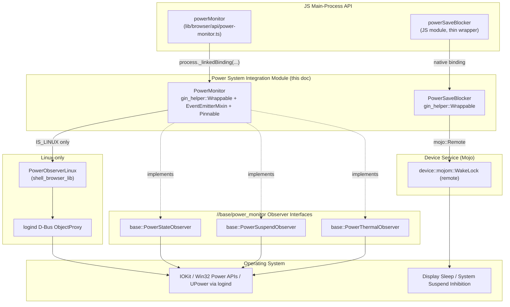
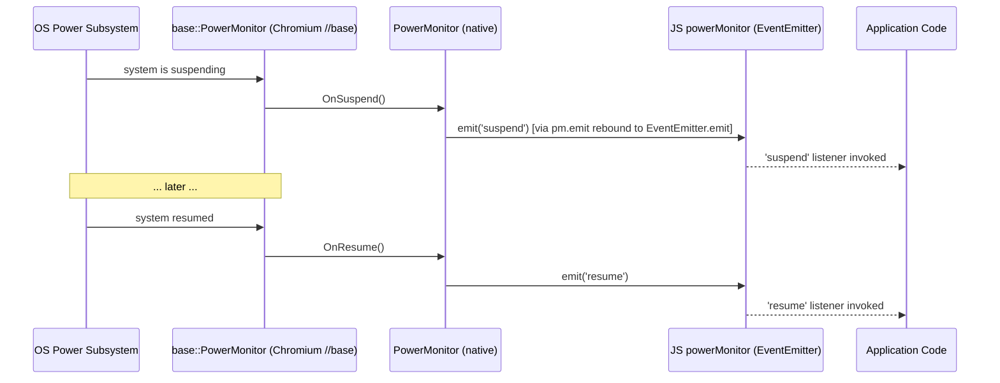
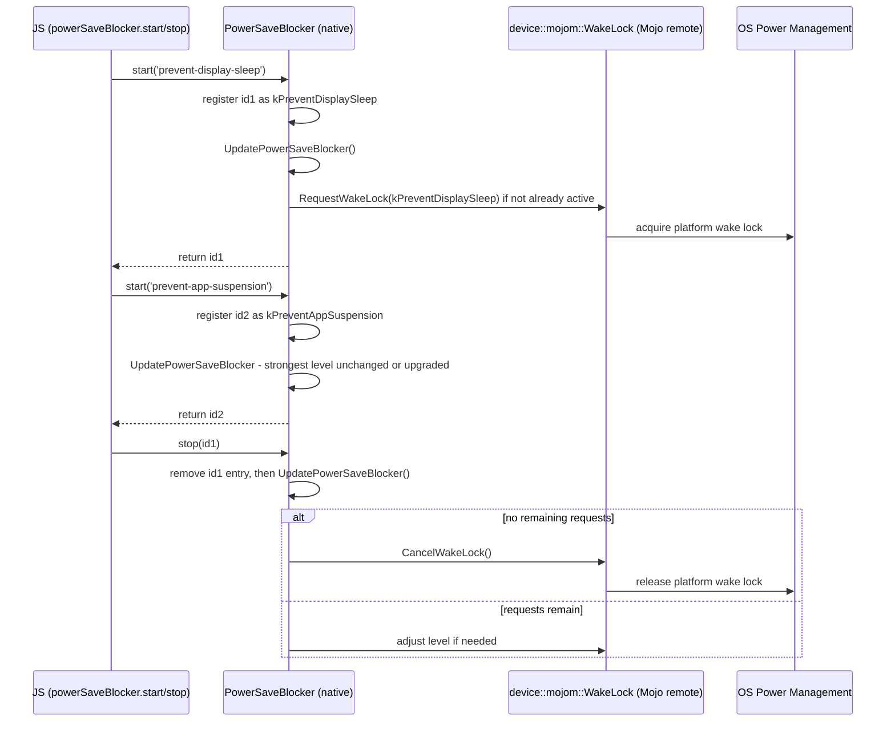
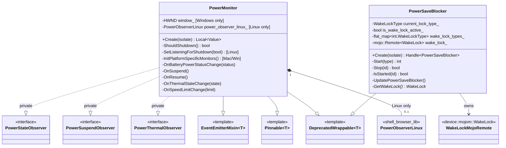

# Power System Integration Module

## Introduction

The **Power System Integration** module is the native (C++/Gin-bound) implementation backing two of Electron's OS-power-related JavaScript APIs:

- **`powerMonitor`** — observes operating-system power-state transitions (suspend/resume, AC↔battery, thermal throttling, and — on Linux — participation in the `logind` shutdown sequence) and re-emits them as Node.js-style events in the main process.
- **`powerSaveBlocker`** — allows application code to prevent the OS from dimming the display or suspending the system (e.g., during video playback or long-running downloads) by acquiring a platform **wake lock**.

Both classes are defined in `shell/browser/api/electron_api_power_monitor.h` (`PowerMonitor`) and `shell/browser/api/electron_api_power_save_blocker.h` (`PowerSaveBlocker`), and are two of the eight independent, single-purpose Gin-wrapped classes that make up the parent [System Integration module](shell_browser_api_system_device_system_integration.md). They share no code dependency on each other; they are grouped together here purely because both concern *system power management*.

This module is a **leaf** node in the documentation tree, sibling to:
- [Input & Display System Integration](shell_browser_api_system_device_system_integration_input_display.md) — `GlobalShortcut`, `Screen`
- [Notifications & Theme System Integration](shell_browser_api_system_device_system_integration_notifications_theme.md) — `Notification`, `PushNotifications`, `NativeTheme`, `SystemPreferences`

> **Note:** The JavaScript-facing wrapper for `PowerMonitor` (`lib/browser/api/power-monitor.ts`) and its Linux D-Bus/`logind` companion (`PowerObserverLinux`) are already documented in depth in **[System Monitoring Module (`PowerMonitor`)](lib_browser_api_system_monitoring.md)**. This document focuses on the native `PowerMonitor`/`PowerSaveBlocker` C++ classes themselves, their place within the System & App-Level Services API, and how they relate to `PowerSaveBlocker`, which has no dedicated JS-layer documentation elsewhere. Refer to that document for the full lazy-initialization sequence, the `logind` inhibitor state machine, and the public JS API surface table for `powerMonitor`.

---

## Purpose & Core Functionality

| Component | Header | Responsibility |
|---|---|---|
| `PowerMonitor` | `shell/browser/api/electron_api_power_monitor.h` | Singleton, event-emitting Gin-wrapped object that observes `base::PowerStateObserver`, `base::PowerSuspendObserver`, and `base::PowerThermalObserver` callbacks from Chromium's `//base/power_monitor`, and (on Linux) composes a `PowerObserverLinux` to inhibit/allow `logind` shutdown and sleep. |
| `PowerSaveBlocker` | `shell/browser/api/electron_api_power_save_blocker.h` | Gin-wrapped object that manages a reference-counted set of "block" requests (`Start`/`Stop`/`IsStarted`), translating them into a single active `device::mojom::WakeLock` Mojo connection at the strongest currently-requested level. |

Both classes:
- Extend `gin_helper::DeprecatedWrappable<T>` (see [Common Native Gin Infrastructure](Common_Native_Gin_Infrastructure.md)) so they can be constructed once and exposed to JS as plain wrapped objects.
- Are created via a static factory (`Create(isolate)`), following the same pattern as sibling classes `GlobalShortcut` and `Screen` (see [Input & Display System Integration](shell_browser_api_system_device_system_integration_input_display.md)).
- Have no compile-time dependency on each other, on `GlobalShortcut`/`Screen`, or on `Notification`/`NativeTheme`/`SystemPreferences`/`PushNotifications` — each is an independently pluggable façade over a distinct Chromium/OS subsystem.

`PowerMonitor` additionally mixes in `gin_helper::EventEmitterMixin<PowerMonitor>` and `gin_helper::Pinnable<PowerMonitor>`, giving it Node.js `EventEmitter` semantics (`.emit()`) and letting it be "pinned" (kept alive) for the lifetime of the process regardless of JS garbage collection, since it must keep listening to OS power callbacks even if no JS reference is retained. `PowerSaveBlocker` does **not** emit events — it is a purely imperative request/release API.

---

## Architecture Overview

Notably, `PowerMonitor::InitPlatformSpecificMonitors()` is only compiled on macOS/Windows (`BUILDFLAG(IS_MAC) || BUILDFLAG(IS_WIN)`), where it sets up a hidden message-only window (`window_`, `WndProc`) on Windows to receive `WM_POWERBROADCAST` messages, or platform-specific IOKit registration on macOS. On Linux, the equivalent role — participating in the shutdown negotiation — is delegated entirely to the composed `PowerObserverLinux` member (`power_observer_linux_`), documented in [shell_browser_lib](shell_browser_lib.md).

---

## Component Details

### PowerMonitor

`PowerMonitor` (`shell/browser/api/electron_api_power_monitor.h`) is the native backing of the `powerMonitor` JS singleton.

**Key responsibilities:**
- Implements three Chromium observer interfaces from `//base/power_monitor`:
  - `base::PowerStateObserver::OnBatteryPowerStatusChange` — fires when the machine switches between AC and battery power.
  - `base::PowerSuspendObserver::OnSuspend` / `OnResume` — fires around system sleep/wake.
  - `base::PowerThermalObserver::OnThermalStateChange` / `OnSpeedLimitChange` — fires on thermal throttling state and CPU speed-limit changes (used for Electron's `thermal-state-change`/`speed-limit-change` events).
- On **Linux**, composes a `PowerObserverLinux power_observer_linux_{this}` member and exposes `SetListeningForShutdown(bool)` and the private `ShouldShutdown()` predicate, which together implement `logind`-based shutdown inhibition — allowing the JS `shutdown` event listener chain to influence whether the OS is permitted to proceed with a shutdown request. See [System Monitoring Module](lib_browser_api_system_monitoring.md) for the full state machine.
- On **macOS/Windows**, calls `InitPlatformSpecificMonitors()` during construction; on Windows this additionally maintains a private message-only window (`atom_`, `instance_`, `window_`, `WndProc`/`WndProcStatic`) to intercept `WM_POWERBROADCAST`/session-lock notifications used for `lock-screen`/`unlock-screen` events.
- Exposes itself to JS through `GetObjectTemplateBuilder`, and is registered as a **pinned** wrappable (`gin_helper::Pinnable<PowerMonitor>`) so the singleton is not garbage-collected while native OS observers are still registered against it.

**Dependencies:**
- `base::PowerMonitor` observer interfaces (`//base/power_monitor`).
- `ui::IdleState`/idle-time helpers (`ui/base/idle/idle.h`) backing `getSystemIdleState`/`getSystemIdleTime` in the JS layer.
- `PowerObserverLinux` (Linux only) — see [shell_browser_lib](shell_browser_lib.md).
- `gin_helper::DeprecatedWrappable`, `gin_helper::EventEmitterMixin`, `gin_helper::Pinnable` — see [Common Native Gin Infrastructure](Common_Native_Gin_Infrastructure.md).

### PowerSaveBlocker

`PowerSaveBlocker` (`shell/browser/api/electron_api_power_save_blocker.h`) is the native backing of the `powerSaveBlocker` JS module, which lets application code request that the system not sleep or dim the display (e.g. while playing a video or performing a long download).

**Key responsibilities:**
- Maintains a map of active block requests: `base::flat_map<int, device::mojom::WakeLockType> wake_lock_types_`, keyed by an integer id returned from `Start()`.
- `Start(device::mojom::WakeLockType type)` — registers a new block request of the given type (e.g. "prevent display sleep" vs. "prevent app suspension") and returns a unique id; `Stop(int id)` releases a previously-started request; `IsStarted(int id)` checks whether a given id is still active.
- `UpdatePowerSaveBlocker()` — recomputes the **strongest** currently-requested `WakeLockType` across all active `wake_lock_types_` entries and ensures exactly one underlying wake lock reflects that strength; this means multiple overlapping `Start()` calls of different levels are coalesced into a single OS-level lock at the highest requested level.
- `GetWakeLock()` lazily creates/returns the `mojo::Remote<device::mojom::WakeLock> wake_lock_` connection to the Device Service's Wake Lock Mojo interface, which is the actual mechanism that talks to the OS (`IOPMAssertion` on macOS, `SetThreadExecutionState`/power request APIs on Windows, D-Bus `org.freedesktop.PowerManagement`/`logind` inhibitors on Linux — all implemented inside Chromium's `//services/device` component, outside this module).

**Dependencies:**
- `device::mojom::WakeLock` / `device::mojom::WakeLockType` (Mojo interface, `//services/device/public/mojom/wake_lock.mojom`).
- `mojo::Remote<T>` — Mojo IPC client handle.
- `base::flat_map` — request bookkeeping.
- `gin_helper::DeprecatedWrappable<PowerSaveBlocker>`, `gin_helper::Handle<T>`, `gin::ObjectTemplateBuilder` — see [Common Native Gin Infrastructure](Common_Native_Gin_Infrastructure.md).

---

## Data Flow

### PowerMonitor: OS Suspend/Resume Propagation

### PowerMonitor: Linux Shutdown Negotiation (delegated)

See [System Monitoring Module — Linux section](lib_browser_api_system_monitoring.md#platform-specific-behavior) for the complete `logind` inhibitor-lock state diagram; in short, `PowerMonitor::SetListeningForShutdown(bool)` toggles whether `PowerObserverLinux` holds a `shutdown` inhibitor lock, and `PowerMonitor::ShouldShutdown()` is invoked as the callback that decides whether the OS shutdown may proceed.

### PowerSaveBlocker: Request Coalescing

---

## Component Interaction (Class Relationships)

---

## Integration with the Broader System

- **Parent module:** [System Integration](shell_browser_api_system_device_system_integration.md), itself nested under [System & App-Level Services API](shell_browser_api_system_device.md).
- **Sibling modules:**
  - [Input & Display System Integration](shell_browser_api_system_device_system_integration_input_display.md) — `GlobalShortcut`, `Screen`
  - [Notifications & Theme System Integration](shell_browser_api_system_device_system_integration_notifications_theme.md) — `Notification`, `PushNotifications`, `NativeTheme`, `SystemPreferences`
- **Detailed JS-layer & Linux `logind` documentation:** [System Monitoring Module (`PowerMonitor`)](lib_browser_api_system_monitoring.md) — covers the `lib/browser/api/power-monitor.ts` lazy-initialization pattern, the full public JS API table for `powerMonitor`, and the `PowerObserverLinux` D-Bus inhibitor state machine in depth. This document should be consulted for anything not specific to the raw native class definitions.
- **Linux D-Bus integration:** [shell_browser_lib](shell_browser_lib.md) — houses `PowerObserverLinux`, composed by `PowerMonitor` only on `BUILDFLAG(IS_LINUX)`.
- **Native binding infrastructure:** [Common Native Gin Infrastructure](Common_Native_Gin_Infrastructure.md) — supplies `DeprecatedWrappable`, `EventEmitterMixin`, `Pinnable`, `Handle<T>`, and `ObjectTemplateBuilder` used by both classes.
- **Mojo/device service:** `device::mojom::WakeLock` used by `PowerSaveBlocker` is part of Chromium's `//services/device` component; Electron only holds a `mojo::Remote` client handle and does not implement the wake-lock service itself.
- **Browser process lifecycle:** Like other singletons in [shell_browser_api_system_device](shell_browser_api_system_device.md), `PowerMonitor`'s native object is created on first access from JS via the linked-binding mechanism established during browser startup, described in [Browser Process Core & Lifecycle](Browser_Process_Core_%26_Lifecycle.md).

---

## Lifecycle Notes

- **`PowerMonitor`** is created lazily — the JS wrapper only instantiates the native singleton once the first listener is attached to any `powerMonitor` event (see [System Monitoring Module](lib_browser_api_system_monitoring.md) for the full sequence). Because it must continue receiving OS callbacks indefinitely, it uses `gin_helper::Pinnable` to remain alive independent of V8 garbage collection for the life of the browser process.
- **`PowerSaveBlocker`** has no persistent OS-level effect until `Start()` is called at least once; the underlying `mojo::Remote<WakeLock>` connection is established lazily via `GetWakeLock()` and the wake lock is only actually held by the OS while `wake_lock_types_` is non-empty. Calling `Stop()` on all outstanding ids releases the Mojo wake lock, returning the system to its normal power-management behavior.
- Both classes avoid owning heavyweight platform resources directly: `PowerMonitor` delegates suspend/resume detection to Chromium's `//base/power_monitor` (and to `PowerObserverLinux`'s D-Bus proxy on Linux), while `PowerSaveBlocker` delegates the actual OS wake-lock acquisition to the Device Service via Mojo — keeping this module a thin, JS-facing adapter layer consistent with its siblings in [System Integration](shell_browser_api_system_device_system_integration.md).
