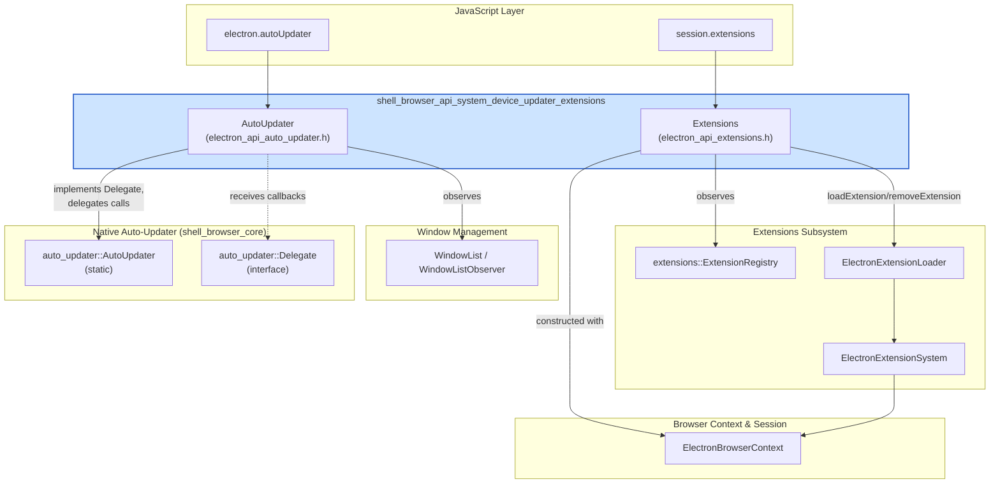
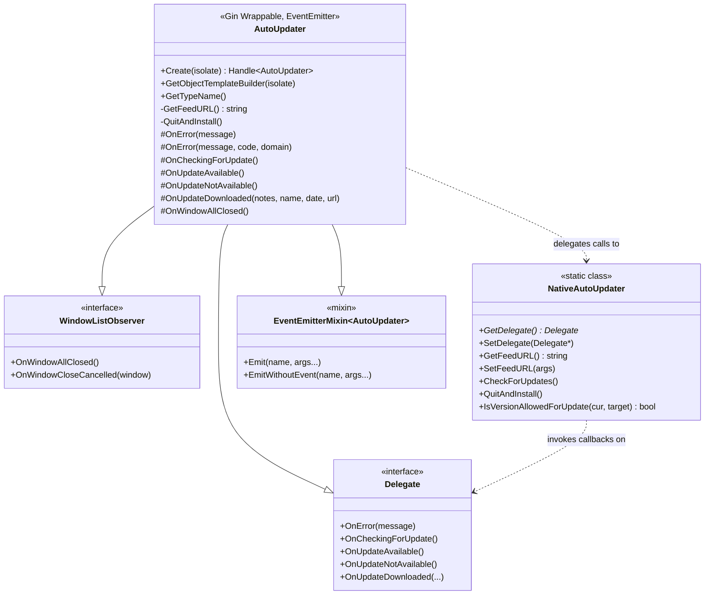
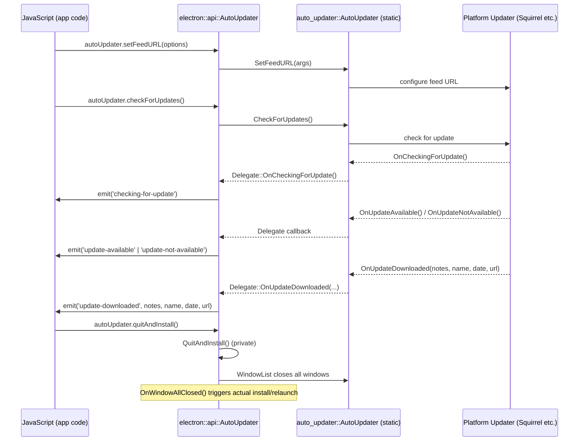
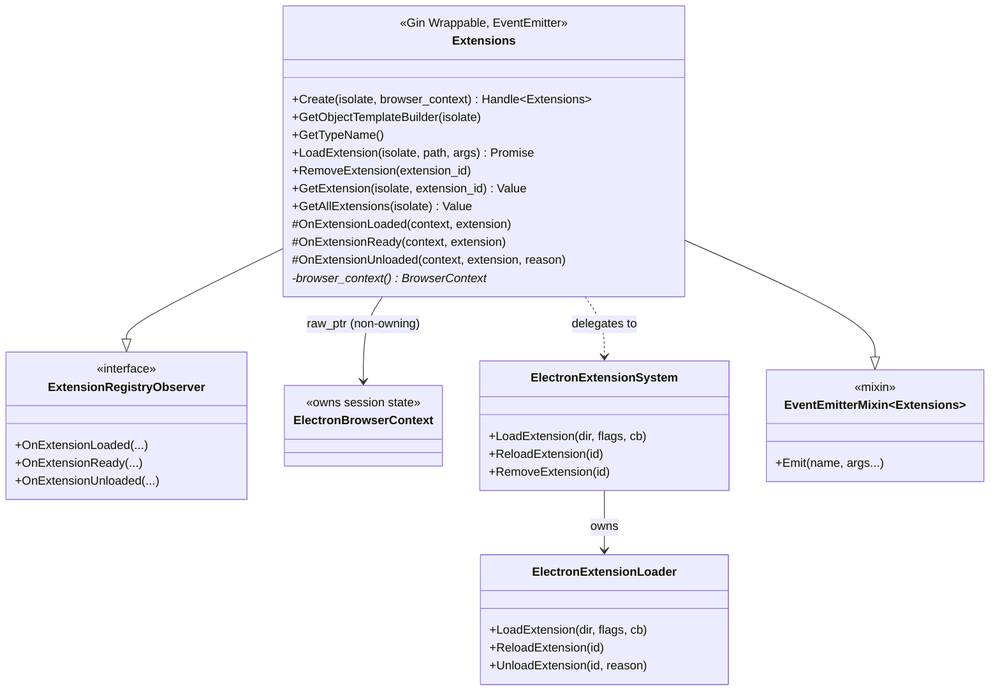
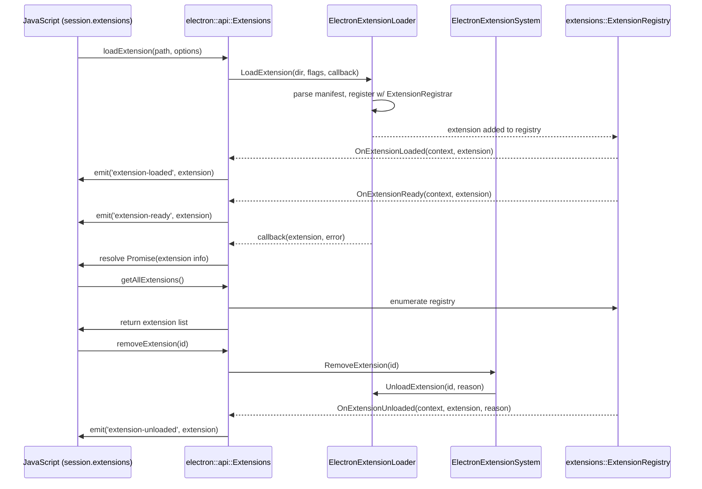
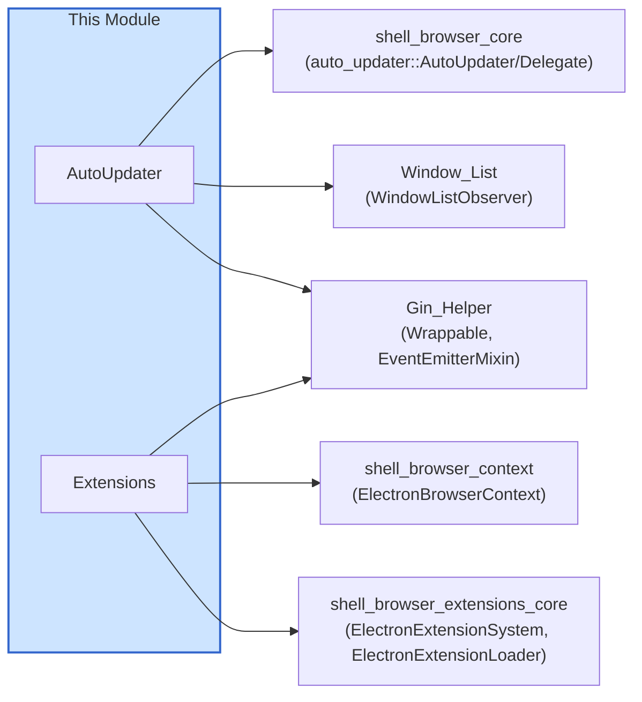
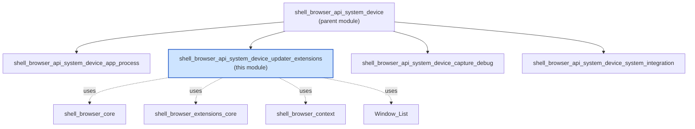

# Auto-Updater & Extensions API Module

## Introduction

The `shell_browser_api_system_device_updater_extensions` module provides the JavaScript-facing (V8/Gin) bindings for two distinct, high-level Electron capabilities that live in the browser (main) process:

1. **`AutoUpdater`** — exposes the native Squirrel-based auto-update mechanism (`autoUpdater` in Electron's public API) to JavaScript, allowing apps to check for, download, and install updates, and to react to update lifecycle events.
2. **`Extensions`** — exposes Chromium's extension system (`session.extensions` in Electron's public API) to JavaScript, allowing apps to load, query, and remove Chrome-style extensions on a per-`ElectronBrowserContext` (session) basis.

Both classes are thin **Gin wrapper / event-emitter** objects: they translate between C++ subsystems (the native auto-updater and the Chromium extensions system) and idiomatic Node.js-style EventEmitter objects usable from JavaScript. They are siblings within the broader `shell_browser_api_system_device` family of System & App-Level Services APIs (see [shell_browser_api_system_device_app_process.md](shell_browser_api_system_device_app_process.md) and [shell_browser_api_system_device_system_integration.md](shell_browser_api_system_device_system_integration.md)).

---

## Module Purpose & Core Functionality

| Component | Public JS Surface | Underlying C++ System | Lifetime Scope |
|---|---|---|---|
| `AutoUpdater` | `require('electron').autoUpdater` | `auto_updater::AutoUpdater` / `auto_updater::Delegate` (static, singleton-style) | Process-wide singleton |
| `Extensions` | `session.extensions` | `extensions::ExtensionRegistry`, `ElectronExtensionSystem`, `ElectronExtensionLoader` | Per `ElectronBrowserContext` (session) |

### AutoUpdater

`electron::api::AutoUpdater` is a Gin-wrapped `EventEmitter` that:

- Implements `auto_updater::Delegate` so it receives lifecycle callbacks from the native updater (`OnCheckingForUpdate`, `OnUpdateAvailable`, `OnUpdateNotAvailable`, `OnUpdateDownloaded`, `OnError`) and re-emits them as JS events (`checking-for-update`, `update-available`, `update-not-available`, `update-downloaded`, `error`).
- Delegates actual update operations (`checkForUpdates`, `quitAndInstall`, `setFeedURL`, `getFeedURL`) to the static `auto_updater::AutoUpdater` class, which in turn talks to platform-specific update mechanisms (e.g., Squirrel.Mac, Squirrel.Windows).
- Observes the global `WindowList` (`WindowListObserver`) so it can trigger `QuitAndInstall()` behavior correctly when all windows are closed during an update-triggered quit.

### Extensions

`electron::api::Extensions` is a Gin-wrapped `EventEmitter`, scoped to a single `ElectronBrowserContext`, that:

- Wraps Chromium's `extensions::ExtensionRegistry` and observes it (`ExtensionRegistryObserver`) to translate native extension lifecycle events (`OnExtensionLoaded`, `OnExtensionReady`, `OnExtensionUnloaded`) into JS events (`extension-loaded`, `extension-ready`, `extension-unloaded`).
- Exposes `loadExtension()` (returns a `Promise`), `removeExtension()`, `getExtension()`, and `getAllExtensions()` to JavaScript — these delegate to the extensions subsystem's loader (`ElectronExtensionLoader`) and system (`ElectronExtensionSystem`), documented in [shell_browser_extensions_core.md](shell_browser_extensions_core.md).
- Holds only a raw, non-owning pointer to its owning `content::BrowserContext` — it does not manage extension lifecycle itself, but forwards to the underlying browser-context-scoped extension services.

---

## Architecture

---

## Component Details

### 1. `AutoUpdater`

**Key design points:**

- Inherits `gin_helper::DeprecatedWrappable<AutoUpdater>` and `gin_helper::EventEmitterMixin<AutoUpdater>` (see [Gin_Helper.md](Gin_Helper.md)) — this is the standard pattern used across all Electron native API objects to bridge C++ and V8/JS.
- The `auto_updater::AutoUpdater` static class (in `shell/browser/auto_updater.h`, part of [shell_browser_core.md](shell_browser_core.md)) is a *process-wide singleton facade* — it holds a single `Delegate*` at a time. The `electron::api::AutoUpdater` JS wrapper registers itself as that delegate upon creation.
- `WindowListObserver` inheritance allows the updater to correctly sequence "quit and install" behavior with the app's window lifecycle (tracked by [Window_List.md](Window_List.md)).
- Platform-specific update backends (Squirrel.Mac / Squirrel.Windows / no-op on Linux) are implemented as separate `Delegate` subclasses elsewhere in the codebase and are not part of this module; this module only defines the JS-facing wrapper and event translation layer.

#### AutoUpdater Event Flow

---

### 2. `Extensions`

**Key design points:**

- One `Extensions` instance exists **per `ElectronBrowserContext`** (i.e., per `Session`), exposed to JS as `session.extensions`. This mirrors the per-session scoping pattern used broadly throughout [shell_browser_api_session_net.md](shell_browser_api_session_net.md).
- `Extensions` does not implement extension loading logic itself; it is a thin façade over the [Extensions Subsystem](shell_browser_extensions_core.md) — specifically `ElectronExtensionSystem` and `ElectronExtensionLoader`, which perform the actual filesystem loading, manifest parsing, and registration with Chromium's `ExtensionRegistrar`.
- By observing `extensions::ExtensionRegistry` directly (rather than only the loader), `Extensions` receives lifecycle notifications regardless of *how* an extension was loaded/unloaded (component extensions, unpacked extensions, updates, etc.), keeping JS-side events consistent.
- `LoadExtension()` returns a JS `Promise`, following Electron's modern async API conventions (see [Gin_Helper.md](Gin_Helper.md) `Promise` helpers).

#### Extensions Load/Query Flow

---

## Dependencies

- **[Gin_Helper.md](Gin_Helper.md)** — Provides `Wrappable`, `DeprecatedWrappable`, `Handle<T>`, `ObjectTemplateBuilder`, and `Promise` used by both classes to bridge into V8.
- **[shell_browser_core.md](shell_browser_core.md)** — Supplies the native `auto_updater::AutoUpdater` static class and `Delegate` interface that `AutoUpdater` implements/drives.
- **[Window_List.md](Window_List.md)** — `WindowListObserver` interface, used by `AutoUpdater` to coordinate quit-and-install with window closure.
- **[shell_browser_context.md](shell_browser_context.md)** — `ElectronBrowserContext`, the per-session object that owns/scopes each `Extensions` instance.
- **[shell_browser_extensions_core.md](shell_browser_extensions_core.md)** — `ElectronExtensionSystem` and `ElectronExtensionLoader`, which perform the actual extension load/unload/reload mechanics that `Extensions` delegates to.
- **[shell_browser_extensions_api.md](shell_browser_extensions_api.md)** — Higher-level chrome.* extension APIs (tabs, scripting, management, etc.) that operate on extensions once loaded via this module.

## How This Module Fits Into the Overall System

This module sits within the **[System & App-Level Services API](shell_browser_api_system_device_app_process.md)** family, alongside sibling sub-modules such as:
- `shell_browser_api_system_device_app_process` (app lifecycle, utility processes, GPU info)
- `shell_browser_api_system_device_capture_debug` (debugger, desktop capturer, downloads)
- `shell_browser_api_system_device_system_integration` (native theme, notifications, power monitor, global shortcuts, etc.)

Both `AutoUpdater` and `Extensions` follow Electron's consistent pattern (shared across the whole `System_&_App-Level_Services_API` group) of:

1. Being instantiated via a static `Create()` factory that returns a `gin_helper::Handle<T>`.
2. Inheriting `DeprecatedWrappable<T>` + `EventEmitterMixin<T>` for JS object/EventEmitter semantics.
3. Delegating substantive logic to lower-level, non-JS-aware C++ subsystems (native updater backend / extensions system), keeping the API-binding layer itself thin and focused purely on translation between native callbacks and JS events/promises.

This separation of concerns means that any changes to the underlying update mechanism or extension loading pipeline can happen independently of the JS API surface, as long as the `Delegate`/`ExtensionRegistryObserver` contracts are honored.
