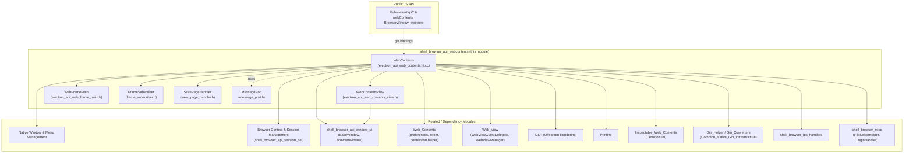
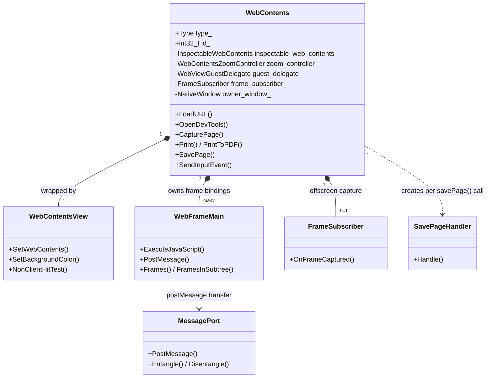
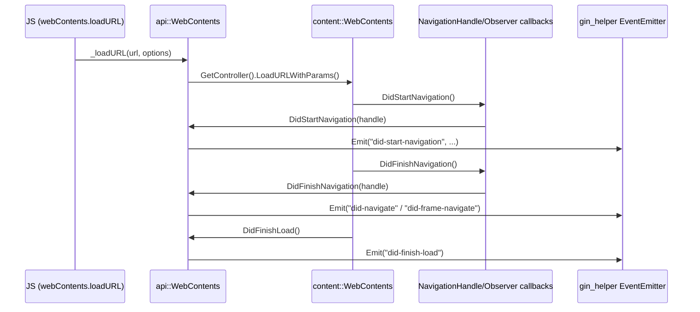

# WebContents Rendering & Communication — Browser API Layer

## Introduction

The `shell_browser_api_webcontents` module is the heart of Electron's browser-process JavaScript binding for Chromium's `content::WebContents`. It exposes the `WebContents` class to JavaScript (`electron.WebContents` / `webContents` module), and provides the surrounding native infrastructure required to:

- Create, own, and manage the lifecycle of `content::WebContents` instances (windows, `<webview>` guests, offscreen renderers, background pages, DevTools contents).
- Bridge Chromium's C++ `WebContentsDelegate`/`WebContentsObserver`/`JavaScriptDialogManager` callbacks into Electron's JS event-emitter model.
- Provide supporting native services consumed by `WebContents`: frame-level access (`WebFrameMain`), off-screen frame capture (`FrameSubscriber`), page saving (`SavePageHandler`), a `View`-compatible wrapper for embedding contents in the Views hierarchy (`WebContentsView`), and a generic HTML5 `MessagePort` implementation used for `postMessage` plumbing.

This module sits squarely in the browser process and is one of the largest and most interconnected components in Electron's codebase — it is the glue between Chromium's content layer, Electron's native window/session/UI subsystems, and the public JS API surface.

## Where This Module Fits

## Architecture Overview

The module is organized around one dominant class — `WebContents` — surrounded by focused helper classes that each own a narrow slice of functionality. Rather than being separate subsystems, most of these helpers are directly instantiated and owned by `WebContents` itself.

## Sub-Modules

This module is documented across the following focused pages:

| Sub-module | Description |
|---|---|
| [shell_browser_api_webcontents_core.md](shell_browser_api_webcontents_core.md) | The central `WebContents` class: construction/lifecycle, navigation, DevTools integration, printing, zoom, input, dialogs, and the huge `WebContentsDelegate`/`WebContentsObserver` surface it implements. |
| [shell_browser_api_webcontents_view.md](shell_browser_api_webcontents_view.md) | `WebContentsView`, the Views-compatible wrapper that lets a `WebContents` be embedded as a native UI `View`, including background color and draggable-region/hit-testing support. |
| [shell_browser_api_webcontents_frame.md](shell_browser_api_webcontents_frame.md) | `WebFrameMain`, the per-`RenderFrameHost` JS binding used for frame-scoped operations (`executeJavaScript`, `postMessage`, frame tree traversal). |
| [shell_browser_api_webcontents_support.md](shell_browser_api_webcontents_support.md) | Supporting utility classes: `FrameSubscriber` (video-capture-based frame subscription for offscreen rendering / `beginFrameSubscription`), `SavePageHandler` (`savePage()` implementation), and `MessagePort` (native HTML5 MessagePort used for cross-context messaging). |

## Key Cross-Module Relationships

- **Sessions**: Every `WebContents` is associated with an `api::Session`, documented in [shell_browser_api_session_net_session_core](shell_browser_api_session_net_session_core.md) (part of the broader [Browser Context & Session Management](shell_browser_context.md) area).
- **Native windows**: `WebContents` can have an owning `NativeWindow` (see [shell_browser_native_window_core](shell_browser_native_window_core.md)) and is wrapped by `BrowserWindow`/`BaseWindow` JS objects (see [shell_browser_api_window_ui_windows](shell_browser_api_window_ui_windows.md)).
- **Preferences, zoom & permissions**: Non-owned but tightly coupled helper classes `WebContentsPreferences`, `WebContentsZoomController`, and `WebContentsPermissionHelper` live in the sibling `Web_Contents` module.
- **Guest views (`<webview>`)**: Guest-specific behavior is delegated to `WebViewGuestDelegate` / `WebViewManager` in the sibling `Web_View` module.
- **Offscreen rendering**: When `type_ == kOffScreen`, rendering is delegated to `OffScreenWebContentsView` / `OffScreenRenderWidgetHostView`, documented in the `OSR (Offscreen Rendering)` module.
- **DevTools / Inspectable contents**: DevTools docking, file system requests, and indexing are delegated through `InspectableWebContents`, documented under `Inspectable_Web_Contents`.
- **Printing**: `Print()`/`PrintToPDF()` delegate to `PrintViewManagerElectron`, documented in the `Printing` module.
- **IPC**: Renderer-to-browser IPC (`ipcRenderer`, service worker IPC) is wired up via handlers in `shell_browser_ipc_handlers`.
- **Gin plumbing**: All V8/gin bindings, converters (`gin_converters/*`), and helper templates (`gin_helper/*`) that power the JS bindings for this module are documented in `Common_Native_Gin_Infrastructure`.

## Typical Data Flow: Loading a Page and Emitting Events

## Summary

`shell_browser_api_webcontents` is the browser-process nucleus that turns a raw Chromium `WebContents` into the rich, event-driven `webContents` API that Electron applications rely on. Understanding this module requires following its dependencies outward into session management, native windowing, offscreen rendering, printing, and the gin/V8 binding infrastructure — each of which is documented in its own dedicated module page linked above.
