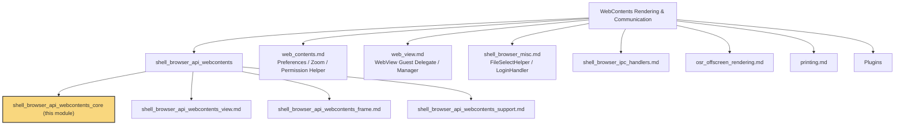
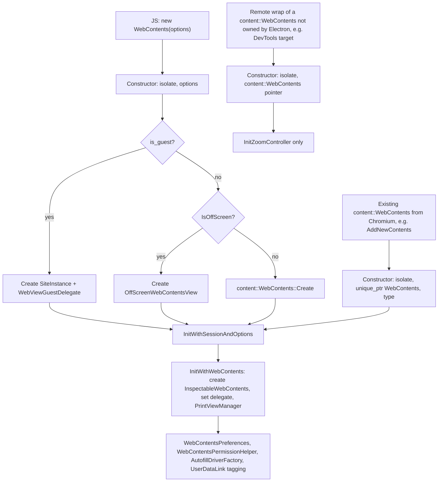
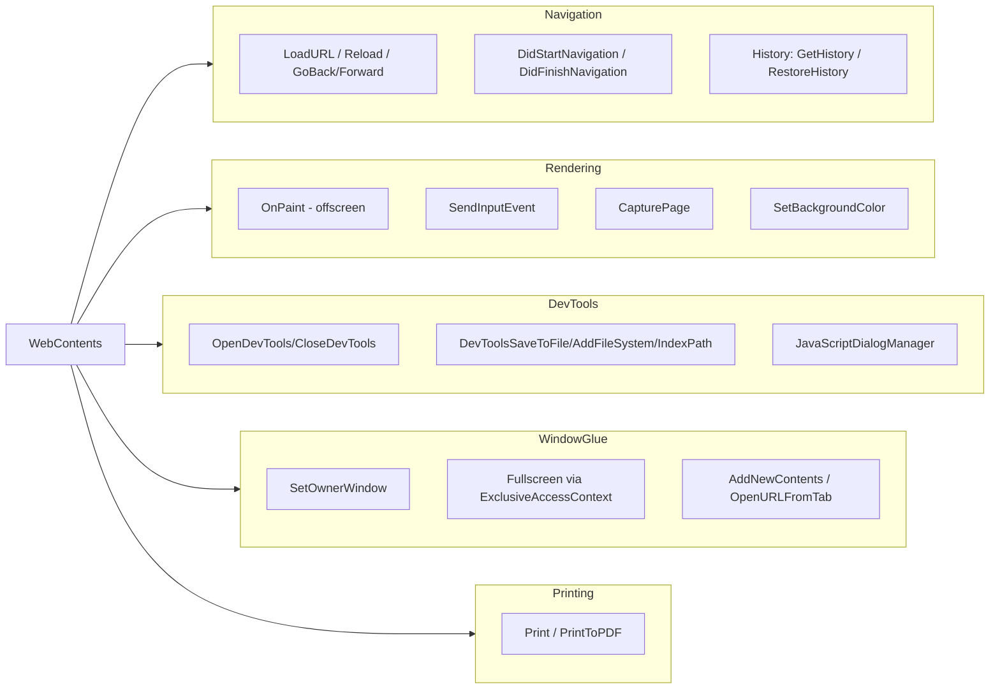
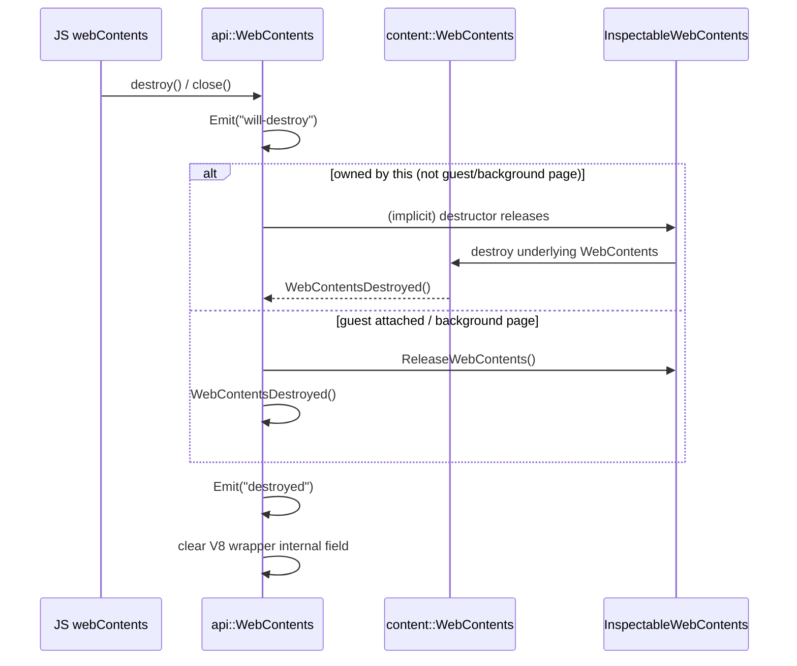

# WebContents Core (`shell_browser_api_webcontents_core`)

## 1. Purpose

This module implements **`electron::api::WebContents`**, the single most
important native class in Electron's browser process. It is the C++
binding layer that wraps Chromium's `content::WebContents` and exposes it
to JavaScript as `webContents` objects (and, indirectly, as the backing
object for `BrowserWindow.webContents`, `<webview>`, `BrowserView`,
offscreen rendering, and extension background pages).

Defined in:
- `shell/browser/api/electron_api_web_contents.h`
- `shell/browser/api/electron_api_web_contents.cc`

`WebContents` is the "brain" that:

* Owns (or wraps) a `content::WebContents` and drives its lifecycle.
* Implements a large number of Chromium delegate/observer interfaces
  (`content::WebContentsDelegate`, `content::WebContentsObserver`,
  `content::JavaScriptDialogManager`, `ExclusiveAccessContext`,
  `InspectableWebContentsDelegate`, `InspectableWebContentsViewDelegate`,
  `BackgroundThrottlingSource`, and Chromium's
  `RenderWidgetHost::InputEventObserver`).
* Translates all of the above native callbacks into Node.js/V8 events
  (`Emit(...)`) consumed by the `lib/browser/api/web-contents.ts` JS
  wrapper.
* Provides the full surface of navigation, DevTools, printing, zoom,
  input, drag-and-drop, capture, fullscreen, and process-management APIs
  that make up the public `webContents` API.

Because of its size and centrality, this class is intentionally kept as
one cohesive unit rather than split into sub-modules — nearly every
method operates on the same underlying `content::WebContents*` and
shares the same lifetime/ownership model.

## 2. Where This Module Fits

`shell_browser_api_webcontents_core` is one of four children of the
**Web Contents API** module (`shell_browser_api_webcontents`), which in
turn belongs to the top-level **WebContents Rendering & Communication**
area of Electron's browser process:

* **[shell_browser_api_webcontents_view.md](shell_browser_api_webcontents_view.md)** –
  `WebContentsView`, the gin-wrapped native View that hosts a
  `WebContents` inside the Views/Cocoa UI tree.
* **[shell_browser_api_webcontents_frame.md](shell_browser_api_webcontents_frame.md)** –
  `WebFrameMain`, the per-frame API (`mainFrame`, `frame`, IPC to a
  specific render frame). `WebContents` looks up and updates
  `WebFrameMain` instances on every frame lifecycle event.
* **[shell_browser_api_webcontents_support.md](shell_browser_api_webcontents_support.md)** –
  `FrameSubscriber` (frame capture callback used by
  `BeginFrameSubscription`), `SavePageHandler` (used by `SavePage`), and
  `MessagePort` (used by the messaging pipeline).

## 3. Architecture Overview

### 3.1 Class Relationships

`WebContents` sits between the JS `webContents` object and Chromium's
content layer, and coordinates with many browser-process subsystems:

```mermaid
classDiagram
    class WebContents {
        +Type type_
        +int32_t id_
        -content::WebContents* web_contents()
        +LoadURL(url, options)
        +OpenDevTools(args)
        +Print(args)
        +CapturePage(args)
        +SetZoomLevel(level)
        +SendInputEvent(isolate, event)
        +OnPaint(rect, bitmap, texture)
        +New(isolate, options)$
        +From(content::WebContents*)$
        +FromID(id)$
    }
    WebContents --|> ExclusiveAccessContext
    WebContents --|> ContentWebContentsObserver
    WebContents --|> ContentWebContentsDelegate
    WebContents --|> ContentJavaScriptDialogManager
    WebContents --|> InspectableWebContentsDelegate
    WebContents --|> InspectableWebContentsViewDelegate
    WebContents --|> BackgroundThrottlingSource
    WebContents --|> GinHelperWrappable

    WebContents "1" *-- "1" InspectableWebContents : owns
    WebContents "1" o-- "1" WebContentsZoomController : zoom_controller_
    WebContents "1" o-- "0..1" WebViewGuestDelegate : guest_delegate_
    WebContents "1" o-- "0..1" FrameSubscriber : frame_subscriber_
    WebContents "1" o-- "0..1" ApiSession : session_
    WebContents "1" --> "0..1" NativeWindow : owner_window_
    WebContents "1" --> "0..1" WebContents : embedder_
    WebContents ..> WebFrameMain : looks up per-frame
    WebContents ..> OffScreenWebContentsView : offscreen mode
    WebContents ..> ElectronBrowserContext : GetBrowserContext()
```

### 3.2 Construction Paths

`WebContents` has three constructors reflecting the three ways a wrapper
can come into existence:

Every non-remote path funnels through `InitWithWebContents()` /
`InitWithSessionAndOptions()`, which:

1. Wraps the `content::WebContents` in an
   `InspectableWebContents` (DevTools host — see
   [Inspectable_Web_Contents.md](Inspectable_Web_Contents.md)).
2. Attaches `WebContentsPreferences`,
   `WebContentsPermissionHelper` (see [Web_Contents.md](Web_Contents.md)).
3. Creates `WebContentsZoomController` (`InitZoomController`).
4. Registers extension observers and `ScriptExecutor` if extensions are
   enabled (see
   [shell_browser_extensions_core.md](shell_browser_extensions_core.md)).
5. Creates `AutofillDriverFactory` (see
   [shell_browser_ipc_handlers.md](shell_browser_ipc_handlers.md)).
6. Tags the underlying `content::WebContents` with a `UserDataLink` (a
   `base::SupportsUserData::Data`) so that `WebContents::From()` can
   recover the JS wrapper from any raw `content::WebContents*` anywhere
   in the codebase — this is the mechanism used by nearly every other
   Electron module (`NativeWindow`, `WebFrameMain`, extension code,
   printing code, etc.) to bridge back into the API layer.

### 3.3 Runtime Responsibilities

## 4. Key Responsibilities in Detail

### 4.1 Identity & Lookup

* `id_` — a process-unique integer assigned via a global
  `base::IDMap<WebContents*>` (`GetAllWebContents()`), exposed to JS as
  `webContents.id`. `WebContents::FromID()` and
  `WebContents::GetWebContentsList()` back the `webContents.fromId()`
  and `webContents.getAllWebContents()` JS APIs.
* `WebContents::From(content::WebContents*)` — recovers the wrapper via
  the `UserDataLink` set on the native object; used pervasively by other
  modules (native windows, extensions, printing, IPC handlers) to get
  from a bare Chromium `WebContents*` back to the Electron API object.
* `Type` enum (`kBackgroundPage`, `kBrowserWindow`, `kBrowserView`,
  `kRemote`, `kWebView`, `kOffScreen`) drives many behavioral branches
  throughout the class (DevTools availability, focus handling,
  background color defaults, etc.).

### 4.2 Navigation & History

Methods such as `LoadURL`, `Reload`, `ReloadIgnoringCache`, `Stop`,
`GoBack`/`GoForward`/`GoToOffset`/`GoToIndex`, `GetHistory`,
`RestoreHistory`, and `ClearHistory` wrap
`content::NavigationController`. Navigation lifecycle callbacks
(`DidStartNavigation`, `DidRedirectNavigation`, `ReadyToCommitNavigation`,
`DidFinishNavigation`, `DidFinishLoad`, `DidFailLoad`) are converted into
the `did-start-navigation`, `did-navigate`, `did-fail-load`, etc. JS
events via `EmitNavigationEvent()`.

### 4.3 Window/Frame Creation Glue

`IsWebContentsCreationOverridden`, `CreateCustomWebContents`,
`WebContentsCreatedWithFullParams`, `AddNewContents`, and
`OpenURLFromTab` implement Electron's `setWindowOpenHandler` /
`new-window` pipeline together with
**[ChildWebContentsTracker](shell_browser_native_window_core.md)**. New
child contents are wrapped via `CreateAndTake()` and announced through
the internal `-add-new-contents` / `-will-add-new-contents` events
consumed by `lib/browser/guest-window-manager.ts`.

### 4.4 DevTools Integration

`WebContents` implements `InspectableWebContentsDelegate` and
`InspectableWebContentsViewDelegate` directly (see
[Inspectable_Web_Contents.md](Inspectable_Web_Contents.md) for the host
class). It handles the full DevTools protocol surface: opening/closing,
docking state, file system requests used by the DevTools "Workspace"
feature (`DevToolsAddFileSystem`, `DevToolsSaveToFile`,
`DevToolsIndexPath`, `DevToolsSearchInPath`), and the eye-dropper tool
(`DevToolsSetEyeDropperActive`, backed by Chromium's
`DevToolsEyeDropper`).

### 4.5 JavaScript Dialogs

`WebContents::GetJavaScriptDialogManager()` returns a small internal
helper class, `JSDialogManagerHelper`, whose lifetime is bound to the
underlying `content::WebContents` (via `base::SupportsUserData::Data`).
This indirection prevents crashes when the Electron `WebContents` is
destroyed before the Chromium one (e.g. during shutdown or with
`<webview>` guests) — the helper simply forwards to
`WebContents::From(web_contents)` and no-ops if the wrapper is gone.
`RunJavaScriptDialog`, `RunBeforeUnloadDialog`, and `CancelDialogs` are
surfaced as `-run-dialog`, `will-prevent-unload`, and `-cancel-dialogs`
internal events, consumed by the JS dialog UI (`electron/lib/browser`).

### 4.6 Offscreen Rendering & Painting

When `type_ == Type::kOffScreen` (or a guest embedded in an offscreen
window), `WebContents` cooperates with
**[osr_offscreen_rendering.md](osr_offscreen_rendering.md)**:
`OnPaint()` receives frames from `OffScreenWebContentsView` /
`OffScreenRenderWidgetHostView` and re-emits them as the `paint` event
(optionally attaching a shared GPU texture handle). `StartPainting`,
`StopPainting`, `SetFrameRate`, `Invalidate`, and
`GetSizeForNewRenderView` all delegate to the OSR view.

### 4.7 Input & Focus

`SendInputEvent` converts a JS-described input event (mouse, keyboard,
or wheel) into the corresponding `blink::WebInputEvent` and forwards it
either to the OSR view or directly to the `RenderWidgetHost`.
`PreHandleKeyboardEvent`/`HandleKeyboardEvent` integrate with
`ExclusiveAccessManager` and the owning `NativeWindow`
(see [shell_browser_native_window_core.md](shell_browser_native_window_core.md))
for menu shortcuts and accelerator handling. `Focus`/`IsFocused` account
for platform quirks (macOS/Linux need to explicitly focus the owning
window).

### 4.8 Fullscreen

`WebContents` implements `ExclusiveAccessContext` directly, delegating
actual fullscreen transitions to the `ExclusiveAccessManager` member and
the owning `NativeWindow`. `EnterFullscreenModeForTab` and
`ExitFullscreenModeForTab` go through
`WebContentsPermissionHelper::RequestFullscreenPermission` before
committing the transition, and `SetHtmlApiFullscreen` /
`UpdateHtmlApiFullscreen` propagate state down to any guest `<webview>`s
via `WebViewManager` (see [Web_View.md](Web_View.md)).

### 4.9 Printing

Guarded by `BUILDFLAG(ENABLE_PRINTING)`, `Print()` and `PrintToPDF()`
build up a `printing::mojom::PrintSettings`-compatible dictionary and
hand off to `PrintViewManagerElectron`
(see [printing.md](printing.md)). `PrintToPDF` additionally resolves a
JS `Promise<Buffer>` once PDF generation completes.

### 4.10 Zoom

`SetZoomLevel`/`GetZoomLevel`/`SetZoomFactor`/`GetZoomFactor`/
`SetTemporaryZoomLevel` all delegate to the `WebContentsZoomController`
owned by the underlying `content::WebContents`
(see [Web_Contents.md](Web_Contents.md) for the controller/observer
pair). `ContentsZoomChange` bridges Chromium's own Ctrl+/Ctrl- zoom
gesture into the `zoom-changed` event.

### 4.11 Session, Browser Context & Related Native Objects

Each `WebContents` holds a reference to an `api::Session` (`session_`,
see
[shell_browser_api_session_net_session_core.md](shell_browser_api_session_net_session_core.md))
and exposes it as the read-only `webContents.session` property.
`GetBrowserContext()` returns the associated
`ElectronBrowserContext` (see
[shell_browser_context.md](shell_browser_context.md)), used to resolve
preferences, the download manager, and other per-partition state.

`SetOwnerWindow`/`owner_window()` link a `WebContents` to a
`NativeWindow` (see
[shell_browser_native_window_core.md](shell_browser_native_window_core.md)),
which is also how `BackgroundThrottlingSource` registration and
`getOwnerBrowserWindow()` (wrapping into
[shell_browser_api_window_ui_windows.md](shell_browser_api_window_ui_windows.md)'s
`BrowserWindow`) work.

### 4.12 Guest Views (`<webview>`)

When `type_ == Type::kWebView`, construction creates a
`WebViewGuestDelegate` (see [Web_View.md](Web_View.md)) and the
`embedder_` back-pointer is set. Keyboard events, fullscreen state, and
destruction are all specially coordinated between guest and embedder
(`HandleKeyboardEvent`, `SetHtmlApiFullscreen`, destructor logic around
`not_owned_by_this`).

### 4.13 File Dialogs & File Selection

`RunFileChooser`/`EnumerateDirectory` delegate to `FileSelectHelper`
(see [shell_browser_misc.md](shell_browser_misc.md)). DevTools' save /
open-folder flows use `file_dialog::ShowSaveDialogSync` /
`ShowOpenDialogSync` directly (see
[UI_Dialogs](Desktop_UI_Widgets_%26_Dialogs.md) family, specifically the
file dialog component).

### 4.14 Memory / Diagnostics

`GetProcessMemoryInfo` and `TakeHeapSnapshot` provide the native
implementation behind `webContents.getProcessMemoryInfo()` (via Chromium
memory-instrumentation) and the heap-snapshot mojo call to the renderer
(`mojom::ElectronRenderer`), respectively.

## 5. Gin/V8 Binding Surface

`WebContents::FillObjectTemplate()` is the single place where the entire
native method surface is exposed to V8 via
`gin_helper::ObjectTemplateBuilder`. It is invoked once per wrapper
construction (through the `gin_helper::Constructible` mixin) and wires
dozens of methods (`_loadURL`, `_goBack`, `openDevTools`, `capturePage`,
`_print`, `setZoomLevel`, etc.) plus properties (`id`, `session`,
`mainFrame`, `debugger`, `hostWebContents`, `devToolsWebContents`).
`WebContents` composes several gin-helper mixins for cross-cutting
concerns; see
[Gin_Helper.md](Gin_Helper.md) for details on
`Wrappable`/`DeprecatedWrappable`, `Constructible`,
`EventEmitterMixin`, `Pinnable`, and `CleanedUpAtExit`.

The file-level `Initialize()` function (registered via
`NODE_LINKED_BINDING_CONTEXT_AWARE(electron_browser_web_contents, ...)`)
exports the `WebContents` constructor plus free functions:
`fromId`, `fromFrame` (uses
[shell_browser_api_webcontents_frame.md](shell_browser_api_webcontents_frame.md)'s
`WebFrameMain`), `fromDevToolsTargetId`, and `getAllWebContents`.

## 6. Lifecycle & Destruction

`Destroy()` posts an async delete (`DeleteThisIfAlive`) unless the app is
shutting down or this is a guest view, in which case deletion happens
synchronously. `DeleteThisIfAlive` guards against double-free races with
V8's garbage collector by checking `GetWrapper()` before `delete this`.

## 7. Cross-Module Dependency Summary

| Dependency | Module | Used For |
|---|---|---|
| `ElectronBrowserContext` | [shell_browser_context.md](shell_browser_context.md) | Partition/session storage, download manager, preferences |
| `api::Session` | [shell_browser_api_session_net_session_core.md](shell_browser_api_session_net_session_core.md) | `webContents.session` |
| `NativeWindow`, `NativeWindowRelay`, `ChildWebContentsTracker` | [shell_browser_native_window_core.md](shell_browser_native_window_core.md) | Owner window, fullscreen, new-window tracking |
| `BrowserWindow` | [shell_browser_api_window_ui_windows.md](shell_browser_api_window_ui_windows.md) | `getOwnerBrowserWindow()` |
| `WebContentsPreferences`, `WebContentsZoomController`, `WebContentsPermissionHelper` | [Web_Contents.md](Web_Contents.md) | Preferences, zoom, permission gating |
| `WebViewGuestDelegate`, `WebViewManager` | [Web_View.md](Web_View.md) | `<webview>` guest behavior |
| `InspectableWebContents`, `InspectableWebContentsView` | [Inspectable_Web_Contents.md](Inspectable_Web_Contents.md) | DevTools hosting |
| `OffScreenWebContentsView`, `OffScreenRenderWidgetHostView` | [osr_offscreen_rendering.md](osr_offscreen_rendering.md) | Offscreen rendering / painting |
| `PrintViewManagerElectron` | [printing.md](printing.md) | `print()`, `printToPDF()` |
| `FileSelectHelper` | [shell_browser_misc.md](shell_browser_misc.md) | `<input type=file>` dialogs |
| `AutofillDriverFactory` | [shell_browser_ipc_handlers.md](shell_browser_ipc_handlers.md) | Autofill IPC wiring |
| `ElectronExtensionWebContentsObserver`, `ScriptExecutor` | [shell_browser_extensions_core.md](shell_browser_extensions_core.md) | Extension-aware WebContents behavior |
| `WebFrameMain` | [shell_browser_api_webcontents_frame.md](shell_browser_api_webcontents_frame.md) | Per-frame lifecycle sync |
| `FrameSubscriber`, `SavePageHandler` | [shell_browser_api_webcontents_support.md](shell_browser_api_webcontents_support.md) | Frame capture, page saving |
| `WebContentsView` | [shell_browser_api_webcontents_view.md](shell_browser_api_webcontents_view.md) | Views-tree hosting |
| `gin_helper::*` mixins, `Promise`, `Handle` | [Gin_Helper.md](Gin_Helper.md) | V8 wrapping infrastructure |
| `Debugger` | [shell_browser_api_system_device.md](shell_browser_api_system_device.md) | `webContents.debugger` property |

## 8. Summary

`shell_browser_api_webcontents_core` is the connective tissue between
Electron's JavaScript `webContents` API and Chromium's content layer. It
does not implement rendering, storage, or windowing itself — instead it
**orchestrates** the specialized subsystems documented in the sibling
and dependency modules above, translating native lifecycle/delegate
callbacks into a stable, event-driven JavaScript API surface.
