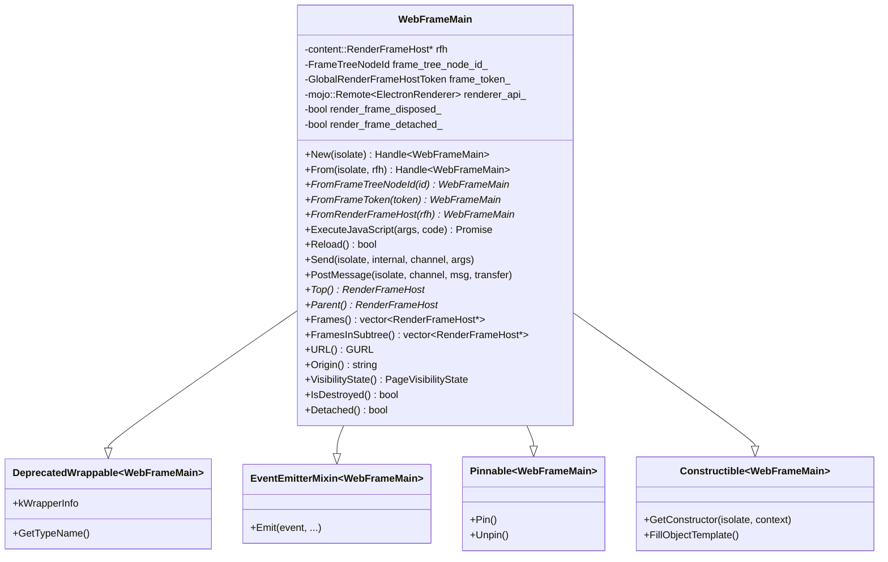
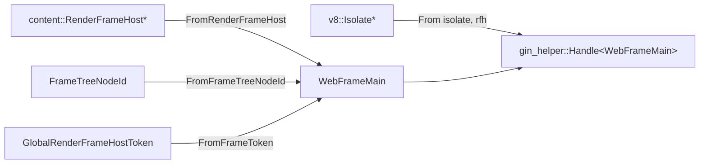
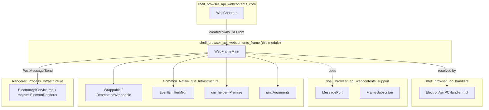
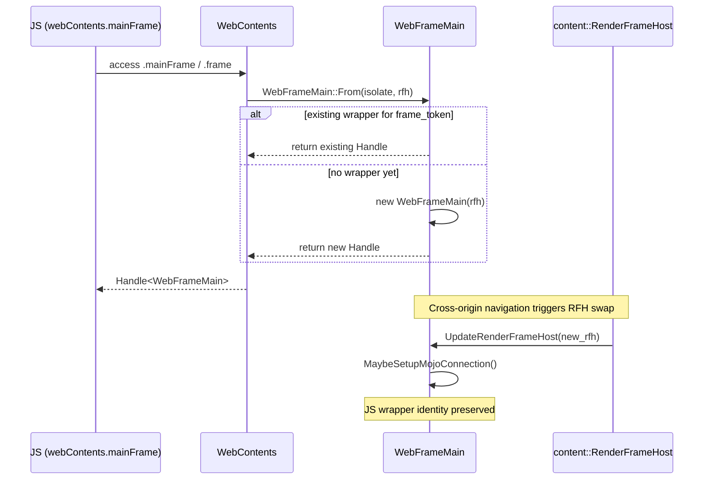
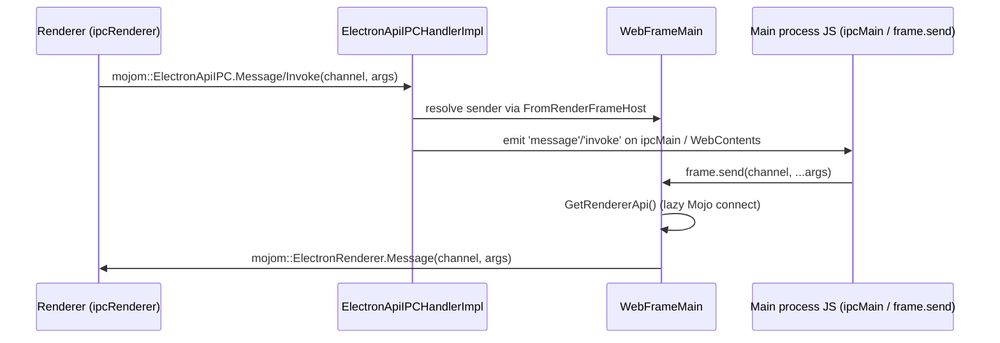
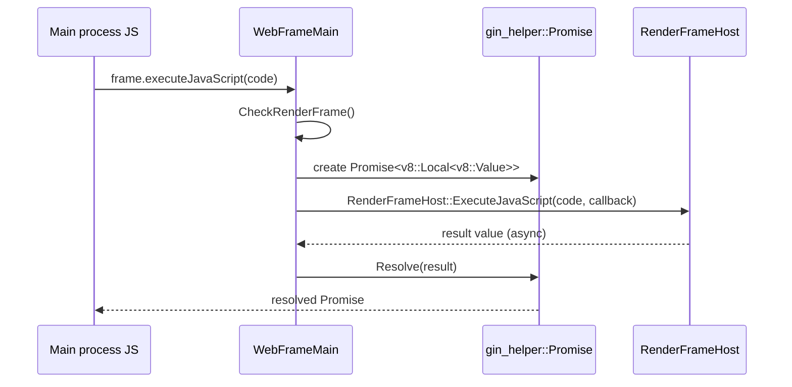
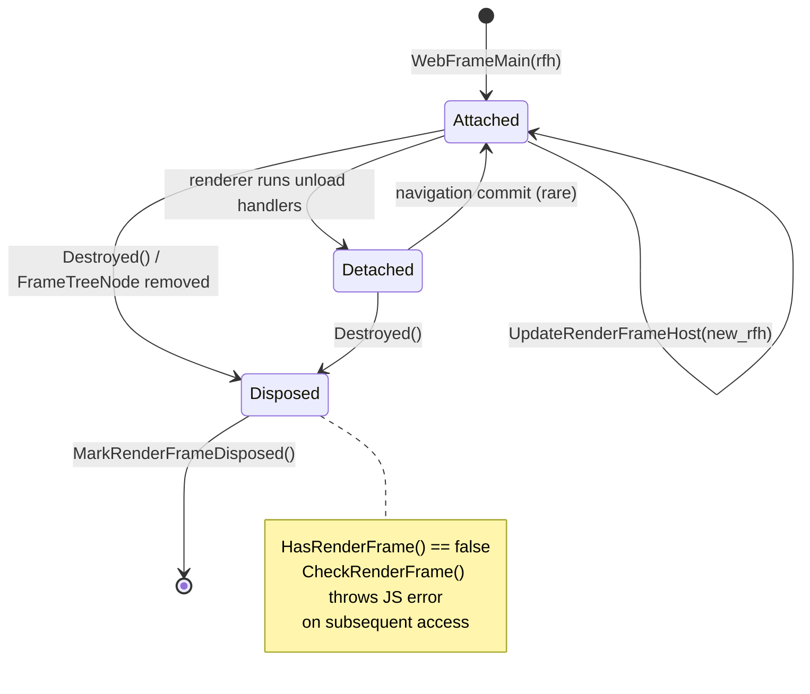

# WebContents Rendering & Communication — Frame API (`shell_browser_api_webcontents_frame`)

## Introduction

The `shell_browser_api_webcontents_frame` module implements the **`WebFrameMain`** binding — the browser-process
JavaScript API that exposes an individual renderer frame (a Chromium `content::RenderFrameHost`) to Electron's main
process. Where `WebContents` (see [shell_browser_api_webcontents_core.md](shell_browser_api_webcontents_core.md))
represents an entire tab/window's content, `WebFrameMain` represents a single frame within that content's frame
tree — the main frame or any of its (possibly cross-origin, possibly cross-process) subframes.

This module is a leaf of the `WebContents_Rendering_&_Communication` module family and is intentionally narrow in
scope: it owns the lifetime, identity, and low-level IPC/messaging surface of a frame, while delegating rendering,
navigation, and higher-level WebContents behavior to sibling modules.

## Purpose & Core Functionality

`WebFrameMain` (declared in `shell/browser/api/electron_api_web_frame_main.h`) is a `gin`-wrapped native object that:

- **Wraps a `content::RenderFrameHost`** and tracks its identity via `FrameTreeNodeId` and
  `GlobalRenderFrameHostToken`, surviving (or invalidating itself) across renderer-side navigations and
  cross-origin frame swaps.
- **Exposes frame metadata to JS**: frame token, routing ID, process ID, OS process ID, name, URL, origin,
  visibility state, detached/destroyed status, and lifecycle state (for testing).
- **Provides frame-tree navigation**: `Top()`, `Parent()`, `Frames()`, `FramesInSubtree()` — allowing JS code to
  walk the frame hierarchy of a page (e.g. `webContents.mainFrame.frames`).
- **Executes JavaScript in the frame's renderer context** via `ExecuteJavaScript()`, returning a `v8::Promise`.
- **Sends/receives IPC** to/from the associated renderer frame using the internal `mojom::ElectronRenderer` Mojo
  interface (`Send`, `PostMessage`, `MessageHost`), tying into Electron's `ipcRenderer`/`ipcMain` and
  `postMessage` channel infrastructure.
- **Supports reload** of the frame (`Reload()`).
- **Collects JS call stacks** for diagnostics (`CollectDocumentJSCallStack`).
- **Emits lifecycle events** (`DOMContentLoaded`, `Destroyed`) consumed by the JS-side `WebFrameMain` EventEmitter.

Because a single logical frame in a page can be backed by different `RenderFrameHost` instances over its lifetime
(e.g., cross-origin navigation triggers a process swap), `WebFrameMain` is designed to persist across
`UpdateRenderFrameHost()` calls and to safely reject access once genuinely torn down
(`MarkRenderFrameDisposed()`, `CheckRenderFrame()`).

## Architecture

### Class Structure

`WebFrameMain` composes several native-to-JS binding mixins from the
[Common_Native_Gin_Infrastructure](Common_Native_Gin_Infrastructure.md) module:

- **`DeprecatedWrappable<T>`** — provides the gin V8 wrapper plumbing (`kWrapperInfo`, `GetTypeName`). See
  [Common_Native_Gin_Infrastructure.md](Common_Native_Gin_Infrastructure.md) (`Gin_Helper` submodule,
  `wrappable.h`).
- **`EventEmitterMixin<T>`** — gives `WebFrameMain` Node.js-style `EventEmitter` semantics so JS listeners can
  subscribe to frame events (e.g. `dom-ready`).
- **`Pinnable<T>`** — keeps the V8 wrapper alive across GC while native-side activity (pending IPC, JS execution)
  is outstanding.
- **`Constructible<T>`** — supplies `GetConstructor`/`FillObjectTemplate` used to expose the `WebFrameMain` class
  constructor/prototype to the V8 context (see `Constructible` implementation details below).

### Identity & Lookup

`WebFrameMain` instances are retrievable by several keys, all backed by static maps/registries maintained
internally:

- `From()` is the primary factory used by [WebContents](shell_browser_api_webcontents_core.md) to hand out a JS
  wrapper for `mainFrame`, `frame`, or events like `did-frame-navigate`.
- `FromFrameTreeNodeId`/`FromFrameToken`/`FromRenderFrameHost` are used internally (and by other modules such as
  IPC handlers) to resolve an existing `WebFrameMain` without creating a new wrapper.

## Component Relationships

- **[shell_browser_api_webcontents_core](shell_browser_api_webcontents_core.md)** — `WebContents` is declared a
  `friend class` of `WebFrameMain` and is the primary owner/creator, wiring `WebFrameMain::From()` results into JS
  APIs (`webContents.mainFrame`, `frameConnected`, navigation events, etc.).
- **[shell_browser_ipc_handlers](shell_browser_ipc_handlers.md)** — `ElectronApiIPCHandlerImpl` (Mojo receiver for
  `mojom::ElectronApiIPC`) resolves the sending `RenderFrameHost` back to a `WebFrameMain`/`Session` pair to route
  `ipcRenderer.send`/`invoke` calls to the correct JS-side handlers. `WebFrameMain::Send`/`PostMessage` are the
  browser-to-renderer half of this same channel.
- **[shell_browser_api_webcontents_support](shell_browser_api_webcontents_support.md)** — `MessagePort` provides
  the underlying transferable `MessagePortChannel` objects used when `PostMessage` includes a `transfer` argument
  (structured-clone message ports).
- **[Common_Native_Gin_Infrastructure](Common_Native_Gin_Infrastructure.md)** — supplies the gin/V8 binding
  primitives (`Wrappable`, `EventEmitterMixin`, `Constructible`, `Promise`, `Handle`, `Arguments`) that make
  `WebFrameMain` a proper JS-visible class.
- **[Renderer_Process_Infrastructure](Renderer_Process_Infrastructure.md)** — the renderer-side counterpart
  (`ElectronApiServiceImpl`, `electron_api_web_frame.cc`) implements `mojom::ElectronRenderer`/receives calls made
  through `renderer_api_`, and originates the `mojom::ElectronApiIPC` calls handled on the browser side.

## Data Flow

### Frame Wrapper Creation & Cross-Origin Swap

### Renderer IPC (`ipcRenderer` ↔ `ipcMain`) via WebFrameMain

### JavaScript Execution in a Frame

## Lifecycle & Disposal State Machine

Key invariants enforced by the implementation:
- `render_frame_disposed_` is set once the underlying `RenderFrameHost`/`FrameTreeNode` is gone; any further
  attempts to use frame accessors throw a JS exception via `CheckRenderFrame()`.
- `render_frame_detached_` tracks the "pagehide/unload in progress" state, which is exposed as `Detached()` to JS
  so scripts can distinguish "still running unload handlers" from "fully gone."
- The `mojo::Remote<mojom::ElectronRenderer>` (`renderer_api_`) is lazily established (`MaybeSetupMojoConnection`)
  and torn down (`TeardownMojoConnection`) as the frame's process lifetime changes, with
  `OnRendererConnectionError()` handling unexpected disconnects.

## Public API Surface (JavaScript)

While this document describes the native binding, the resulting JS-facing `WebFrameMain` API (exposed as
`webContents.mainFrame`, `event.frame` in IPC handlers, etc.) includes:

| Category | Members |
|---|---|
| Identity | `frameTreeNodeId`, `name`, `osProcessId`, `processId`, `routingId`, `url`, `origin` |
| Tree navigation | `top`, `parent`, `frames`, `framesInSubtree` |
| State | `detached`, `visibilityState` |
| Actions | `executeJavaScript(code)`, `reload()` |
| Messaging | `send(channel, ...args)`, `postMessage(channel, message, transfer?)` |
| Diagnostics | `collectJavaScriptCallStack()` (via `CollectDocumentJSCallStack`) |
| Events | `dom-ready` (`DOMContentLoaded`) |

This mirrors and complements the `WebContents` navigation/frame events documented in
[shell_browser_api_webcontents_core.md](shell_browser_api_webcontents_core.md).

## Dependencies Summary

| Dependency | Module | Relationship |
|---|---|---|
| `content::RenderFrameHost` | Chromium `//content` (external) | Wrapped/owned-by-reference entity |
| `WebContents` | [shell_browser_api_webcontents_core](shell_browser_api_webcontents_core.md) | Creator/owner; friend class |
| `ElectronApiIPCHandlerImpl` | [shell_browser_ipc_handlers](shell_browser_ipc_handlers.md) | Renderer→main IPC entry point that resolves to a `WebFrameMain` |
| `MessagePort` | [shell_browser_api_webcontents_support](shell_browser_api_webcontents_support.md) | Transferable ports for `postMessage` |
| `mojom::ElectronRenderer` | [Renderer_Process_Infrastructure](Renderer_Process_Infrastructure.md) | Mojo interface used for `Send`/`PostMessage` to the renderer |
| `gin_helper::{Wrappable, EventEmitterMixin, Constructible, Pinnable, Promise, Handle, Arguments}` | [Common_Native_Gin_Infrastructure](Common_Native_Gin_Infrastructure.md) | V8/gin binding infrastructure |
| `Session` (via `ElectronApiIPCHandlerImpl::GetSession`) | [shell_browser_api_session_net](shell_browser_api_session_net.md) | Used to route IPC events to the right session-scoped listeners |

## Summary

`WebFrameMain` is the frame-granular counterpart to `WebContents`, giving Electron's main process a stable,
GC-safe JS handle onto individual (possibly cross-process) renderer frames. It concentrates frame identity
tracking, frame-tree traversal, JS execution, and low-level IPC/postMessage plumbing behind a small, well-defined
gin-wrapped class, while relying on sibling modules — `WebContents` for ownership and events, the IPC handler
module for renderer-originated messages, and the common gin infrastructure for V8 binding mechanics.
