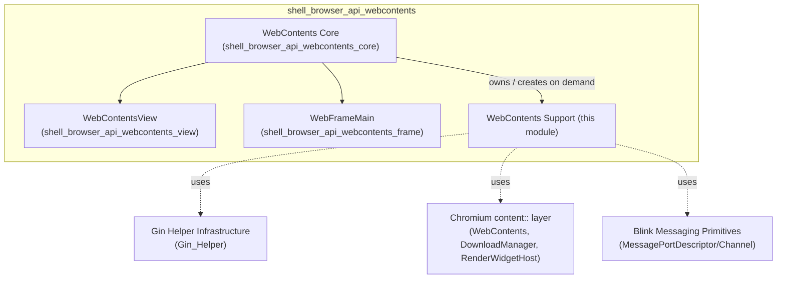
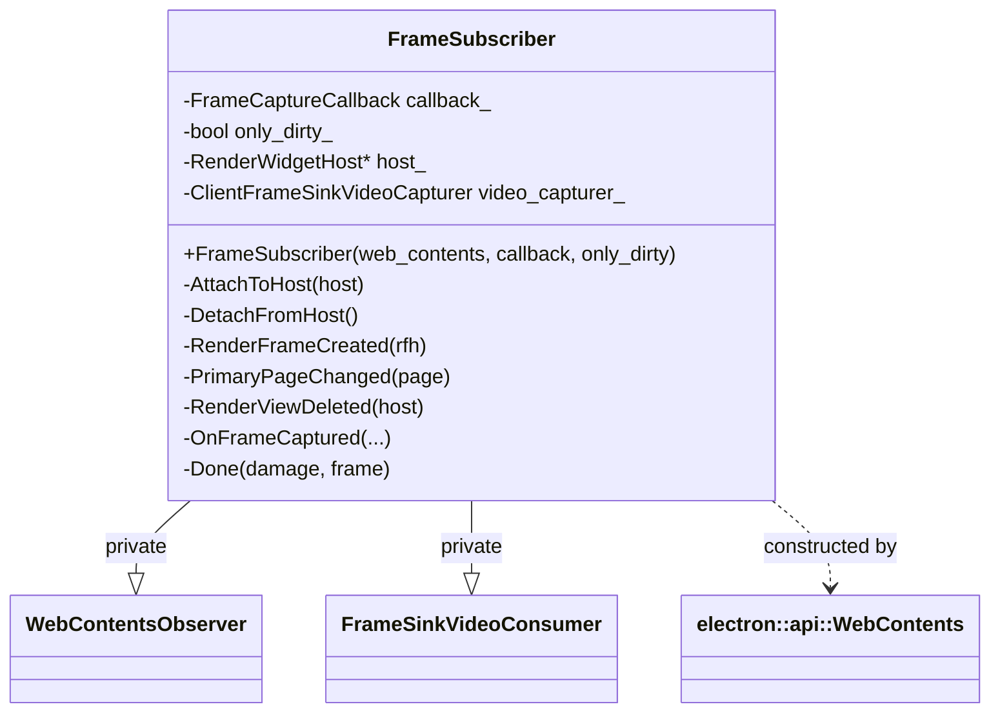
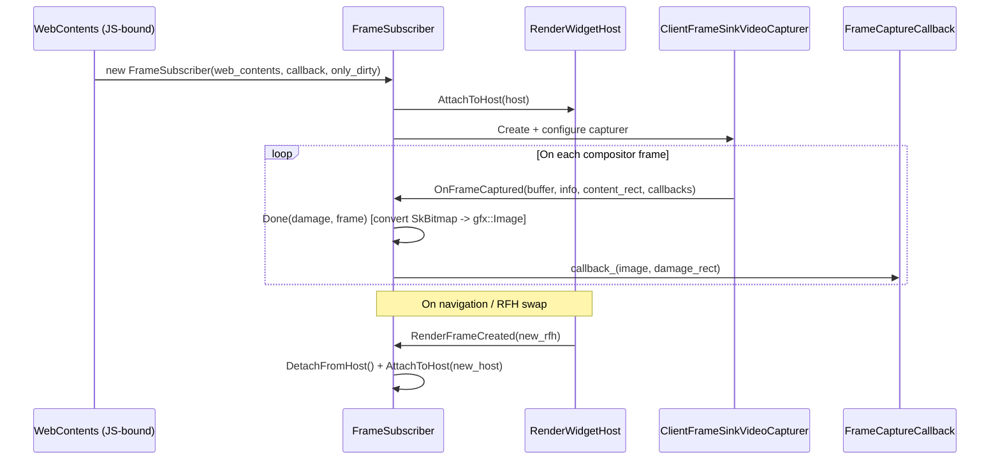
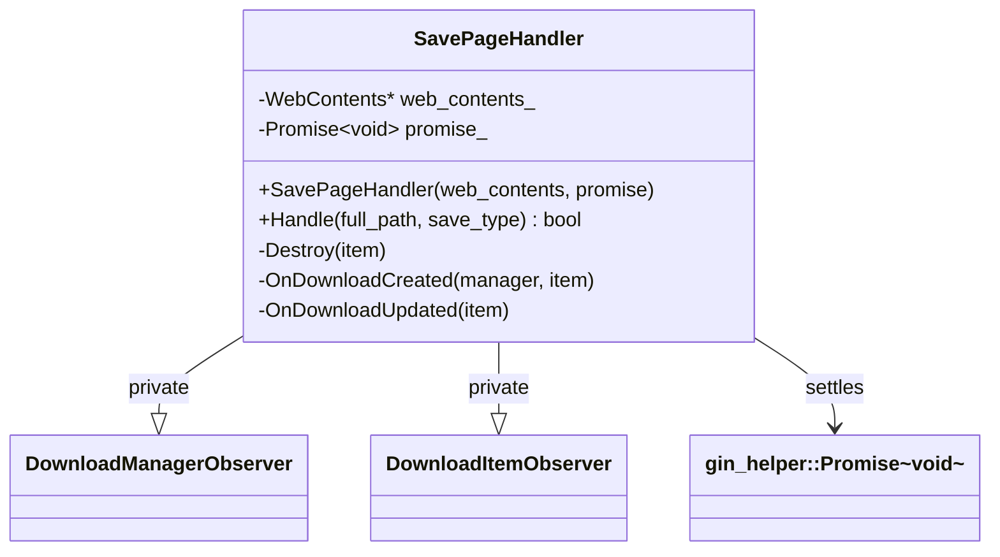
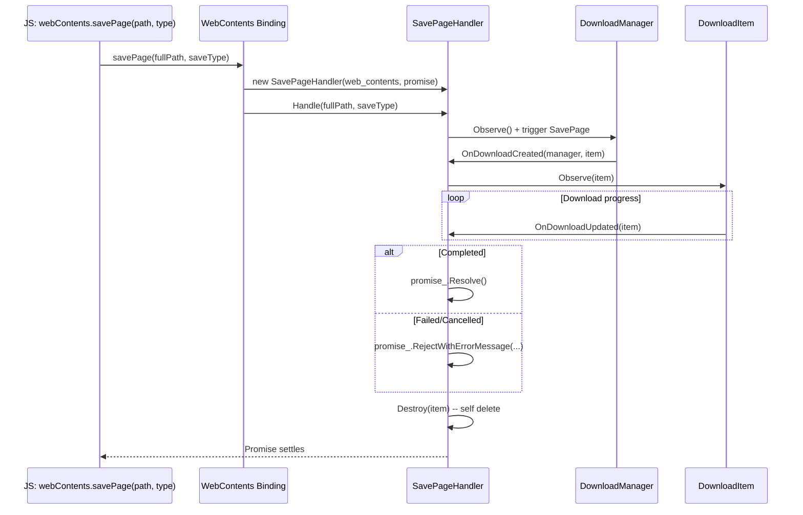
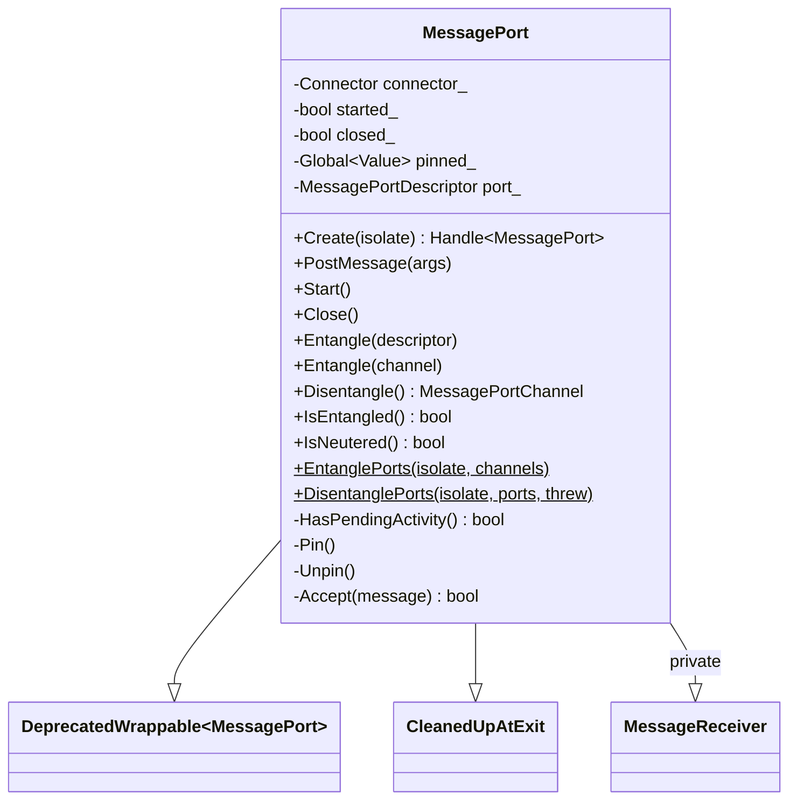
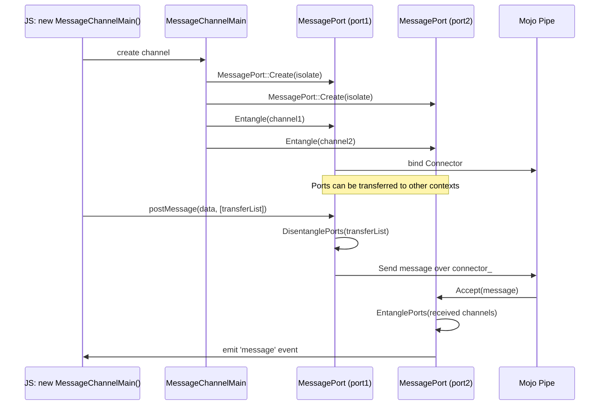
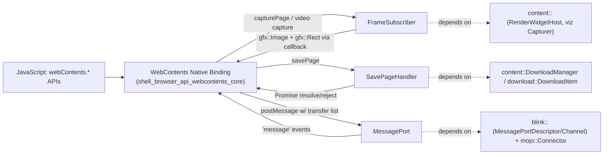

# WebContents API Support Utilities

## Introduction

The **WebContents API Support** module provides a small set of focused, self-contained helper classes that extend the capabilities of Electron's core `WebContents` binding (see [shell_browser_api_webcontents_core](shell_browser_api_webcontents_core.md)) without being part of its main class definition. These utilities implement three distinct, narrowly-scoped responsibilities:

- **`FrameSubscriber`** — captures rendered video frames from a `WebContents`' compositor surface, used to implement `webContents.capturePage()`-style frame capture and video-frame streaming.
- **`SavePageHandler`** — drives the "Save Page As" download flow, coordinating with Chromium's `DownloadManager` to persist a page (and its resources) to disk and resolve/reject a JavaScript promise when complete.
- **`MessagePort`** — a native (non-Blink-renderer) implementation of the HTML5 `MessagePort` primitive, used to entangle/disentangle Mojo message pipes so that `MessageChannelMain` ports (see [lib_browser_api_messaging_and_guestviews](lib_browser_api_messaging_and_guestviews.md)) can be passed between the main process and other native code.

These three components have no direct dependency on one another; they are grouped together because each is a **supporting utility invoked by the `WebContents` native binding** (`electron_api_web_contents.h/.cc`) to fulfill specific, occasionally-used JS-exposed features, rather than being core to the `WebContents` lifecycle itself.

This document describes each component's responsibilities, its interaction with the rest of the Electron native layer, and the data/control flow through typical use cases.

---

## Module Position in the System

This module is a child of `shell_browser_api_webcontents`, sitting alongside:

- [shell_browser_api_webcontents_core](shell_browser_api_webcontents_core.md) — the main `WebContents` class, which owns/instantiates the helpers documented here.
- [shell_browser_api_webcontents_view](shell_browser_api_webcontents_view.md) — the `WebContentsView` UI-container binding.
- [shell_browser_api_webcontents_frame](shell_browser_api_webcontents_frame.md) — the `WebFrameMain` per-frame binding.

---

## Components Overview

| Component | File | Purpose |
|---|---|---|
| `FrameSubscriber` | `shell/browser/api/frame_subscriber.h` | Subscribes to a `WebContents`' compositor frame sink and delivers captured bitmaps via callback. |
| `SavePageHandler` | `shell/browser/api/save_page_handler.h` | Observes the download subsystem to detect completion of a "save page" operation and resolves a JS Promise. |
| `MessagePort` | `shell/browser/api/message_port.h` | Native wrapper around a Blink `MessagePortDescriptor`/`MessagePortChannel`, exposed to JS via gin, enabling message-passing between contexts. |

---

## 1. FrameSubscriber

### Purpose
`FrameSubscriber` implements page frame capture for `webContents.capturePage()` and similar video-capture-driven features (e.g., offscreen rendering consumers, see [OSR_(Offscreen_Rendering)](OSR_(Offscreen_Rendering).md)). It attaches to a `content::RenderWidgetHost`'s compositor frame sink through a `viz::ClientFrameSinkVideoCapturer` and receives raw video frames, converting them into `gfx::Image` + damage `gfx::Rect` pairs delivered through a callback.

### Key Design Points
- Inherits privately from both `content::WebContentsObserver` (to track navigation/frame lifecycle events) and `viz::mojom::FrameSinkVideoConsumer` (to receive captured video frames over Mojo).
- `only_dirty_` flag controls whether only the "damaged" (changed) region of the frame is delivered, or the full frame every time.
- Re-attaches automatically to new `RenderWidgetHost` instances as they are created (`RenderFrameCreated`), and detaches on primary page change / view deletion, ensuring capture continuity across navigations without leaking capturer state.
- Uses `base::WeakPtrFactory` for safe callback dispatch across asynchronous Mojo frame delivery.

### Class Relationships

### Frame Capture Flow

### Consumers
`FrameSubscriber` is instantiated and owned internally by the `WebContents` native binding (see [shell_browser_api_webcontents_core](shell_browser_api_webcontents_core.md)) when frame capture is requested from JavaScript. It is also conceptually related to offscreen rendering's video consumer (`OffScreenVideoConsumer`, see [OSR_(Offscreen_Rendering)](OSR_(Offscreen_Rendering).md)), though that is a separate, dedicated capturer used specifically for the OSR rendering pipeline.

---

## 2. SavePageHandler

### Purpose
Implements the backing logic for `webContents.savePage()`. It is a **self-destroying** observer object: it registers itself with the `content::DownloadManager` and the resulting `download::DownloadItem`, waits for the save operation to complete or fail, resolves/rejects the associated `gin_helper::Promise<void>`, and then deletes itself.

### Key Design Points
- Constructed with a raw (non-owning) pointer to the target `content::WebContents` and a `gin_helper::Promise<void>` (see [Gin_Helper](Gin_Helper.md)) that will be settled based on outcome.
- `Handle()` kicks off the actual save operation via Chromium's download subsystem given a target `base::FilePath` and `content::SavePageType` (e.g., HTML-only, complete HTML with resources, or MHTML).
- Implements two observer interfaces:
  - `content::DownloadManager::Observer::OnDownloadCreated` — captures the newly created `DownloadItem` corresponding to the save operation.
  - `download::DownloadItem::Observer::OnDownloadUpdated` — monitors state transitions (in-progress, complete, cancelled, interrupted) to determine when to settle the promise.
- `Destroy()` unregisters all observers and deletes `this`, ensuring no dangling observer registrations remain after the operation concludes.

### Class Relationships

### Save Page Flow

### Consumers
Invoked directly from the `WebContents::SavePage` JS-bound method in [shell_browser_api_webcontents_core](shell_browser_api_webcontents_core.md). It relies on the browser-wide download infrastructure exposed through `BrowserContext`'s `DownloadManager` (see [shell_browser_context](shell_browser_context.md) and `ElectronDownloadManagerDelegate`).

---

## 3. MessagePort

### Purpose
`MessagePort` is Electron's native, non-renderer equivalent of the web platform's `MessagePort`. It wraps a Blink `blink::MessagePortDescriptor` (the underlying Mojo message pipe handle) and exposes `postMessage`, `start`, and `close` semantics to JavaScript through the gin binding layer, enabling structured message channels to be entangled/disentangled and passed between native and script contexts — critical for `MessageChannelMain` (see [lib_browser_api_messaging_and_guestviews](lib_browser_api_messaging_and_guestviews.md)) and utility-process / service-worker messaging (see [Node_Service](Node_Service.md), [shell_browser_api_session_net_service_workers](shell_browser_api_session_net_service_workers.md)).

### Key Design Points
- Inherits from `gin_helper::DeprecatedWrappable<MessagePort>` for JS object binding, and `gin_helper::CleanedUpAtExit` to ensure proper teardown at process exit.
- Privately implements `mojo::MessageReceiver::Accept` to receive raw Mojo messages arriving on the entangled pipe and dispatch them as JS `message` events.
- **Entangle / Disentangle** lifecycle:
  - `Entangle(MessagePortDescriptor)` / `Entangle(MessagePortChannel)` — binds the native port to an underlying Mojo pipe, wiring up a `mojo::Connector`.
  - `Disentangle()` — detaches the port from its Mojo connector, returning a `blink::MessagePortChannel` that can be handed off elsewhere (e.g., sent to a renderer or another `MessagePort`).
- **Static helpers** `EntanglePorts` / `DisentanglePorts` operate on collections of ports/channels — used when transferring multiple ports as part of a single postMessage transfer list.
- Implements V8-GC-aware pinning (`Pin()`/`Unpin()`) mirroring Blink's `ActiveScriptWrapper` pattern: since Electron's native wrappables lack that GC hook, `MessagePort` manually holds a `v8::Global` reference to itself whenever `HasPendingActivity()` is true (i.e., the port is open/entangled and could still receive messages), preventing premature GC while messages may still arrive asynchronously.
- `started_` / `closed_` flags gate whether the port dispatches queued/incoming messages (per the Web spec, ports must be explicitly `start()`-ed before receiving queued messages).

### Class Relationships

### Message Port Entanglement & Messaging Flow

### Consumers
- **`MessageChannelMain`** (see [lib_browser_api_messaging_and_guestviews](lib_browser_api_messaging_and_guestviews.md)) creates paired `MessagePort` instances to implement `MessageChannelMain`/`MessagePortMain`.
- **`WebContents`** and **`WebFrameMain`** (see [shell_browser_api_webcontents_core](shell_browser_api_webcontents_core.md), [shell_browser_api_webcontents_frame](shell_browser_api_webcontents_frame.md)) use `MessagePort` disentangle/entangle helpers when routing `postMessage` calls with transferable ports across frame/process boundaries.
- Utility process and service worker IPC bridges (see [Node_Service](Node_Service.md)) leverage the same entanglement mechanism for structured message transfer.

---

## Cross-Component Interaction Summary

Although `FrameSubscriber`, `SavePageHandler`, and `MessagePort` are independent utilities, they share a common integration pattern with the core `WebContents` binding:

### Lifecycle Ownership

| Component | Owner | Lifetime |
|---|---|---|
| `FrameSubscriber` | `WebContents` binding (owns `unique_ptr`) | Lives as long as frame capture is active; destroyed when capture stops or `WebContents` is destroyed. |
| `SavePageHandler` | Self-owned (heap-allocated, self-deleting) | Created per `savePage()` call; destroys itself in `Destroy()` once the download resolves. |
| `MessagePort` | Gin/V8-managed (`DeprecatedWrappable`) with manual GC pinning | Lives as long as referenced from JS *or* while entangled with pending activity (via `Pin()`), whichever is longer. |

---

## Related Modules

- [shell_browser_api_webcontents_core](shell_browser_api_webcontents_core.md) — the primary `WebContents` class that instantiates and drives all three helpers in this module.
- [shell_browser_api_webcontents_view](shell_browser_api_webcontents_view.md) — UI container binding for `WebContents`.
- [shell_browser_api_webcontents_frame](shell_browser_api_webcontents_frame.md) — per-frame `WebFrameMain` binding, another consumer of `MessagePort` transfer semantics.
- [lib_browser_api_messaging_and_guestviews](lib_browser_api_messaging_and_guestviews.md) — `MessageChannelMain` JS API built atop `MessagePort`.
- [OSR_(Offscreen_Rendering)](OSR_(Offscreen_Rendering).md) — related frame/video capture infrastructure for offscreen rendering, conceptually adjacent to `FrameSubscriber`.
- [Gin_Helper](Gin_Helper.md) — the `Promise`, `Wrappable`, and `CleanedUpAtExit` infrastructure used by `SavePageHandler` and `MessagePort`.
- [shell_browser_context](shell_browser_context.md) — provides the `DownloadManager` used by `SavePageHandler`.
- [Node_Service](Node_Service.md) — utility-process side consumer of message-port entanglement for IPC.
