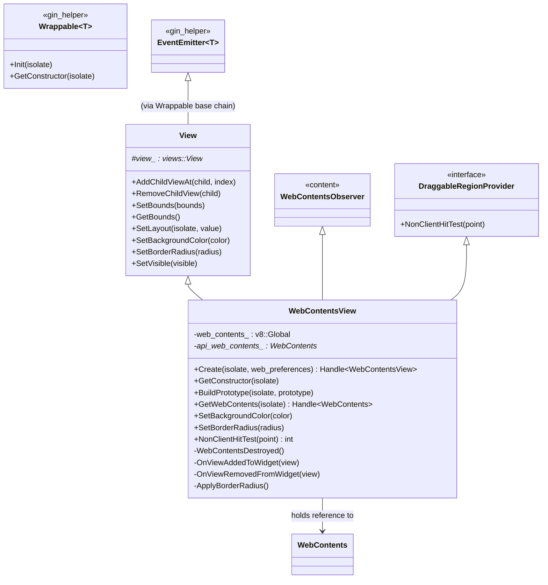
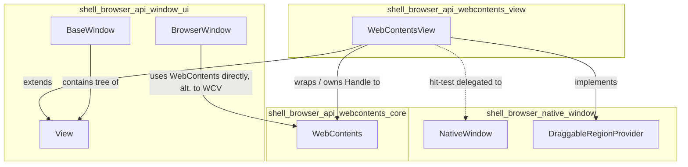
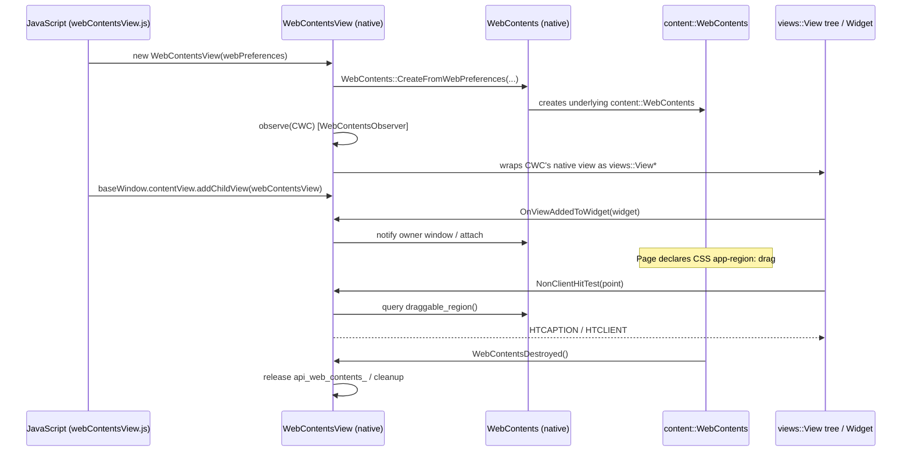
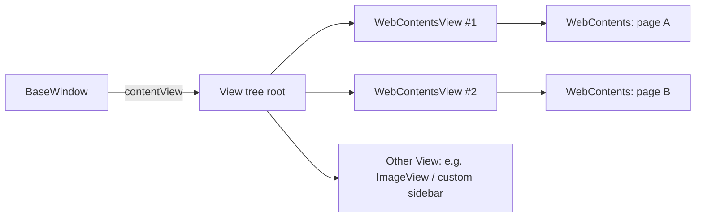

# WebContentsView Module (`shell_browser_api_webcontents_view`)

## Introduction

The `shell_browser_api_webcontents_view` module implements Electron's native
`WebContentsView` class — the C++/gin binding that exposes a `views::View`
capable of hosting a `WebContents` inside Electron's composable UI View
hierarchy. It is the bridge between the low-level `content::WebContents`
rendering surface and Electron's JavaScript-facing `View`/`BaseWindow`
layout system, allowing a renderer's visual output to be embedded, resized,
styled (background color, border radius), and made properly interactive
(e.g. hit-testing for draggable window regions) within a native window.

This module is a small, focused component within the larger
[`shell_browser_api_webcontents`](shell_browser_api_webcontents_core.md)
family of WebContents-related APIs, and it depends heavily on the generic
[`View`](shell_browser_api_window_ui.md) widget infrastructure and the
[`NativeWindow`](shell_browser_native_window.md) draggable-region
abstraction.

---

## Purpose & Core Functionality

`WebContentsView` (`electron::api::WebContentsView`) is responsible for:

1. **Wrapping a `WebContents` as a `views::View`** — so that a web page's
   rendered content can be added into an arbitrary Views-based layout tree
   (windows, splits, custom layouts) alongside other native `View`
   instances (buttons, containers, image views, etc.).
2. **Lifecycle synchronization** — observing the underlying
   `content::WebContents` and reacting when it is destroyed, ensuring the
   native `View` doesn't outlive or dangle from a destroyed web page.
3. **Visual customization** — exposing `SetBackgroundColor()` and
   `SetBorderRadius()` so JS code can style the web content's container
   without needing to touch Chromium internals directly.
4. **Draggable region support** — implementing the `DraggableRegionProvider`
   interface so custom title-bar/drag regions declared by web content (via
   CSS `app-region: drag`) are correctly hit-tested when embedded as a
   `WebContentsView`.
5. **Widget attach/detach hooks** — reacting to `OnViewAddedToWidget` /
   `OnViewRemovedFromWidget` to correctly wire up or tear down the
   association between the native widget and the web contents (e.g. for
   focus, compositing, and window ownership).

It is the primary building block used by the higher-level `WebContentsView`
JS API (`webContentsView` module in Electron's public API) that lets
developers explicitly compose windows out of `BaseWindow` + `View` trees,
as an alternative to the legacy single-WebContents-per-window model.

---

## Architecture

### Class Hierarchy

`WebContentsView` multiply inherits from:
- **`View`** (see [`shell_browser_api_window_ui`](shell_browser_api_window_ui.md)) —
  gives it all generic `View` capabilities: child management, bounds,
  layout, visibility, and the underlying `views::View*` pointer.
- **`content::WebContentsObserver`** (private) — to detect when the
  wrapped `WebContents` goes away.
- **`DraggableRegionProvider`** (from
  [`shell_browser_native_window`](shell_browser_native_window.md)) — to
  participate in native window hit-testing for draggable regions.

### Composition Relationship

---

## Key Components

### `WebContentsView`

| Member / Method | Description |
|---|---|
| `Create(isolate, web_preferences)` | Static factory that builds a new `WebContents` from the given preferences dictionary and wraps it in a new `WebContentsView`. |
| `GetConstructor(isolate)` | Returns the cached V8 constructor function for `WebContentsView`, used by gin's wrappable machinery. |
| `BuildPrototype(isolate, prototype)` | Registers the JS-visible prototype methods (`getWebContents`, `setBackgroundColor`, `setBorderRadius`, etc.) via `gin_helper::ObjectTemplateBuilder`. |
| `GetWebContents(isolate)` | Returns the gin `Handle<WebContents>` associated with this view, allowing JS to access the full `WebContents` API (navigation, devtools, etc. — see [`shell_browser_api_webcontents_core`](shell_browser_api_webcontents_core.md)). |
| `SetBackgroundColor(color)` | Sets the background color drawn behind the web content (useful before the page paints, or for transparent regions). |
| `SetBorderRadius(radius)` | Applies rounded corners to the view, implemented via `ApplyBorderRadius()` which likely configures a clip/mask layer. |
| `NonClientHitTest(point)` | Overrides `DraggableRegionProvider`'s hit test so custom-drawn window drag regions declared in the web page are respected when this view is embedded in a frameless/custom-titlebar window. |
| `WebContentsDestroyed()` | `WebContentsObserver` override; invoked when the underlying `content::WebContents` is destroyed out from under the view, allowing cleanup. |
| `OnViewAddedToWidget` / `OnViewRemovedFromWidget` | `views::ViewObserver` overrides that fire when this view (or its underlying `views::View`) is attached to / detached from a `Widget` — used to wire up focus/compositor state tied to the window lifecycle. |
| `New(gin_helper::Arguments*)` | The gin-registered constructor invoked from JS `new WebContentsView(options)`. |

**Private State:**
- `web_contents_` — a persistent V8 handle keeping the JS `WebContents`
  wrapper object alive as long as the `WebContentsView` exists.
- `api_web_contents_` — a raw (non-owning) pointer to the `api::WebContents`
  C++ object for direct native access.

---

## Data Flow

---

## Interaction with Other Modules

| Related Module | Relationship |
|---|---|
| [`shell_browser_api_webcontents_core`](shell_browser_api_webcontents_core.md) | `WebContentsView` wraps and owns a reference to the `WebContents` gin wrapper defined there; all navigation/rendering/devtools functionality is delegated to it. |
| [`shell_browser_api_window_ui`](shell_browser_api_window_ui.md) | `WebContentsView` extends the base `View` class (`electron_api_view.h`), inheriting child management, layout, and visibility behavior shared by all View-family widgets (`ImageView`, etc.), and is composed into `BaseWindow`/`BrowserWindow` content view trees. |
| [`shell_browser_native_window`](shell_browser_native_window.md) | Implements `DraggableRegionProvider` (declared in `native_window.h`), enabling frameless/custom-titlebar `NativeWindow` implementations to delegate hit-testing to embedded web content. |
| [`Common_Native_Gin_Infrastructure`](Common_API.md) | Relies on `gin_helper::Wrappable`, `gin_helper::Handle`, `gin_helper::Dictionary`, and `ObjectTemplateBuilder` for V8 binding plumbing (see `Gin_Helper` docs). |
| [`shell_browser_api_webcontents_support`](shell_browser_api_webcontents_support.md) | Indirectly related: `FrameSubscriber`, `SavePageHandler`, and `MessagePort` support classes used by the wrapped `WebContents` also apply when that `WebContents` is hosted via a `WebContentsView`. |

---

## Typical Usage Pattern (Conceptual)

This pattern (multiple `WebContentsView`s composed with other `View`s under
a single `BaseWindow`) is the primary motivation for this module: it allows
developers to build multi-pane browser UIs (tabs, split views, sidebars)
without resorting to multiple OS-level windows or the older `BrowserView`
API.

---

## Design Notes

- **Ownership model**: `WebContentsView` does *not* necessarily own the
  `WebContents` — the `web_contents_` field is a persistent V8 reference
  keeping the JS object alive, while `api_web_contents_` is a raw pointer
  used for calling into the native object directly. This mirrors Electron's
  general gin-wrapper pattern where V8 garbage collection and C++ object
  ownership are coordinated via a wrapper handle rather than direct
  ownership.
- **Observer-based cleanup**: By observing `content::WebContentsObserver`,
  the view guards against dangling `api_web_contents_` pointers if the
  underlying `WebContents` is destroyed independently of the view.
- **Border radius / background color** are implemented at the `View` layer
  and specialized here (`ApplyBorderRadius`) because a hosted web page's
  content needs special handling (e.g. layer masking) compared to plain
  native `View`s.
