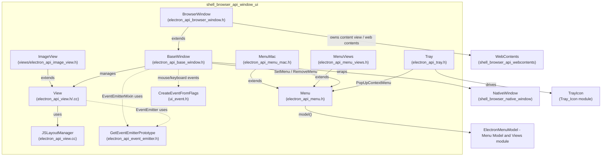
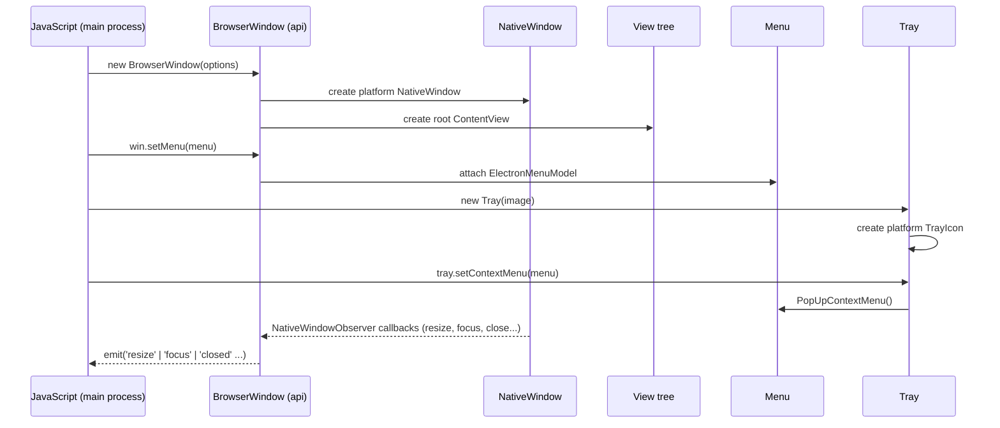
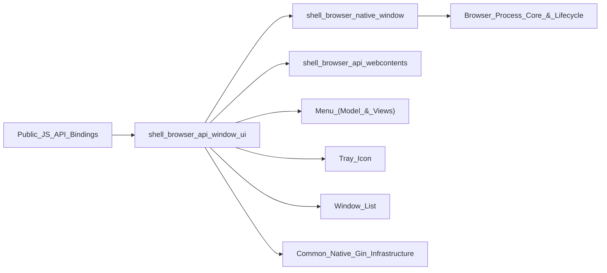

# Shell Browser API: Window & UI

## Introduction

The **`shell_browser_api_window_ui`** module implements the browser-process JavaScript-visible APIs for Electron's core desktop UI primitives:

- **Windows** — `BaseWindow` and `BrowserWindow`, the classes that back Electron's `BrowserWindow`/`BaseWindow` JS classes.
- **Menus** — `Menu` and its platform-specialized subclasses `MenuMac` (Cocoa native menus) and `MenuViews` (Chromium Views-based menus on Windows/Linux).
- **Tray** — `Tray`, backing the JS `Tray` (system tray icon) class.
- **Views** — the low-level `View` composable UI primitive (and `ImageView`), which underlies `BrowserWindow`'s content view tree, plus small event-related helpers (`electron_api_event_emitter.h`, `ui_event.h`) shared by all `gin_helper::EventEmitter`-derived wrappers in this module.

These classes are all exposed to Node/Chromium-embedder JavaScript through Electron's `gin`/`gin_helper` binding layer (see [Common_Native_Gin_Infrastructure](Common_Native_Gin_Infrastructure.md)) and sit on top of the platform-neutral windowing primitives documented in [shell_browser_native_window](shell_browser_native_window.md).

This module is part of the larger **Native_Window_&_Menu_Management** area of Electron's browser process, and works closely with:

- [shell_browser_native_window](shell_browser_native_window.md) – the underlying `NativeWindow`/`NativeWindowMac`/`NativeWindowViews` platform window implementations that `BaseWindow` wraps.
- [Window_List](Window_List.md) – global registry of all open `NativeWindow` instances.
- [Menu_(Model_&_Views)](Menu_(Model_&_Views).md) – the `ElectronMenuModel` and platform menu-controller/menu-bar implementations that back `Menu`.
- [Tray_Icon](Tray_Icon.md) – the platform `TrayIcon` implementations (Cocoa, GTK, Windows) that `Tray` drives.
- [shell_browser_api_webcontents](shell_browser_api_webcontents.md) – `WebContents`, which every `BrowserWindow` owns and renders.
- [Common_Native_Gin_Infrastructure](Common_Native_Gin_Infrastructure.md) – `gin_helper` wrapping, event-emitter, and converter infrastructure used pervasively here.

## Architecture Overview

## Sub-modules

| Sub-module | Description | Documentation |
|---|---|---|
| **Windows** | `BaseWindow` (generic window API surface: bounds, state, menu, touch bar, taskbar integration) and `BrowserWindow` (window that hosts a `WebContents`). | [shell_browser_api_window_ui_windows](shell_browser_api_window_ui_windows.md) |
| **Menu** | `Menu` base class plus platform popup implementations `MenuMac` and `MenuViews`. | [shell_browser_api_window_ui_menu](shell_browser_api_window_ui_menu.md) |
| **Tray** | `Tray` system tray icon API, including balloon notifications, context menu, and mouse/drag event forwarding. | [shell_browser_api_window_ui_tray](shell_browser_api_window_ui_tray.md) |
| **Views & Event Helpers** | `View` composable UI element, `ImageView`, `JSLayoutManager` (JS-driven layout manager), and shared event-emitter/UI-event helper functions. | [shell_browser_api_window_ui_views](shell_browser_api_window_ui_views.md) |

## High-Level Data & Control Flow

## Key Cross-Module Relationships

- **`BaseWindow`** wraps a platform `electron::NativeWindow` (see [shell_browser_native_window](shell_browser_native_window.md)) and implements `NativeWindowObserver` to translate native window lifecycle/state events into JS `EventEmitter` events.
- **`BrowserWindow`** extends `BaseWindow` and additionally observes `content::WebContentsObserver` / `ExtendedWebContentsObserver` to bridge a `WebContents` (see [shell_browser_api_webcontents](shell_browser_api_webcontents.md)) into the window's lifecycle (title updates, activation, close confirmation dialogs, etc).
- **`Menu`** delegates command dispatch and accelerator resolution through `ElectronMenuModel::Delegate`/`Observer` (see [Menu_(Model_&_Views)](Menu_(Model_&_Views).md)), while `MenuMac`/`MenuViews` provide the actual popup/rendering using Cocoa's `ElectronMenuController` or `views::MenuRunner` respectively.
- **`Tray`** owns a platform `TrayIcon` (see [Tray_Icon](Tray_Icon.md)) and can pop up a `Menu` as its context menu.
- **`View`**/`ImageView` are the building blocks for `BaseWindow`'s content view hierarchy and for standalone composable UI (`WebContentsView`, `ImageView`, custom layouts via `JSLayoutManager`).
- All classes above rely on the shared `gin_helper` wrapping/constructing infrastructure (`Wrappable`, `Constructible`, `EventEmitterMixin`, `Pinnable`, `Handle`) documented in [Common_Native_Gin_Infrastructure](Common_Native_Gin_Infrastructure.md).

## Where This Module Fits

`shell_browser_api_window_ui` is the JavaScript-facing veneer of Electron's **Native_Window_&_Menu_Management** area: it turns low-level, platform-specific window/menu/tray/view primitives into a uniform, cross-platform JS API surface consumed by app developers.
