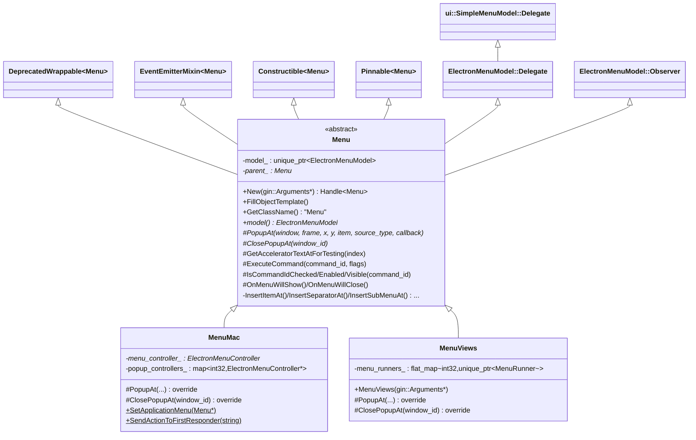
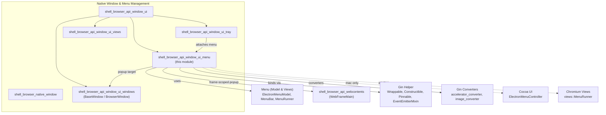
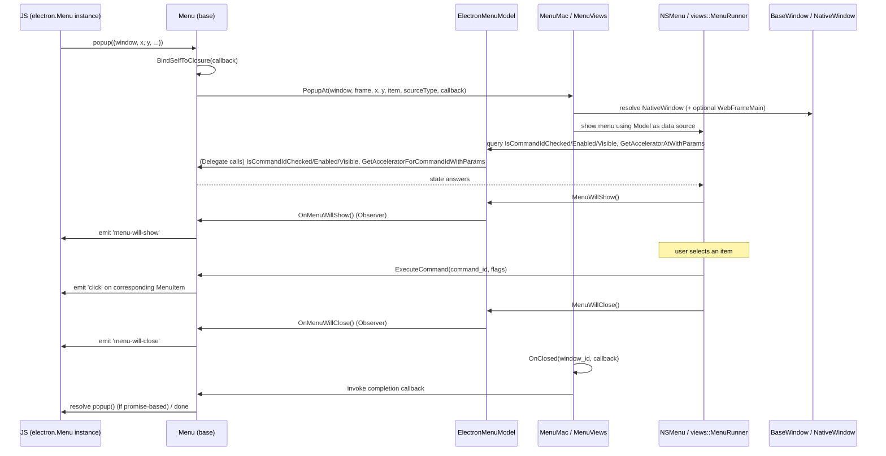
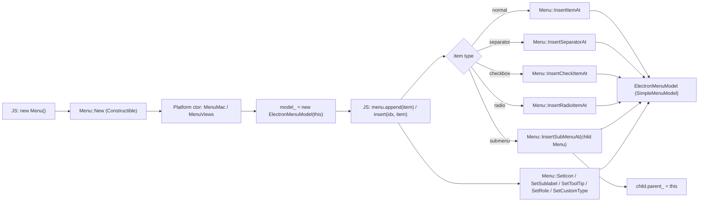
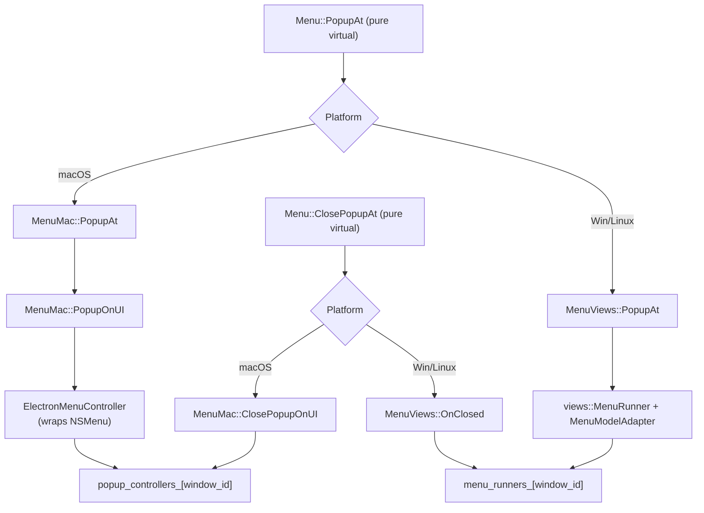
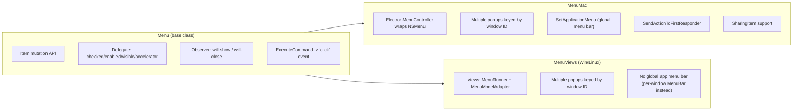

# Shell Browser API — Window UI Menu (`shell_browser_api_window_ui_menu`)

## Introduction

This module implements Electron's `Menu` JavaScript API — the native, cross-platform
context/application menu system exposed to Node.js/Chromium's Main process. It provides
the C++ glue between Electron's V8-bound `Menu` object and the underlying platform menu
toolkits: **Cocoa `NSMenu`** on macOS and **`views::MenuRunner`** (Chromium Views) on
Windows/Linux.

The module is composed of three tightly-coupled headers:

| File | Component | Responsibility |
|---|---|---|
| `shell/browser/api/electron_api_menu.h` | `Menu` | Platform-agnostic base class: gin bindings, menu item mutation, delegate/observer glue to `ElectronMenuModel` |
| `shell/browser/api/electron_api_menu_mac.h` | `MenuMac` | macOS implementation using `ElectronMenuController` (Cocoa `NSMenu` wrapper) |
| `shell/browser/api/electron_api_menu_views.h` | `MenuViews` | Windows/Linux implementation using `views::MenuRunner` |

It sits inside the broader **[Native Window & Menu Management](shell_browser_api_window_ui.md)**
area of the codebase and depends heavily on the menu *model* defined in
**[Menu (Model & Views)](Menu_(Model_&_Views).md)** and on the generic native-binding
infrastructure in **[Gin Helper](Gin_Helper.md)**.

---

## Purpose & Core Functionality

The `Menu` class (and its platform subclasses) is the native-side implementation backing
`electron.Menu` in the main-process JS API. Its responsibilities are:

1. **Object lifecycle & JS binding** — Constructible via `gin_helper::Constructible`,
   wrapped via `gin_helper::DeprecatedWrappable`, and kept alive appropriately via
   `gin_helper::Pinnable` (so open/popped-up menus aren't garbage collected mid-display).
2. **Menu structure mutation** — Exposes methods to insert items, separators, checkboxes,
   radio buttons, and submenus, as well as to set icons, sublabels, tooltips, roles, and
   custom types on menu entries. These calls are forwarded to the underlying
   `ElectronMenuModel` (a `ui::SimpleMenuModel` subclass).
3. **Delegate protocol** — Implements `ElectronMenuModel::Delegate` to answer menu-state
   queries (checked/enabled/visible, accelerators, sharing items on macOS) and to route
   command execution (`ExecuteCommand`) back into the emitted `click` events on the JS
   side.
4. **Observer protocol** — Implements `ElectronMenuModel::Observer` privately to bridge
   native `MenuWillShow`/`MenuWillClose` notifications to JS `menu-will-show` /
   `menu-will-close` events.
5. **Popup lifecycle** — Declares the pure-virtual `PopupAt` / `ClosePopupAt` interface
   that platform subclasses implement to actually display/dismiss a context menu attached
   to a `BaseWindow`, optionally scoped to a specific `WebFrameMain`.
6. **Platform-specific application menu (macOS only)** — `Menu::SetApplicationMenu` and
   `Menu::SendActionToFirstResponder` manage the global macOS menu bar and NSResponder
   action forwarding, which has no equivalent on Windows/Linux.

---

## Architecture

### Class Hierarchy

### Module Position

---

## Component Details

### `Menu` (platform-agnostic base)

`shell/browser/api/electron_api_menu.h`

- **Bindings surface (`gin_helper::Constructible`)** — `New()` constructs the correct
  platform subclass (`MenuMac` or `MenuViews`) transparently to JS; `FillObjectTemplate`
  registers all prototype methods/properties exposed to script.
- **Backing model** — Owns a `std::unique_ptr<ElectronMenuModel> model_`. All item-level
  mutation methods (`InsertItemAt`, `InsertCheckItemAt`, `InsertRadioItemAt`,
  `InsertSubMenuAt`, `SetIcon`, `SetSublabel`, `SetToolTip`, `SetRole`, `SetCustomType`,
  `Clear`, and the various getters) operate on `model_`, delegating actual list storage
  and state to `ElectronMenuModel` (see
  **[Menu (Model & Views)](Menu_(Model_&_Views).md)**).
- **Delegate implementation** — Implements every query the `ElectronMenuModel::Delegate`
  interface requires: checked/enabled/visible state, accelerator resolution
  (`GetAcceleratorForCommandIdWithParams`), whether accelerators should be registered
  globally, and whether a command should still fire when the item is hidden. On macOS,
  additionally answers `GetSharingItemForCommandId` for `ShareMenu`-style items (see
  **[lib_browser_api_menu_and_sharing](lib_browser_api_menu_and_sharing.md)** for the
  JS-side `ShareMenu`/`Role` wrappers).
- **Command execution** — `ExecuteCommand(command_id, event_flags)` is invoked by the
  platform toolkit when a user clicks an item; the base class translates this into the
  `click` event emitted on the JS `MenuItem`/`Menu` object via `EventEmitterMixin`.
- **Self-keep-alive during popup** — `BindSelfToClosure` wraps a callback so that the JS
  wrapper (and therefore the C++ `Menu`) is kept alive for the duration of an
  asynchronous popup operation, preventing use-after-free when a menu is displayed
  detached from any other GC root.
- **Parent/submenu tracking** — `parent_` (a raw, non-owning pointer) lets a submenu
  locate its owning `Menu`, used e.g. for accelerator propagation and closing cascades.
- **Popup contract (pure virtual)** — `PopupAt` / `ClosePopupAt` are the seam implemented
  differently per platform; `GetAcceleratorTextAtForTesting` is a virtual test hook with a
  default implementation shared by subclasses that don't need to override it.
- **Gin type conversion helper** — A `gin::Converter<electron::ElectronMenuModel*>`
  specialization is defined alongside `Menu` to unwrap a JS `Menu` object (or `null`)
  directly into its underlying `ElectronMenuModel*`, used e.g. when assigning submenus or
  window menus from script.

### `MenuMac` (macOS)

`shell/browser/api/electron_api_menu_mac.h`

- Wraps a Cocoa `ElectronMenuController*` (see
  **[Cocoa UI](Cocoa_UI.md)** → `electron_menu_controller.h`) that adapts the
  `ElectronMenuModel` into an actual `NSMenu`.
- `PopupAt` resolves the target `NativeWindow` and optional `WebFrameMain*` on the UI
  thread and calls `PopupOnUI`, which performs the actual native `NSMenu` popup anchored
  to the specified window/frame and screen coordinates.
- Multiple concurrent context-menu popups are tracked per-window in
  `popup_controllers_` (`window ID -> ElectronMenuController*`), since more than one
  window could show a context menu simultaneously.
- `ClosePopupAt` / `ClosePopupOnUI` dismiss a specific window's open popup; `OnClosed`
  cleans up the controller entry and invokes the completion callback.
- Static macOS-only surface: `SetApplicationMenu` installs a `Menu` as the process-wide
  macOS menu bar; `SendActionToFirstResponder` allows JS to simulate standard macOS
  editing/window actions (cut/copy/paste, etc.) by forwarding an NSResponder action
  message — used for menu roles (see `Role` in
  **[lib_browser_api_menu_and_sharing](lib_browser_api_menu_and_sharing.md)**).

### `MenuViews` (Windows/Linux)

`shell/browser/api/electron_api_menu_views.h`

- Uses Chromium's `views::MenuRunner` to display the menu, driven by an adapter over
  `ElectronMenuModel` (`MenuModelAdapter`, see
  **[Menu (Model & Views)](Menu_(Model_&_Views).md)**).
- Like `MenuMac`, supports multiple simultaneously open popups by keying
  `menu_runners_` (`base::flat_map<int32_t, std::unique_ptr<views::MenuRunner>>`) by
  window ID.
- `PopupAt` builds/opens a `MenuRunner` anchored to the target window's native widget;
  `ClosePopupAt` cancels the runner for the given window; `OnClosed` erases the map entry
  and invokes the completion callback — mirroring the macOS teardown flow but through the
  Views toolkit instead of Cocoa.

---

## Data Flow: Showing a Context Menu (`menu.popup()`)

## Data Flow: Building a Menu Tree

---

## Cross-Platform Popup/Close Dispatch

---

## Key Relationships & Dependencies

| Dependency | Relationship |
|---|---|
| **[Menu (Model & Views)](Menu_(Model_&_Views).md)** | `ElectronMenuModel` is the `ui::SimpleMenuModel` subclass that actually stores menu items; `Menu` implements its `Delegate`/`Observer` interfaces. `MenuModelAdapter`, `MenuBar`, and `MenuRunner` (Views) render the model on Windows/Linux; `ElectronMenuController` renders it on macOS. |
| **[shell_browser_api_window_ui_windows](shell_browser_api_window_ui_windows.md)** | `BaseWindow` is the popup anchor passed into `PopupAt`; `BaseWindow::SetMenu`/`RemoveMenu` attach a `Menu` as a window's menu bar. |
| **[shell_browser_api_webcontents](shell_browser_api_webcontents.md)** | `WebFrameMain` allows a context menu popup to be scoped to a specific render frame (used for frame-targeted context menus, e.g. from `WebContents` `context-menu` event). |
| **[shell_browser_api_window_ui_tray](shell_browser_api_window_ui_tray.md)** | `Tray` (`electron_api_tray.h`) attaches a `Menu` to a system tray icon, reusing the same `ElectronMenuModel`-based structure. |
| **[Gin Helper](Gin_Helper.md)** | Supplies `DeprecatedWrappable`, `Constructible`, `Pinnable`, `EventEmitterMixin`, `Handle`, and `Arguments` — the generic native/JS binding scaffolding used by nearly every `electron.*` API class. |
| **[Gin Converters](Gin_Converters.md)** | `accelerator_converter.h` and `image_converter.h` convert JS values to `ui::Accelerator` / `gfx::Image` used in `SetIcon`, `GetAcceleratorForCommandIdWithParams`, etc. A custom `gin::Converter<ElectronMenuModel*>` is defined directly in `electron_api_menu.h` to unwrap a JS `Menu`/`null` into its model pointer (used for submenu assignment). |
| **[Cocoa UI](Cocoa_UI.md)** | `ElectronMenuController` — the Objective-C++ class that projects `ElectronMenuModel` onto `NSMenu`, used exclusively by `MenuMac`. |
| **[lib_browser_api_menu_and_sharing](lib_browser_api_menu_and_sharing.md)** | JS-side `Role` enum and `ShareMenu` wrapper build on top of native `Menu`/`SharingItem` support (macOS `GetSharingItemForCommandId`) and role-based accelerators (`SendActionToFirstResponder`). |
| **[shell_browser_native_window](shell_browser_native_window.md)** | `NativeWindow` is the platform window type resolved from a `BaseWindow` and used as the anchor for native popup APIs (`NSMenu` / `MenuRunner`). |

---

## Platform Differentiation Summary

- Both platform classes support **multiple concurrent popups** (one per window ID),
  since Electron allows independent context menus across separate `BrowserWindow`
  instances.
- Only **macOS** exposes a *global* application menu (`SetApplicationMenu`) and NSResponder
  action forwarding, reflecting the singular system menu bar model on macOS.
- On **Windows/Linux**, a window-level menu bar is instead implemented separately via
  `MenuBar` / `GlobalMenuBarX11` (see **[Menu (Model & Views)](Menu_(Model_&_Views).md)**),
  not through this module's `Menu` class directly — `Menu` here is used for both the
  window menu bar's model and standalone context-menu popups.

---

## Summary

The `shell_browser_api_window_ui_menu` module provides the native backbone for Electron's
`Menu` API: a shared, model-driven base class (`Menu`) plus two platform-specific popup
implementations (`MenuMac`, `MenuViews`). It cleanly separates *menu structure/state*
(delegated to `ElectronMenuModel`) from *menu presentation* (delegated to Cocoa or
Chromium Views), while providing the JS binding surface via Electron's `gin_helper`
infrastructure. It integrates closely with window management (`BaseWindow`/`NativeWindow`),
frame targeting (`WebFrameMain`), and the system tray (`Tray`), and forms the foundation
that Electron's higher-level JS menu conveniences (roles, sharing menus, touch bar menu
items) build upon.
