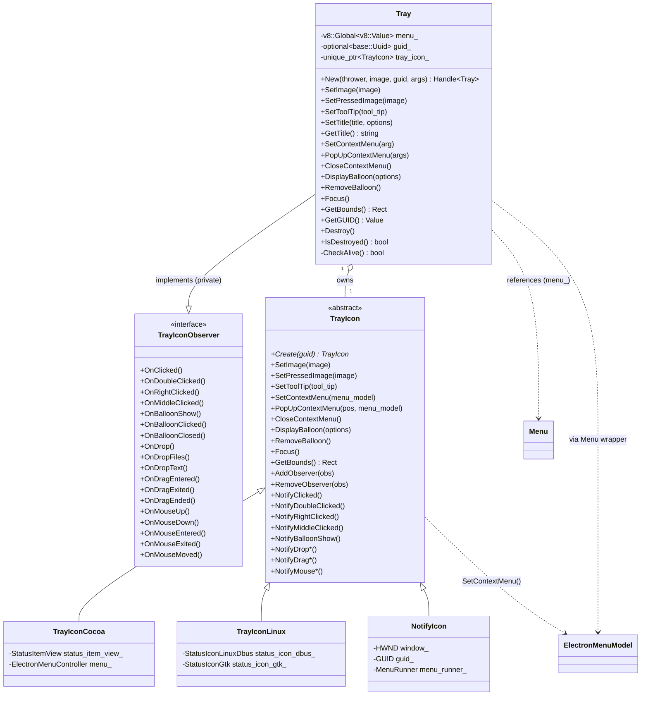
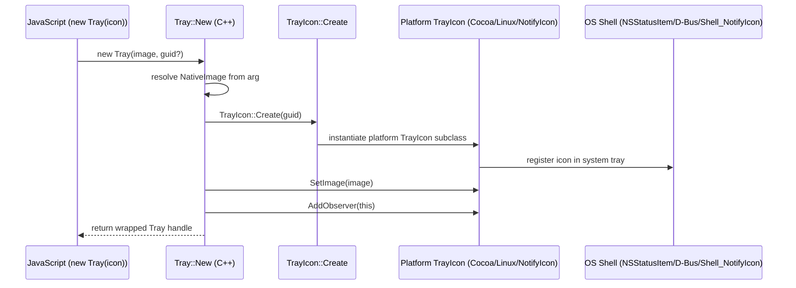
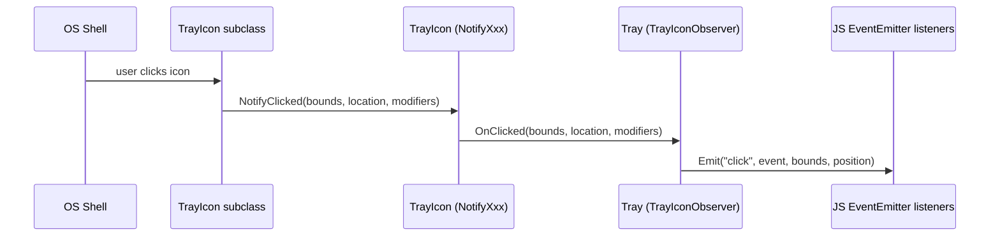
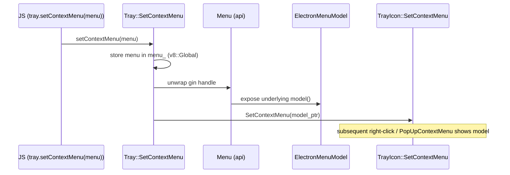
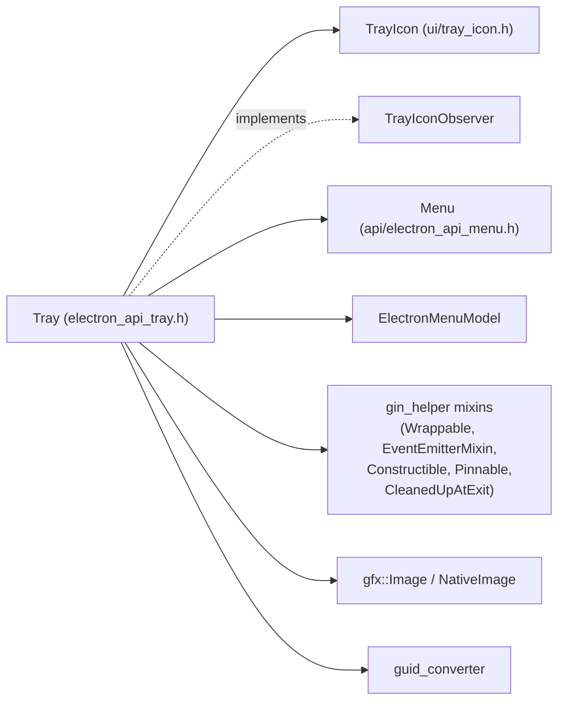
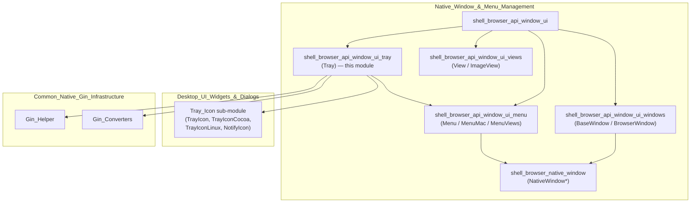
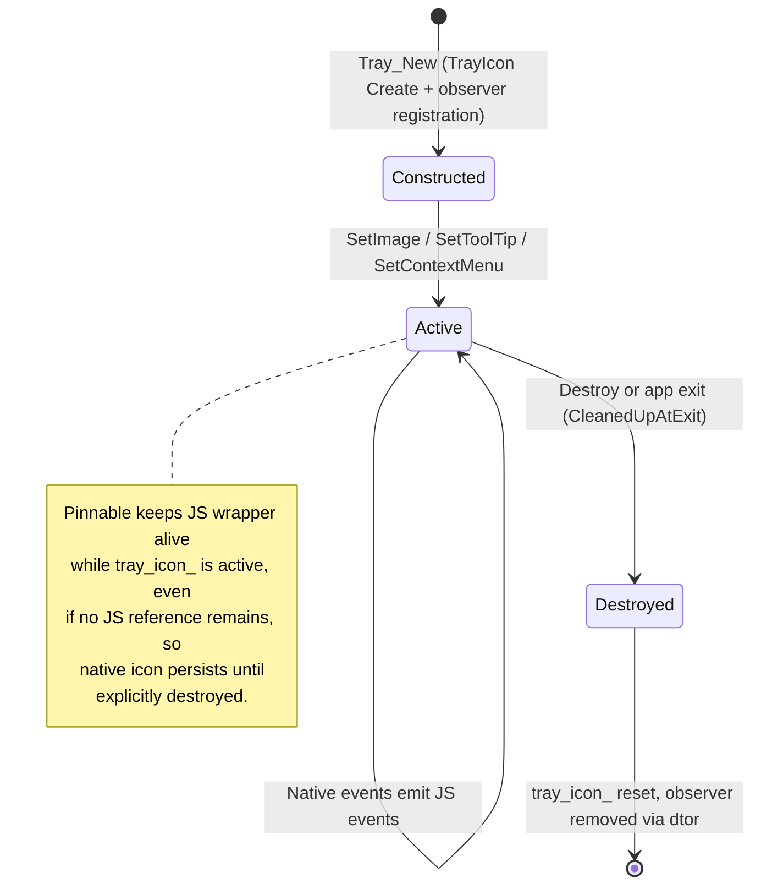

# Shell Browser API — Window UI Tray Module

## Introduction

The `shell_browser_api_window_ui_tray` module implements Electron's **`Tray`** JavaScript API — the object that lets applications place an icon in the operating system's notification area (macOS menu bar, Windows system tray, or Linux status area). This module is the *Gin binding layer* that exposes native tray functionality to JavaScript; it wraps a platform-specific `TrayIcon` implementation and forwards native UI events (clicks, drags, balloon interactions, etc.) as EventEmitter events on the JS-facing `Tray` object.

This module is one of four siblings under the broader **Native Window & Menu Management** area (`shell_browser_api_window_ui`), alongside window (`shell_browser_api_window_ui_windows`), menu (`shell_browser_api_window_ui_menu`), and view (`shell_browser_api_window_ui_views`) bindings. It depends heavily on the platform-agnostic `TrayIcon` interface and its OS-specific implementations, documented in [Desktop_UI_Widgets_&_Dialogs.md](Desktop_UI_Widgets_&_Dialogs.md).

---

## Module Purpose

| Concern | Description |
|---|---|
| **Primary responsibility** | Expose a `Tray` gin-wrappable class to JS that creates, configures, and destroys a native system tray icon. |
| **Core file** | `shell/browser/api/electron_api_tray.h` |
| **Key class** | `electron::api::Tray` |
| **Pattern** | Bridge / Facade over platform-specific `TrayIcon` subclasses, using the PIMPL-like `tray_icon_` member. |
| **Event model** | Implements `TrayIconObserver` privately and re-emits native callbacks as gin `EventEmitterMixin` events (`click`, `double-click`, `right-click`, `drop`, `mouse-move`, etc.) |

---

## Component Overview

### `Tray` (electron::api::Tray)

`Tray` is defined in `shell/browser/api/electron_api_tray.h` and is the sole core component of this module. It combines multiple gin-helper mixins to provide full JS object lifecycle management:

- **`gin_helper::DeprecatedWrappable<Tray>`** — provides the V8 wrapper/unwrap machinery (see [Gin_Helper.md](Gin_Helper.md)).
- **`gin_helper::EventEmitterMixin<Tray>`** — allows `Tray` instances to emit Node.js-style events to JS listeners.
- **`gin_helper::Constructible<Tray>`** — supports `new Tray(...)` construction from JS via the static `New()` factory.
- **`gin_helper::CleanedUpAtExit`** — ensures the native tray icon is torn down safely during app shutdown (`WillBeDestroyed()`).
- **`gin_helper::Pinnable<Tray>`** — keeps the JS wrapper alive as long as necessary (pinned) so short-lived script references don't prematurely garbage collect an active tray icon.
- **`TrayIconObserver` (private)** — receives raw native UI events and translates them into JS-visible events.

#### Key Responsibilities

1. **Construction** (`Tray::New`) — Accepts an image (path, `NativeImage`, or empty), optional GUID (Windows tray icon identity persistence), and general `gin::Arguments`. Internally instantiates a platform-specific `TrayIcon` via `TrayIcon::Create(guid)`.
2. **Image & Appearance** — `SetImage`, `SetPressedImage`, `SetToolTip`, `SetTitle`/`GetTitle` (macOS-only text next to the icon).
3. **Context Menu** — `SetContextMenu`, `PopUpContextMenu`, `CloseContextMenu` bridge to the JS `Menu` object (see [shell_browser_api_window_ui_menu.md](shell_browser_api_window_ui_menu.md)); the menu reference is retained in `menu_` (a `v8::Global<v8::Value>`) to keep the underlying `ElectronMenuModel` alive.
4. **Notifications** — `DisplayBalloon` / `RemoveBalloon` (Windows/Linux balloon-style notifications distinct from the cross-platform `Notification` API — see [Platform-Specific_Integration.md](Platform-Specific_Integration.md)).
5. **Lifecycle** — `Destroy()`, `IsDestroyed()`, `CheckAlive()` guard against use-after-free once the tray icon is removed.
6. **Event forwarding** — Implements every `TrayIconObserver` callback (`OnClicked`, `OnDoubleClicked`, `OnRightClicked`, `OnMiddleClicked`, `OnBalloonShow/Clicked/Closed`, `OnDrop*`, `OnDragEntered/Exited/Ended`, `OnMouse*`) and re-emits them as JS events with position/modifier metadata.
7. **GUID support** (`GetGUID`) — Windows allows tray icons to persist an identity (GUID) across app restarts so the OS remembers taskbar pinning/position.

---

## Architecture

### Class Relationships

### Platform Abstraction

The `Tray` class never talks to OS APIs directly. It delegates all rendering/interaction to a `TrayIcon` instance created via the platform factory `TrayIcon::Create()`. Platform implementations live in [Desktop_UI_Widgets_&_Dialogs.md](Desktop_UI_Widgets_&_Dialogs.md) under the "Tray_Icon" sub-module:

| Platform | Implementation | Notes |
|---|---|---|
| macOS | `TrayIconCocoa` | Wraps `NSStatusItem` via a custom `StatusItemView`; menu shown through `ElectronMenuController`. |
| Linux | `TrayIconLinux` | Delegates to either D-Bus (`StatusIconLinuxDbus`) or GTK (`StatusIconGtk`) status icon backends depending on desktop environment support. |
| Windows | `NotifyIcon` (owned by `NotifyIconHost`) | Uses the Windows Shell notification area API (`Shell_NotifyIcon`); supports GUID-based icon identity and `views::MenuRunner` for context menus. |

---

## Data Flow

### Tray Creation Flow

### Native Event → JS Event Flow

### Context Menu Flow

---

## Integration Points

### Dependencies

- **`shell_browser_api_window_ui_menu`** — `Tray::SetContextMenu`/`PopUpContextMenu` take a `Menu` (or `BaseWindow`-adjacent) JS object and extract its `ElectronMenuModel*`, tying tray context menus to the same menu infrastructure used by application and window menus. See [shell_browser_api_window_ui_menu.md](shell_browser_api_window_ui_menu.md).
- **`Desktop_UI_Widgets_&_Dialogs` (Tray_Icon sub-module)** — Supplies the abstract `TrayIcon`/`TrayIconObserver` interfaces and every OS-specific backend (`TrayIconCocoa`, `TrayIconLinux`, `NotifyIcon`/`NotifyIconHost`). See [Desktop_UI_Widgets_&_Dialogs.md](Desktop_UI_Widgets_&_Dialogs.md).
- **`Common_Native_Gin_Infrastructure`** — `Tray` relies on `gin_helper::Wrappable`, `EventEmitterMixin`, `Constructible`, `Pinnable`, `CleanedUpAtExit`, `ErrorThrower`, and `Dictionary`/`Arguments` conversion helpers. See [Gin_Helper.md](Gin_Helper.md) and [Common_API.md](Common_API.md) (for `NativeImage` conversions used when resolving the `image` argument).
- **`Common_Native_Gin_Infrastructure` (Gin_Converters)** — Uses `image_converter.h` to convert JS image arguments (path string, buffer, or `NativeImage` handle) into `gfx::Image`.
- **`shell_browser_api_window_ui_windows` / `_views`** — Sibling bindings sharing the same parent module (`shell_browser_api_window_ui`); not directly coupled to `Tray` but part of the same JS `api` object surface exposed to renderer/main scripts.

### Position within the Overall System

---

## Lifecycle & Memory Management

Key points:
- **`CheckAlive()`** is called at the top of most JS-exposed methods to throw a JS error rather than crash if `Destroy()` was already called.
- **`WillBeDestroyed()`** (from `CleanedUpAtExit`) guarantees native cleanup happens during Electron's app shutdown sequence, preventing dangling OS tray icons.
- **`Pinnable<Tray>`** prevents premature garbage collection: since a tray icon has externally visible OS effects, it must stay alive independent of JS reachability until explicitly destroyed.

---

## Summary

The `shell_browser_api_window_ui_tray` module is a thin, single-class binding (`Tray`) that adapts the cross-platform `TrayIcon` abstraction (and its Cocoa/Linux/Windows implementations) into Electron's JavaScript API surface. It cleanly separates concerns:

- **Native platform logic** lives in `TrayIcon` subclasses (documented under [Desktop_UI_Widgets_&_Dialogs.md](Desktop_UI_Widgets_&_Dialogs.md)).
- **JS object lifecycle & event plumbing** lives in this module, using shared gin-helper infrastructure ([Gin_Helper.md](Gin_Helper.md)).
- **Menu integration** is delegated to the sibling menu module ([shell_browser_api_window_ui_menu.md](shell_browser_api_window_ui_menu.md)).

This separation allows the JS-facing `Tray` API to remain stable across platforms while each OS's native tray/status-icon quirks are encapsulated behind the `TrayIcon` interface.
