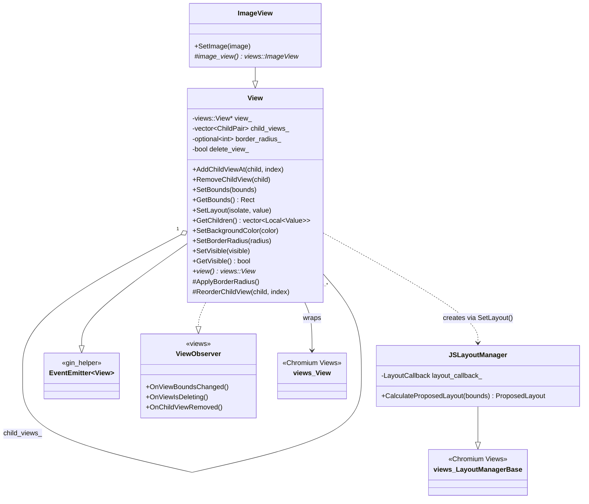
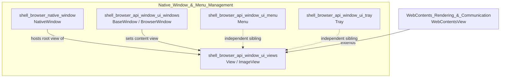
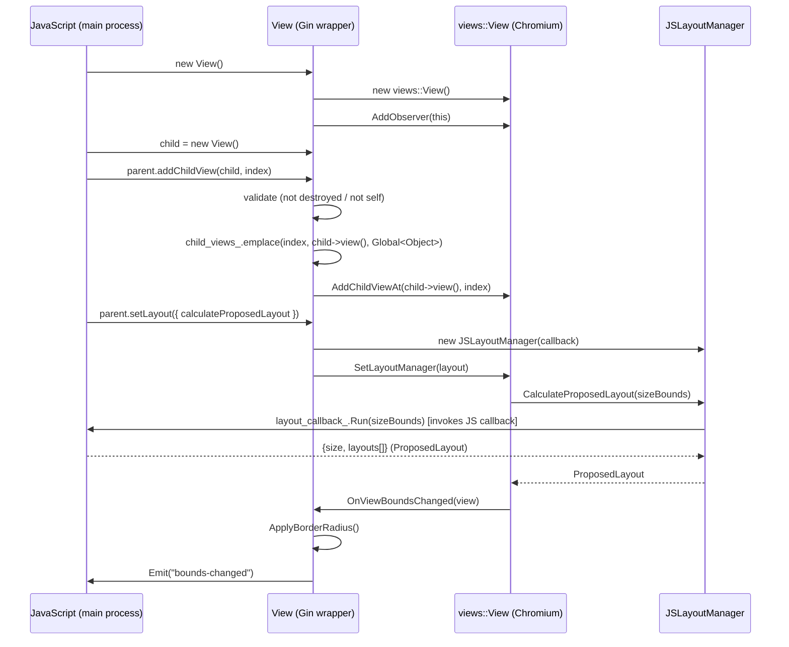
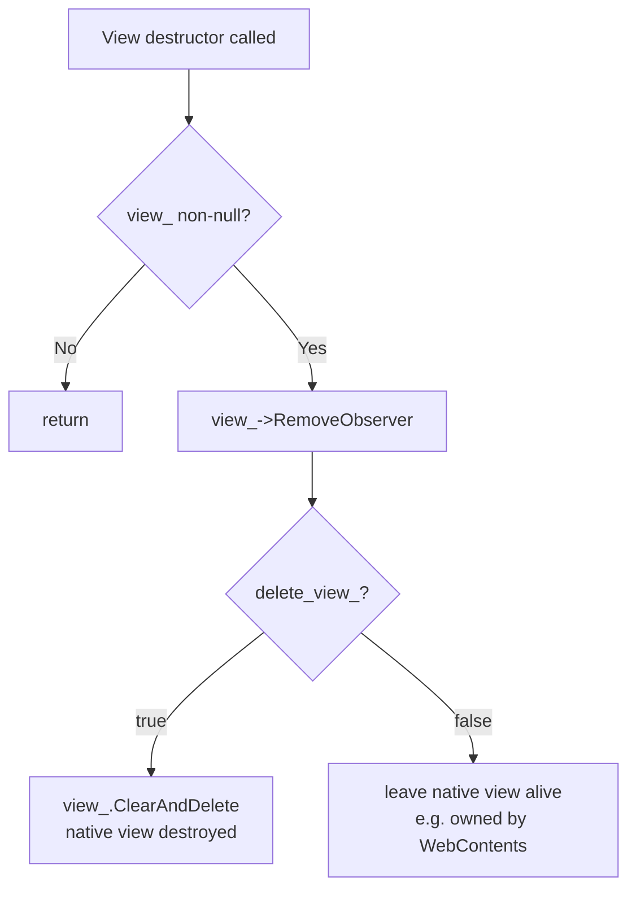
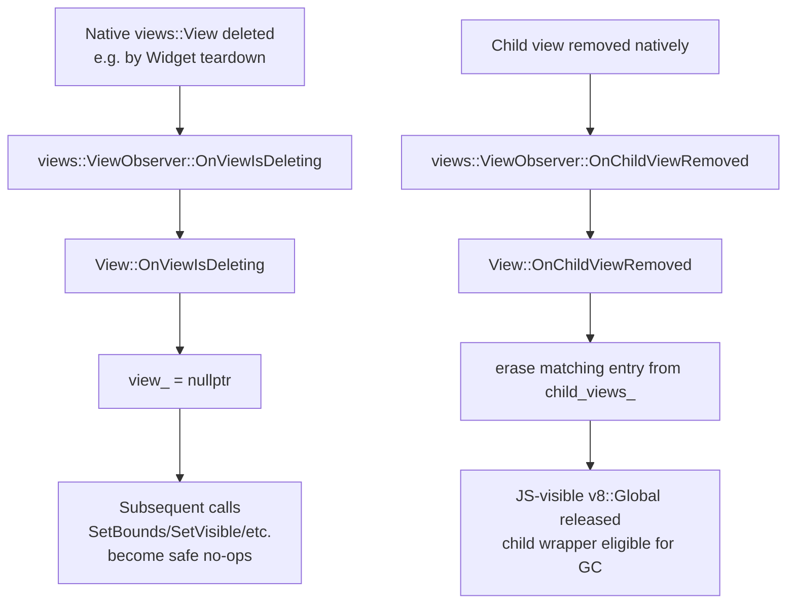

# Shell Browser API Window UI Views

## Introduction

The **Shell Browser API Window UI Views** module provides Electron's low-level, composable UI primitive for building native window content trees: the JavaScript-exposed `View` class. It is the foundational building block that sits underneath higher-level UI surfaces such as `BrowserWindow`, `WebContentsView`, and specialized views (e.g. `ImageView`). This module bridges Chromium's native `views::View` hierarchy (part of the `//ui/views` toolkit) with Electron's Gin/V8 JavaScript bindings, allowing JS code to construct, nest, size, style, and lay out native view trees that are ultimately hosted inside a `NativeWindow`.

Concretely, this module implements:

- **`View`** — the core wrappable class exposing child-view management, bounds, background color, border radius, visibility, and pluggable layout to JavaScript.
- **`JSLayoutManager`** — an internal adapter that allows JavaScript to supply a custom layout algorithm (`calculateProposedLayout`) that plugs into Chromium's `views::LayoutManagerBase` framework.
- **`ImageView`** — a concrete `View` subclass that wraps `views::ImageView` for displaying `gfx::Image` content.
- Supporting event infrastructure (`CreateEventFromFlags`, `GetEventEmitterPrototype`) used to construct UI event objects passed back into JS callbacks.

This module is part of the broader [Native_Window_&_Menu_Management](shell_browser_api_window_ui.md) subsystem and is a sibling to the window (`BaseWindow`/`BrowserWindow`), menu, and tray API modules.

---

## Purpose & Core Functionality

### Why this module exists

Electron exposes two parallel UI paradigms:
1. A DOM/HTML-based UI rendered inside `WebContents`.
2. A **native, Views-toolkit-based** UI tree that can host native controls and composite `WebContents` alongside other native widgets (buttons, image views, custom-drawn views, etc).

The `View` class is the JS-facing handle for the second paradigm. It is intentionally generic — it wraps *any* `views::View*` — which lets other modules (e.g. `WebContentsView`, `ImageView`) subclass it to expose specialized native controls with the same child-management, layout, and styling API.

### Core Responsibilities

| Responsibility | Description |
|---|---|
| **Child view tree management** | `AddChildViewAt`, `RemoveChildView`, `ReorderChildView`, `GetChildren` maintain both the native `views::View` parent/child relationship and a parallel JS-visible list of `v8::Global` wrapper references (`child_views_`), keeping native and JS object graphs in sync. |
| **Bounds & Layout** | `SetBounds`/`GetBounds` expose absolute positioning. `SetLayout` allows either a built-in `views::FlexLayout` (configured via a JS options dictionary) or a fully custom JS-defined layout algorithm via `JSLayoutManager`. |
| **Visual styling** | `SetBackgroundColor` and `SetBorderRadius` (backed by `ash::RoundedRectCutoutPathBuilder` clip-path generation) provide simple native styling hooks. |
| **Visibility** | `SetVisible`/`GetVisible` control native view visibility. |
| **Lifecycle safety** | As a `views::ViewObserver`, `View` tracks `OnViewIsDeleting` and `OnChildViewRemoved` to null out dangling pointers and keep the JS-side child list consistent with native deletions that may happen outside of JS control (e.g., a `WebContents` closing). |
| **Event emission** | `View` extends `gin_helper::EventEmitter<View>`, emitting JS events like `bounds-changed` when native geometry changes (`OnViewBoundsChanged`). |

---

## Architecture

### Component Overview

### Relationship to Sibling Modules

`View` is the base class used by other window-UI API components. See [shell_browser_api_window_ui](shell_browser_api_window_ui.md) for the parent grouping, and:

- [shell_browser_api_window_ui_windows](shell_browser_api_window_ui_windows.md) — `BaseWindow`/`BrowserWindow` host a root `View` (often a `WebContentsView`) as their content view.
- `WebContentsView` (from [WebContents_Rendering_&_Communication](shell_browser_api_webcontents.md)) subclasses `View` to composite a `WebContents` as a native child view, reusing all of `View`'s child-management, bounds, and styling machinery.
- [shell_browser_api_window_ui_menu](shell_browser_api_window_ui_menu.md) and [shell_browser_api_window_ui_tray](shell_browser_api_window_ui_tray.md) — sibling API surfaces for menus and tray icons that may embed or interact with view trees.
- [shell_browser_native_window](shell_browser_native_window.md) — the native window classes (`NativeWindow`, `NativeWindowViews`, `NativeWindowMac`) ultimately host the root `views::View` tree that `View` instances populate.

---

## Data Flow: Building a View Tree from JavaScript

---

## Component Details

### `View` (electron_api_view.h / .cc)

The central class. Key design points:

- **Ownership model**: `View` can either own its underlying `views::View*` (`delete_view_ = true`, the default for JS-created `View`s) or wrap an externally-owned view (used by subclasses like `WebContentsView` where the underlying view's lifetime may be tied to a `WebContents`). `set_owned_by_client` is used to prevent Chromium's views hierarchy from double-deleting.
- **Dual child bookkeeping**: `child_views_` is a `vector<pair<raw_ptr<views::View>, v8::Global<v8::Object>>>`. This keeps the JS wrapper objects alive (via `v8::Global`) as long as they are attached as children, and allows `GetChildren()` to return live JS references without re-wrapping. When Chromium's native tree removes a child out-of-band (`OnChildViewRemoved`), the corresponding entry is pruned so JS-side state stays consistent.
- **Defensive `AddChildViewAt`**: Guards against re-adding a destroyed view, self-parenting, and duplicate-add (which Chromium's `views::View::AddChildViewAtImpl` would `CHECK`-crash on) by detecting the already-a-child case and delegating to `ReorderChildView` instead.
- **macOS CALayer animation suppression**: Uses `ScopedCAActionDisabler` (see [shell_browser_native_window_mac](shell_browser_native_window_mac.md) for related macOS windowing concerns) when adding/removing children to avoid implicit Core Animation transitions on sublayer changes.
- **Border radius clipping**: `SetBorderRadius`/`ApplyBorderRadius` compute a clamped radius (bounded by half of the view's width/height and a 32×32 minimum size imposed by `ash::RoundedRectCutoutPathBuilder`) and apply it as a `SkPath` clip on the native view. Recomputed automatically whenever bounds change.
- **Layout configuration** (`SetLayout`): Two mutually exclusive modes selected by inspecting the JS options object:
  1. **Custom JS layout** — if `calculateProposedLayout` is present, a `JSLayoutManager` wraps the callback.
  2. **Built-in FlexLayout** — otherwise, a `views::FlexLayout` is configured from dictionary fields: `orientation`, `mainAxisAlignment`, `crossAxisAlignment`, `interiorMargin`, `minimumCrossAxisSize`, `collapseMargins`, `includeHostInsetsInLayout`, `ignoreDefaultMainAxisMargins`, `flexAllocationOrder`.
- **Gin/V8 plumbing**: `New`, `GetConstructor`, `Create`, and `BuildPrototype` follow Electron's standard `gin_helper::Wrappable` pattern (see [Gin_Helper](Gin_Helper.md)) for exposing a constructible JS class with a prototype of native methods/properties (`addChildView`, `removeChildView`, `children`, `setBounds`, `getBounds`, `setBackgroundColor`, `setBorderRadius`, `setLayout`, `setVisible`, `getVisible`).
- **Node binding registration**: The file registers itself as the `electron_browser_view` linked Node binding, exporting the `View` constructor under `exports.View`.

### `JSLayoutManager` (internal, electron_api_view.cc)

A thin adapter (`views::LayoutManagerBase` subclass) that lets JavaScript supply the layout algorithm for a native view. `CalculateProposedLayout` is invoked by Chromium's layout system whenever the host view needs to compute child placement for given `SizeBounds`; it enters a V8 handle scope and forwards to the JS-supplied `LayoutCallback`. This enables entirely custom, JS-driven layout logic (e.g., implementing novel layout algorithms) without needing to write C++ `LayoutManager` subclasses.

Supporting Gin type converters (defined at file scope in `electron_api_view.cc`) translate between V8 values and Views-toolkit layout types: `views::ChildLayout`, `views::ProposedLayout`, `views::LayoutOrientation`, `views::LayoutAlignment`, `views::FlexAllocationOrder`, `views::SizeBound`, `views::SizeBounds`. These converters are local to this file (not part of the shared [Gin_Converters](Gin_Converters.md) module) because they are specific to the JS layout callback contract.

### `ImageView` (electron_api_image_view.h)

A minimal `View` subclass that wraps `views::ImageView` (a Chromium Views control for rendering a static image). Exposes:
- `SetImage(const gfx::Image&)` — sets the displayed image.
- Standard `New`/`BuildPrototype` wrappable machinery, inheriting all of `View`'s child/layout/bounds/visibility API.

`ImageView` demonstrates the intended extension pattern for this module: subclass `View`, override the protected constructor to instantiate the specialized `views::View` subtype, and add only the incremental API surface needed (here, just `SetImage`). Image conversion relies on the shared [Gin_Converters](Gin_Converters.md) `image_converter.h` for `gfx::Image`/`gin::Arguments` marshaling.

### `ui_event.h` / `electron_api_event_emitter.h`

Two small supporting headers used broadly across the Views UI surface:

- **`CreateEventFromFlags(int flags)`** (`ui_event.h`) — builds a JS event object from native UI event flags (e.g., modifier key state), used when forwarding native input events into JS-visible event objects for View-hosted controls.
- **`GetEventEmitterPrototype(v8::Isolate*)`** (`electron_api_event_emitter.h`) — returns the shared V8 prototype object implementing Node's `EventEmitter` semantics (`on`, `emit`, etc.), which `gin_helper::EventEmitter<View>` (the base class of `View`) builds upon. This is part of the common event-emitter infrastructure shared by nearly all Electron API objects; see [Gin_Helper](Gin_Helper.md) for the templated `EventEmitter` mixin itself.

---

## Process & Lifecycle Flows

### View Destruction

### Native-side deletion (out-of-band)

This dual observer pattern is critical because native views can be destroyed by Chromium's widget/window teardown independent of JS garbage collection or explicit `removeChildView` calls (for example, when a `WebContents` backing a `WebContentsView` is closed). Without it, the `View` wrapper could hold dangling `raw_ptr<views::View>` pointers.

---

## Integration Points

| Consumer | How it uses this module |
|---|---|
| [shell_browser_api_window_ui_windows](shell_browser_api_window_ui_windows.md) (`BaseWindow`) | Sets a `View`-derived object (often a `WebContentsView`) as the window's content view, delegating to the native `NativeWindow`'s view hierarchy. |
| `WebContentsView` ([WebContents_Rendering_&_Communication](shell_browser_api_webcontents.md)) | Subclasses `View` directly; reuses bounds/background/border-radius/visibility API while adding `WebContentsObserver` and `DraggableRegionProvider` behavior specific to hosting a `WebContents`. |
| [shell_browser_native_window](shell_browser_native_window.md) | Provides the underlying `views::Widget`/root view that the top-level `View` tree is attached into (platform-specific via `NativeWindowViews`, `NativeWindowMac`). |
| [Gin_Helper](Gin_Helper.md) | Supplies `EventEmitter`, `Wrappable`, `Handle`, `ObjectTemplateBuilder`, `Dictionary`, and `Arguments` infrastructure used throughout `View`'s bindings. |
| [Gin_Converters](Gin_Converters.md) | Supplies `gfx_converter.h` (Rect/Point/Insets conversions) and `image_converter.h` (used by `ImageView`); this module additionally defines its own local Views-layout-specific converters. |

---

## Summary

The `shell_browser_api_window_ui_views` module implements Electron's native, composable Views-toolkit binding layer. `View` is the general-purpose primitive — managing child hierarchies, bounds, background/border styling, visibility, and pluggable (built-in or JS-custom) layout — while `ImageView` and `WebContentsView` (in other modules) demonstrate its extensibility for specialized native content. Its careful dual-observer lifecycle handling ensures safety across independent native and V8 garbage-collected lifetimes, making it a robust foundation for Electron's native UI composition features (`BaseWindow.contentView`, custom layout views, etc.).
