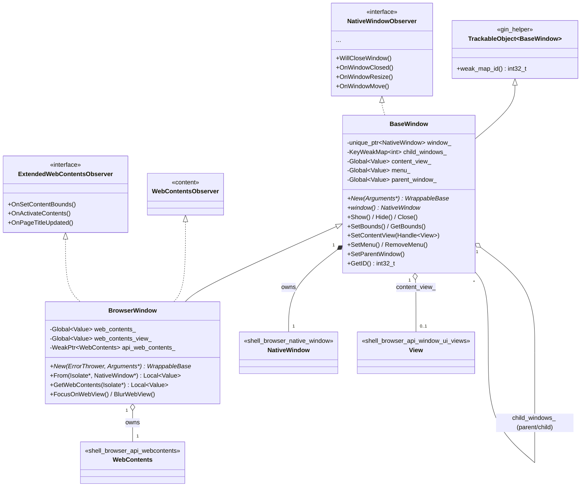
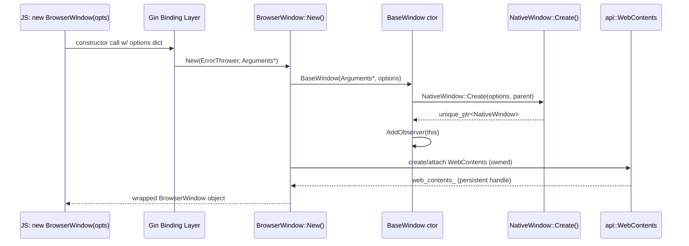
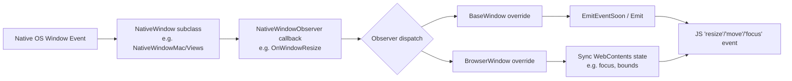
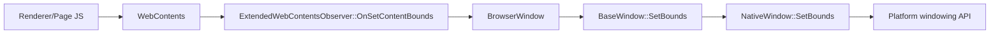
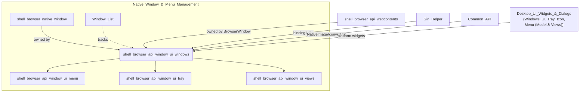

# Shell Browser API Window UI — Windows Module

## Introduction

The **`shell_browser_api_window_ui_windows`** module is the JavaScript-facing bridge between Electron's native windowing subsystem and the Node/V8 world. It exposes the two most fundamental window classes that scripts interact with via `require('electron')`:

- **`BaseWindow`** — the low-level, content-agnostic native window wrapper (`shell/browser/api/electron_api_base_window.h`)
- **`BrowserWindow`** — the full-featured, `WebContents`-hosting window that most Electron apps use directly (`shell/browser/api/electron_api_browser_window.h`)

This module sits at the intersection of the native windowing layer (`shell_browser_native_window`), the Gin/V8 binding infrastructure (`Gin_Helper`), and the `WebContents` rendering pipeline (`shell_browser_api_webcontents`). It is a direct sibling of the Menu, Tray, and Views API modules within the broader `shell_browser_api_window_ui` family, and together they form the "Native Window & Menu Management" surface of Electron's browser process.

---

## Purpose & Core Functionality

| Component | Responsibility |
|---|---|
| `BaseWindow` | Wraps a platform `NativeWindow` instance and exposes generic window operations (show/hide, resize, move, always-on-top, taskbar, touch bar, vibrancy, window messages, etc.) to JS. Manages child window relationships, window event dispatch, and JS garbage-collection safety via persistent references. |
| `BrowserWindow` | Extends `BaseWindow` by attaching and owning a `WebContents` instance, wiring up content-rendering lifecycle events (title updates, focus/blur propagation to the web view, close confirmation dialogs, background color/material for the hosted page). |

Both classes are **Gin-wrapped native objects** (`gin_helper::TrackableObject`) — meaning each JS `BrowserWindow`/`BaseWindow` instance has a paired C++ object tracked by a weak-map ID (`GetID()`), garbage-collected safely, and callable from JS via auto-generated bindings (see [Gin_Helper](Gin_Helper.md)).

### Why two classes?

`BaseWindow` was introduced to let developers build custom window content (e.g., attaching arbitrary `View` trees via `SetContentView`) without the overhead of a full `WebContents`. `BrowserWindow` is implemented **on top of** `BaseWindow` and automatically creates/owns a `WebContents`, restoring the historical all-in-one API surface most Electron apps rely on.

---

## Architecture

### Key relationships

- **`BaseWindow` owns a `NativeWindow`** (`std::unique_ptr<NativeWindow> window_`), the platform-abstracted window object implemented per-OS in [shell_browser_native_window](shell_browser_native_window.md) (`NativeWindowMac`, `NativeWindowViews`, etc.). `BaseWindow` is a `NativeWindowObserver`, receiving lifecycle/geometry/state-change callbacks from the native layer and re-emitting them as JS events.
- **`BrowserWindow` extends `BaseWindow`** and additionally observes `content::WebContentsObserver` and `ExtendedWebContentsObserver` (declared in `shell/browser/extended_web_contents_observer.h`) to bridge content-level events (title changes, activation, bounds requests) into native window behavior.
- **`SetContentView(gin_helper::Handle<View> view)`** links `BaseWindow` to the [Views](shell_browser_api_window_ui_views.md) module — any `View`-derived JS object (including `WebContentsView`) can be attached as a window's root content.
- **`SetMenu`/`RemoveMenu`** connect to the [Menu (Model & Views)](Menu_(Model_&_Views).md) and [shell_browser_api_window_ui_menu](shell_browser_api_window_ui_menu.md) subsystems via `ElectronMenuModel`.
- **`AddTabbedWindow`, `GetParentWindow`, `GetChildWindows`** manage a parent/child window graph using `KeyWeakMap<int>`, cross-referencing other `BaseWindow`/`BrowserWindow` instances tracked in [Window_List](Window_List.md).
- **Gin/V8 binding plumbing** (`gin_helper::Arguments`, `gin_helper::Handle`, `gin_helper::PersistentDictionary`, `TrackableObject`) comes from [Gin_Helper](Gin_Helper.md) — see that module for how JS constructors, method dispatch, and object lifetime are implemented generically.

---

## Component Details

### `BaseWindow`

- **Construction**: Two constructors — one for use as a base class (`BaseWindow(Isolate*, Dictionary)`) and one for standalone instantiation (`BaseWindow(Arguments*, Dictionary)`). The static `New()` factory is invoked by the Gin binding layer when JS calls `new BaseWindow(options)`.
- **Event forwarding**: Implements every `NativeWindowObserver` callback (`OnWindowFocus`, `OnWindowResize`, `OnWindowEnterFullScreen`, `OnSystemContextMenu`, platform-specific `OnWindowMessage` on Windows, etc.) and forwards them to JS listeners via `Emit<Args...>`, often deferred via `EmitEventSoon` to post onto the UI thread task runner (avoiding re-entrancy during native callbacks).
- **Window geometry & state APIs**: `SetBounds/GetBounds`, `SetSize/GetSize`, `SetContentSize/GetContentSize`, `SetMinimumSize/SetMaximumSize`, `Center`, `SetPosition/GetPosition`, `SetAspectRatio`.
- **Window state flags**: Maximize/Minimize/Restore/Fullscreen/Kiosk/SimpleFullScreen, resizable/movable/minimizable/maximizable/fullscreenable/closable toggles, always-on-top level, focusable, content-protection.
- **Platform-specific surface**:
  - **macOS** (`BUILDFLAG(IS_MAC)`): vibrancy, window button visibility/position, Mission Control visibility, tabbing APIs (`SelectNextTab`, `MergeAllWindows`, `AddTabbedWindow`), touch bar item management (`SetTouchBar`, `RefreshTouchBarItem`).
  - **Windows** (`BUILDFLAG(IS_WIN)`): raw window message hooking (`HookWindowMessage`/`UnhookWindowMessage`), thumbnail clip/tooltip, taskbar `AppDetails`, snap-layout state, accent color — these connect to [Windows_UI_(Desktop_Widgets)](Windows_UI_(Desktop_Widgets).md) (`TaskbarHost`, `JumpList`) and [Tray_Icon](Tray_Icon.md)/notify-icon infra.
  - **Linux/Windows shared**: `SetTitleBarOverlay` for custom window-control overlays.
- **Menu integration**: `SetMenu`/`RemoveMenu` accept a JS `Menu` value and delegate to `ElectronMenuModel`; `SetIcon` (Views toolkit only) delegates to `NativeImage` conversion helpers from [Common_API](Common_API.md).
- **Lifecycle & memory safety**: `content_view_`, `menu_`, `parent_window_`, and `self_ref_` are `v8::Global<v8::Value>` handles preventing premature GC while the native window is alive. `RemoveFromParentChildWindows()` cleans up the parent's `child_windows_` map when a child is destroyed. `weak_factory_` guards posted UI-thread tasks against use-after-free.

### `BrowserWindow`

- **Construction**: `New(ErrorThrower, gin::Arguments*)` — unlike `BaseWindow::New`, this uses `gin::Arguments`/`ErrorThrower` directly (legacy Gin binding style) since `BrowserWindow` predates the newer `gin_helper::Arguments` convention.
- **`From(Isolate*, NativeWindow*)`**: static lookup allowing native code (e.g., `NativeWindow` callbacks, extension APIs) to retrieve the JS `BrowserWindow` wrapper for a given native window pointer — used across [Extensions_Subsystem](shell_browser_extensions_core.md) and [Device_&_Peripheral_Access](shell_browser_hid.md) chooser dialogs that need a parent window handle.
- **`WebContents` ownership**: `web_contents_` and `web_contents_view_` are persistent JS handles; `api_web_contents_` is a `base::WeakPtr<api::WebContents>` for safe native-side access. See [shell_browser_api_webcontents](shell_browser_api_webcontents.md) for the full `WebContents` API surface (navigation, printing, DevTools, zoom, IPC).
- **Content ↔ Window event bridging** (via `ExtendedWebContentsObserver`):
  - `OnSetContentBounds` → resizes the native window when content requests a specific size.
  - `OnActivateContents` → focuses the native window when the page calls `window.focus()`.
  - `OnPageTitleUpdated` → updates the native window title bar.
  - `RequestPreferredWidth`, `OnCloseButtonClicked`, `OnWindowIsKeyChanged`, `UpdateWindowControlsOverlay` — native-window-observer overrides specific to content-hosting windows (e.g., macOS traffic-light key/main state, Windows Control Overlay API for custom titlebars).
- **`content::WebContentsObserver` overrides**: `BeforeUnloadDialogCancelled`, `WebContentsDestroyed` — synchronize window teardown with the underlying content lifecycle (e.g., don't destroy the native window while a beforeunload prompt is pending).
- **Overrides of `BaseWindow` virtuals**: `CloseImmediately`, `Focus`, `Blur`, `SetBackgroundColor`, `SetBackgroundMaterial`, `OnWindowBlur/Focus`, `OnWindowShow/Hide`, `OnWindowLeaveFullScreen` — these specialize base behavior to also propagate to/from the hosted `WebContents` (e.g., blurring the window also blurs the focused web view).
- **Web-view specific APIs**: `FocusOnWebView`, `BlurWebView`, `IsWebViewFocused`, `GetWebContents(Isolate*)` (the primary way JS retrieves `browserWindow.webContents`).

---

## Data & Control Flow

### Window creation flow (`new BrowserWindow(options)`)

### Native event → JS event propagation

### Content-driven window mutation (e.g., page requests resize)

---

## Relationship to Sibling & Parent Modules

- **[shell_browser_native_window](shell_browser_native_window.md)** — provides the `NativeWindow` base class and OS-specific implementations (`NativeWindowMac`, `NativeWindowViews`) that `BaseWindow` wraps.
- **[shell_browser_api_window_ui_views](shell_browser_api_window_ui_views.md)** — provides the `View` class usable as a window's content view.
- **[shell_browser_api_window_ui_menu](shell_browser_api_window_ui_menu.md)** and **[Menu_(Model_&_Views)](Menu_(Model_&_Views).md)** — provide `ElectronMenuModel`/`Menu` objects attached via `SetMenu`.
- **[shell_browser_api_window_ui_tray](shell_browser_api_window_ui_tray.md)** — sibling module for `Tray`, sharing the same parent (`shell_browser_api_window_ui`) and often interacting with `BaseWindow` (e.g., tray click showing/focusing a window).
- **[shell_browser_api_webcontents](shell_browser_api_webcontents.md)** — supplies the `WebContents` class that `BrowserWindow` creates/owns and exposes via `GetWebContents`.
- **[Window_List](Window_List.md)** — the global registry (`WindowList`, `WindowListObserver`) that tracks all live `NativeWindow`/`BaseWindow` instances application-wide (used for "quit when all windows closed" logic, `BrowserWindow.getAllWindows()`, etc.).
- **[Gin_Helper](Gin_Helper.md)** — supplies `TrackableObject`, `Handle`, `Arguments`, `PersistentDictionary`, and the function-template/callback machinery that turns these C++ classes into callable JS constructors and methods.
- **[Common_API](Common_API.md)** — supplies `NativeImage` (used by `SetIcon`, `SetOverlayIcon`) and other Gin converters (`gfx_converter`, `image_converter`) for marshalling `Rect`, `Point`, `Image` types between JS and C++.
- **[Windows_UI_(Desktop_Widgets)](Windows_UI_(Desktop_Widgets).md)** — backs Windows-specific `BaseWindow` APIs like taskbar thumbnails, jump lists, and window message hooking.

---

## Threading & Lifetime Considerations

- Most `BaseWindow`/`BrowserWindow` methods run on the **UI thread** (Chromium's browser main thread); event emission is sometimes deferred via `content::GetUIThreadTaskRunner({})->PostTask(...)` (see `EmitEventSoon`) to avoid emitting JS events synchronously from within native window callback stacks (re-entrancy hazards).
- `base::WeakPtrFactory<BaseWindow>` and `base::WeakPtr<api::WebContents>` are used throughout to guard against use-after-free when native window/content teardown races with pending posted tasks.
- JS object lifetime is tied to native lifetime via `v8::Global<v8::Value> self_ref_` (in `BaseWindow`) — the wrapper keeps itself alive as long as the underlying native window exists, and is released on `OnWindowClosed`.

---

## Summary

The `shell_browser_api_window_ui_windows` module is the canonical entry point for scripting native application windows in Electron. `BaseWindow` provides a comprehensive, cross-platform windowing API decoupled from content, while `BrowserWindow` layers `WebContents` ownership and content/window event synchronization on top. Both classes are thin, safety-conscious Gin wrappers around the native window layer, deferring actual platform behavior to `NativeWindow` implementations and relying on the broader Gin/V8 binding infrastructure for JS interop.
