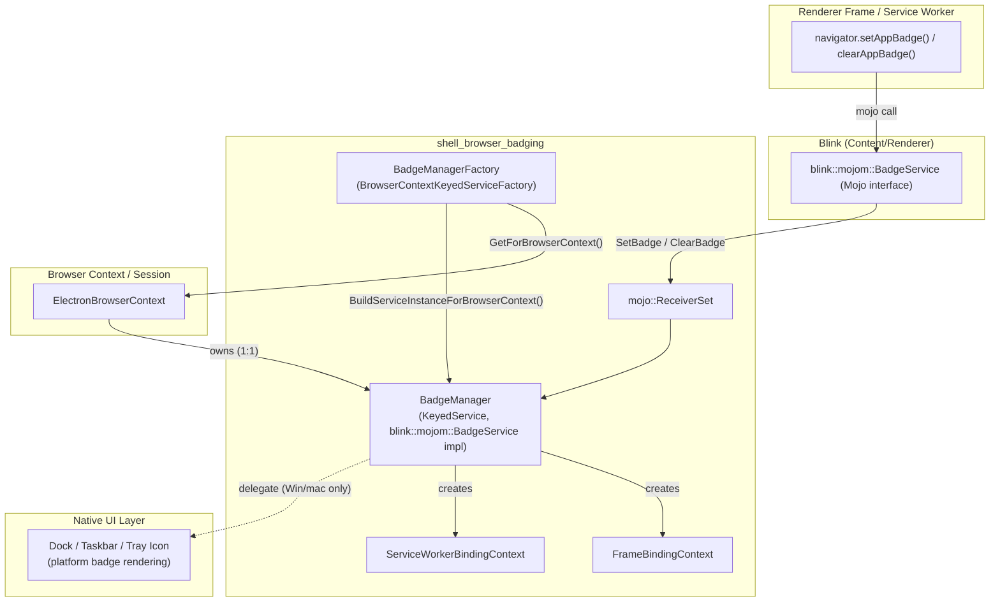
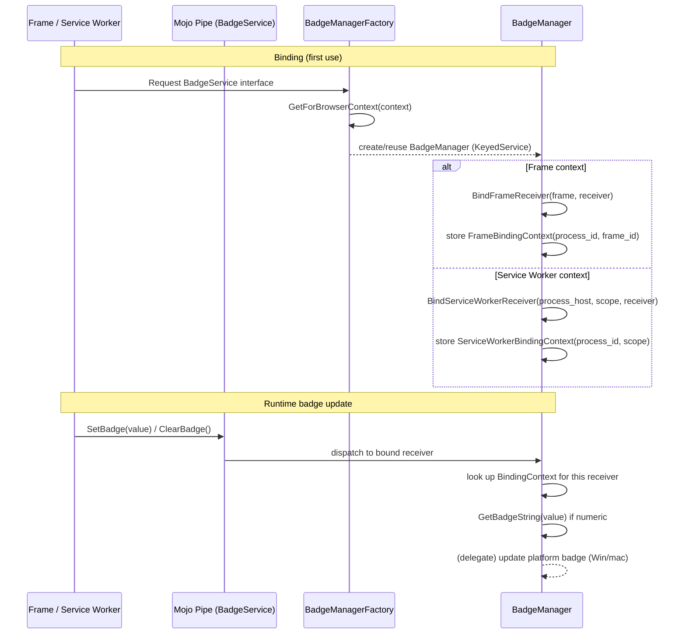
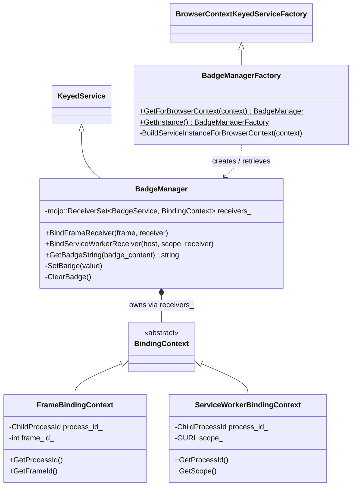

# Shell Browser Badging Module

## Introduction

The `shell_browser_badging` module implements Electron's support for the **W3C Badging API**
(`navigator.setAppBadge()` / `navigator.clearAppBadge()`). It allows web content — whether
running in a normal page/frame or inside a Service Worker — to set a small numeric or
"flag" indicator on an application's icon (e.g., a dock icon on macOS, a taskbar icon on
Windows, or a launcher icon on Linux), similar to how mobile apps show unread-count badges.

This module is intentionally small and focused. It sits at the intersection of:

- **Blink's Badging Mojo interface** (`blink::mojom::BadgeService`), which is the renderer-side
  contract that content processes use to request badge changes.
- **Chromium's `KeyedService` / `BrowserContextKeyedServiceFactory` infrastructure**, which
  ties the badge state to a specific `BrowserContext` (i.e., an Electron `Session`).
- **Electron's native window and tray icon layer**, which is ultimately responsible for
  rendering the badge on-screen (see [Desktop_UI_Widgets_&_Dialogs.md](Desktop_UI_Widgets_&_Dialogs.md)
  for `TrayIcon` and platform dock/taskbar integration, and
  [shell_browser_core.md](shell_browser_core.md) for the `Browser` singleton that exposes
  dock-badge APIs like `setBadgeCount` on Linux/macOS).

## Purpose & Core Functionality

The module provides two collaborating classes:

| Component | File | Responsibility |
|---|---|---|
| `badging::BadgeManager` | `shell/browser/badging/badge_manager.h` | Per-`BrowserContext` service that implements `blink::mojom::BadgeService`. Receives `SetBadge`/`ClearBadge` mojo calls from renderer frames or Service Workers, tracks which execution context each call came from, and (via an internal delegate on Windows/macOS) triggers the actual badge to be painted. |
| `badging::BadgeManagerFactory` | `shell/browser/badging/badge_manager_factory.h` | Standard Chromium `BrowserContextKeyedServiceFactory` singleton that lazily creates and returns the `BadgeManager` instance for a given `BrowserContext`. Ensures one `BadgeManager` per Electron `Session`. |

### Key responsibilities of `BadgeManager`

1. **Mojo receiver binding** — Exposes two static binder entry points:
   - `BindFrameReceiver(RenderFrameHost*, PendingReceiver<BadgeService>)` — used when a
     regular document/frame calls the Badging API.
   - `BindServiceWorkerReceiver(RenderProcessHost*, GURL scope, PendingReceiver<BadgeService>)`
     — used when a Service Worker (background context, no frame) calls the API.

   Both binders attach an internal `BindingContext` subclass to the `mojo::ReceiverSet` so
   that, when `SetBadge`/`ClearBadge` arrive, the manager can trace the call back to its
   origin without trusting renderer-supplied identifiers.

2. **Binding context tracking** — Two private, final subclasses of the abstract
   `BindingContext` base record *who* is making the badge request:
   - `FrameBindingContext` — stores `ChildProcessId` + `frame_id` for window/document contexts.
   - `ServiceWorkerBindingContext` — stores `ChildProcessId` + the Service Worker's `scope`
     (a `GURL`) for worker contexts.

3. **Badge value handling** — Implements the two `blink::mojom::BadgeService` methods:
   - `SetBadge(BadgeValuePtr value)` — sets/updates the badge value.
   - `ClearBadge()` — removes the badge.

   Both are declared `private` because they must only be invoked through the mojo binding
   (never called directly), enforcing that badge state changes always come from a real,
   traceable execution context.

4. **Badge string formatting** — The static helper `GetBadgeString(std::optional<int>
   badge_content)` converts a numeric badge value into a display string, saturating at
   `kMaxBadgeContent` (99) so large counts render as e.g. "99+" rather than overflowing the
   available icon space.

### Key responsibilities of `BadgeManagerFactory`

- `GetForBrowserContext(content::BrowserContext*)` — the primary access point used elsewhere
  in Electron (e.g., by the Mojo binder registration code that wires up
  `blink::mojom::BadgeService` for new frames/workers) to fetch the `BadgeManager` scoped to
  a given `Session`/`BrowserContext`.
- `GetInstance()` — returns the process-wide factory singleton (backed by `base::NoDestructor`
  to avoid static-destruction-order issues).
- `BuildServiceInstanceForBrowserContext(...)` — the `BrowserContextKeyedServiceFactory`
  override that actually constructs a new `BadgeManager` the first time it's requested for a
  context.

## Architecture Overview

## Binding & Call Flow

The diagram below shows how a badge request travels from JavaScript down to the
`BadgeManager`, and how the manager determines which execution context issued the call.

## Component Relationships

## Relationship to Other Modules

- **[Browser_Context_&_Session_Management](shell_browser_context.md)** — `BadgeManager` is a
  `KeyedService` scoped to `ElectronBrowserContext` (the C++ backing for an Electron
  `Session`). `BadgeManagerFactory::GetForBrowserContext` is the standard mechanism, matching
  the pattern used by other per-context services in that module (e.g.
  `ElectronPermissionManager`, `ElectronDownloadManagerDelegate`).
- **[WebContents_Rendering_&_Communication](Web_Contents.md) /
  [shell_browser_ipc_handlers_frame_sw_ipc](shell_browser_ipc_handlers_frame_sw_ipc.md)** —
  `RenderFrameHost` and `RenderProcessHost`/Service-Worker IPC plumbing (as used elsewhere for
  `ElectronApiIPCHandlerImpl` and `ElectronApiSWIPCHandlerImpl`) are the same content-layer
  primitives used here to bind the `BadgeService` mojo receiver to the correct
  frame or worker process.
- **[Desktop_UI_Widgets_&_Dialogs](Desktop_UI_Widgets_&_Dialogs.md)** — The actual visual
  rendering of a badge (on `TrayIcon`, dock icon, or taskbar overlay) happens in the
  platform-specific UI layer. `BadgeManager` is the front-door API surface; platform code
  (Windows `NotifyIcon`/taskbar, macOS dock tile, Linux launcher entry via
  [Platform-Specific_Integration](shell_browser_linux.md)) is responsible for actually
  painting the value once notified.
- **[shell_browser_core](shell_browser_core.md)** — The higher-level `Browser` singleton
  exposes JS-facing APIs such as `app.setBadgeCount()` (Linux/macOS dock badge) that
  ultimately configure platform badge state; `BadgeManager` complements this by handling the
  *web content driven* (Badging API) path rather than the *main-process driven* path.

## Design Notes

- **Security via binding context, not renderer input.** Both `SetBadge` and `ClearBadge` are
  declared `private`; they can only be invoked through the mojo dispatch mechanism itself.
  Combined with the `BindingContext` tracked per-receiver, this ensures the browser process
  never has to trust an untrusted renderer's claim about which frame or worker is making the
  request — the identity is captured at bind time using trusted browser-side APIs
  (`RenderFrameHost`/`RenderProcessHost`).
- **One manager per browsing context.** Because `BadgeManager` is a `KeyedService`,
  incognito/persistent partitions and multiple `Session`s each get independent badge state,
  consistent with Electron's general per-`Session` isolation model.
- **Platform-conditional delegate.** The commented-out `BadgeManagerDelegate` member indicates
  that actual OS-level badge painting is only wired up on Windows and macOS in current
  Electron; on Linux, badge counts are generally driven through the separate `Browser`/dock
  APIs (see [shell_browser_linux](shell_browser_linux.md) for Unity launcher integration)
  rather than through this mojo-based path.
