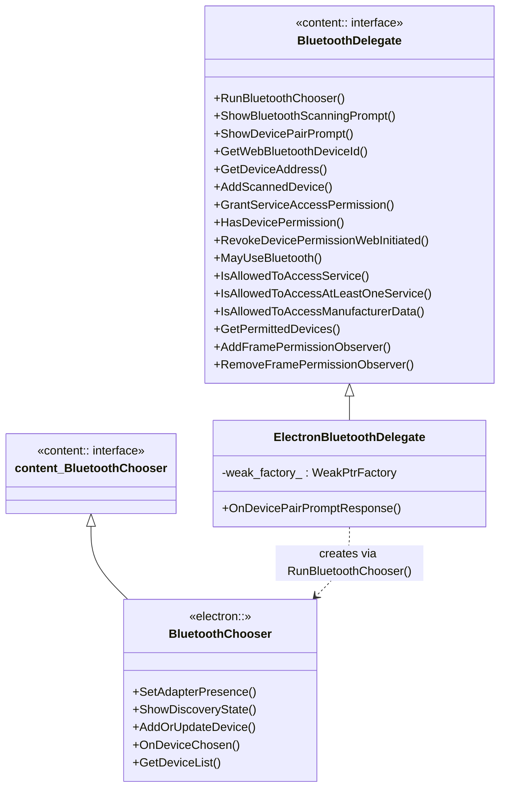
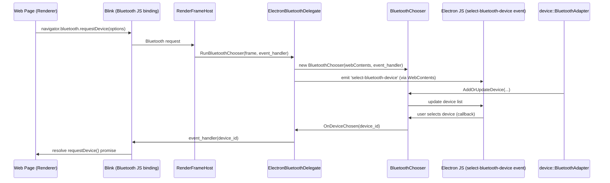
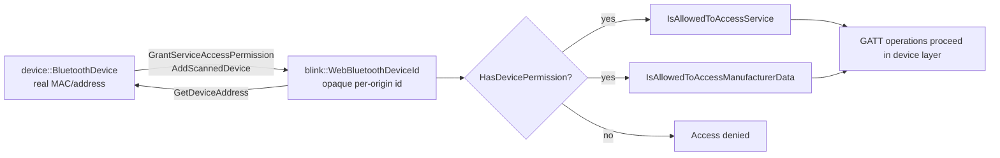
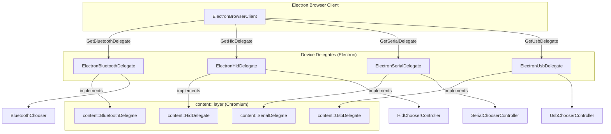
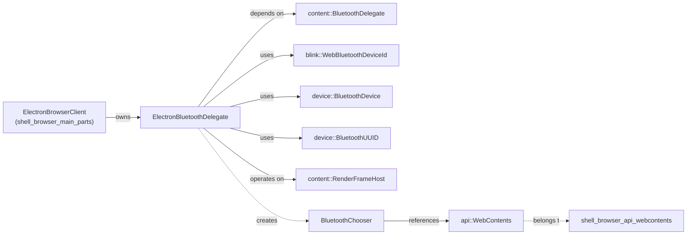
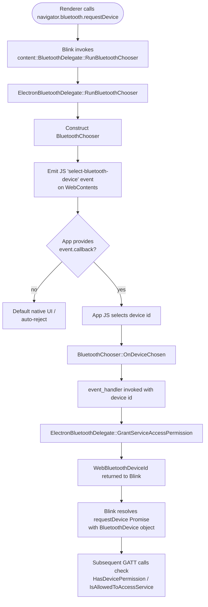

# Bluetooth Module (`shell_browser_bluetooth`)

## Introduction

The `shell_browser_bluetooth` module implements Electron's browser-process integration with Chromium's **Web Bluetooth** and **Web Bluetooth Scanning API**. It is the concrete implementation of Chromium's `content::BluetoothDelegate` interface, allowing web content running inside `WebContents`/`RenderFrameHost` instances to discover, pair, and communicate with Bluetooth Low Energy (BLE) devices, subject to per-origin permission and user-consent gating.

This module is intentionally small and focused: it acts as the **policy and permission bridge** between Chromium's device-agnostic Bluetooth content layer and Electron-specific concerns such as the device chooser UI, permission persistence, and JS-facing events. It is one of several "device delegate" modules that plug into `ElectronBrowserClient`, sitting alongside HID, Serial, USB, and WebAuthn delegates under the broader Device & Peripheral Access family.

---

## Purpose & Responsibilities

`ElectronBluetoothDelegate` is responsible for:

- **Device chooser UI**: Launching a native/JS-driven Bluetooth device picker (`RunBluetoothChooser`) when a page calls `navigator.bluetooth.requestDevice()`.
- **Scanning prompts**: Presenting a prompt for the Web Bluetooth Scanning API (`ShowBluetoothScanningPrompt`).
- **Pairing UX**: Driving native device pairing flows (`ShowDevicePairPrompt`) including PIN entry, and returning the result back to Blink via `PairPromptCallback`.
- **Device identity mapping**: Maintaining/mapping between Blink's opaque `blink::WebBluetoothDeviceId` and the underlying platform `device::BluetoothDevice` address (`GetWebBluetoothDeviceId`, `GetDeviceAddress`, `AddScannedDevice`).
- **Permission enforcement**: Granting, checking, and revoking per-origin/per-frame permissions to access Bluetooth devices, specific GATT services, and manufacturer data (`GrantServiceAccessPermission`, `HasDevicePermission`, `IsAllowedToAccessService`, `IsAllowedToAccessManufacturerData`, `RevokeDevicePermissionWebInitiated`).
- **Frame lifecycle observation**: Notifying observers (`FramePermissionObserver`) of permission changes scoped to a `content::RenderFrameHost`.

It does **not** implement Bluetooth transport/GATT logic itself — that remains in Chromium's `device::bluetooth` layer. This delegate is purely about **who is allowed to see/use which devices**, and **how the chooser UI is surfaced**.

---

## Core Component

### `ElectronBluetoothDelegate`

Defined in `shell/browser/bluetooth/electron_bluetooth_delegate.h`, this class derives from `content::BluetoothDelegate` and is instantiated once per `ElectronBrowserClient` (see [shell_browser_main_parts](shell_browser_main_parts.md)).

Key characteristics:
- **Move/copy disabled** — it is a singleton-like delegate owned by the browser client.
- Uses `base::WeakPtrFactory` to safely handle async callbacks (e.g., pairing prompt responses) that may outlive the delegate's synchronous call stack.
- Stateless with respect to per-device bookkeeping in this header — actual bookkeeping (chooser state, device list, id mapping) is delegated to companion classes like `BluetoothChooser` (see below) and Chromium's underlying `content::BluetoothAllowedDevicesMap` machinery accessed indirectly through the base class.

---

## Related Component: `BluetoothChooser`

While `ElectronBluetoothDelegate` implements the Chromium-facing policy interface, the actual **chooser UI state machine** lives in `shell/browser/lib/bluetooth_chooser.h` (module: `shell_browser_lib`):

- `BluetoothChooser` implements `content::BluetoothChooser` and is constructed with an `api::WebContents*` and an `EventHandler` callback.
- It tracks discovered devices in `device_id_to_name_map_`, exposes `GetDeviceList()` for the JS-facing chooser UI, and forwards the user's selection back into Blink via `OnDeviceChosen()`.
- `ElectronBluetoothDelegate::RunBluetoothChooser()` is expected to construct and own a `BluetoothChooser` instance, wiring native device discovery events (`SetAdapterPresence`, `ShowDiscoveryState`, `AddOrUpdateDevice`) to JS renderer events (typically surfaced through the `Session`/`WebContents` JS API — see [shell_browser_api_session_net](shell_browser_api_session_net.md) and [shell_browser_api_webcontents](shell_browser_api_webcontents.md)).

---

## Permission & Identity Model

Web Bluetooth uses an opaque per-origin device identifier (`blink::WebBluetoothDeviceId`) to avoid leaking stable hardware addresses to web content. `ElectronBluetoothDelegate` mediates the mapping:

- **`GrantServiceAccessPermission`**: Called after the user picks a device in the chooser; creates/reuses a `WebBluetoothDeviceId` and records which GATT services the origin may access.
- **`HasDevicePermission` / `IsAllowedToAccessService` / `IsAllowedToAccessAtLeastOneService` / `IsAllowedToAccessManufacturerData`**: Read-only permission checks consulted by Blink before performing GATT reads/writes or exposing manufacturer data in advertisements.
- **`RevokeDevicePermissionWebInitiated`**: Supports the `BluetoothDevice.forget()` JS API, allowing a page to voluntarily drop its own permission grant.
- **`AddFramePermissionObserver` / `RemoveFramePermissionObserver`**: Lets Blink-side objects (e.g., `BluetoothDevice` JS wrappers) observe permission revocation to fire `gattserverdisconnected` events.

Persistent storage of grants is expected to be backed by Electron's permission infrastructure — see [shell_browser_context](shell_browser_context.md) (`ElectronPermissionManager`) for the general per-origin permission model that Bluetooth grants may interact with at a higher level (e.g., `session.setPermissionRequestHandler`).

---

## Integration with `ElectronBrowserClient`

`ElectronBluetoothDelegate` is one of several device delegates owned/created by `ElectronBrowserClient` (declared in `shell/browser/electron_browser_client.h`, module [shell_browser_main_parts](shell_browser_main_parts.md)), alongside:

- `ElectronHidDelegate` — see `shell_browser_hid`
- `ElectronSerialDelegate` — see `Serial` module (Device & Peripheral Access)
- `ElectronUsbDelegate` — see `USB` module (Device & Peripheral Access)
- `ElectronWebAuthenticationDelegate` — see `WebAuthn` module (Device & Peripheral Access)

These delegates share a common architectural pattern: implement a `content::XxxDelegate` interface, maintain a per-`RenderFrameHost` controller/chooser map, and bridge native device events to JS-facing APIs exposed on `Session` and `WebContents`.

Note the architectural asymmetry: HID/Serial/USB delegates each maintain their own `ChooserController` map keyed by `RenderFrameHost*` (visible in their headers), whereas the Bluetooth delegate's per-frame/per-device bookkeeping is largely delegated to Chromium's built-in `BluetoothAllowedDevicesMap` (inherited via `content::BluetoothDelegate`'s base machinery) plus the standalone `BluetoothChooser` class for UI state — it does not expose an explicit `controller_map_` in its own header.

---

## Dependency Overview

**Upstream dependents:**
- [shell_browser_main_parts](shell_browser_main_parts.md) — `ElectronBrowserClient::GetBluetoothDelegate()` returns/owns this delegate.

**Sibling modules (same parent: Device & Peripheral Access):**
- `shell_browser_hid` — analogous delegate for WebHID.
- `Serial` and `USB` delegate modules — analogous patterns for `navigator.serial` / `navigator.usb`.
- `WebAuthn` — `ElectronWebAuthenticationDelegate`, another content-layer security delegate.
- `shell_browser_lib` — houses `BluetoothChooser`, the chooser-UI counterpart used by this delegate.

**Downstream/consumer relationship:**
- [shell_browser_api_webcontents](shell_browser_api_webcontents.md) — `WebContents` emits JS events (e.g. `select-bluetooth-device`) that the chooser UI relies on.
- [shell_browser_context](shell_browser_context.md) — general permission infrastructure (`ElectronPermissionManager`) that complements device-specific grants.

---

## Typical Request Flow (End-to-End)

---

## Summary

| Aspect | Detail |
|---|---|
| **Interface implemented** | `content::BluetoothDelegate` |
| **Owning component** | `ElectronBrowserClient` |
| **Primary responsibilities** | Chooser UI orchestration, pairing prompts, device-id/address mapping, permission grant/check/revoke |
| **Companion class** | `BluetoothChooser` (`shell/browser/lib/bluetooth_chooser.h`) |
| **Related delegates** | `ElectronHidDelegate`, `ElectronSerialDelegate`, `ElectronUsbDelegate`, `ElectronWebAuthenticationDelegate` |
| **JS surface** | Exposed indirectly via `WebContents`/`Session` events (e.g. `select-bluetooth-device`), not a direct gin-wrapped API in this header |

For broader context on how device permission delegates fit into the browser process bootstrap, see [shell_browser_main_parts](shell_browser_main_parts.md). For the JS-facing session/permission APIs that applications use to respond to these native prompts, see [shell_browser_api_session_net](shell_browser_api_session_net.md) and [shell_browser_context](shell_browser_context.md).
