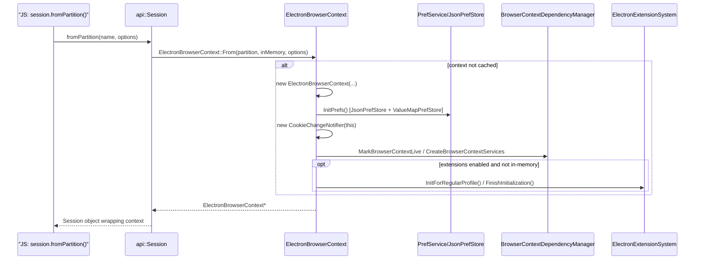
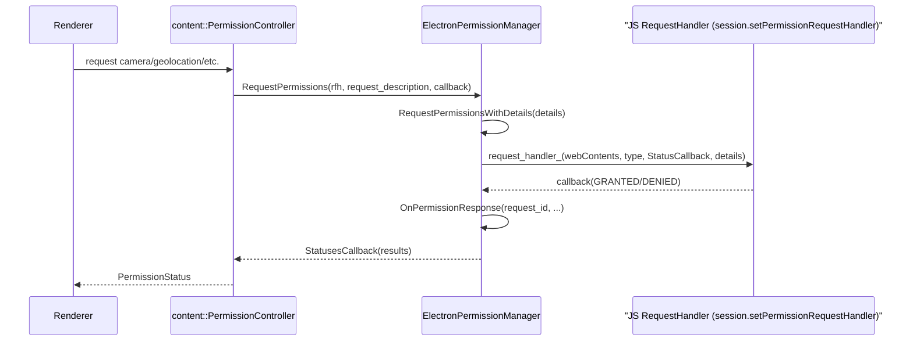
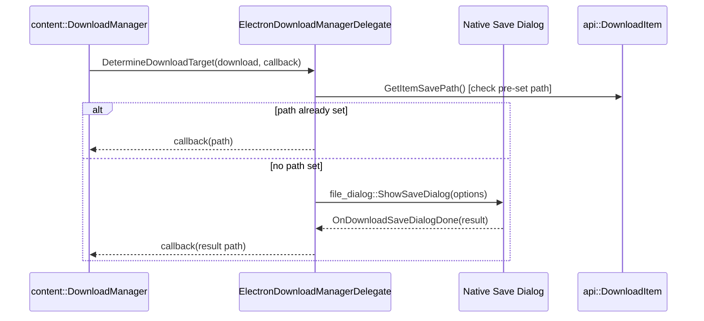

# Shell Browser Context

## Introduction

The `shell_browser_context` module implements **`ElectronBrowserContext`**, the Electron-specific specialization of Chromium's `content::BrowserContext`. This class is the anchor point for a *session* in Electron: every `session` object exposed to JavaScript (`session.defaultSession`, `session.fromPartition(...)`, etc.) is ultimately backed by one `ElectronBrowserContext` instance.

A `BrowserContext` in Chromium owns (directly or via keyed-service factories) all the per-session state needed to render and network content: cookies, cache, permissions, downloads, preconnection hints, storage partitions, preferences, and more. This module provides the Electron implementations of the context itself and of several tightly-coupled delegate/helper classes that `content::BrowserContext` requires as extension points.

This module is part of the broader Browser Context & Session Management area and is closely related to two sibling modules:

- **[Session Storage](session_storage.md)** — lightweight per-context preference/storage-policy helpers (`SessionPreferences`, `SpecialStoragePolicy`) that `ElectronBrowserContext` owns and exposes.
- **[Session & Network API](shell_browser_api_session_net.md)** — the higher-level, JS-facing `Session` object and network-oriented APIs (cookies, protocol registration, web requests, service workers) that are built **on top of** `ElectronBrowserContext`.

## Purpose & Responsibilities

`ElectronBrowserContext` and its companion classes are responsible for:

1. **Context identity & lifecycle** — creating, caching, and destroying `ElectronBrowserContext` instances keyed by partition name or filesystem path (`From`, `FromPath`, `GetDefaultBrowserContext`, `DestroyAllContexts`).
2. **Preferences** — bootstrapping a `PrefService` backed by a `JsonPrefStore` on disk plus an in-memory `ValueMapPrefStore` for command-line/session overrides.
3. **Cookies** — bridging Chromium's mojo `CookieChangeListener` interface to a simple callback-list API via `CookieChangeNotifier`.
4. **Permissions** — implementing `content::PermissionControllerDelegate` through `ElectronPermissionManager`, including JS-programmable request/check handlers and device-permission bookkeeping (USB/HID/Serial/Bluetooth).
5. **Downloads** — implementing `content::DownloadManagerDelegate` through `ElectronDownloadManagerDelegate`, wiring the native save dialog into download target resolution.
6. **Network preconnection** — supplying a minimal `content::PreconnectManager::Delegate` (`ElectronPreconnectManagerDelegate`) so Chromium's preconnect logic can run without Chrome-specific browser UI.
7. **Supporting content::BrowserContext virtuals** — guest-view management, storage policy, proxy resolution, zoom delegate creation, SSL config, display-media (`getDisplayMedia`) device selection, and File System Access permissions (delegating to the [Device & Peripheral Access](shell_browser_file_system_access.md) module).

## Architecture Overview

```mermaid
graph TB
    subgraph "shell_browser_context"
        EBC[ElectronBrowserContext]
        CCN[CookieChangeNotifier]
        EPM[ElectronPermissionManager]
        EDMD[ElectronDownloadManagerDelegate]
        EPCMD[ElectronPreconnectManagerDelegate]
    end

    subgraph "Owned Helpers (Session Storage)"
        SP[SpecialStoragePolicy]
        SPref[SessionPreferences]
    end

    subgraph "Chromium Base Classes"
        CBC[content::BrowserContext]
        PCD[content::PermissionControllerDelegate]
        DMD[content::DownloadManagerDelegate]
        PMD[content::PreconnectManager::Delegate]
        CCL[network::mojom::CookieChangeListener]
    end

    EBC -- "is-a" --> CBC
    EPM -- "is-a" --> PCD
    EDMD -- "is-a" --> DMD
    EPCMD -- "is-a" --> PMD
    CCN -- "implements" --> CCL

    EBC -- "owns" --> CCN
    EBC -- "owns" --> EPM
    EBC -- "owns lazily" --> EDMD
    EBC -- "owns lazily" --> EPCMD
    EBC -- "owns" --> SP
    EBC -. "attached via SupportsUserData" .-> SPref

    EBC --> ProtoReg["ProtocolRegistry\n(shell_browser_api_session_net)"]
    EBC --> WVM["WebViewManager\n(Native_Window_&_Menu_Management)"]
    EBC --> RPH["ResolveProxyHelper\n(shell_browser_net)"]
    EBC --> MDIS["MediaDeviceIDSalt\n(Device_&_Peripheral_Access)"]
    EBC --> ZLD["ZoomLevelDelegate\n(WebContents_Rendering_&_Communication)"]
    EBC --> FSAP["FileSystemAccessPermissionContext\n(shell_browser_file_system_access)"]

    Session["api::Session\n(shell_browser_api_session_net)"] -- "wraps" --> EBC
    MainParts["ElectronBrowserMainParts\n(shell_browser_main_parts)"] -- "creates default context" --> EBC
```

### Key relationships

| Component | Base / Interface | Owned by `ElectronBrowserContext`? | Notes |
|---|---|---|---|
| `ElectronBrowserContext` | `content::BrowserContext` | — | Central class; statically tracked in a global `ContextMap` keyed by `PartitionKey` |
| `CookieChangeNotifier` | `network::mojom::CookieChangeListener` | Yes (`unique_ptr`, created in constructor) | Fan-out point for cookie-change callbacks |
| `ElectronPermissionManager` | `content::PermissionControllerDelegate` | Yes (lazily, via `GetPermissionControllerDelegate()`) | Exposes JS-settable request/check/device handlers |
| `ElectronDownloadManagerDelegate` | `content::DownloadManagerDelegate` | Yes (lazily, via `GetDownloadManagerDelegate()`) | Delegates save-path selection to native file dialog |
| `ElectronPreconnectManagerDelegate` | `content::PreconnectManager::Delegate` | Yes (lazily, via `GetPreconnectManager()`) | Minimal no-op stats/initiation hooks, gates on `IsPreconnectEnabled()` |
| `SpecialStoragePolicy` | `storage::SpecialStoragePolicy` | Yes (`scoped_refptr`, created in constructor) | See [Session Storage](session_storage.md) |
| `SessionPreferences` | `base::SupportsUserData::Data` | Attached externally | See [Session Storage](session_storage.md) |

## Component Details

### `ElectronBrowserContext` (`electron_browser_context.h/.cc`)

The core class. Highlights:

- **Identity / caching** — Instances are stored in a process-global `ContextMap` (`std::map<PartitionKey, unique_ptr<ElectronBrowserContext>>`), keyed by an internal `PartitionKey` value type that can represent either a named partition (+ `in_memory` flag) or an absolute `base::FilePath`. `PartitionKey` uses `operator<=>` (C++20 defaulted three-way comparison) for map ordering.
  - `From(partition, in_memory, options)` — get-or-create by partition string.
  - `FromPath(path, options)` — get-or-create by filesystem path (used for persistent custom locations).
  - `GetDefaultBrowserContext(options)` — convenience wrapper around `From("", false, options)`.
  - `DestroyAllContexts()` — tears down every context, carefully destroying the **default** context last to avoid use-after-free during shutdown (see the `extract`/`clear` dance in the `.cc` file).
- **Preferences (`InitPrefs`)** — Builds a `PrefService` via `PrefServiceFactory` from a `JsonPrefStore` (`<userData>/Partitions/<name>/Preferences`) layered with:
  - `in_memory_pref_store_` (a `ValueMapPrefStore`) for command-line/runtime overrides,
  - (when extensions are enabled) an `ExtensionPrefStore`.
  Registers prefs needed by `InspectableWebContents`, `MediaDeviceIDSalt`, `ZoomLevelDelegate`, `PrefProxyConfigTrackerImpl`, accessibility UI, and (conditionally) extensions/spellcheck subsystems.
- **Device permission bookkeeping** — `GrantDevicePermission` / `RevokeDevicePermission` / `CheckDevicePermission` maintain an in-memory `DevicePermissionMap` (`PermissionType → Origin → [base::Value device]`) used as a lightweight substitute for Chromium's `ObjectPermissionContextBase`, matching devices via `DoesDeviceMatch()` (HID/USB by vendor+product+serial, Serial by platform-specific instance/serial IDs).
- **Display Media selection** — `ChooseDisplayMediaDevice` / `DisplayMediaDeviceChosen` implement the native hook for Electron's `setDisplayMediaRequestHandler` JS API, converting a JS-provided video/audio source (a `WebFrameMain`, a `DesktopCapturerSource` id, or a special string like `"loopback"`) into a `blink::mojom::StreamDevicesSet` that satisfies a `getDisplayMedia()` request. This mirrors logic copied from `desktop_capture_devices_util.cc` in Chrome (`CreateCaptureHandle`, `GetZoomLevel`, `DesktopMediaIDToDisplayMediaInformation`).
- **`content::BrowserContext` overrides** delegate to (or lazily create) the specialized helpers below, or to other modules:
  - `GetGuestManager()` → `WebViewManager` (see the Native Window & Menu Management module's Window List / guest-view management)
  - `GetPlatformNotificationService()` → `ElectronBrowserClient::Get()` (see [shell_browser_main_parts_client_core_browser_client](shell_browser_main_parts_client_core_browser_client.md))
  - `GetFileSystemAccessPermissionContext()` → `FileSystemAccessPermissionContextFactory` (see [Device & Peripheral Access](shell_browser_file_system_access.md))
  - `CreateZoomLevelDelegate()` → `ZoomLevelDelegate` (see WebContents module)
  - `GetURLLoaderFactory()` builds a `network::SharedURLLoaderFactory` via `URLLoaderFactoryBuilder`, consulting `ElectronBrowserClient::WillCreateURLLoaderFactory` for header-client injection.

### `CookieChangeNotifier` (`cookie_change_notifier.h`)

A small adapter that:
- Registers itself as a `network::mojom::CookieChangeListener` (via mojo `Receiver`) against the context's cookie manager (`StartListening`), reconnecting on `OnConnectionError`.
- Exposes `RegisterCookieChangeCallback()` returning a `base::CallbackListSubscription`, allowing any interested party (primarily the `Cookies` JS API in [shell_browser_api_session_net](shell_browser_api_session_net.md)) to subscribe to `net::CookieChangeInfo` events without touching mojo directly.
- Is instantiated once per `ElectronBrowserContext` and exposed via `cookie_change_notifier()`.

### `ElectronPermissionManager` (`electron_permission_manager.h`)

Implements `content::PermissionControllerDelegate`, the interface Chromium calls into whenever a renderer requests or queries a permission (camera, geolocation, HID, USB, notifications, etc.). Key design points:

- **Pluggable handlers set from JS** (via `session.setPermissionRequestHandler`, etc.):
  - `RequestHandler` — invoked for interactive permission requests.
  - `CheckHandler` — invoked for synchronous permission checks.
  - `DeviceCheckHandler` / `ProtectedUSBHandler` — used for device-permission and protected-class USB checks.
  - `BluetoothPairingHandler` — used for Web Bluetooth pairing UI flows.
- **`PendingRequest`** (private nested class) and `PendingRequestsMap` (`base::IDMap`) track in-flight multi-permission requests so that `OnPermissionResponse` can aggregate individual `blink::mojom::PermissionStatus` results before invoking the original `StatusesCallback`.
- Implements the full `PermissionControllerDelegate` virtual surface (`RequestPermissions`, `ResetPermission`, `GetPermissionStatus`, `GetPermissionStatusForCurrentDocument`, `GetPermissionStatusForWorker`, `GetPermissionStatusForEmbeddedRequester`, etc.), converting between Chromium's permission types and Electron's JS-friendly `base::Value::Dict` "details" bag (`RequestPermissionsWithDetails`, `CheckPermissionWithDetails`).
- Device-permission helpers (`GrantDevicePermission`/`RevokeDevicePermission`/`CheckDevicePermission`) simply forward into `ElectronBrowserContext`'s `DevicePermissionMap`, keeping storage centralized in the context while permission *logic* lives here.

### `ElectronDownloadManagerDelegate` (`electron_download_manager_delegate.h`)

Implements `content::DownloadManagerDelegate` for a given `content::DownloadManager`:

- `DetermineDownloadTarget()` resolves the save path — either a path previously set on the JS `DownloadItem` object, or by presenting a native save dialog (`file_dialog::DialogSettings`, `GetItemSaveDialogOptions`) and handling the async result in `OnDownloadSaveDialogDone` / `OnDownloadPathGenerated`.
- `ShouldOpenDownload()` and `GetNextId()` complete the minimal delegate surface Chromium requires.
- Remembers `last_saved_directory_` to pre-populate subsequent save dialogs.

### `ElectronPreconnectManagerDelegate` (`electron_preconnect_manager_delegate.h`)

A minimal `content::PreconnectManager::Delegate` implementation:
- `PreconnectInitiated` / `PreconnectFinished` are no-ops (Electron does not surface preconnect telemetry).
- `IsPreconnectEnabled()` gates whether Chromium's preconnect subsystem is allowed to run at all for this context.
- Exposes a `base::WeakPtr` for safe use by `content::PreconnectManager::Create()`.

## Data & Control Flow

### Browser context creation

### Permission request flow

### Download target resolution

## Relationship to Other Modules

- **[Session Storage](session_storage.md)** — `SpecialStoragePolicy` and `SessionPreferences`, owned/attached to `ElectronBrowserContext`, control storage isolation/quotas and hold per-session preload scripts.
- **[Session & Network API](shell_browser_api_session_net.md)** — the JS-facing `Session`, `Cookies`, `Protocol`, `WebRequest`, `NetLog`, and ServiceWorker APIs all operate on top of an `ElectronBrowserContext`, calling into `cookie_change_notifier()`, `protocol_registry()`, `GetResolveProxyHelper()`, etc.
- **[Browser Process Core & Lifecycle](shell_browser_core.md)** and **[Browser Main Parts](shell_browser_main_parts.md)** — `ElectronBrowserMainParts` and `ElectronBrowserClient` create/consult the default `ElectronBrowserContext` during startup and content-layer callbacks (e.g. `GetPlatformNotificationService`, `WillCreateURLLoaderFactory`).
- **[Extensions Subsystem](shell_browser_extensions_core.md)** — when extensions are compiled in, `ElectronBrowserContext` bootstraps `ElectronExtensionSystem` and registers extension-related prefs/keyed services.
- **[Device & Peripheral Access](shell_browser_file_system_access.md)** — File System Access permission context and HID/USB/Serial chooser contexts are looked up per-`ElectronBrowserContext` via factories, and device permission grants recorded in this module's `DevicePermissionMap` back those APIs.
- **[Networking Layer](shell_browser_net.md)** — `ResolveProxyHelper` and `ProtocolRegistry` are owned/created by `ElectronBrowserContext` and used by the proxying URL loader factories.
- **[Native Window & Menu Management](shell_browser_native_window.md)** — `WebViewManager` (guest view manager) is created lazily by `GetGuestManager()`.
- **[WebContents Rendering & Communication](web_contents.md)** — `ZoomLevelDelegate` is created per storage partition via `CreateZoomLevelDelegate()`.

## Summary

`shell_browser_context` is a small but architecturally central module: it is where Chromium's generic `BrowserContext` extension points are given Electron-specific, JS-programmable implementations. Nearly every other browser-side subsystem in Electron (networking, permissions, extensions, downloads, device access, notifications) ultimately reaches back into an `ElectronBrowserContext` instance to obtain session-scoped state or delegates.
