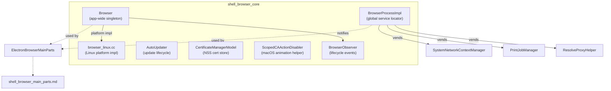
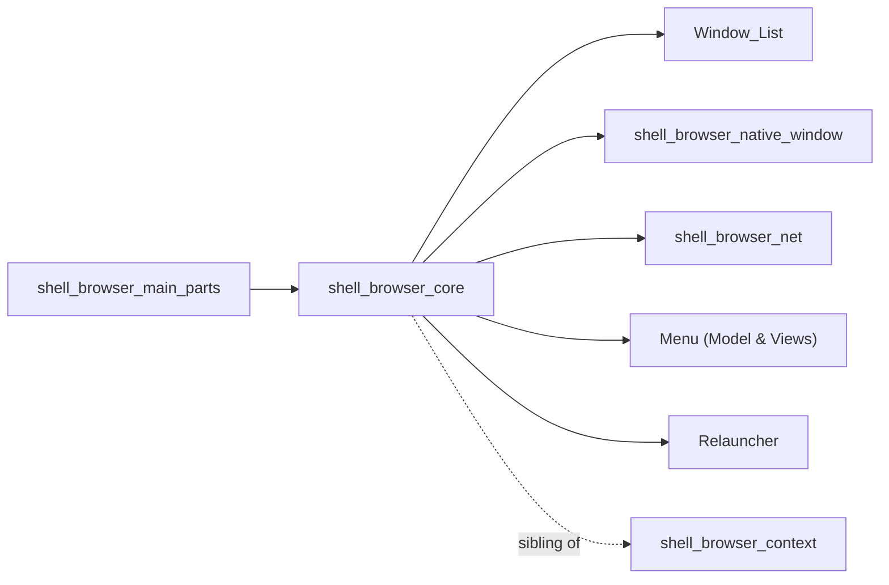
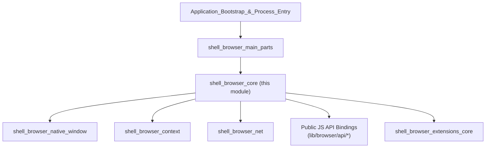

# Shell Browser Core

## Purpose

`shell_browser_core` is the heart of Electron's **browser process**. It defines the
application-wide singleton (`Browser`), the process-scoped service locator
(`BrowserProcessImpl`), and a handful of small, focused helpers that support
application lifecycle management: automatic updates (`AutoUpdater`), TLS/SSL
client-certificate management (`CertificateManagerModel`), and a macOS
animation helper (`ScopedCAActionDisabler`).

Everything in this module runs exclusively in the **main (browser) process**
and is largely platform-agnostic at the header level, with per-platform `.cc`
implementations (macOS, Windows, Linux) providing OS-specific behavior (dock
management, jump lists, `xdg-settings`, etc.).

This module is the foundation on which the rest of the browser-process
subsystem is built. Higher-level browser initialization
(`ElectronBrowserMainParts`, environment setup, extensions wiring) lives in
the sibling module **[shell_browser_main_parts](shell_browser_main_parts.md)**,
which depends on the types defined here (`Browser`, `BrowserProcessImpl`).

## Architecture Overview

High-level relationships to neighboring modules:

## Sub-modules

This module is documented in two focused sub-modules:

| Sub-module | Description | Doc |
|---|---|---|
| **Application Lifecycle** | The `Browser` singleton, its observer interface, and platform-specific lifecycle behavior (Linux `xdg-settings`, dock/jump-list hooks on other platforms, macOS Core Animation helper). | [shell_browser_core_lifecycle.md](shell_browser_core_lifecycle.md) |
| **Process Services & Support Utilities** | `BrowserProcessImpl` (the `BrowserProcess`-derived global service locator), `AutoUpdater` (update-check/download/install lifecycle), and `CertificateManagerModel` (NSS certificate database operations). | [shell_browser_core_services.md](shell_browser_core_services.md) |

## Key Responsibilities

- **Single source of truth for app state**: `Browser` tracks whether the app
  is ready, quitting, or shutting down, and mediates OS-level app behaviors
  (recent documents, login items, protocol handlers, badge counts, dock
  actions, jump lists, etc.) behind a single cross-platform API consumed by
  the JS `app` module (see [System_&_App-Level_Services_API](shell_browser_api_system_device.md)).
- **Central service registry**: `BrowserProcessImpl` implements Chromium's
  `BrowserProcess` interface, lazily creating and exposing globally-scoped
  services such as the local `PrefService`, `PrintJobManager`,
  `SystemNetworkContextManager`, and `ResolveProxyHelper`. Most other browser
  subsystems ultimately fetch shared services through this object.
- **Update lifecycle**: `AutoUpdater` provides a static, delegate-based API
  surface bridging native updater backends (Squirrel.Mac, Squirrel.Windows,
  etc.) to the JS `autoUpdater` API.
- **Certificate management**: `CertificateManagerModel` wraps
  `net::NSSCertDatabase` to support importing/trusting/deleting client and CA
  certificates, primarily used by Linux certificate-trust UI flows.

## How This Module Fits Into the System

`Browser` and `BrowserProcessImpl` are constructed early during process
startup (see [shell_app](shell_app_main_delegate.md) and
[shell_browser_main_parts](shell_browser_main_parts.md)) and remain alive for
the lifetime of the browser process. Nearly every other browser-process
subsystem — window management, extensions, networking, notifications —
either observes `Browser` lifecycle events via `BrowserObserver` or fetches a
shared service through `BrowserProcessImpl`.

## Related Modules

- [shell_browser_main_parts](shell_browser_main_parts.md) — browser process
  initialization that constructs and wires up `Browser`/`BrowserProcessImpl`.
- [shell_browser_context](shell_browser_context.md) — per-session browsing
  context, a peer subsystem that `BrowserProcessImpl` services support.
- [shell_browser_native_window](shell_browser_native_window.md) — native
  window implementations observed via `WindowListObserver`, which `Browser`
  implements.
- [Window_List](Window_List.md) — window registry used by `Browser` to detect
  when all windows have closed.
- [shell_browser_net](shell_browser_net.md) — networking services
  (`ResolveProxyHelper`, `SystemNetworkContextManager`) vended by
  `BrowserProcessImpl`.
- [Relauncher](Relauncher.md) — process relaunch support invoked as part of
  quit/relaunch flows coordinated by `Browser`.
