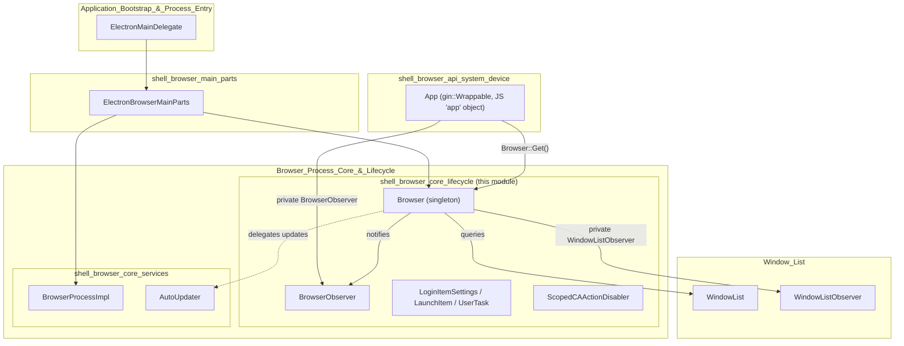
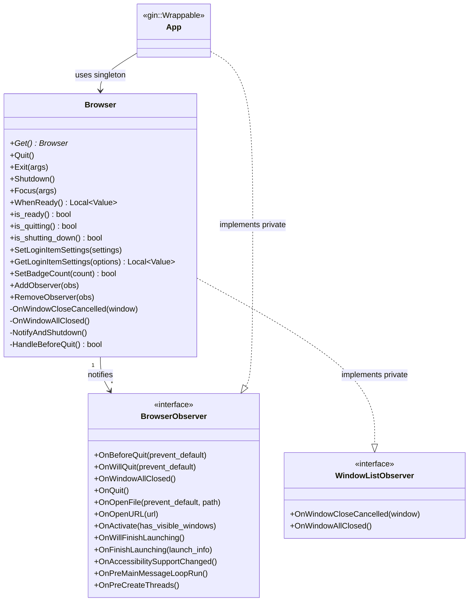
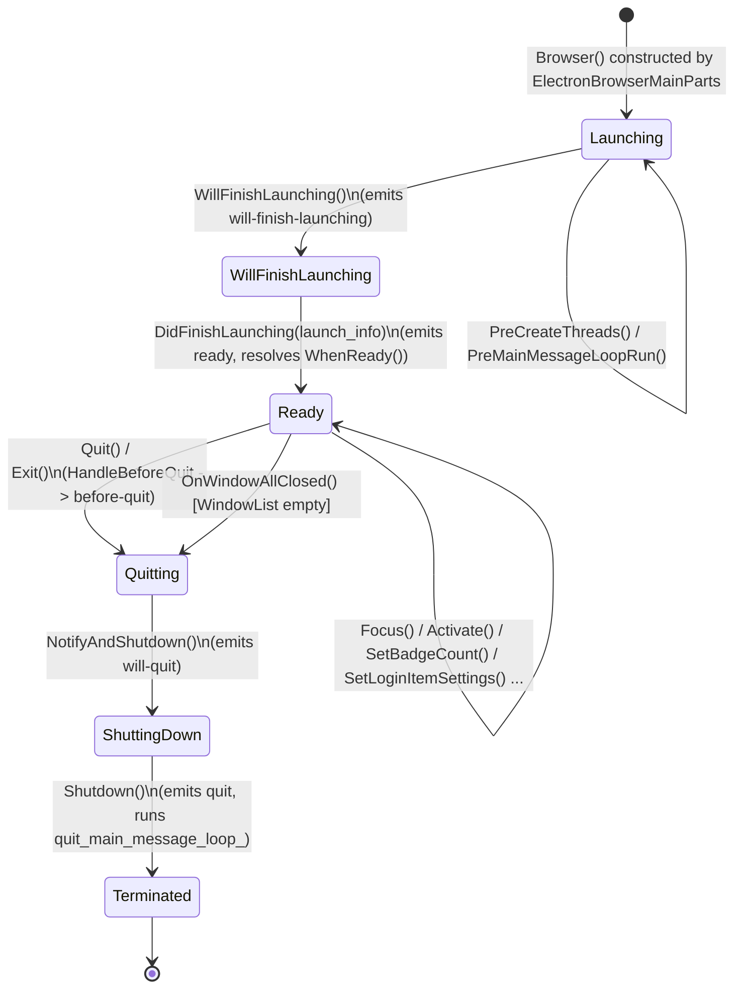
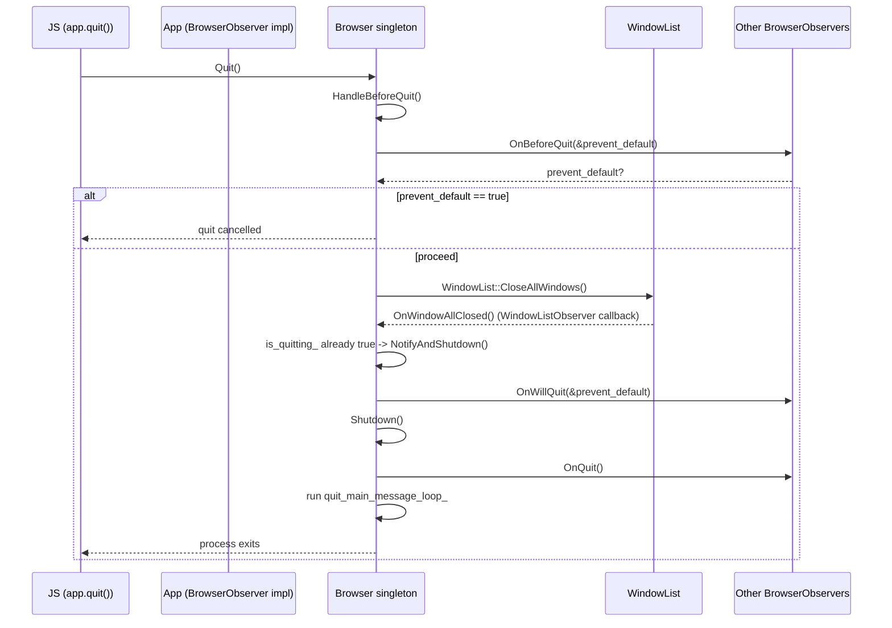
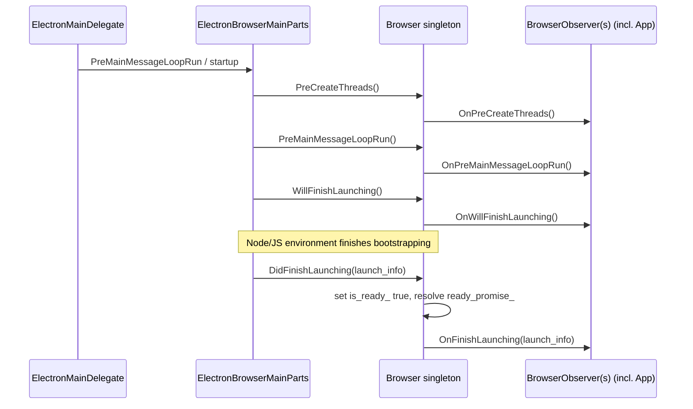
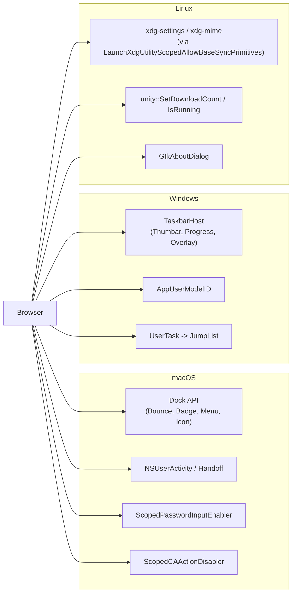
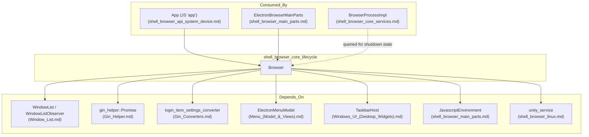

# Shell Browser Core Lifecycle

## Introduction

The **Shell Browser Core Lifecycle** module is the heart of Electron's main-process application lifecycle management. It defines the `electron::Browser` singleton — the C++ engine behind the JS-facing `app` object — along with the `BrowserObserver` interface that lets other subsystems react to lifecycle events (ready, quit, activate, open-file, open-url, accessibility changes, etc.).

This module answers three fundamental questions for the whole application:

1. **When** is the app ready, quitting, or shut down?
2. **Who** gets notified when these transitions happen?
3. **What** platform-specific behavior (macOS Dock/Handoff, Windows Jump List/Taskbar, Linux XDG/Unity) is triggered as part of these transitions?

It sits directly beneath the JS `app` API (`App`, in [shell_browser_api_system_device](shell_browser_api_system_device.md)) and works alongside the broader browser-process services documented in [shell_browser_core_services](shell_browser_core_services.md) and [shell_browser_main_parts](shell_browser_main_parts.md).

---

## Module Position in the System

`shell_browser_core_lifecycle` is a child of **Browser_Process_Core_&_Lifecycle**, sibling to `shell_browser_core_services` (which hosts `BrowserProcessImpl`, `AutoUpdater`, `CertificateManagerModel`). Together they form the low-level runtime foundation that `shell_browser_main_parts` ([shell_browser_main_parts](shell_browser_main_parts.md)) initializes during Chromium's `BrowserMainParts` startup sequence.

---

## Core Components

### `Browser` (`shell/browser/browser.h`)

`Browser` is a **process-wide singleton** (`Browser::Get()`) that centralizes application-level operations that don't belong to any single window or web contents. It is instantiated once by [`ElectronBrowserMainParts`](shell_browser_main_parts.md) during startup and lives for the entire lifetime of the process.

Key responsibilities:

| Category | Representative Methods |
|---|---|
| **Lifecycle control** | `Quit()`, `Exit()`, `Shutdown()`, `NotifyAndShutdown()`, `HandleBeforeQuit()`, `WillFinishLaunching()`, `DidFinishLaunching()`, `WhenReady()` |
| **Identity** | `GetVersion()/SetVersion()`, `GetName()/SetName()` |
| **Protocol handling** | `SetAsDefaultProtocolClient()`, `IsDefaultProtocolClient()`, `RemoveAsDefaultProtocolClient()`, `GetApplicationNameForProtocol()`, `GetApplicationInfoForProtocol()` |
| **Recent documents** | `AddRecentDocument()`, `ClearRecentDocuments()`, `GetRecentDocuments()` |
| **Login items (auto-launch)** | `SetLoginItemSettings()`, `GetLoginItemSettings()` |
| **Badging** | `SetBadgeCount()`, `badge_count()` |
| **macOS specific** | Dock control (`DockBounce`, `DockSetIcon`, `DockSetMenu`…), Handoff/User Activity (`ContinueUserActivity`, `UpdateUserActivityState`…), `Hide()/Show()`, secure keyboard entry |
| **Windows specific** | Jump-list `UserTask`s (`SetUserTasks`), `TaskbarHost` integration, `GetAppUserModelID()` |
| **Linux specific** | Unity launcher badge/progress via `IsUnityRunning()` (see `browser_linux.cc`) |
| **Accessibility** | `OnAccessibilitySupportChanged()` |
| **Focus/Activation** | `Focus()`, `Activate(bool has_visible_windows)` |

`Browser` privately implements `WindowListObserver` (see [Window_List](Window_List.md)) so it can automatically detect when all application windows have closed (`OnWindowAllClosed`) or when a window close was cancelled by a `beforeunload` handler (`OnWindowCloseCancelled`), and translate those into higher-level quit-flow decisions.

### `BrowserObserver` (`shell/browser/browser_observer.h`)

A `base::CheckedObserver` interface that any browser-process component can implement to be notified of `Browser` lifecycle transitions without needing to depend on the JS binding layer. The most important consumer is `App` (`shell/browser/api/electron_api_app.h`, documented in [shell_browser_api_system_device](shell_browser_api_system_device.md)), which implements `BrowserObserver` privately and re-emits every callback as a JS event (`before-quit`, `will-quit`, `window-all-closed`, `quit`, `open-file`, `open-url`, `activate`, `will-finish-launching`, `ready`, `accessibility-support-changed`, and macOS Handoff events).

### `LoginItemSettings`, `LaunchItem`, `UserTask`

Plain data structs describing OS auto-launch ("open at login") and jump-list configuration:

- **`LoginItemSettings`** — cross-platform struct with platform-conditional fields: macOS adds `type`/`service_name`/`status` (Login Items service), Windows adds `enabled`/`name`/`executable_will_launch_at_login`/`launch_items`.
- **`LaunchItem`** (Windows only) — one entry in the resolved list of registered auto-launch items (`name`, `path`, `scope`, `args`, `enabled`).
- **`Browser::UserTask`** (Windows only) — describes a single Jump List task (program, arguments, title, description, icon) consumed by `SetUserTasks()` and rendered via [`JumpList`](Windows_UI_(Desktop_Widgets).md).

These structs are converted to/from V8 values using the gin converter defined in [Gin_Converters](Gin_Converters.md) (`login_item_settings_converter.h`).

### `ScopedCAActionDisabler` (`shell/browser/animation_util.h`)

A macOS-only RAII helper that temporarily disables Core Animation implicit animations (`CAAction`) while making UI changes that should be visually instantaneous (e.g., during window/dock manipulation triggered by lifecycle transitions). It is a lightweight platform utility used by native window and dock code in [shell_browser_native_window](shell_browser_native_window.md) and macOS Cocoa UI ([Cocoa_UI](Cocoa_UI.md)).

### `LaunchXdgUtilityScopedAllowBaseSyncPrimitives` (`shell/browser/browser_linux.cc`)

An internal, Linux-only helper class (a specialization of `base::ScopedAllowBaseSyncPrimitivesForTesting`) that permits blocking waits around `xdg-settings`/`xdg-mime` subprocess calls. It backs the Linux implementations of:

- `Browser::SetAsDefaultProtocolClient` / `IsDefaultProtocolClient` / `GetApplicationNameForProtocol` — shell out to `xdg-settings` / `xdg-mime`.
- `Browser::SetBadgeCount` — delegates to the Unity launcher API (`unity::SetDownloadCount`) documented in [shell_browser_linux](shell_browser_linux.md).
- `Browser::ShowAboutPanel` — renders a native `GtkAboutDialog` populated from `about_panel_options_`.

---

## Lifecycle State Machine

`Browser` tracks three primary boolean states — `is_ready_`, `is_quitting_`, `is_shutdown_` — that gate what operations are legal and what events fire.

- **`is_ready_`** becomes `true` after `DidFinishLaunching()`; `WhenReady()` returns a `gin_helper::Promise<void>` that resolves at this point (or immediately if already ready).
- **`is_quitting_`** is set by `Quit()`/the quit sequence and gates whether `OnWindowAllClosed` should trigger a full quit (`NotifyAndShutdown`) versus simply firing `window-all-closed`.
- **`is_shutdown_`** (`is_shutting_down()`) is set once `Shutdown()` executes, and is used by other subsystems (e.g., [shell_browser_core_services](shell_browser_core_services.md)'s `BrowserProcessImpl`) to avoid doing work during teardown.

## Quit / Shutdown Sequence

Key nuance: `Browser` itself never owns windows — it relies on the process-wide [`WindowList`](Window_List.md) (also used by [shell_browser_native_window](shell_browser_native_window.md)) to know when the last window has closed. Because `Browser` privately implements `WindowListObserver`, it is automatically informed via `OnWindowAllClosed()`/`OnWindowCloseCancelled()` without needing direct references to any `NativeWindow`.

## Application Launch Sequence

`ElectronBrowserMainParts` (see [shell_browser_main_parts](shell_browser_main_parts.md)) drives this sequence as part of Chromium's `content::BrowserMainParts` hooks, ensuring `Browser`'s lifecycle callbacks are interleaved correctly with GPU/thread initialization and JS environment setup.

---

## Platform-Specific Behavior

`Browser` centralizes cross-platform lifecycle semantics but delegates OS-specific mechanics to platform source files and related modules:

| Platform | Mechanism | Module Reference |
|---|---|---|
| macOS | Dock bounce/badge/menu/icon, Handoff (`NSUserActivity`), secure keyboard entry, `ScopedCAActionDisabler` | [Cocoa_UI](Cocoa_UI.md), [shell_browser_mac](shell_browser_mac.md) |
| Windows | `TaskbarHost` (thumbar buttons, progress, overlay icon), `UserTask`/Jump List, `GetAppUserModelID()` | [Windows_UI_(Desktop_Widgets)](Windows_UI_(Desktop_Widgets).md) |
| Linux | `xdg-settings`/`xdg-mime` for default protocol handling, Unity launcher badge counts, native GTK About panel | [shell_browser_linux](shell_browser_linux.md) |

---

## Dependencies and Consumers

- **Depends on:**
  - [Window_List](Window_List.md) — for tracking open `NativeWindow` instances and reacting to close/all-closed events.
  - [Gin_Helper](Gin_Helper.md) — `gin_helper::Promise<void>` powers `WhenReady()`; `gin_helper::Arguments`/`gin::Arguments` are used across method signatures.
  - [Gin_Converters](Gin_Converters.md) — `login_item_settings_converter.h` converts `LoginItemSettings`/`LaunchItem` to/from V8.
  - [Menu_(Model_&_Views)](Menu_(Model_&_Views).md) — `ElectronMenuModel` used by `DockSetMenu()` on macOS.
  - [Windows_UI_(Desktop_Widgets)](Windows_UI_(Desktop_Widgets).md) — `TaskbarHost` member drives Windows taskbar integration.
  - [shell_browser_main_parts](shell_browser_main_parts.md) — provides `JavascriptEnvironment` used to convert `LoginItemSettings` to V8 in `browser_linux.cc`.
  - [shell_browser_linux](shell_browser_linux.md) — `unity_service` namespace for badge counts and Unity launcher detection.

- **Consumed by:**
  - [shell_browser_api_system_device](shell_browser_api_system_device.md) — `App` is the primary consumer, implementing `BrowserObserver` and wrapping nearly every `Browser` method for the JS `app` API.
  - [shell_browser_main_parts](shell_browser_main_parts.md) — `ElectronBrowserMainParts` owns/constructs the `Browser` singleton and drives its lifecycle hooks (`PreCreateThreads`, `PreMainMessageLoopRun`, `WillFinishLaunching`, `DidFinishLaunching`).
  - [shell_browser_core_services](shell_browser_core_services.md) — `BrowserProcessImpl` and related services check `Browser::is_shutting_down()`/`is_quitting()` to coordinate teardown ordering.

---

## Design Notes

- **Singleton by design**: `Browser::Get()` provides global access because application lifecycle is inherently a single, process-wide concept — unlike windows or web contents, which are inherently multi-instance and tracked via [Window_List](Window_List.md) and [Web_Contents](Web_Contents.md)/[shell_browser_api_webcontents](shell_browser_api_webcontents.md) respectively.
- **Observer pattern decouples JS bindings from core logic**: `BrowserObserver` lets `Browser` remain free of any V8/gin dependency in its notification path (the callbacks pass plain C++ types), while `App` (which does depend on gin) adapts these into JS events. This mirrors the same decoupling used by `WindowListObserver` for window events.
- **Platform code is compiled conditionally, not via subclasses**: Rather than platform-specific `Browser` subclasses, the header uses `BUILDFLAG(IS_MAC)/IS_WIN/IS_LINUX` guards, and separate `.cc` files (`browser_linux.cc`, and implied `browser_mac.mm`/`browser_win.cc` in sibling modules) implement the platform branches of the same class. This keeps the single `Browser::Get()` entry point uniform across platforms while allowing divergent OS integration.
- **`is_quitting_` is `protected`, not `private`**: allowing platform-specific `.cc` implementations (compiled as part of the same class across TUs) to inspect/set quitting state directly without needing additional accessor plumbing.
