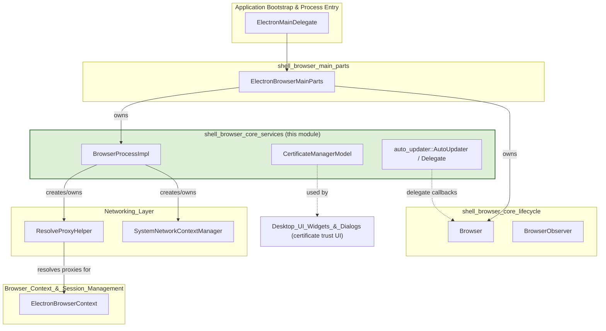
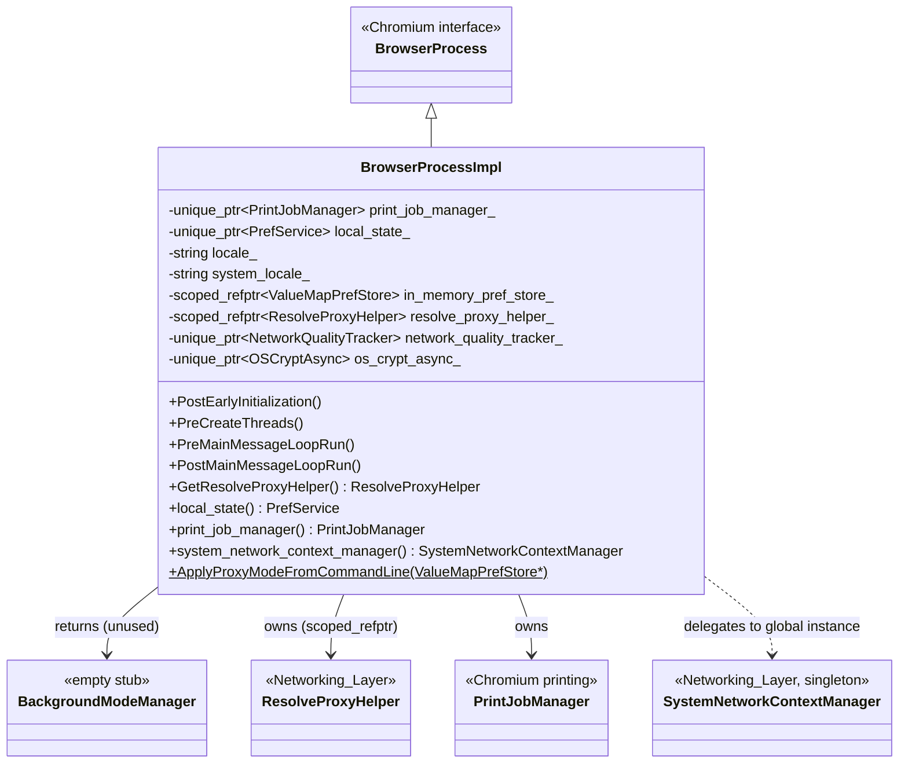
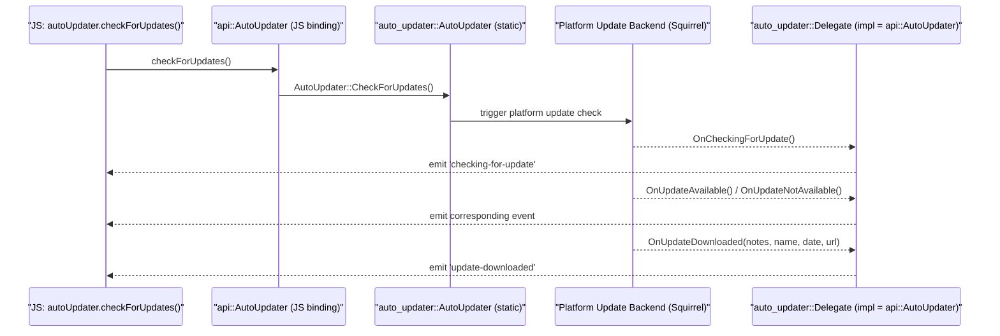
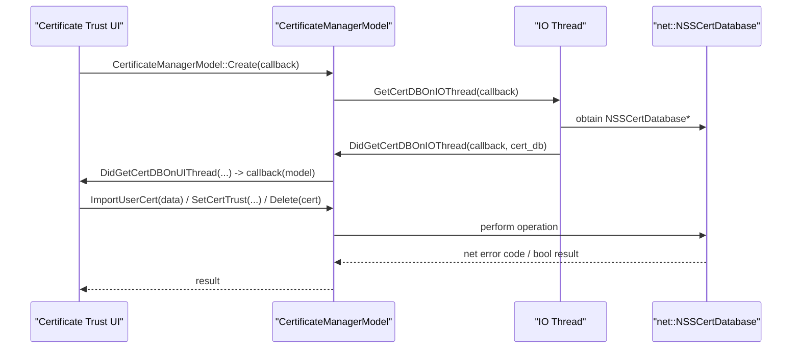
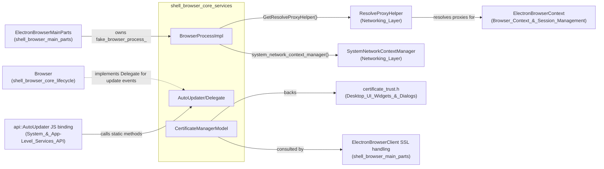
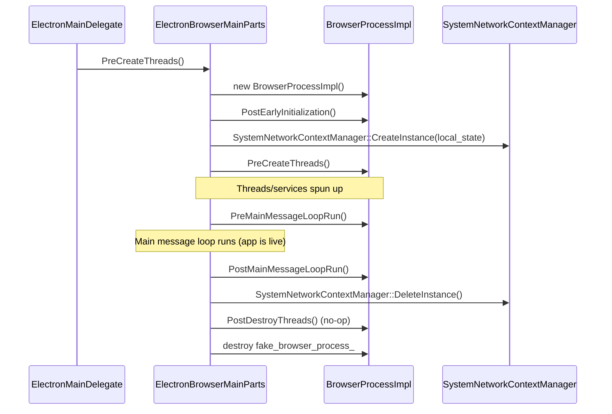

# Shell Browser Core Services

## Introduction

The **Shell Browser Core Services** module provides the foundational, process-wide services that back Electron's browser process. It is the C++ layer that mirrors and extends Chromium's `BrowserProcess` abstraction, offering lazily-created singleton-style services (proxy resolution, print job management, background-mode stubbing) as well as two supporting subsystems used throughout the browser process:

- **Auto-updating** (`auto_updater::AutoUpdater` / `Delegate`) — a thin static façade that bridges the native auto-update backends (Squirrel.Mac, Squirrel.Windows) to the JS-exposed `autoUpdater` API.
- **Certificate management** (`CertificateManagerModel`) — a data/business-logic layer for inspecting and mutating the NSS certificate database, used by certificate-management UI and import/export flows.

Together with `Browser` and `BrowserObserver` (documented in [shell_browser_core_lifecycle.md](shell_browser_core_lifecycle.md)), these components make up the `shell_browser_core` parent grouping — the backbone that `ElectronBrowserMainParts` (see [shell_browser_main_parts.md](shell_browser_main_parts.md)) instantiates during startup and keeps alive for the lifetime of the application.

This module sits low in the dependency graph: almost every other browser-process subsystem (networking, sessions, extensions, UI) either consults `BrowserProcessImpl` for a shared service or is orchestrated by code that owns an instance of it.

## Module Position in the System

## Core Components

### 1. `BrowserProcessImpl`

`BrowserProcessImpl` is Electron's concrete implementation of Chromium's `BrowserProcess` interface. It is a **NOT-thread-safe**, main-thread-only singleton (owned by `ElectronBrowserMainParts`) that lazily creates and exposes process-global services. Most of the interface consists of overridden accessors for Chromium subsystems (metrics, policy, GPU mode, download limiters, etc.), many of which Electron does not use and simply stub out or return `nullptr`/no-op.

Key responsibilities relevant to Electron:

- **Lifecycle hooks** — `PostEarlyInitialization()`, `PreCreateThreads()`, `PreMainMessageLoopRun()`, `PostMainMessageLoopRun()` are called at specific points during startup/shutdown by `ElectronBrowserMainParts`.
- **Locale management** — `SetSystemLocale`/`GetSystemLocale` and `SetApplicationLocale`/`GetApplicationLocale`.
- **Proxy resolution access** — `GetResolveProxyHelper()` returns the shared `electron::ResolveProxyHelper` (see [Networking_Layer](#relationship-to-networking-layer) below).
- **Preferences** — owns `local_state_` (`PrefService`) and an in-memory `ValueMapPrefStore` used to seed proxy configuration from the command line (`ApplyProxyModeFromCommandLine`).
- **Printing** — owns `printing::PrintJobManager` (behind `BUILDFLAG(ENABLE_PRINTING)`).
- **OS Crypt** — creates and exposes `os_crypt_async::OSCryptAsync` for encrypted storage needs.
- **Linux storage backend selection** — tracks which secret-storage backend (kwallet, gnome-keyring, basic-text) was selected for Linux OS Crypt.

`BackgroundModeManager` in this file is an intentionally **empty stub class** — Electron does not implement Chrome's background-mode feature but must supply the type to satisfy `BrowserProcess`'s virtual interface (`std::unique_ptr<BackgroundModeManager>` parameters, etc.).

### 2. `auto_updater::AutoUpdater` and `Delegate`

`AutoUpdater` is a **static-only class** (non-instantiable, `AutoUpdater() = delete`) that exposes a small, platform-agnostic API surface for the auto-update feature:

- `SetFeedURL(gin::Arguments*)` / `GetFeedURL()`
- `CheckForUpdates()`
- `QuitAndInstall()`
- `IsVersionAllowedForUpdate(current, target)`

All actual update logic lives in platform-specific backends (Squirrel.Mac / Squirrel.Windows, not shown in this module) which call back into the registered `Delegate`. The `Delegate` interface defines the event contract:

- `OnError(message)` / `OnError(message, code, domain)`
- `OnCheckingForUpdate()`
- `OnUpdateAvailable()`
- `OnUpdateNotAvailable()`
- `OnUpdateDownloaded(release_notes, release_name, release_date, update_url)`

The delegate is typically implemented by the JS-facing binding class `electron::api::AutoUpdater` (see [System_&_App-Level_Services_API](System_&_App-Level_Services_API.md) → `electron_api_auto_updater.h`), which converts these callbacks into `autoUpdater` events emitted to JavaScript.

### 3. `CertificateManagerModel`

`CertificateManagerModel` provides the data and mutation operations backing certificate-management UI (import/export/trust). It wraps a `net::NSSCertDatabase` pointer and exposes:

- **Creation** — `Create(CreationCallback)` performs asynchronous, thread-hopping initialization (`GetCertDBOnIOThread` → `DidGetCertDBOnIOThread` → `DidGetCertDBOnUIThread`) because NSS database access must happen on the IO thread while the resulting model is handed back on the UI thread.
- **Import operations** — `ImportFromPKCS12`, `ImportUserCert`, `ImportCACerts`, `ImportServerCert`.
- **Trust management** — `SetCertTrust`.
- **Deletion** — `Delete`.
- **Availability check** — `is_user_db_available()` indicates whether the profile has a public NSS slot, gating whether import operations are permitted.

This model is primarily consumed by the [Desktop_UI_Widgets_&_Dialogs](Desktop_UI_Widgets_&_Dialogs.md) module's certificate-trust dialog (`shell/browser/ui/certificate_trust.h`) and by browser-client SSL/client-certificate flows in [shell_browser_main_parts.md](shell_browser_main_parts.md) (`ElectronBrowserClient`'s `SSLCertRequestInfo` / `ClientCertificateDelegate` handling).

## Component Relationships

### Relationship to Networking Layer

`BrowserProcessImpl::GetResolveProxyHelper()` exposes a shared `electron::ResolveProxyHelper` instance. This class (defined in the [Networking_Layer](Networking_Layer.md) module) queues and dispatches asynchronous proxy lookups via `network::mojom::ProxyLookupClient`, ultimately used by `ElectronBrowserContext` and networking code that needs `session.resolveProxy()`-style behavior.

Similarly, `BrowserProcessImpl::system_network_context_manager()` returns the global `SystemNetworkContextManager` singleton (also in [Networking_Layer](Networking_Layer.md)), which configures default `NetworkContextParams`, exposes a shared `URLLoaderFactory`, and reacts to `OnNetworkServiceCreated`. `BrowserProcessImpl` does not own this singleton directly — it accesses it via `SystemNetworkContextManager::GetInstance()`, which is created/destroyed elsewhere in the startup/shutdown sequence orchestrated by `ElectronBrowserMainParts`.

### Relationship to Browser Lifecycle

`BrowserProcessImpl` is instantiated and owned by `ElectronBrowserMainParts::fake_browser_process_` (see [shell_browser_main_parts.md](shell_browser_main_parts.md)). It is a companion object to `Browser` (owned separately as `ElectronBrowserMainParts::browser_`, documented in [shell_browser_core_lifecycle.md](shell_browser_core_lifecycle.md)) — together, `Browser` handles app-lifecycle events (`will-quit`, `before-quit`, dock/tray hooks, login items) while `BrowserProcessImpl` supplies backing services that Chromium code expects to find via the global `g_browser_process` pointer pattern.

## Startup / Shutdown Sequence

## Design Notes

- **Interface stubbing**: `BrowserProcessImpl` overrides a very large Chromium interface (`BrowserProcess`) but only meaningfully implements the subset Electron needs (locale, printing, proxy resolution, network context, OS Crypt, prefs). All unused accessors either return `nullptr` or are no-ops — this is intentional, since Electron reuses Chromium's `//chrome` layer code paths without pulling in the full Chrome browser feature set.
- **Thread-safety caveat**: The header explicitly documents `BrowserProcessImpl` as **NOT THREAD SAFE** — all access must occur on the main (UI) thread.
- **Static delegate pattern for AutoUpdater**: Rather than being an instantiable object, `AutoUpdater` uses a static delegate registration pattern (`SetDelegate`/`GetDelegate`), matching the single-updater-per-process nature of Squirrel-based auto-update flows and simplifying calls from platform-specific `.mm`/`.cc` update implementations.
- **Async NSS access in CertificateManagerModel**: Because `NSSCertDatabase` must be accessed on the IO thread historically, `CertificateManagerModel::Create` follows a hop-to-IO-then-back-to-UI callback chain rather than exposing a synchronous constructor.

## Related Modules

- [shell_browser_core_lifecycle.md](shell_browser_core_lifecycle.md) — `Browser`, `BrowserObserver`: application-level lifecycle events and observer pattern; sibling module under `shell_browser_core`.
- [shell_browser_main_parts.md](shell_browser_main_parts.md) — `ElectronBrowserMainParts`: owns and drives the lifecycle of `BrowserProcessImpl` and `Browser`.
- [Networking_Layer.md](Networking_Layer.md) — `ResolveProxyHelper`, `SystemNetworkContextManager`: services exposed through `BrowserProcessImpl`.
- [Browser_Context_&_Session_Management.md](Browser_Context_&_Session_Management.md) — `ElectronBrowserContext` and session APIs that consume proxy resolution and network context services.
- [System_&_App-Level_Services_API.md](System_&_App-Level_Services_API.md) — JS-facing `electron_api_auto_updater.h` binding that drives `auto_updater::AutoUpdater` and implements `Delegate`.
- [Desktop_UI_Widgets_&_Dialogs.md](Desktop_UI_Widgets_&_Dialogs.md) — certificate trust dialogs and other UI consuming `CertificateManagerModel`.
