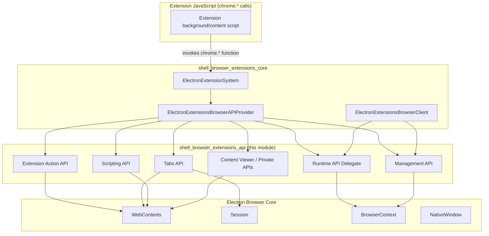
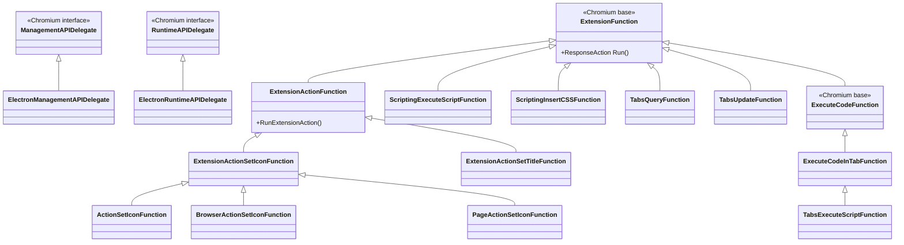

# Shell Browser Extensions API

## Introduction

The **Shell Browser Extensions API** module implements the browser-process (main process) side of Chrome-extension-compatible JavaScript APIs that Electron exposes to loaded extensions. It is the collection of `ExtensionFunction` implementations, delegate classes, and small helper services that back the `chrome.*` namespaces most commonly used by Chrome/Chromium extensions running inside Electron, including:

- `chrome.action` / `chrome.browserAction` / `chrome.pageAction`
- `chrome.management`
- `chrome.runtime` (browser-side delegate)
- `chrome.scripting`
- `chrome.tabs`
- `chrome.pdfViewerPrivate`, `chrome.resourcesPrivate`, `chrome.streamsPrivate` (internal/private APIs used by Electron's bundled PDF viewer and MIME handler view)

This module is one of three sibling sub-modules of the broader **Extensions Subsystem**:

- `shell_browser_extensions_api` (this module) — the concrete extension API surface (`ExtensionFunction` subclasses & API delegates).
- [shell_browser_extensions_core.md](shell_browser_extensions_core.md) — the extensions runtime plumbing (extension system, loader, browser client, messaging, kiosk, resource manager) that hosts and dispatches these API calls.
- [Extensions_(Common).md](Extensions_(Common).md) — cross-process extension definitions, permission handling and the `ExtensionsClient`/`ExtensionsAPIProvider` shared between browser and renderer.

Each `ExtensionFunction` subclass in this module corresponds to a single JavaScript-callable API method. They are registered by `ElectronExtensionsBrowserAPIProvider` (in `shell_browser_extensions_core`) and dispatched by the extensions system whenever an extension's JS calls into the corresponding `chrome.*` method. Most of these functions ultimately act upon Electron's own browser objects — `WebContents`, `Session`, `BrowserContext`, `NativeWindow` — bridging the Chromium extension API contract with Electron's native API surface.

## Architecture Overview

### Design characteristics

- **`ExtensionFunction` pattern**: Nearly every class extends `extensions::ExtensionFunction` (or a more specific base such as `ExtensionActionFunction` / `ExecuteCodeFunction`), overriding `Run()` to implement a single API call and returning a `ResponseAction`.
- **Delegate pattern**: Larger Chromium subsystems (`management`, `runtime`) are integrated via small `*Delegate` classes (`ElectronManagementAPIDelegate`, `ElectronRuntimeAPIDelegate`) that implement Chromium-defined delegate interfaces, letting Electron plug into upstream Chromium extensions code with minimal duplication.
- **Alias hierarchies**: The Extension Action API defines a single implementation class per operation (e.g. `ExtensionActionSetIconFunction`) and derives thin, name-only subclasses for each of the three JS namespaces that share the behavior (`action.*`, `browserAction.*`, `pageAction.*`).
- **Partial/stubbed implementations**: Several delegates (e.g. `ElectronManagementAPIDelegate`) intentionally no-op or stub out behavior not yet supported by Electron (app installation prompts, extension service integration), since Electron does not have a full Chrome-style extension service.

## Sub-modules

| Sub-module | Description | Documentation |
|---|---|---|
| Extension Action API | Implements `chrome.action`, `chrome.browserAction`, and `chrome.pageAction` — icon, title, popup, badge and enable/disable state management for extension toolbar actions. | [shell_browser_extensions_api_actions.md](shell_browser_extensions_api_actions.md) |
| Management API | Implements the browser-process delegate for `chrome.management`, bridging extension install/uninstall/enable/launch operations to Electron (largely stubbed since Electron lacks a full `ExtensionService`). | [shell_browser_extensions_api_management.md](shell_browser_extensions_api_management.md) |
| Runtime API Delegate | Implements the browser-process delegate for `chrome.runtime`, handling extension reload, update checks, and platform info. | [shell_browser_extensions_api_runtime.md](shell_browser_extensions_api_runtime.md) |
| Scripting API | Implements `chrome.scripting` — programmatic script/CSS injection and dynamic content-script registration. | [shell_browser_extensions_api_scripting.md](shell_browser_extensions_api_scripting.md) |
| Tabs API | Implements `chrome.tabs` — tab query/get/update/reload and per-tab zoom control, plus script/CSS execution in a tab. | [shell_browser_extensions_api_tabs.md](shell_browser_extensions_api_tabs.md) |
| Content Viewer & Private APIs | Implements the private APIs (`pdfViewerPrivate`, `resourcesPrivate`, `streamsPrivate`) that power Electron's built-in PDF viewer and stream/MIME-handler hand-off. | [shell_browser_extensions_api_content_viewers.md](shell_browser_extensions_api_content_viewers.md) |

## How this module fits into the system

- **Upstream dispatch**: [shell_browser_extensions_core.md](shell_browser_extensions_core.md)'s `ElectronExtensionsBrowserAPIProvider` registers all `ExtensionFunction`s defined here with the Chromium extensions function registry, and `ElectronExtensionsBrowserClient` supplies the process-wide hooks (kiosk delegate, process manager delegate, messaging delegate) that some of these functions rely on indirectly.
- **Data model**: [Extensions_(Common).md](Extensions_(Common).md)'s `ElectronExtensionsClient`/`ElectronPermissionMessageProvider` define the extension manifest/permission model that these functions validate against before executing privileged operations.
- **Target objects**: Most functions act on Electron browser objects documented elsewhere — see [shell_browser_api_session_net_session_core.md](shell_browser_api_session_net_session_core.md) for `Session`, [shell_browser_context.md](shell_browser_context.md) for `BrowserContext`, and [shell_browser_api_webcontents_core.md](shell_browser_api_webcontents_core.md) for `WebContents` and its zoom controller used by the Tabs API.
- **Renderer counterpart**: Content-script execution triggered by the Scripting/Tabs APIs is carried out on the renderer side by the `Renderer_Extensions` sub-module (`ElectronExtensionsRendererClient`), part of the Renderer Process Infrastructure module.

## Cross-cutting API summary

