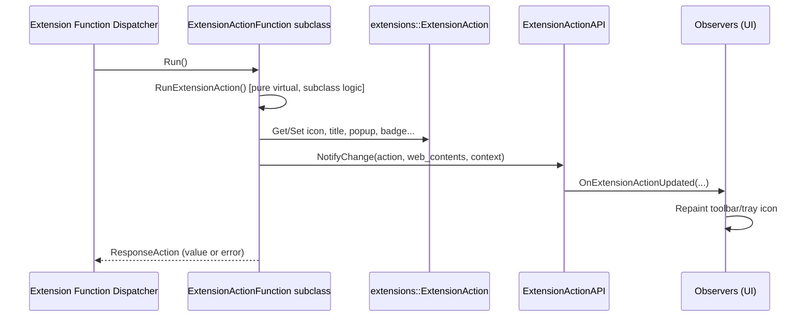
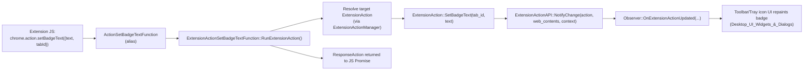
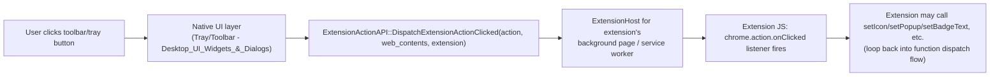

# Extension Action API (`shell_browser_extensions_api_actions`)

## Introduction

The **Extension Action API** module implements the browser-side plumbing for Chrome's
extension "action" family of JavaScript APIs — `chrome.action`, the legacy
`chrome.browserAction`, and the legacy `chrome.pageAction`. These APIs let extensions
control the toolbar icon, badge, title (tooltip), popup document, and enabled/disabled
state associated with the extension's UI surface (commonly the toolbar button next to
the omnibox).

This module is a leaf component of the broader [Extensions Subsystem](shell_browser_extensions_api.md).
It contains no rendering logic itself; instead it validates and dispatches the extension
function calls, mutates the underlying `extensions::ExtensionAction` model owned by
`ExtensionActionManager`/`ExtensionPrefs`, and fires notifications that are consumed by
the UI layers (e.g. tray/toolbar icon rendering in [Desktop_UI_Widgets_&_Dialogs](Desktop_UI_Widgets_&_Dialogs.md))
and by other extension JS contexts via the standard extension event system.

All code lives in a single header:
`shell/browser/extensions/api/extension_action/extension_action_api.h`.

---

## Purpose & Responsibilities

1. **Central coordination service** — `ExtensionActionAPI` is a
   `BrowserContextKeyedAPI` singleton (per `content::BrowserContext`) that:
   - Tracks changes to `ExtensionAction` state (icon, title, badge, popup, enabled).
   - Notifies registered `Observer`s (`OnExtensionActionUpdated`,
     `OnExtensionActionAPIShuttingDown`) so UI code can repaint the affected surface.
   - Dispatches the `onClicked` event back into the extension's JS context when the user
     activates the action.
   - Clears per-tab action state when a tab (`content::WebContents`) navigates or closes.

2. **Extension function implementations** — A large family of
   `ExtensionFunction` subclasses that implement each JS-callable method
   (`setIcon`, `setTitle`, `setPopup`, `setBadgeText`,
   `setBadgeBackgroundColor`, `setBadgeTextColor`, `enable`, `disable`,
   `isEnabled`, `getUserSettings`, `openPopup`, and their `get*` counterparts).

3. **API surface aliasing** — Chrome's extension platform historically exposed three
   near-identical JS namespaces for the same underlying concept:
   - `chrome.action` (Manifest V3, current)
   - `chrome.browserAction` (Manifest V2, legacy)
   - `chrome.pageAction` (Manifest V2, legacy, per-tab visibility)

   This module implements the *shared* logic once (in the `ExtensionAction*Function`
   base classes) and then creates lightweight subclasses per namespace that only supply
   the `DECLARE_EXTENSION_FUNCTION` name/id mapping — a **class-based alias pattern**
   that avoids duplicating business logic three times.

---

## Architecture Overview

```mermaid
graph TB
    subgraph "JS Extension Context"
        JS["chrome.action / chrome.browserAction / chrome.pageAction<br/>JavaScript calls"]
    end

    subgraph "Extensions Function Dispatch (Chromium extensions layer)"
        EF["extensions::ExtensionFunction"]
    end

    subgraph "shell_browser_extensions_api_actions (this module)"
        EAF["ExtensionActionFunction<br/>(abstract base)"]
        SHOW["ExtensionActionShowFunction"]
        HIDE["ExtensionActionHideFunction"]
        SETICON["ExtensionActionSetIconFunction"]
        SETTITLE["ExtensionActionSetTitleFunction"]
        SETPOPUP["ExtensionActionSetPopupFunction"]
        SETBADGE["ExtensionActionSetBadgeTextFunction"]
        SETBG["ExtensionActionSetBadgeBackgroundColorFunction"]
        GETTITLE["ExtensionActionGetTitleFunction"]
        GETPOPUP["ExtensionActionGetPopupFunction"]
        GETBADGE["ExtensionActionGetBadgeTextFunction"]
        GETBG["ExtensionActionGetBadgeBackgroundColorFunction"]
        OPENPOPUP["ExtensionActionOpenPopupFunction"]

        ACTIONNS["Action* classes<br/>(chrome.action.*)"]
        BANS["BrowserAction* classes<br/>(chrome.browserAction.*)"]
        PANS["PageAction* classes<br/>(chrome.pageAction.*)"]

        API["ExtensionActionAPI<br/>(BrowserContextKeyedAPI)"]
        OBS["ExtensionActionAPI::Observer"]
    end

    subgraph "Chromium Extensions Model"
        EA["extensions::ExtensionAction"]
        EP["ExtensionPrefs"]
        EH["ExtensionHost"]
    end

    subgraph "Consumers"
        UI["Toolbar / Tray Icon rendering<br/>(Desktop_UI_Widgets_&_Dialogs)"]
        TABS["Tabs API<br/>(shell_browser_extensions_api_tabs)"]
    end

    JS --> EF
    EF --> EAF
    EAF --> SHOW & HIDE & SETICON & SETTITLE & SETPOPUP & SETBADGE & SETBG & GETTITLE & GETPOPUP & GETBADGE & GETBG & OPENPOPUP
    SHOW & HIDE & SETICON & SETTITLE & SETPOPUP & SETBADGE & SETBG & GETTITLE & GETPOPUP & GETBADGE & GETBG --> ACTIONNS
    SHOW & HIDE & SETICON & SETTITLE & SETPOPUP & SETBADGE & SETBG & GETTITLE & GETPOPUP & GETBADGE & GETBG --> BANS
    SHOW & HIDE & SETICON & SETTITLE & SETPOPUP --> PANS
    OPENPOPUP --> ACTIONNS
    OPENPOPUP --> BANS

    ACTIONNS & BANS & PANS -->|mutate| EA
    EAF -->|persist| EP
    API -->|reads/writes state via| EA
    API -->|dispatches onClicked to| EH
    API --> OBS
    OBS --> UI
    ACTIONNS -.->|getUserSettings pinned state| TABS
    API -->|NotifyChange| UI
```

---

## Class Hierarchy

The module relies heavily on C++ inheritance to share logic between the three JS
namespaces. Every concrete leaf class registers itself with the extension function
dispatch table via `DECLARE_EXTENSION_FUNCTION(name, id)`.

```mermaid
classDiagram
    class ExtensionFunction
    class ExtensionActionFunction {
        <<abstract>>
        +Run() ResponseAction
        #RunExtensionAction() ResponseAction*
    }
    class ExtensionActionShowFunction
    class ExtensionActionHideFunction
    class ExtensionActionSetIconFunction
    class ExtensionActionSetTitleFunction
    class ExtensionActionSetPopupFunction
    class ExtensionActionSetBadgeTextFunction
    class ExtensionActionSetBadgeBackgroundColorFunction
    class ExtensionActionGetTitleFunction
    class ExtensionActionGetPopupFunction
    class ExtensionActionGetBadgeTextFunction
    class ExtensionActionGetBadgeBackgroundColorFunction
    class ExtensionActionOpenPopupFunction

    ExtensionFunction <|-- ExtensionActionFunction
    ExtensionActionFunction <|-- ExtensionActionShowFunction
    ExtensionActionFunction <|-- ExtensionActionHideFunction
    ExtensionActionFunction <|-- ExtensionActionSetIconFunction
    ExtensionActionFunction <|-- ExtensionActionSetTitleFunction
    ExtensionActionFunction <|-- ExtensionActionSetPopupFunction
    ExtensionActionFunction <|-- ExtensionActionSetBadgeTextFunction
    ExtensionActionFunction <|-- ExtensionActionSetBadgeBackgroundColorFunction
    ExtensionActionFunction <|-- ExtensionActionGetTitleFunction
    ExtensionActionFunction <|-- ExtensionActionGetPopupFunction
    ExtensionActionFunction <|-- ExtensionActionGetBadgeTextFunction
    ExtensionActionFunction <|-- ExtensionActionGetBadgeBackgroundColorFunction
    ExtensionActionFunction <|-- ExtensionActionOpenPopupFunction

    %% action.* aliases
    ExtensionActionSetIconFunction <|-- ActionSetIconFunction
    ExtensionActionGetPopupFunction <|-- ActionGetPopupFunction
    ExtensionActionSetPopupFunction <|-- ActionSetPopupFunction
    ExtensionActionGetTitleFunction <|-- ActionGetTitleFunction
    ExtensionActionSetTitleFunction <|-- ActionSetTitleFunction
    ExtensionActionGetBadgeTextFunction <|-- ActionGetBadgeTextFunction
    ExtensionActionSetBadgeTextFunction <|-- ActionSetBadgeTextFunction
    ExtensionActionGetBadgeBackgroundColorFunction <|-- ActionGetBadgeBackgroundColorFunction
    ExtensionActionSetBadgeBackgroundColorFunction <|-- ActionSetBadgeBackgroundColorFunction
    ExtensionActionFunction <|-- ActionGetBadgeTextColorFunction
    ExtensionActionFunction <|-- ActionSetBadgeTextColorFunction
    ExtensionActionShowFunction <|-- ActionEnableFunction
    ExtensionActionHideFunction <|-- ActionDisableFunction
    ExtensionActionFunction <|-- ActionIsEnabledFunction
    ExtensionFunction <|-- ActionGetUserSettingsFunction
    ExtensionActionOpenPopupFunction <|-- ActionOpenPopupFunction

    %% browserAction.* aliases
    ExtensionActionSetIconFunction <|-- BrowserActionSetIconFunction
    ExtensionActionSetTitleFunction <|-- BrowserActionSetTitleFunction
    ExtensionActionSetPopupFunction <|-- BrowserActionSetPopupFunction
    ExtensionActionGetTitleFunction <|-- BrowserActionGetTitleFunction
    ExtensionActionGetPopupFunction <|-- BrowserActionGetPopupFunction
    ExtensionActionSetBadgeTextFunction <|-- BrowserActionSetBadgeTextFunction
    ExtensionActionSetBadgeBackgroundColorFunction <|-- BrowserActionSetBadgeBackgroundColorFunction
    ExtensionActionGetBadgeTextFunction <|-- BrowserActionGetBadgeTextFunction
    ExtensionActionGetBadgeBackgroundColorFunction <|-- BrowserActionGetBadgeBackgroundColorFunction
    ExtensionActionShowFunction <|-- BrowserActionEnableFunction
    ExtensionActionHideFunction <|-- BrowserActionDisableFunction
    ExtensionActionOpenPopupFunction <|-- BrowserActionOpenPopupFunction

    %% pageAction.* aliases (global-namespace, not extensions::)
    ExtensionActionShowFunction <|-- PageActionShowFunction
    ExtensionActionHideFunction <|-- PageActionHideFunction
    ExtensionActionSetIconFunction <|-- PageActionSetIconFunction
    ExtensionActionSetTitleFunction <|-- PageActionSetTitleFunction
    ExtensionActionSetPopupFunction <|-- PageActionSetPopupFunction
    ExtensionActionGetTitleFunction <|-- PageActionGetTitleFunction
    ExtensionActionGetPopupFunction <|-- PageActionGetPopupFunction
```

**Key observation:** `PageAction*` classes are declared in the **global namespace**
(not inside `namespace extensions`), while `Action*` and `BrowserAction*` classes live
inside `namespace extensions`. This mirrors upstream Chromium's historical API surface
layout and must be respected when adding new bindings or forward-declaring these types.

---

## Component Reference

### `ExtensionActionAPI`
A `BrowserContextKeyedAPI` (one instance per `content::BrowserContext` /
[Browser Context](shell_browser_context.md)) that acts as the **event hub** for action
state changes:

| Method | Responsibility |
|---|---|
| `Get(context)` | Static accessor, returns the per-context singleton. |
| `AddObserver` / `RemoveObserver` | Registers `Observer` instances (typically toolbar/tray UI or other extension features) interested in action state changes. |
| `NotifyChange` | Broadcasts an `OnExtensionActionUpdated` notification to observers whenever an action's icon/title/badge/popup/enabled state changes. |
| `DispatchExtensionActionClicked` | Fires the `onClicked` event into the owning extension's background/service-worker context — this is the entry point for the click-driven activation flow. |
| `ClearAllValuesForTab` | Resets per-tab action state (used for `pageAction`, which is tab-scoped) when a `WebContents` navigates/closes. |

It depends on `ExtensionPrefs` (for persisted action state) and interacts with
`ExtensionHost` when dispatching the click event.

### `ExtensionActionFunction` (abstract base)
Every concrete action-related `ExtensionFunction` derives, directly or indirectly, from
this class. It implements the Template Method pattern:

`Run()` is defined once in the base class and calls the pure-virtual
`RunExtensionAction()`, which each mid-level class (`ExtensionActionSetIconFunction`,
`ExtensionActionGetTitleFunction`, etc.) implements with the actual get/set logic against
the `ExtensionAction` model.

### Mid-level "verb" classes
These implement the actual behavior shared across all three namespaces:

- **Visibility**: `ExtensionActionShowFunction`, `ExtensionActionHideFunction`
- **Icon**: `ExtensionActionSetIconFunction` (also exposes
  `SetReportErrorForInvisibleIconForTesting` for test instrumentation)
- **Title/tooltip**: `ExtensionActionSetTitleFunction`, `ExtensionActionGetTitleFunction`
- **Popup document**: `ExtensionActionSetPopupFunction`, `ExtensionActionGetPopupFunction`,
  `ExtensionActionOpenPopupFunction`
- **Badge**: `ExtensionActionSetBadgeTextFunction`, `ExtensionActionGetBadgeTextFunction`,
  `ExtensionActionSetBadgeBackgroundColorFunction`,
  `ExtensionActionGetBadgeBackgroundColorFunction`

### Namespace-specific leaf classes (aliases)
Three parallel families bind the shared logic above to their respective JS API names via
`DECLARE_EXTENSION_FUNCTION("<namespace>.<method>", <ENUM_ID>)`:

| JS Namespace | C++ Prefix | Scope | Notes |
|---|---|---|---|
| `chrome.action` | `Action*` | Global, MV3 | Current/recommended API; includes `ActionGetUserSettingsFunction` (pinned/pin-to-toolbar state) and `ActionGetBadgeTextColorFunction`/`ActionSetBadgeTextColorFunction`, which have no `browserAction`/`pageAction` equivalents. |
| `chrome.browserAction` | `BrowserAction*` | Global, MV2 legacy | Superset of icon/title/popup/badge/enable-disable, no dedicated badge-text-color support. |
| `chrome.pageAction` | `PageAction*` | Global (non-`extensions` namespace), MV2 legacy | Narrower surface: show/hide/setIcon/setTitle/setPopup/getTitle/getPopup only — no badge or enable/disable, since page actions are inherently tab-scoped and hidden/shown per tab. |

`ActionGetUserSettingsFunction` is notable because it does **not** derive from
`ExtensionActionFunction` — it overrides `ExtensionFunction::Run()` directly, since it
queries toolbar pin state rather than mutating an `ExtensionAction`.

---

## Data Flow: Extension Calls `chrome.action.setBadgeText(...)`

## Data Flow: User Clicks the Action Button

---

## Integration with the Rest of the System

| Related module | Relationship |
|---|---|
| [shell_browser_extensions_api](shell_browser_extensions_api.md) | Parent grouping — this module is one of several extension API surfaces (alongside `management`, `runtime`, `scripting`, `tabs`, and content-viewer APIs). |
| [shell_browser_extensions_api_tabs](shell_browser_extensions_api_tabs.md) | Actions are frequently tab-scoped (`tabId` parameter); `pageAction` visibility is tied to the active tab tracked by the Tabs API. |
| [shell_browser_extensions_core](shell_browser_extensions_core.md) | Supplies `ElectronExtensionsBrowserClient`, `ProcessMap`, and other infrastructure that resolves `BrowserContext` → extension system wiring used indirectly by `ExtensionActionAPI`. |
| [Extensions_(Common)](Extensions_Common.md) | `ElectronExtensionsClient` and permission classes gate whether an extension is allowed to call these APIs (manifest permissions such as `"action"`). |
| [WebContents_Rendering_&_Communication](shell_browser_api_webcontents.md) | `content::WebContents` is the per-tab context passed into most action functions and into `NotifyChange`/`ClearAllValuesForTab`. |
| [Desktop_UI_Widgets_&_Dialogs](Desktop_UI_Widgets_&_Dialogs.md) (Tray Icon / Menu) | Actual on-screen rendering of icon/badge/title/popup is performed by platform UI code that observes `ExtensionActionAPI`. |
| [Browser_Context_&_Session_Management](Browser_Context_&_Session_Management.md) | `ExtensionActionAPI` is keyed off `content::BrowserContext`, i.e. an Electron `Session`. |

---

## Design Patterns Used

- **Template Method** — `ExtensionActionFunction::Run()` fixes the control flow
  (validate → `RunExtensionAction()` → respond), while subclasses supply the varying
  step.
- **Class-based Alias / Multiple Inheritance Facades** — Rather than parametrizing a
  single class by namespace string at runtime, each JS namespace gets its own thin
  subclass purely to satisfy `DECLARE_EXTENSION_FUNCTION`'s compile-time name/id binding
  required by the extension function registry.
- **Observer Pattern** — `ExtensionActionAPI::Observer` decouples action-state mutation
  from UI repaint logic, allowing multiple independent listeners (toolbar, tray, tests).
- **BrowserContextKeyedAPI / Factory** — Standard Chromium pattern ensuring one
  `ExtensionActionAPI` instance per profile/session, with incognito redirection enabled
  (`kServiceRedirectedInIncognito = true`).

---

## Notes for Maintainers

- When adding a new shared behavior (e.g., a new getter/setter), implement it once in a
  new `ExtensionAction<Verb>Function` base class, then add up to three leaf aliases
  (`Action*`, `BrowserAction*`, `PageAction*`) as needed — only implement the aliases for
  namespaces that actually expose the method in their IDL.
- `PageAction*` classes intentionally live outside `namespace extensions`; keep this
  convention when extending the pageAction surface.
- Any state mutation should route through `ExtensionActionAPI::NotifyChange` so that all
  UI observers stay in sync — avoid mutating `ExtensionAction` directly from unrelated
  code paths.
- `ActionGetUserSettingsFunction` and the badge-text-color pair are **MV3-only**; do not
  add equivalents to `BrowserAction*`/`PageAction*` since Chrome never shipped them there.
