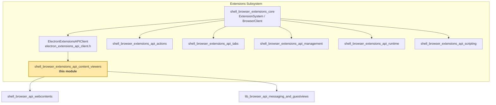
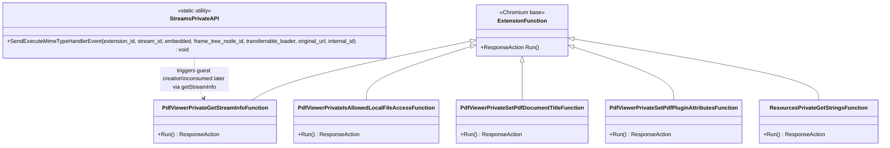
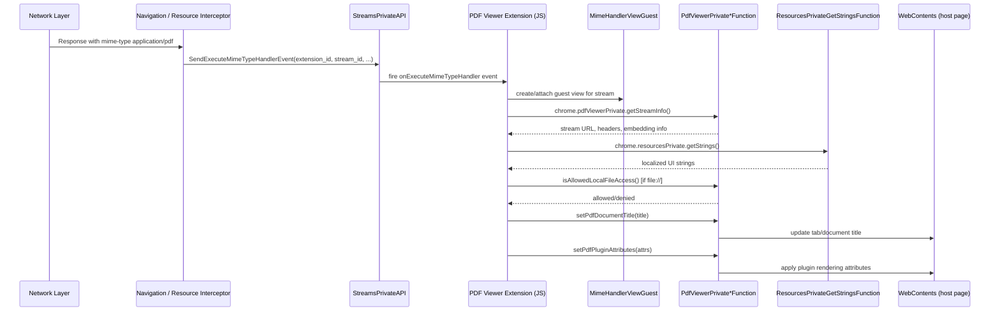
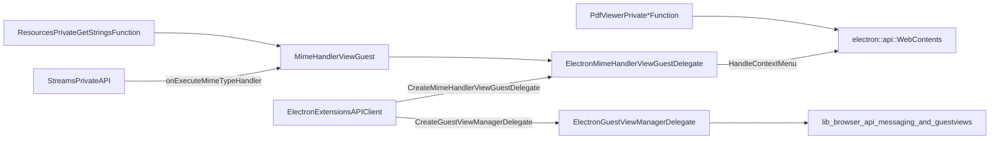
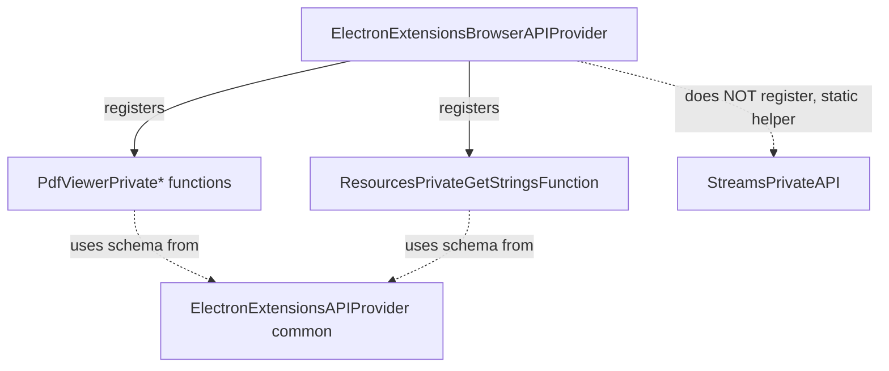

# Content Viewers Extension APIs (`shell_browser_extensions_api_content_viewers`)

## Introduction

The **Content Viewers** module implements the browser-process side of three private Chromium extension APIs that power Electron's built-in "MimeHandlerView"-based content viewers — most notably the **PDF viewer**. These APIs are internal (`*Private`) extension functions that are not exposed to third-party extensions; they exist purely to support Chromium/Electron's bundled component extensions that render specific MIME types (PDF, and other stream-based resources) inside a guest view hosted in a web page.

This module provides:

- **`pdfViewerPrivate`** — API functions used by the PDF viewer extension to fetch stream metadata, query local-file-access permissions, and set document title/plugin attributes on the hosting `WebContents`.
- **`resourcesPrivate`** — API function that lets privileged extensions (like the PDF viewer) pull localized strings from Chromium's grit resource bundles.
- **`streamsPrivate`** — Legacy-named API (now used only for `MimeHandlerView`) that fires the `onExecuteMimeTypeHandler` event to hand off a network stream to the extension responsible for rendering it.

Together these three files form the plumbing that connects a raw network response stream (e.g., a `.pdf` download) to the JavaScript-based viewer extension that renders it inside the Electron app.

---

## Position in the System

This module is a leaf node under the broader **Extensions Subsystem**, sitting alongside sibling API implementations such as `shell_browser_extensions_api_actions` (browser/page actions), `shell_browser_extensions_api_tabs` (tabs API), `shell_browser_extensions_api_management`, `shell_browser_extensions_api_runtime`, and `shell_browser_extensions_api_scripting`. See [Extensions_Subsystem](Extensions_Subsystem.md) for the full extension-API family and [shell_browser_extensions_core](shell_browser_extensions_core.md) for the runtime infrastructure (extension system, loader, browser client) that registers and dispatches these functions.

---

## Core Components

| Component | File | Responsibility |
|---|---|---|
| `PdfViewerPrivateGetStreamInfoFunction` | `pdf_viewer_private_api.h` | Returns metadata about the network stream backing a PDF (URL, response headers, embedding context) to the PDF viewer extension. |
| `PdfViewerPrivateIsAllowedLocalFileAccessFunction` | `pdf_viewer_private_api.h` | Checks whether the extension/frame is permitted to access `file://` PDFs, based on extension manifest permissions and app policy. |
| `PdfViewerPrivateSetPdfDocumentTitleFunction` | `pdf_viewer_private_api.h` | Propagates the PDF's internal document title to the hosting `WebContents`/tab title. |
| `PdfViewerPrivateSetPdfPluginAttributesFunction` | `pdf_viewer_private_api.h` | Sets background color, print-readiness, and other plugin-level rendering attributes used by the PDF viewer's embedder page. |
| `ResourcesPrivateGetStringsFunction` | `resources_private_api.h` | Returns a dictionary of localized UI strings (grit resources) requested by name, used by the PDF viewer's UI (toolbar labels, etc.). |
| `StreamsPrivateAPI` | `streams_private_api.h` | Static utility that fires `onExecuteMimeTypeHandler`, the extension event that kicks off `MimeHandlerViewGuest` creation and streams the resource body into the viewer extension. |

All four `PdfViewerPrivate*` classes and `ResourcesPrivateGetStringsFunction` derive from Chromium's `extensions::ExtensionFunction` base class and follow the standard `DECLARE_EXTENSION_FUNCTION` + `Run()` override pattern used throughout the [Extensions_Subsystem](Extensions_Subsystem.md) (compare with [shell_browser_extensions_api_tabs](shell_browser_extensions_api_tabs.md) and [shell_browser_extensions_api_actions](shell_browser_extensions_api_actions.md)).

---

## Component Relationships

- The `Pdf*` and `ResourcesPrivate*` classes are **request/response** style extension functions: JS calls `chrome.pdfViewerPrivate.getStreamInfo()` (etc.) from within the sandboxed PDF viewer extension, which is routed by the extensions dispatch machinery to these `Run()` implementations.
- `StreamsPrivateAPI` is different in shape: it is not an `ExtensionFunction` but a **static event-dispatch helper** invoked from the browser's stream/navigation-interception code path (typically from the `MimeHandlerView`/navigation-throttle machinery) to *push* a stream to the extension, which then triggers `MimeHandlerViewGuest` creation and, subsequently, JS-side calls into `PdfViewerPrivateGetStreamInfoFunction` to retrieve stream details.

---

## Data / Control Flow: PDF Viewing Pipeline

**Flow summary:**
1. A network response identified as PDF (or another registered MIME type) is intercepted by Chromium's stream/navigation-interception logic.
2. `StreamsPrivateAPI::SendExecuteMimeTypeHandlerEvent` notifies the responsible extension and hands over the `TransferrableURLLoaderPtr` for the resource body.
3. The extension (running its own JS context) creates a `MimeHandlerViewGuest` to host the viewer UI, then calls into the `pdfViewerPrivate` functions to pull stream metadata, verify permissions, and push metadata (title, plugin attributes) back to the host `WebContents`.
4. `resourcesPrivate.getStrings` supplies localized strings needed to render the viewer's UI chrome (toolbar, error messages, etc.).

---

## Integration with Guest Views and Extensions Infrastructure

The `ElectronExtensionsAPIClient` (declared in [shell_browser_extensions_core](shell_browser_extensions_core.md)) wires up the `ElectronMimeHandlerViewGuestDelegate`, which handles context menus for the guest content and forwards them to the outer `electron::api::WebContents` (see [shell_browser_api_webcontents](shell_browser_api_webcontents.md)). This delegate is the browser-side counterpart that receives the guest view created as a result of `StreamsPrivateAPI`'s event dispatch.

The actual **guest view instance tracking** (creation, attach/detach to embedder) is handled by the JS-side `GuestInstance`/`guest-view-manager` described in [lib_browser_api_messaging_and_guestviews](lib_browser_api_messaging_and_guestviews.md).

---

## Extension Function Registration

Like other private extension APIs in this codebase, these functions are registered with the extension function registry via generated glue code keyed by the string names passed to `DECLARE_EXTENSION_FUNCTION` (e.g., `"pdfViewerPrivate.getStreamInfo"`). This registration mechanism, along with the API provider that lists these functions for inclusion in the browser process, is defined outside this module in:

- [shell_browser_extensions_core](shell_browser_extensions_core.md) — `ElectronExtensionsBrowserAPIProvider` registers the set of generated function specs, including those defined here.
- [Extensions_(Common)](Extensions_(Common).md) — `ElectronExtensionsAPIProvider` (common/shared) supplies API schemas consumed by both browser and renderer.

Note: `StreamsPrivateAPI` is **not** an `ExtensionFunction` and is not registered through the function registry — it is called directly from C++ browser code (navigation/stream interception paths), unlike the `Pdf*`/`ResourcesPrivate*` classes which are invoked from extension JavaScript.

---

## Key Design Notes

- **Security boundary**: `PdfViewerPrivateIsAllowedLocalFileAccessFunction` is the gatekeeper controlling whether a bundled viewer extension can read `file://` PDFs — an important sandboxing boundary since local file access from extension-hosted content carries higher risk.
- **Decoupled event vs. request/response**: `StreamsPrivateAPI` uses a push-style event (`onExecuteMimeTypeHandler`) to *initiate* the viewer, while the `pdfViewerPrivate` functions use a pull-style request/response model for the viewer to *query* stream/document details afterward. This two-phase design mirrors the general Chromium `MimeHandlerView` architecture and is shared with upstream Chromium's own PDF extension implementation.
- **Minimal footprint**: All classes in this module are thin C++ shims; the actual PDF rendering, layout, and toolbar logic lives entirely in the bundled JavaScript/HTML PDF viewer extension, not in this C++ module. This module's sole job is to bridge browser-process capabilities (title-setting, file permission checks, localized strings, stream metadata) into that JS extension via the standard extension messaging bridge.

## Related Modules

- [Extensions_Subsystem](Extensions_Subsystem.md) — parent module and sibling extension API implementations.
- [shell_browser_extensions_core](shell_browser_extensions_core.md) — extension system, loader, browser client, and API provider registration.
- [shell_browser_api_webcontents](shell_browser_api_webcontents.md) — `WebContents` implementation that hosts/embeds the PDF viewer guest and receives title/attribute updates.
- [lib_browser_api_messaging_and_guestviews](lib_browser_api_messaging_and_guestviews.md) — guest view instance management underlying `MimeHandlerViewGuest`.
- [Extensions_(Common)](Extensions_(Common).md) — shared extension client/API schema infrastructure.
