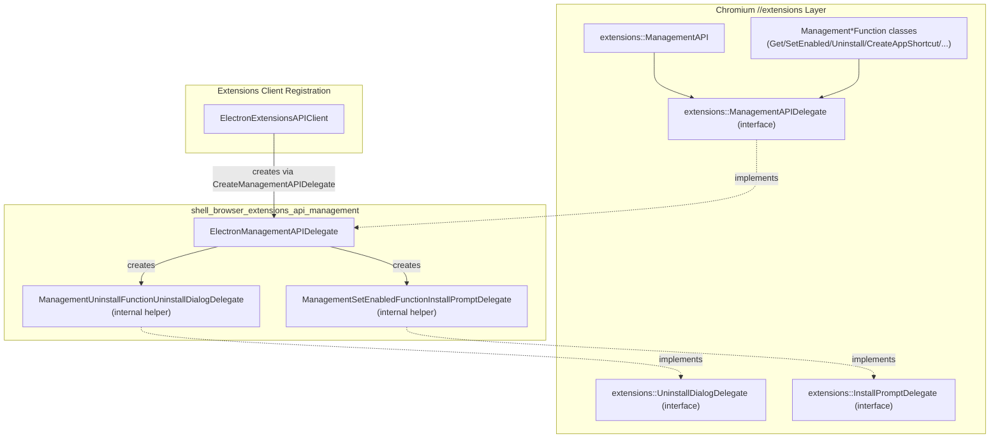
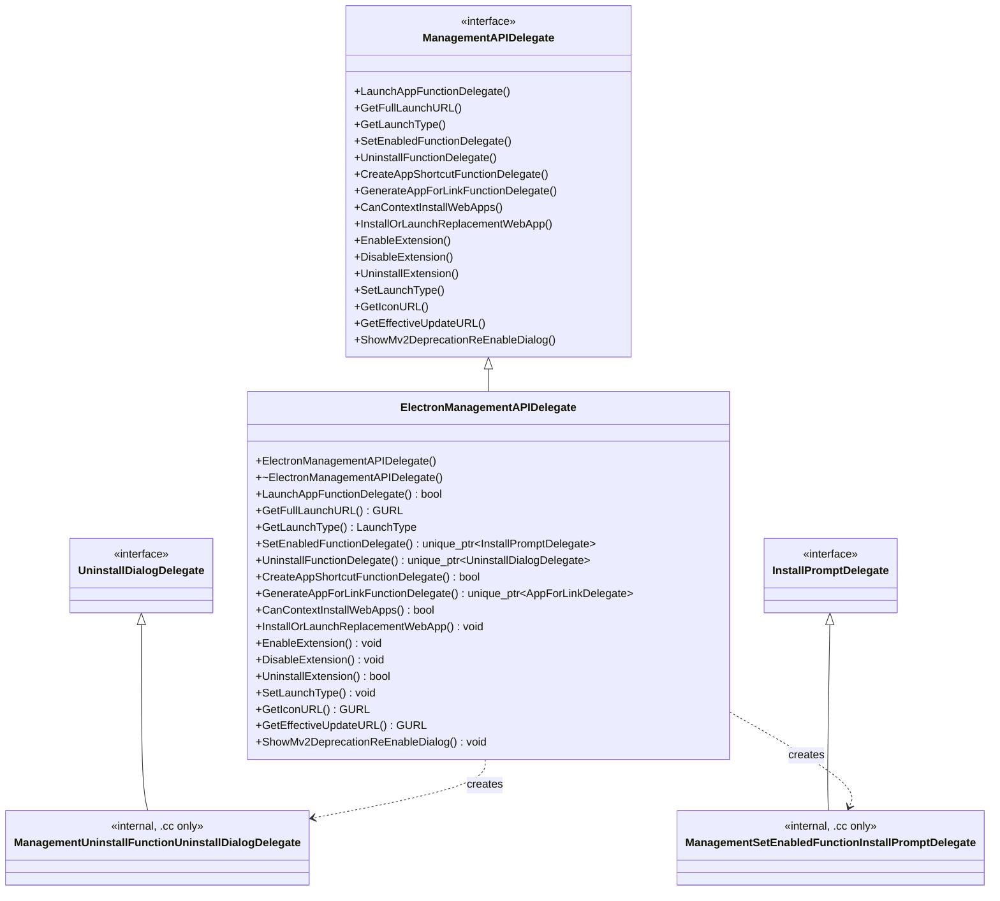
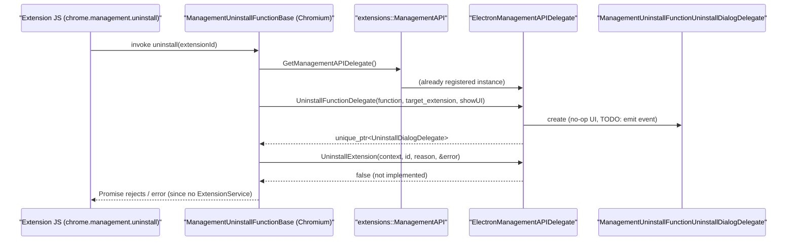
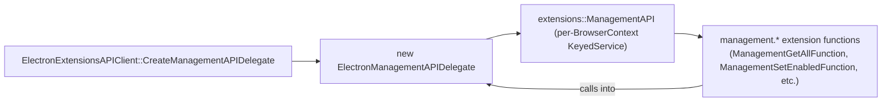

# Extensions API: Management Delegate (`shell_browser_extensions_api_management`)

## Introduction

This module implements Electron's integration point for the Chromium **`chrome.management`** extension API. Chromium's extensions layer defines the `chrome.management` JavaScript API (used by extensions to query, enable/disable, launch, and uninstall other extensions) as an abstract contract (`extensions::ManagementAPIDelegate`) that each embedder must implement to supply platform/product-specific behavior.

`ElectronManagementAPIDelegate` is Electron's concrete implementation of that contract. It is a thin, mostly-stubbed adapter that satisfies the interface required by the upstream `extensions::ManagementAPI` service so that Electron can compile and run the standard Chromium extensions code without requiring a full Chrome-style profile/extension-service stack. Most methods are intentionally minimal or no-ops (marked with `TODO(sentialx)` in the source) because Electron does not ship a full `ExtensionService`/profile management UI — Electron apps that need this functionality are expected to build their own UX around the underlying extension APIs exposed elsewhere in the [Extensions Subsystem](shell_browser_extensions_core.md).

This document describes the delegate's responsibilities, its relationship to the broader extensions subsystem, and the request/response flows it participates in.

---

## Purpose & Scope

| Aspect | Description |
|---|---|
| **Primary class** | `ElectronManagementAPIDelegate` |
| **Base class** | `extensions::ManagementAPIDelegate` (Chromium `//extensions` layer) |
| **Helper class** | `ManagementUninstallFunctionUninstallDialogDelegate` (internal, `.cc`-local implementation of `extensions::UninstallDialogDelegate`) |
| **Consumed by** | `extensions::ManagementAPI` and the various `management.*` extension function implementations (`ManagementGetFunction`, `ManagementUninstallFunction`, `ManagementSetEnabledFunction`, etc.) inside Chromium's `//extensions` code |
| **Registered via** | `ElectronExtensionsAPIClient` (see [Extensions Subsystem](shell_browser_extensions_core.md)) |

The delegate does **not** implement the `chrome.management` API surface itself — that is done by Chromium's built-in `ManagementAPI`/`ManagementFunction` classes. Instead, it supplies the embedder-specific hooks those classes call into for things that differ between a full Chrome browser and Electron (e.g., "does this browser context support installing web apps?", "how do I resolve an icon URL?", "how do I uninstall an extension for this embedder?").

---

## Architecture

### Component Relationship

### Class Structure

---

## Core Components

### `ElectronManagementAPIDelegate`

Defined in `shell/browser/extensions/api/management/electron_management_api_delegate.h` / `.cc`.

Implements `extensions::ManagementAPIDelegate`, the interface Chromium's `chrome.management` API functions rely on for embedder-specific behavior. Responsibilities are grouped as follows:

| Category | Methods | Electron Behavior |
|---|---|---|
| **App launch** | `LaunchAppFunctionDelegate`, `GetFullLaunchURL`, `GetLaunchType`, `SetLaunchType` | Records launch metrics and returns the app's launch URL via `extensions::AppLaunchInfo`. Launch type defaults to `LAUNCH_TYPE_DEFAULT`; `SetLaunchType` is a no-op stub. |
| **Enable / Disable / Uninstall** | `EnableExtension`, `DisableExtension`, `UninstallExtension`, `SetEnabledFunctionDelegate`, `UninstallFunctionDelegate` | All are stubs or partially implemented — Electron does **not** have a Chrome-style `ExtensionService`, so these mostly return default/failure values or leave TODOs for future event-based hooks into Electron's own `Session`/`Extensions` API (see [Extensions Subsystem](shell_browser_extensions_core.md) and [System & App-Level Services API](shell_browser_api_system_device.md)). |
| **App shortcuts / web app installation** | `CreateAppShortcutFunctionDelegate`, `GenerateAppForLinkFunctionDelegate`, `CanContextInstallWebApps`, `InstallOrLaunchReplacementWebApp` | Not supported; return `false`/`nullptr`/no-op, since Electron does not implement Chrome's web-app installation subsystem. |
| **Icon resolution** | `GetIconURL` | Fully implemented — builds a `chrome-extension-icon://<extension_id>/<size>/<match>` style URL using `chrome::kChromeUIExtensionIconURL`, validated with `CHECK(icon_url.is_valid())`. |
| **Update URL** | `GetEffectiveUpdateURL` | Returns an empty `GURL` — Electron does not implement `ExtensionManagement` policy-based update URL overrides. |
| **MV2 deprecation UI** | `ShowMv2DeprecationReEnableDialog` | No-op — Electron does not show Chrome's Manifest V2 deprecation re-enable dialog. |

Because most methods return conservative defaults (`false`, `nullptr`, empty `GURL`), the delegate effectively **disables** management-API side effects that would normally require a full browser profile / extension service, while still allowing the extension code paths to compile and execute without crashing.

### `ManagementUninstallFunctionUninstallDialogDelegate` (internal)

An anonymous-namespace class defined only in the `.cc` file, implementing `extensions::UninstallDialogDelegate`. Returned by `UninstallFunctionDelegate()`. It currently performs no UI action (a `TODO(sentialx): emit event` marks the intended future hook for signaling uninstall-confirmation events back into JS-land, e.g., through Electron's `Session`/`Extensions` API).

### `ManagementSetEnabledFunctionInstallPromptDelegate` (internal)

Similarly, an anonymous-namespace class implementing `extensions::InstallPromptDelegate`, returned by `SetEnabledFunctionDelegate()`. It is also a stub pending future event-emission support.

---

## Data & Control Flow

### Typical call flow: `chrome.management.uninstall()`

### Delegate registration flow

---

## Relationship to Other Modules

- **[Extensions Subsystem (Core)](shell_browser_extensions_core.md)** — Owns `ElectronExtensionsAPIClient`, which is responsible for constructing and returning the `ElectronManagementAPIDelegate` instance to Chromium's extensions layer (via the `CreateManagementAPIDelegate()` factory method on the API client). Also owns `ElectronExtensionSystem`, `ElectronExtensionLoader`, and the browser client that wires the whole extensions stack together.
- **[Extensions Subsystem: Actions API](shell_browser_extensions_api_actions.md)** — Sibling module implementing `chrome.action`/`chrome.browserAction`/`chrome.pageAction`; shares the same parent "Extensions Subsystem" grouping and is registered through the same `ElectronExtensionsAPIClient`.
- **[Extensions Subsystem: Runtime API](shell_browser_extensions_api_runtime.md)** — Sibling delegate module (`ElectronRuntimeAPIDelegate`) implementing `chrome.runtime` embedder hooks, following the same delegate pattern as this module.
- **[Extensions Subsystem: Scripting API](shell_browser_extensions_api_scripting.md)** and **[Tabs API](shell_browser_extensions_api_tabs.md)** — Other sibling API implementations under the same Extensions API parent grouping.
- **[Extensions (Common)](Extensions_(Common).md)** — Provides `ElectronExtensionsClient` and `ElectronExtensionsAPIProvider`, which register the schema/permissions for the `management` API surface that this delegate ultimately backs.
- **[System & App-Level Services API](shell_browser_api_system_device.md)** — Houses `electron_api_extensions.h` (`Extensions` class), Electron's own higher-level JS-facing `Extensions` object exposed on `Session`, which is the primary way Electron apps are expected to manage extensions programmatically, complementing (and largely superseding) the standard `chrome.management` surface that this delegate partially supports.
- **[Browser Context & Session Management](shell_browser_context.md)** — `content::BrowserContext`/`ElectronBrowserContext` instances are passed into nearly every delegate method as the scoping context for extension operations.

---

## Design Notes

1. **Compliance over completeness.** The delegate exists primarily to satisfy Chromium's `ManagementAPIDelegate` pure-virtual interface so the `//extensions` code compiles and can be linked into Electron. Many methods are deliberately unimplemented stubs (returning `false`/`nullptr`/empty values), reflecting the fact that Electron does not ship Chrome's full extension-management UI/profile stack.
2. **Extension points for future work.** Comments such as `// TODO(sentialx): emit relevant events in Electron's session?` throughout the `.cc` file indicate the intended long-term direction: routing these hooks through Electron's `Session`/`Extensions` JS API (see `electron_api_extensions.h`) so that app developers can observe/react to install, enable, disable, and uninstall events themselves.
3. **One fully-functional method.** `GetIconURL` is the only method with complete, production-quality logic — it constructs a valid `chrome-extension-icon:` URL used to render extension icons in UI surfaces (e.g., extension icon requests routed through Electron's URL loader factories described in [Networking Layer](shell_browser_net.md)).
4. **No persistent extension enable/disable state.** Because `EnableExtension`/`DisableExtension`/`UninstallExtension` are stubs, callers relying on `chrome.management` to fully manage extension lifecycle should instead use Electron's native `Session.extensions` API.
