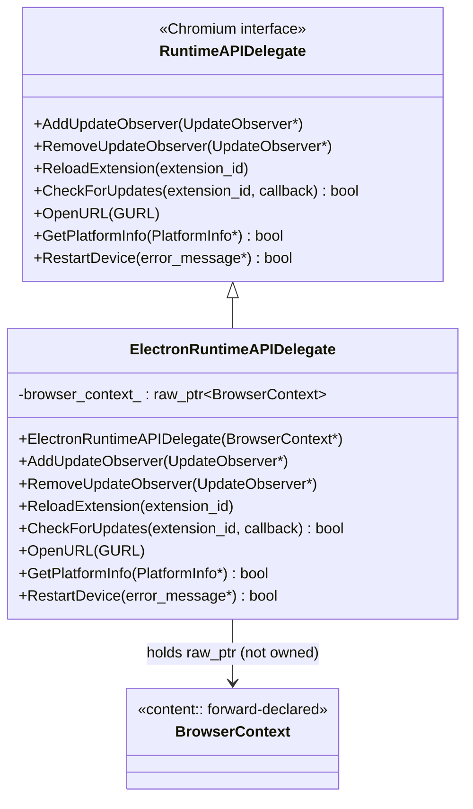
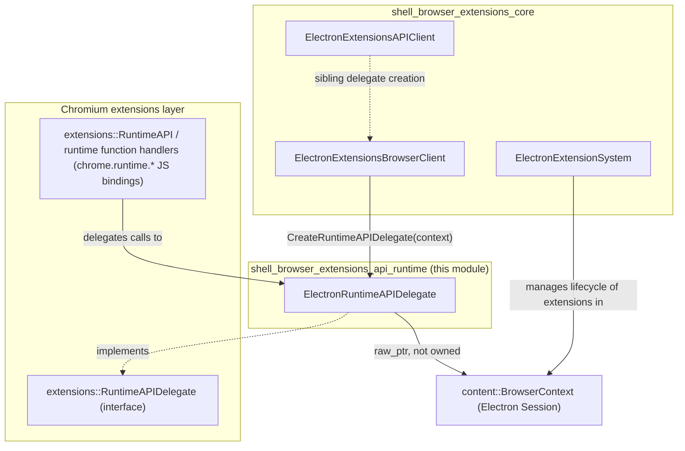
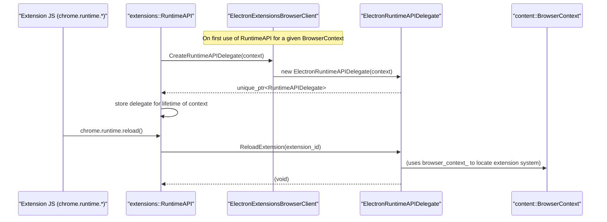
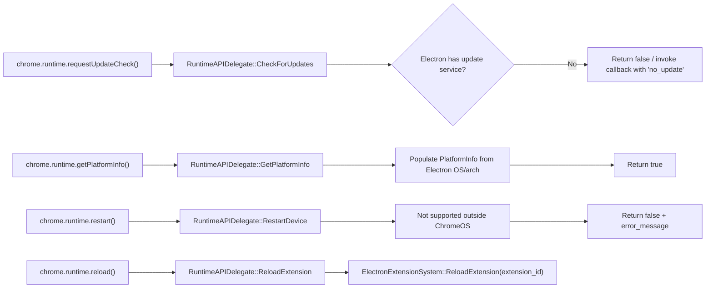
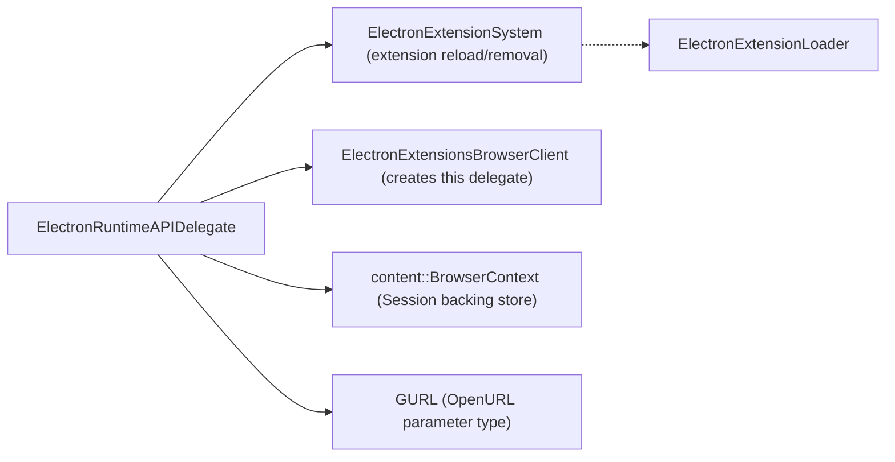

# Shell Browser Extensions API — Runtime Delegate

## Introduction

The **shell_browser_extensions_api_runtime** module provides Electron's implementation of the Chromium `chrome.runtime` extension API's native backing logic. It contains a single, focused component — `ElectronRuntimeAPIDelegate` — which plugs Electron's browser-process behavior into the `extensions::RuntimeAPIDelegate` interface defined by the upstream `//extensions` component library.

This delegate is the bridge that lets extension JavaScript code call `chrome.runtime.*` methods (such as `reload()`, `requestUpdateCheck()`, `getPlatformInfo()`, and `restart()`) and have those calls handled correctly within Electron's app model, since Electron does not have a full Chrome browser (multi-profile, updater service, OS-level restart, etc.) backing these calls.

Because Electron only implements a subset of the full browser feature surface, most of `ElectronRuntimeAPIDelegate`'s methods are minimal or no-op implementations that adapt Chromium's expectations to Electron's simpler, single-process-per-app model.

## Purpose & Core Functionality

The `chrome.runtime` API in Chromium extensions expects specific browser behaviors:

| Runtime API surface | Chromium expectation | Electron delegate behavior |
|---|---|---|
| `chrome.runtime.reload()` | Reload the extension in-place | Delegates to Electron's extension system to unload/reload |
| `chrome.runtime.requestUpdateCheck()` | Query an extension update service | Electron has no built-in extension auto-update service; typically reports "no update" |
| `chrome.runtime.getPlatformInfo()` | Return OS/arch info | Populated from Electron's own platform detection |
| `chrome.runtime.restart()` | Restart ChromeOS device | Not applicable outside ChromeOS — usually returns failure/error |
| Uninstall URL / update observers | Register/notify on background update state | Minimal support, since Electron does not use Omaha/Chrome Update infrastructure |

`ElectronRuntimeAPIDelegate` is constructed per `content::BrowserContext` (i.e., per `Session` in Electron's API surface) and is handed out by `ElectronExtensionsBrowserClient::CreateRuntimeAPIDelegate()` (see [shell_browser_extensions_core](shell_browser_extensions_core.md)) whenever the extensions system needs runtime API support for that context.

## Architecture

### Component Structure

### Position within the Extensions Subsystem

`ElectronRuntimeAPIDelegate` is one of several per-API delegate classes that together implement Electron's extension support, alongside sibling delegates for actions, management, scripting, tabs, and content viewers (PDF/streams). See the sibling documentation for related delegates:

- [shell_browser_extensions_api_actions](shell_browser_extensions_api_actions.md) — `chrome.action` / `chrome.browserAction` / `chrome.pageAction`
- [shell_browser_extensions_api_management](shell_browser_extensions_api_management.md) — `chrome.management`
- [shell_browser_extensions_api_scripting](shell_browser_extensions_api_scripting.md) — `chrome.scripting`
- [shell_browser_extensions_api_tabs](shell_browser_extensions_api_tabs.md) — `chrome.tabs`
- [shell_browser_extensions_api_content_viewers](shell_browser_extensions_api_content_viewers.md) — PDF viewer / streams / resources private APIs

All of these, including this module, are created and wired together by the core extensions infrastructure documented in [shell_browser_extensions_core](shell_browser_extensions_core.md), specifically by `ElectronExtensionsBrowserClient` and `ElectronExtensionSystem`.

## Data & Call Flow

### Delegate Creation Flow

### Method Call Behavior

## Key Component: `ElectronRuntimeAPIDelegate`

**File:** `shell/browser/extensions/api/runtime/electron_runtime_api_delegate.h`

### Responsibilities

- Implements the `extensions::RuntimeAPIDelegate` interface required by Chromium's `RuntimeAPI` KeyedService.
- Holds a non-owning (`raw_ptr`) reference to the owning `content::BrowserContext` (Electron `Session`'s underlying context — see [shell_browser_context](shell_browser_context.md)).
- Provides Electron-specific behavior (or safe no-ops) for:
  - `AddUpdateObserver` / `RemoveUpdateObserver` — observer registration for extension update events.
  - `ReloadExtension` — triggers an extension reload through the extension system.
  - `CheckForUpdates` — reports update availability (Electron does not integrate with Omaha/Chrome Update).
  - `OpenURL` — used for extension uninstall survey URLs; opens via Electron's shell/browser URL handling.
  - `GetPlatformInfo` — fills OS/arch metadata expected by `chrome.runtime.getPlatformInfo()`.
  - `RestartDevice` — always effectively unsupported since Electron isn't targeting ChromeOS device restart semantics.

### Lifecycle

- **Construction**: One instance is created per `BrowserContext` by `ElectronExtensionsBrowserClient::CreateRuntimeAPIDelegate()` when the Chromium `RuntimeAPI` KeyedService for that context is first initialized.
- **Ownership**: Owned by the Chromium `RuntimeAPI` KeyedService (via `unique_ptr`), not by Electron code directly — hence the `raw_ptr` (non-owning) reference back to the `BrowserContext`.
- **Destruction**: Torn down automatically when the owning `BrowserContext`/`RuntimeAPI` service shuts down (typically alongside `Session` destruction).

### Design Notes

- The class explicitly disables copy construction/assignment, consistent with Electron/Chromium coding conventions for browser-process singleton-like service objects.
- Because this delegate is a thin adapter, it intentionally contains **no business logic of its own** for extension loading/reloading — that logic lives in `ElectronExtensionSystem` and `ElectronExtensionLoader` (see [shell_browser_extensions_core](shell_browser_extensions_core.md)). The delegate simply forwards/orchestrates calls into those services.

## Dependencies

- **[shell_browser_extensions_core](shell_browser_extensions_core.md)** — Supplies `ElectronExtensionsBrowserClient` (which constructs this delegate) and `ElectronExtensionSystem`/`ElectronExtensionLoader` (which perform the actual extension reload/management work this delegate forwards to).
- **[shell_browser_context](shell_browser_context.md)** — Supplies the `content::BrowserContext` (Electron `Session`) that this delegate is scoped to.
- **[shell_browser_extensions_api](shell_browser_extensions_api.md)** (parent grouping) — Sibling per-API delegates that follow the same integration pattern with the extensions system.
- **Chromium `//extensions` component** — Defines the `RuntimeAPIDelegate` abstract interface and the `RuntimeAPI` KeyedService that consumes this delegate; not part of the Electron codebase but is the contract this module fulfills.

## Summary

This module is intentionally small and single-purpose: it exists purely to satisfy Chromium's `extensions::RuntimeAPIDelegate` contract so that `chrome.runtime` JavaScript calls made by extensions running inside Electron do not crash or silently fail, while deferring all real extension lifecycle work to the broader extensions core infrastructure documented in [shell_browser_extensions_core](shell_browser_extensions_core.md).
