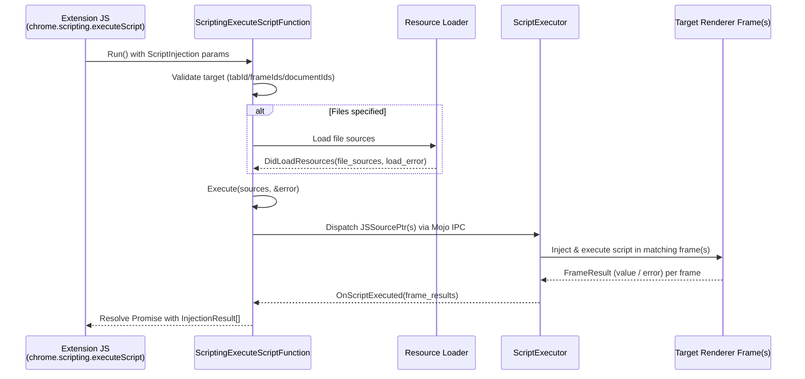
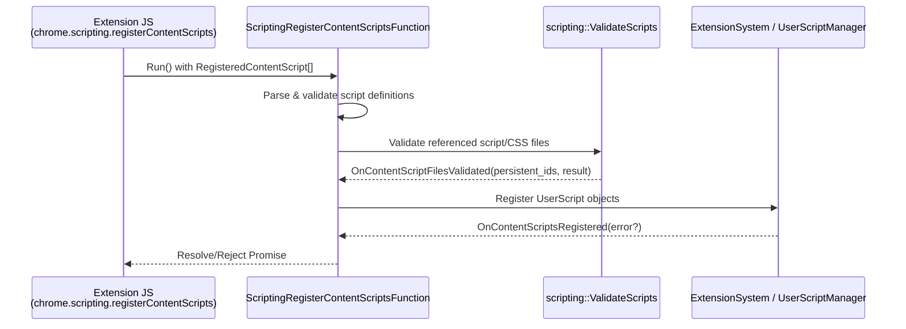
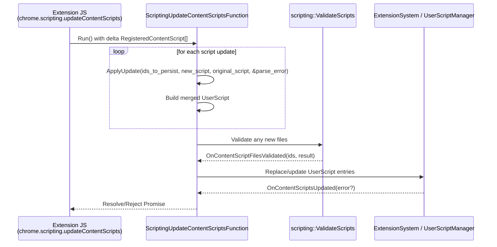
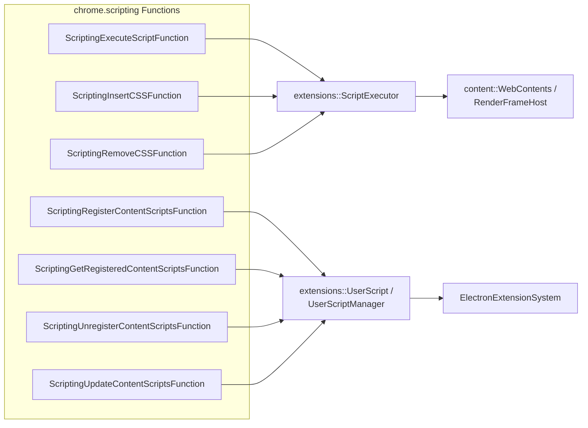

# Extensions API: Scripting (`shell_browser_extensions_api_scripting`)

## Introduction

The **Scripting API** module implements the browser-process side of Chrome's
`chrome.scripting` extension API within Electron. It allows extensions to
programmatically inject JavaScript and CSS into web pages, and to register,
update, query, and unregister *dynamic content scripts* that run
automatically when matching pages are loaded.

This module is a leaf node of the broader
[Extensions Subsystem](shell_browser_extensions_api.md), sitting alongside
sibling API implementations such as
[Actions](shell_browser_extensions_api_actions.md),
[Tabs](shell_browser_extensions_api_tabs.md),
[Management](shell_browser_extensions_api_management.md),
[Runtime](shell_browser_extensions_api_runtime.md), and
[Content Viewers](shell_browser_extensions_api_content_viewers.md). It relies
on core extension infrastructure provided by
[shell_browser_extensions_core](shell_browser_extensions_core.md) and on
common extension definitions from
[Extensions (Common)](Extensions_(Common).md).

All classes in this module are `ExtensionFunction` subclasses — the standard
Chromium extensions mechanism for implementing a JS-callable extension API
method in C++. Each class corresponds 1:1 to a method exposed on the
`chrome.scripting` JavaScript namespace inside an extension's context.

## File Location

```
shell/browser/extensions/api/scripting/scripting_api.h
```

## Purpose & Core Functionality

The module exposes seven `chrome.scripting.*` methods, grouped into two
functional areas:

| Area | API Method | Class |
|---|---|---|
| **Immediate code injection** | `scripting.executeScript` | `ScriptingExecuteScriptFunction` |
| | `scripting.insertCSS` | `ScriptingInsertCSSFunction` |
| | `scripting.removeCSS` | `ScriptingRemoveCSSFunction` |
| **Dynamic content script registration** | `scripting.registerContentScripts` | `ScriptingRegisterContentScriptsFunction` |
| | `scripting.getRegisteredContentScripts` | `ScriptingGetRegisteredContentScriptsFunction` |
| | `scripting.unregisterContentScripts` | `ScriptingUnregisterContentScriptsFunction` |
| | `scripting.updateContentScripts` | `ScriptingUpdateContentScriptsFunction` |

### 1. Immediate Code Injection

- **`ScriptingExecuteScriptFunction`** — Injects and executes one or more
  JavaScript sources (inline strings or extension-relative files) into
  matching frames of a target tab/document, returning per-frame results
  (including return values and any errors) to the calling extension.
- **`ScriptingInsertCSSFunction`** — Injects CSS (inline or from files) into
  matching frames.
- **`ScriptingRemoveCSSFunction`** — Removes previously injected CSS from
  matching frames.

These three classes follow a common pattern:
1. Parse/validate the injection parameters from the API call (`injection_`
   member holds the parsed `ScriptInjection`/`CSSInjection` struct for
   execute/insertCSS).
2. Asynchronously load any referenced resource files
   (`DidLoadResources`).
3. Build Mojo IPC source structs (`mojom::JSSourcePtr` /
   `mojom::CSSSourcePtr`) and dispatch them via `ScriptExecutor` to the
   target renderer frame(s) (`Execute`).
4. Handle the asynchronous completion callback
   (`OnScriptExecuted` / `OnCSSInserted` / `OnCSSRemoved`), converting
   `ScriptExecutor::FrameResult` data into the extension-visible response.

### 2. Dynamic Content Script Registration

- **`ScriptingRegisterContentScriptsFunction`** — Registers one or more new
  dynamic content scripts (with match patterns, run-time, world, etc.) that
  will be automatically injected by the extension system on future
  navigations. Validates script files first
  (`OnContentScriptFilesValidated`) before persisting/registering
  (`OnContentScriptsRegistered`).
- **`ScriptingGetRegisteredContentScriptsFunction`** — Returns the list of
  currently registered dynamic content scripts for the calling extension
  (optionally filtered).
- **`ScriptingUnregisterContentScriptsFunction`** — Removes previously
  registered dynamic content scripts by ID (or all of them), completing via
  `OnContentScriptsUnregistered`.
- **`ScriptingUpdateContentScriptsFunction`** — Updates existing dynamic
  content scripts in place. Uses `ApplyUpdate` to merge a delta
  (`RegisteredContentScript`) onto the existing script definition, producing
  an updated `UserScript`, then validates any new files
  (`OnContentScriptFilesValidated`) before finalizing
  (`OnContentScriptsUpdated`).

All four registration-related classes ultimately manipulate script metadata
that is persisted through the extension system's script/user-script storage
(managed by the broader extensions core, see
[shell_browser_extensions_core](shell_browser_extensions_core.md)) and
propagated to renderers so that `UserScript` matching/injection occurs
automatically on qualifying page loads.

## Architecture

### Class Diagram

```mermaid
classDiagram
    class ExtensionFunction {
        <<Chromium base class>>
        +Run() ResponseAction
    }

    class ScriptingExecuteScriptFunction {
        -ScriptInjection injection_
        +Run() ResponseAction
        -DidLoadResources(file_sources, load_error)
        -Execute(sources, error) bool
        -OnScriptExecuted(frame_results)
    }

    class ScriptingInsertCSSFunction {
        -CSSInjection injection_
        +Run() ResponseAction
        -DidLoadResources(file_sources, load_error)
        -Execute(sources, error) bool
        -OnCSSInserted(results)
    }

    class ScriptingRemoveCSSFunction {
        +Run() ResponseAction
        -OnCSSRemoved(results)
    }

    class ScriptingRegisterContentScriptsFunction {
        +Run() ResponseAction
        -OnContentScriptFilesValidated(ids, result)
        -OnContentScriptsRegistered(error)
    }

    class ScriptingGetRegisteredContentScriptsFunction {
        +Run() ResponseAction
    }

    class ScriptingUnregisterContentScriptsFunction {
        +Run() ResponseAction
        -OnContentScriptsUnregistered(error)
    }

    class ScriptingUpdateContentScriptsFunction {
        +Run() ResponseAction
        -ApplyUpdate(ids, new_script, original_script, parse_error) UserScript
        -OnContentScriptFilesValidated(ids, result)
        -OnContentScriptsUpdated(error)
    }

    ExtensionFunction <|-- ScriptingExecuteScriptFunction
    ExtensionFunction <|-- ScriptingInsertCSSFunction
    ExtensionFunction <|-- ScriptingRemoveCSSFunction
    ExtensionFunction <|-- ScriptingRegisterContentScriptsFunction
    ExtensionFunction <|-- ScriptingGetRegisteredContentScriptsFunction
    ExtensionFunction <|-- ScriptingUnregisterContentScriptsFunction
    ExtensionFunction <|-- ScriptingUpdateContentScriptsFunction
```



### Module Position in the Extensions Subsystem

```mermaid
graph TD
    subgraph Extensions_Subsystem["Extensions Subsystem"]
        API["shell_browser_extensions_api\n(Parent: chrome.* API dispatch)"]
        CORE["shell_browser_extensions_core\n(ExtensionSystem, Loader, BrowserClient)"]
        COMMON["Extensions (Common)\n(ExtensionsClient, Permissions)"]

        API --> SCRIPTING["shell_browser_extensions_api_scripting\n(this module)"]
        API --> ACTIONS["shell_browser_extensions_api_actions"]
        API --> TABS["shell_browser_extensions_api_tabs"]
        API --> MGMT["shell_browser_extensions_api_management"]
        API --> RUNTIME["shell_browser_extensions_api_runtime"]
        API --> VIEWERS["shell_browser_extensions_api_content_viewers"]
    end

    SCRIPTING -. uses .-> CORE
    SCRIPTING -. uses .-> COMMON
    SCRIPTING -. targets .-> WEBCONTENTS["shell_browser_api_webcontents\n(WebContents / RenderFrameHost)"]
    SCRIPTING -. uses .-> GIN["Common_Native_Gin_Infrastructure\n(ScriptExecutor / gin_helper)"]

    click CORE "shell_browser_extensions_core.md"
    click COMMON "Extensions_(Common).md"
    click ACTIONS "shell_browser_extensions_api_actions.md"
    click TABS "shell_browser_extensions_api_tabs.md"
    click MGMT "shell_browser_extensions_api_management.md"
    click RUNTIME "shell_browser_extensions_api_runtime.md"
    click VIEWERS "shell_browser_extensions_api_content_viewers.md"
    click WEBCONTENTS "shell_browser_api_webcontents.md"
```



## Data Flow

### `executeScript` / `insertCSS` Injection Flow



`ScriptingInsertCSSFunction` follows the same pattern using
`CSSInjection`/`mojom::CSSSourcePtr` and completes in `OnCSSInserted`.
`ScriptingRemoveCSSFunction` skips the load/execute steps (no new sources to
inject) and directly asks `ScriptExecutor` to remove previously-inserted
stylesheets, completing in `OnCSSRemoved`.

### Dynamic Content Script Registration Flow





`ScriptingGetRegisteredContentScriptsFunction` and
`ScriptingUnregisterContentScriptsFunction` interact with the same
`Sys`/`UserScriptManager` store synchronously/asynchronously to read or
remove entries, respectively (the latter completing via
`OnContentScriptsUnregistered`).

## Component Interaction



## Key Design Notes

- **Asynchronous, Mojo-based execution.** Script/CSS injection is not
  performed synchronously in the browser process; it is dispatched over
  Mojo to the target renderer frame(s) via `extensions::ScriptExecutor`, and
  results are collected asynchronously per frame
  (`ScriptExecutor::FrameResult`).
- **Two distinct sub-APIs, shared infrastructure.** "Immediate" injection
  (`executeScript`/`insertCSS`/`removeCSS`) is stateless per-call, whereas
  the "dynamic content scripts" group (`register`/`get`/`unregister`/`update`)
  manages persistent `UserScript` state that survives across extension
  reloads and is consulted automatically by the navigation/script-injection
  pipeline for future page loads — not just for the current call.
- **File validation before mutation.** Both registration
  (`ScriptingRegisterContentScriptsFunction`) and update
  (`ScriptingUpdateContentScriptsFunction`) validate any referenced script
  files (`scripting::ValidateScriptsResult`) *before* committing changes to
  the registered script set, ensuring atomicity/error-reporting consistency.
- **Delta-based updates.** `ScriptingUpdateContentScriptsFunction::ApplyUpdate`
  merges a partial update object (`RegisteredContentScript`) onto the
  existing script definition to produce a new `UserScript`, rather than
  requiring the full script definition on every update call.
- **Chromium upstream alignment.** These classes mirror the structure and
  naming of Chromium's own `chrome.scripting` implementation
  (`chrome/browser/extensions/api/scripting/scripting_api.*`), adapted to
  Electron's extension hosting model. This keeps behavior consistent with
  Chrome for extension compatibility.

## Related Modules

- [shell_browser_extensions_api](shell_browser_extensions_api.md) — Parent
  grouping for all `chrome.*` extension API implementations in the browser
  process.
- [shell_browser_extensions_core](shell_browser_extensions_core.md) — Hosts
  `ElectronExtensionSystem`, `ElectronExtensionLoader`, and the
  `ElectronExtensionsBrowserClient` that wire up API providers (including
  this module) and manage extension lifecycle/storage.
- [Extensions (Common)](Extensions_(Common).md) — Shared extension
  client/permission definitions used to validate API access
  (`ElectronExtensionsClient`, permission message providers).
- [shell_browser_extensions_api_tabs](shell_browser_extensions_api_tabs.md) —
  Implements `chrome.tabs`, including the legacy
  `tabs.executeScript`/`ExecuteCodeInTabFunction`, which shares conceptual
  overlap (code injection into tabs) with this module's `executeScript`.
- [shell_browser_extensions_api_actions](shell_browser_extensions_api_actions.md),
  [shell_browser_extensions_api_management](shell_browser_extensions_api_management.md),
  [shell_browser_extensions_api_runtime](shell_browser_extensions_api_runtime.md),
  [shell_browser_extensions_api_content_viewers](shell_browser_extensions_api_content_viewers.md)
  — Sibling `chrome.*` API implementations under the same Extensions API
  group.
- [shell_browser_api_webcontents](shell_browser_api_webcontents.md) — Owns
  the `WebContents`/`RenderFrameHost` objects that are the ultimate targets
  of script/CSS injection dispatched by this module.
- [Common_Native_Gin_Infrastructure](Common_Native_Gin_Infrastructure.md) —
  Provides the underlying gin/V8 and Mojo helper utilities used across
  Electron's native API bindings, including script execution plumbing.
