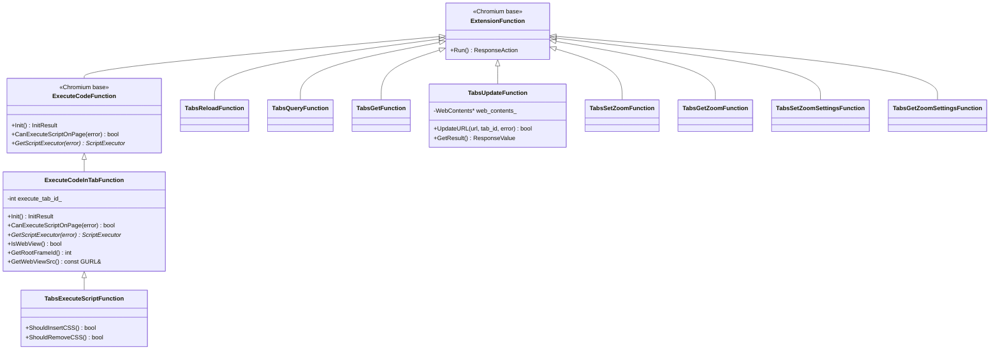
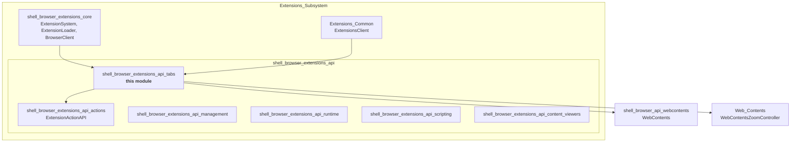
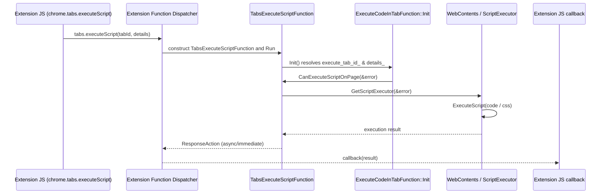
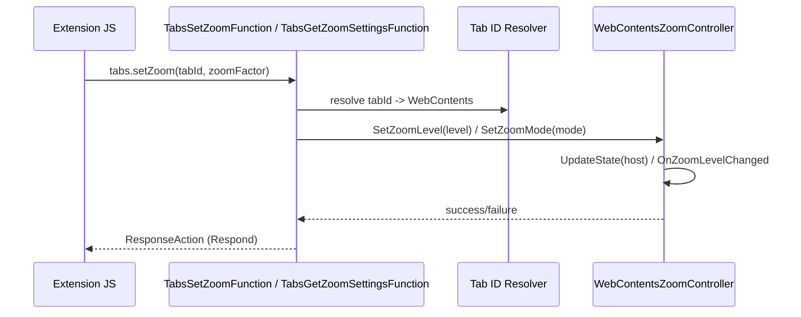
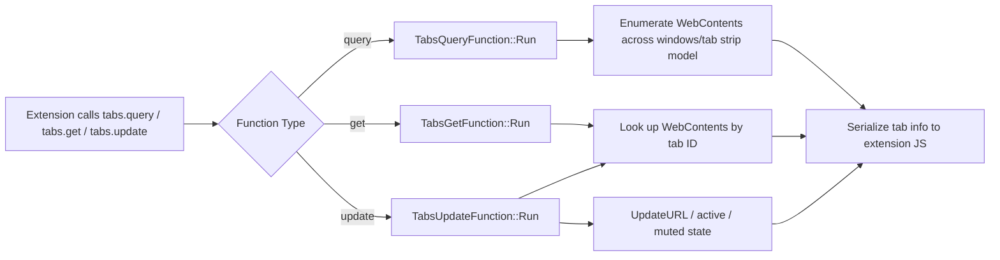
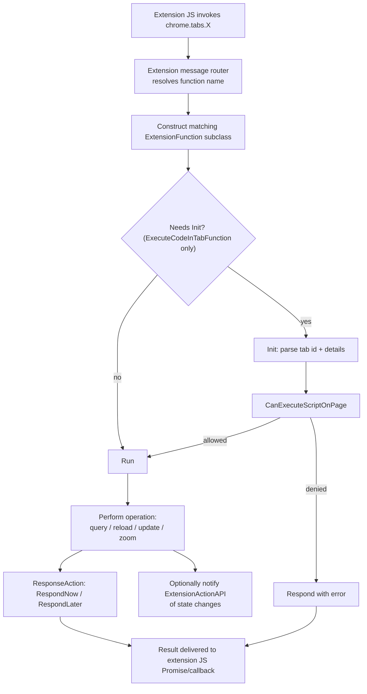

# Tabs Extension API (`shell_browser_extensions_api_tabs`)

## Introduction

The **Tabs Extension API** module implements the browser-process side of the
Chromium `chrome.tabs` extension API surface that Electron exposes to
extensions loaded through its extensions subsystem. It provides the
`ExtensionFunction` implementations that back JavaScript calls such as
`chrome.tabs.query()`, `chrome.tabs.update()`, `chrome.tabs.executeScript()`
and the per-tab zoom control functions (`chrome.tabs.setZoom`,
`chrome.tabs.getZoom`, `chrome.tabs.setZoomSettings`,
`chrome.tabs.getZoomSettings`).

This module is a leaf component inside the larger
[Extensions Subsystem](shell_browser_extensions_api.md). It does not manage
extension lifecycle or permissions itself — it consumes services provided by
sibling modules (extension action state, web contents, zoom control) and
translates extension API calls into concrete Electron browser-process
operations on `content::WebContents`.

---

## Purpose & Core Functionality

All classes in this module derive from Chromium's `extensions::ExtensionFunction`
(or the script-execution specialization `ExecuteCodeFunction`). Each class
corresponds 1:1 to a single `chrome.tabs.*` JS API entry point. When an
extension's background page, content script, or popup calls a `tabs.*`
method, the extensions message-dispatch machinery (outside this module,
in the core extensions runtime) resolves the call name (e.g.
`"tabs.query"`) to the matching `ExtensionFunction` subclass, constructs it,
and invokes `Run()`.

| Class | JS API | Responsibility |
|---|---|---|
| `ExecuteCodeInTabFunction` | (base class) | Shared logic for resolving the target tab/frame and script executor used by script/CSS injection functions. |
| `TabsExecuteScriptFunction` | `tabs.executeScript` / `tabs.insertCSS` | Injects JavaScript or CSS into a tab's page context via the `ScriptExecutor`. |
| `TabsReloadFunction` | `tabs.reload` | Reloads the target tab's `WebContents`. |
| `TabsQueryFunction` | `tabs.query` | Returns tabs matching filter criteria (URL, window, active state, etc.). |
| `TabsGetFunction` | `tabs.get` | Returns a single tab's info by tab ID. |
| `TabsUpdateFunction` | `tabs.update` | Updates a tab's URL, active state, or muted state. |
| `TabsSetZoomFunction` | `tabs.setZoom` | Sets the zoom level for a tab via `WebContentsZoomController`. |
| `TabsGetZoomFunction` | `tabs.getZoom` | Retrieves the current zoom level for a tab. |
| `TabsSetZoomSettingsFunction` | `tabs.setZoomSettings` | Configures zoom mode (default/isolated/manual/disabled) for a tab. |
| `TabsGetZoomSettingsFunction` | `tabs.getZoomSettings` | Retrieves the current zoom mode/settings for a tab. |

All classes register themselves with the extension function dispatch table
using the `DECLARE_EXTENSION_FUNCTION(name, histogram_value)` macro, which
associates the string name (e.g. `"tabs.reload"`) and a UMA histogram
enum value with the C++ implementation.

---

## Architecture

### Class Relationships

### Module Context within the Extensions Subsystem

This module is one of several sibling API implementations grouped under the
[Extensions API layer](shell_browser_extensions_api.md), which itself sits
inside the [Extensions Subsystem](shell_browser_extensions_core.md)
(component registry, extension loader, browser client).

---

## Dependencies

- **[Web Contents](Web_Contents.md)** — `TabsSetZoomFunction`,
  `TabsGetZoomFunction`, `TabsSetZoomSettingsFunction`, and
  `TabsGetZoomSettingsFunction` operate on a tab's
  `WebContentsZoomController`, which owns the per-tab `ZoomMode` state
  (`ZOOM_MODE_DEFAULT`, `ZOOM_MODE_ISOLATED`, `ZOOM_MODE_MANUAL`,
  `ZOOM_MODE_DISABLED`) and dispatches `ZoomChangedEventData` on changes.
- **[WebContents Rendering & Communication](shell_browser_api_webcontents.md)** —
  `TabsGetFunction`, `TabsQueryFunction`, `TabsReloadFunction`, and
  `TabsUpdateFunction` resolve extension tab IDs to the underlying
  `content::WebContents`/Electron `WebContents` wrapper to read state or
  perform navigation.
  `TabsUpdateFunction::web_contents_` is a raw pointer to the resolved tab.
- **[Extension Actions API](shell_browser_extensions_api_actions.md)** —
  Tab lifecycle changes handled here (navigation, reload) often trigger
  `ExtensionActionAPI::NotifyChange` / `ClearAllValuesForTab` to keep
  browser-action/page-action icon state (badge text, popup, enabled state)
  in sync with the active tab.
- **[Extensions Subsystem Core](shell_browser_extensions_core.md)** —
  Provides the `ExtensionsBrowserClient`, `ExtensionLoader`, and
  `ProcessManagerDelegate` infrastructure that resolves extension contexts,
  hosts, and permissions consulted before running any `tabs.*` function
  (e.g. permission checks in `CanExecuteScriptOnPage`).
- **`ScriptExecutor`** (declared in the WebContents API layer) — used by
  `ExecuteCodeInTabFunction`/`TabsExecuteScriptFunction` to actually run
  injected JS/CSS in the target frame.
- **Chromium `extensions::ExtensionFunction` / `ExecuteCodeFunction`** —
  base classes providing the async response plumbing
  (`ResponseAction`, `ResponseValue`) common to all extension API functions
  across Chromium and Electron.

---

## Data Flow: `tabs.executeScript` Call

## Data Flow: `tabs.setZoom` / `tabs.getZoomSettings`

## Data Flow: `tabs.query` / `tabs.get` / `tabs.update`

---

## Process Flow: Extension Function Lifecycle

---

## Key Design Notes

- **Tab ID resolution**: Every function that targets a specific tab (get,
  update, reload, zoom functions, execute-code functions) must translate an
  extension-visible integer tab ID into the corresponding
  `content::WebContents*`. This module relies on tab-ID-to-WebContents
  lookup utilities provided by the surrounding extensions browser client
  (see [Extensions Subsystem Core](shell_browser_extensions_core.md)),
  since Electron does not have Chromium's full `TabStripModel` — tabs
  typically correspond to `BrowserWindow`/`WebContents` instances managed by
  Electron's own [Window List](Window_List.md) and
  [WebContents API](shell_browser_api_webcontents.md).
- **Script execution security**: `CanExecuteScriptOnPage` enforces the
  extension's host permissions and content-script exclusions before any
  injection occurs, guarding against script injection into disallowed
  origins (e.g. `chrome://` pages).
- **Zoom is per-`WebContents`, not per-extension**: Because
  `WebContentsZoomController` is a `WebContentsUserData`, zoom state set via
  `tabs.setZoom`/`tabs.setZoomSettings` persists on the tab itself and is
  visible to any other API/consumer inspecting that `WebContents`
  (including the general [WebContents](Web_Contents.md) zoom observers).
- **Response model**: All functions return Chromium's asynchronous
  `ResponseAction` (`RespondNow(...)` or `RespondLater()` +
  later `Respond(...)`), matching the promise/callback duality exposed to
  extension JavaScript.

---

## Related Modules

- [Extensions API (parent)](shell_browser_extensions_api.md) — sibling API
  families: actions, management, runtime, scripting, content viewers.
- [Extensions Subsystem Core](shell_browser_extensions_core.md) — extension
  loading, browser client, process manager delegate.
- [Extensions (Common)](Extensions_(Common).md) — `ExtensionsClient`,
  permission message provider shared across processes.
- [Extension Actions API](shell_browser_extensions_api_actions.md) —
  browser/page action & badge state kept in sync with tab changes.
- [Extension Scripting API](shell_browser_extensions_api_scripting.md) —
  the modern `chrome.scripting` counterpart to `tabs.executeScript`.
- [WebContents Rendering & Communication](shell_browser_api_webcontents.md) —
  underlying `WebContents` wrapper and `ScriptExecutor`.
- [Web Contents](Web_Contents.md) — `WebContentsZoomController` and zoom
  event plumbing used by the zoom-related tab functions.
- [Window List](Window_List.md) — enumeration of native windows used when
  resolving tabs across windows for `tabs.query`.
