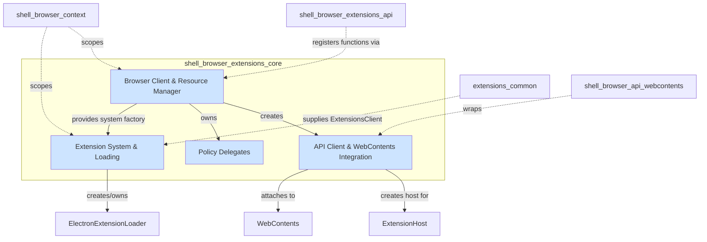
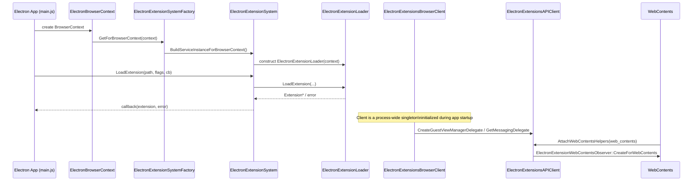

# Shell Browser Extensions Core

## Introduction

`shell_browser_extensions_core` provides the foundational browser-process infrastructure that powers Electron's Chrome extensions support. It wires Electron into Chromium's `extensions` module by supplying Electron-specific implementations of the abstract interfaces the extensions layer expects: an `ExtensionSystem`, an `ExtensionsBrowserClient`, an `ExtensionsAPIClient`, and a handful of narrow delegate classes (kiosk, process manager, messaging, navigation, host, resource manager).

Where the sibling module [shell_browser_extensions_api](shell_browser_extensions_api.md) implements the individual JS-facing extension *API functions* (`chrome.tabs`, `chrome.action`, `chrome.scripting`, etc.), this module implements the *plumbing* that loads extensions, creates the extension system per `BrowserContext`, routes guest views/mime handler views, and supplies the many small policy decisions (kiosk mode, background pages, native messaging, incognito) that Chromium's extensions code requires from an embedder.

It complements [Extensions_(Common)](extensions_common.md), which supplies the process-agnostic `ExtensionsClient` and permission message provider used by both browser and renderer processes, and it depends heavily on [Browser_Context_&_Session_Management](shell_browser_context.md) (each `ElectronExtensionSystem` and `ElectronExtensionsBrowserClient` is scoped to an `ElectronBrowserContext`) and [WebContents_Rendering_&_Communication](shell_browser_api_webcontents.md) (guest views and mime handler views wrap `WebContents`).

## Architecture Overview

The module is organized around four cooperating concerns:

1. **Extension System & Loading** — creates, initializes, and tears down the per-`BrowserContext` extension runtime and loads/reloads/unloads individual extensions from disk.
2. **Browser Client & Resource Manager** — the `ExtensionsBrowserClient` singleton that Chromium's extensions code calls into for almost every cross-cutting browser-level decision (contexts, prefs, resource bundles, cache, kiosk/safe-browsing delegates).
3. **API Client & WebContents Integration** — the `ExtensionsAPIClient` that supplies messaging, management, and guest-view delegates, plus the `WebContentsObserver`/`ExtensionHostDelegate` that attach extension behavior to individual `WebContents`.
4. **Policy Delegates** — small, focused delegate classes (`ProcessManagerDelegate`, `KioskDelegate`, `NavigationUIData`) that answer specific policy questions asked by the extensions system during navigation and background-page lifecycle.

## Sub-modules

| Sub-module | Focus | Documentation |
|---|---|---|
| Extension System & Loading | Per-context extension runtime lifecycle, loading/reloading/unloading extensions from disk | [shell_browser_extensions_core_system.md](shell_browser_extensions_core_system.md) |
| Browser Client & Resource Manager | Central `ExtensionsBrowserClient` implementation, bundled-resource lookup, factory registration | [shell_browser_extensions_core_browser_client.md](shell_browser_extensions_core_browser_client.md) |
| API Client & WebContents Integration | Guest-view/mime-handler delegation, messaging delegate, extension host delegate, per-`WebContents` observer | [shell_browser_extensions_core_api_client.md](shell_browser_extensions_core_api_client.md) |
| Policy Delegates | Process-manager, kiosk, and navigation-UI-data policy hooks | [shell_browser_extensions_core_delegates.md](shell_browser_extensions_core_delegates.md) |

## High-Level Data / Control Flow

## How This Module Fits the System

* **Bootstrap**: [Browser_Process_Core_&_Lifecycle](shell_browser_main_parts.md) instantiates `ElectronExtensionsBrowserClient` (via `shell_browser_main_parts_client_core_bootstrap`) as part of `ElectronBrowserMainParts`/`ElectronBrowserMainParts.h`'s `ElectronExtensionsBrowserClient`/`ElectronExtensionsClient` members, wiring the whole extensions subsystem into the Electron process bootstrap sequence.
* **Session/Context Scoping**: Every `ElectronExtensionSystem` is created for and owned alongside an `ElectronBrowserContext` (see [shell_browser_context](shell_browser_context.md)), matching Chromium's `KeyedService` pattern.
* **JS API surface**: The concrete `chrome.*` extension functions documented in [shell_browser_extensions_api](shell_browser_extensions_api.md) are registered against the browser client via `ElectronExtensionsBrowserAPIProvider::RegisterExtensionFunctions`.
* **Renderer counterpart**: The renderer-side extension client/dispatcher that mirrors this browser-side infrastructure lives in [Renderer_Process_Infrastructure](renderer_process_infrastructure.md) (`Renderer_Extensions` sub-module).
* **WebContents & Guest Views**: Guest view and mime-handler-view delegates created here operate on `electron::api::WebContents` objects documented in [shell_browser_api_webcontents](shell_browser_api_webcontents.md).
* **Common Extensions Client**: The process-agnostic `ElectronExtensionsClient` and permission message provider are documented separately in [Extensions_(Common)](extensions_common.md); this core module consumes that client rather than redefining it.
