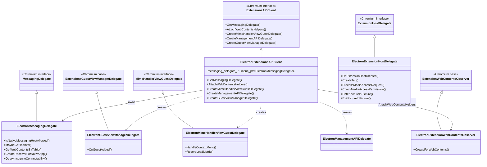
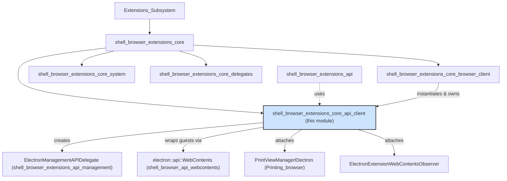
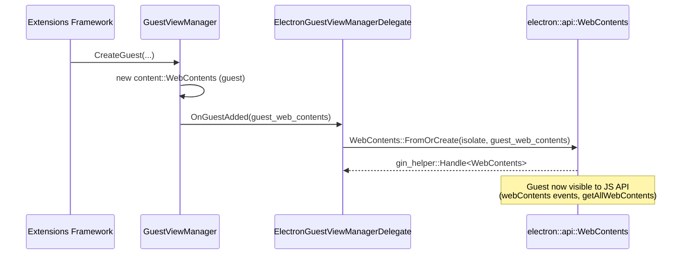
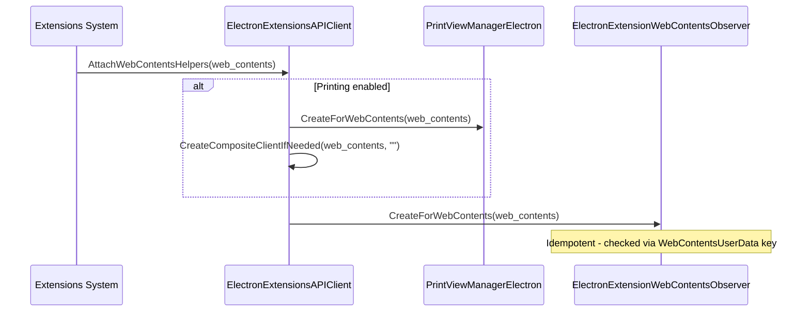
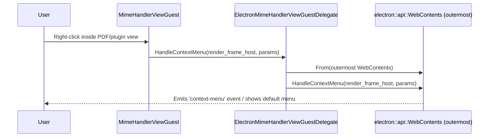

# Browser Extensions Core API Client (`shell_browser_extensions_core_api_client`)

## Introduction

The `shell_browser_extensions_core_api_client` module is the glue layer that connects Chromium's generic `extensions` browser component to Electron-specific behavior. It provides Electron's concrete implementations of several `//extensions` browser abstraction points — most notably `ExtensionsAPIClient` and `MessagingDelegate` — along with supporting delegates that hook extension-related `WebContents`, guest views, and extension host lifecycle events into Electron's own `WebContents` wrapper (`electron::api::WebContents`).

This module is a child of [shell_browser_extensions_core](shell_browser_extensions_core.md), which in turn lives under the broader [Extensions_Subsystem](Extensions_Subsystem.md). It works closely with its sibling modules — [shell_browser_extensions_core_browser_client](shell_browser_extensions_core_browser_client.md) (which owns and instantiates the `ElectronExtensionsAPIClient`), [shell_browser_extensions_core_system](shell_browser_extensions_core_system.md), and [shell_browser_extensions_core_delegates](shell_browser_extensions_core_delegates.md).

## Purpose & Responsibilities

This module exists to answer questions the Chromium extensions layer needs to ask the embedder ("Electron") at runtime:

1. **Messaging**: How should `chrome.runtime.sendMessage`/`connect`/native-messaging calls behave in an Electron app that has no browser tabs or native messaging hosts by default? → `ElectronMessagingDelegate`.
2. **Guest Views**: How should `<webview>`-style guest views and MimeHandlerView (PDF/plugin) guests be created, wired up, and have their context menus handled? → `ElectronGuestViewManagerDelegate`, `ElectronMimeHandlerViewGuestDelegate`.
3. **Extension Management UI**: How should `chrome.management` API calls (install/uninstall/enable/disable, launch apps) be satisfied without a full Chrome browser UI? → delegated to `ElectronManagementAPIDelegate` (see [shell_browser_extensions_api](shell_browser_extensions_api.md)).
4. **WebContents Helper Attachment**: When a `WebContents` is created for extension-related purposes, what Electron-specific helpers (printing, extension observers) need to be attached? → `ElectronExtensionsAPIClient::AttachWebContentsHelpers`.
5. **Extension Host Lifecycle**: How should extension background pages / service workers interact with tabs, media, and picture-in-picture, given Electron has no tab strip? → `ElectronExtensionHostDelegate`.
6. **Per-WebContents Extension State**: How is extension-specific state (e.g. view type, tracked lifetime) attached to a `content::WebContents`? → `ElectronExtensionWebContentsObserver`.

In short, this module is the **API client layer** of Electron's extensions integration — it is the concrete strategy/delegate object that Chromium's abstract `ExtensionsBrowserClient` (see [shell_browser_extensions_core_browser_client](shell_browser_extensions_core_browser_client.md)) hands out when extension code asks "give me your API client."

## Core Components

| Component | File | Role |
|---|---|---|
| `ElectronExtensionsAPIClient` | `electron_extensions_api_client.h/.cc` | Concrete `extensions::ExtensionsAPIClient`. Central factory/dispatcher for messaging, guest view, mime-handler, and management delegates. |
| `ElectronMessagingDelegate` | `electron_messaging_delegate.h` | Concrete `extensions::MessagingDelegate`. Implements `runtime.sendMessage`/`connect`/native messaging policy and tab lookup semantics for Electron. |
| `ElectronGuestViewManagerDelegate` (in `.cc`) | `electron_extensions_api_client.cc` | Concrete `ExtensionsGuestViewManagerDelegate`. Ensures every new guest `WebContents` gets wrapped in an `electron::api::WebContents`. |
| `ElectronMimeHandlerViewGuestDelegate` (in `.cc`) | `electron_extensions_api_client.cc` | Concrete `MimeHandlerViewGuestDelegate`. Routes context-menu requests from MimeHandlerView guests (e.g., the PDF viewer) back through Electron's `WebContents::HandleContextMenu`. |
| `ElectronExtensionHostDelegate` | `electron_extension_host_delegate.h` | Concrete `extensions::ExtensionHostDelegate`. Minimal no-tab-strip implementation for extension background/host `WebContents` (tab creation, media access, picture-in-picture). |
| `ElectronExtensionWebContentsObserver` | `electron_extension_web_contents_observer.h` | Concrete `extensions::ExtensionWebContentsObserver` + `WebContentsUserData`. Attaches per-`WebContents` extension observer state; created via `CreateForWebContents`. |

## Architecture

### Class Relationships

### Module Position

## Component Details

### `ElectronExtensionsAPIClient`

The central entry point. `ElectronExtensionsBrowserClient::CreateExtensionHostDelegate()` and related factory calls in [shell_browser_extensions_core_browser_client](shell_browser_extensions_core_browser_client.md) rely on an instance of `ExtensionsAPIClient` (typically this class) being registered globally with `extensions::ExtensionsBrowserClient::Get()->api_client_`.

Responsibilities:
- **`GetMessagingDelegate()`** — lazily constructs and returns the singleton `ElectronMessagingDelegate` owned by this client.
- **`AttachWebContentsHelpers(web_contents)`** — called whenever extension machinery creates a `content::WebContents` (e.g., background pages, extension popups, guest views). It:
  - Creates a `PrintViewManagerElectron` and a print compositor client if printing is enabled (see [Printing_browser](Printing_browser.md)).
  - Creates an `ElectronExtensionWebContentsObserver` for the WebContents.
- **`CreateManagementAPIDelegate()`** — returns a new `ElectronManagementAPIDelegate` (see [shell_browser_extensions_api_management](shell_browser_extensions_api_management.md)) used by the `chrome.management` extension API.
- **`CreateMimeHandlerViewGuestDelegate(guest)`** — returns an `ElectronMimeHandlerViewGuestDelegate` for MimeHandlerView guests (used by PDF viewer/plugin content).
- **`CreateGuestViewManagerDelegate()`** — returns an `ElectronGuestViewManagerDelegate`, used by the generic `<webview>`/guest view infrastructure.

### `ElectronMessagingDelegate`

Implements Chromium's `MessagingDelegate` interface, which underlies `chrome.runtime.sendMessage`, `chrome.runtime.connect`, and native messaging:

- `IsNativeMessagingHostAllowed` — governs native messaging host policy.
- `MaybeGetTabInfo` / `GetWebContentsByTabId` — since Electron has no browser tab model by default, these provide Electron's notion of "tab" info (typically mapped onto `WebContents` IDs used by the [shell_browser_extensions_api_tabs](shell_browser_extensions_api_tabs.md) module).
- `CreateReceiverForNativeApp` — creates a `MessagePort` bridging an extension to a native application process.
- `QueryIncognitoConnectability` — governs whether a message from an incognito context may reach a given extension.

### `ElectronGuestViewManagerDelegate` / `ElectronMimeHandlerViewGuestDelegate`

Defined in the `.cc` file (internal, non-exported classes used only by `ElectronExtensionsAPIClient`):

- `ElectronGuestViewManagerDelegate::OnGuestAdded` ensures every guest `content::WebContents` created by the guest view framework (e.g., `<webview>` tags, PDF viewer frames) is wrapped with `electron::api::WebContents::FromOrCreate`, making it visible/accessible to the JS-facing [shell_browser_api_webcontents](shell_browser_api_webcontents.md) API surface (`WebContents.getAllWebContents()`, `webContents` events, etc.).
- `ElectronMimeHandlerViewGuestDelegate::HandleContextMenu` forwards context menu requests from a MimeHandlerView (e.g. right-click inside the built-in PDF viewer) to the outermost `electron::api::WebContents::HandleContextMenu`, so Electron's `context-menu` event and default menu logic apply consistently even inside embedded plugin content.

### `ElectronExtensionHostDelegate`

A minimal `ExtensionHostDelegate` implementation for the `ExtensionHost` that backs extension background pages / service worker–adjacent contexts. Since Electron has no tabbed browser UI:

- `CreateTab` is effectively a no-op/stub (no tab strip to insert into).
- `ProcessMediaAccessRequest` / `CheckMediaAccessPermission` delegate media permission decisions consistent with Electron's permission model (see [shell_browser_context](shell_browser_context.md) → `ElectronPermissionManager`).
- `EnterPictureInPicture` / `ExitPictureInPicture` are stubbed since extension hosts are not user-facing windows.

### `ElectronExtensionWebContentsObserver`

A `WebContentsUserData`-based observer attached to every extension-related `WebContents` via `AttachWebContentsHelpers`. It provides the base `ExtensionWebContentsObserver` functionality (tracking extension ID, view type, and other per-WebContents extension bookkeeping) needed by the rest of the extensions stack (e.g., the [shell_browser_extensions_api_actions](shell_browser_extensions_api_actions.md) and [shell_browser_extensions_core_system](shell_browser_extensions_core_system.md) modules, which query `WebContents` for their owning extension).

## Data & Control Flow

### Guest WebContents Creation Flow

### WebContents Helper Attachment Flow

### MimeHandlerView Context Menu Flow

## Integration Points

- **Registration**: `ElectronExtensionsBrowserClient` (see [shell_browser_extensions_core_browser_client](shell_browser_extensions_core_browser_client.md)) holds the `api_client_` member of type `extensions::ExtensionsAPIClient` and can be overridden for tests via `SetAPIClientForTest`. In production it is set to an `ElectronExtensionsAPIClient` instance.
- **Extension System**: The `ElectronExtensionSystem`/`ElectronExtensionLoader` (see [shell_browser_extensions_core_system](shell_browser_extensions_core_system.md)) rely on the API client indirectly through the `ExtensionsBrowserClient` singleton when loading extensions and creating their background/host contexts.
- **JS-Facing WebContents API**: Guest view and mime-handler delegates bridge directly into [shell_browser_api_webcontents](shell_browser_api_webcontents.md)'s `electron::api::WebContents`, which is the class exposed to JavaScript as `webContents`/`BrowserWindow.webContents`.
- **Management API**: `CreateManagementAPIDelegate()` supplies the delegate consumed by [shell_browser_extensions_api](shell_browser_extensions_api.md) `chrome.management.*` functions, specifically implemented in [shell_browser_extensions_api_management](shell_browser_extensions_api_management.md) (`ElectronManagementAPIDelegate`).
- **Printing**: When `ENABLE_PRINTING` is compiled in, `AttachWebContentsHelpers` wires up `PrintViewManagerElectron` from [Printing_browser](Printing_browser.md), enabling `webContents.print()`/PDF generation for extension-hosted content.
- **Delegates Peer Module**: Works alongside [shell_browser_extensions_core_delegates](shell_browser_extensions_core_delegates.md) (`ElectronProcessManagerDelegate`, `ElectronKioskDelegate`, `ElectronNavigationUIData`), which cover process-management and navigation concerns not handled by this module.

## Design Notes

- All classes in this module follow Electron's convention of deleting copy constructors/assignment operators on delegate-style classes to avoid accidental duplication of stateful browser objects.
- `ElectronGuestViewManagerDelegate` and `ElectronMimeHandlerViewGuestDelegate` are intentionally **not exposed in the header** — they are implementation details of `ElectronExtensionsAPIClient` and are only reachable through its factory methods (`CreateGuestViewManagerDelegate`, `CreateMimeHandlerViewGuestDelegate`).
- `ElectronMessagingDelegate` is lazily instantiated (`GetMessagingDelegate()`) and owned for the lifetime of the `ElectronExtensionsAPIClient`, avoiding startup cost when messaging isn't used.
- The module intentionally keeps each delegate minimal and stub-like where Chromium's browser-oriented semantics (tab strips, incognito profiles) don't map cleanly onto Electron's window/BrowserWindow model — deferring actual behavior to Electron's own `Browser`, `BaseWindow`, and `WebContents` abstractions instead.
