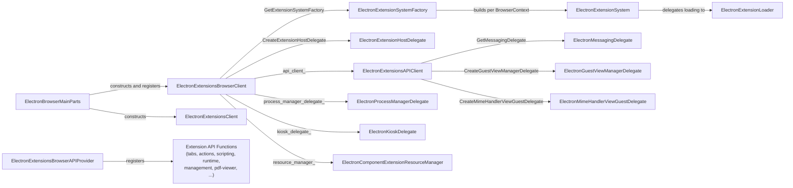
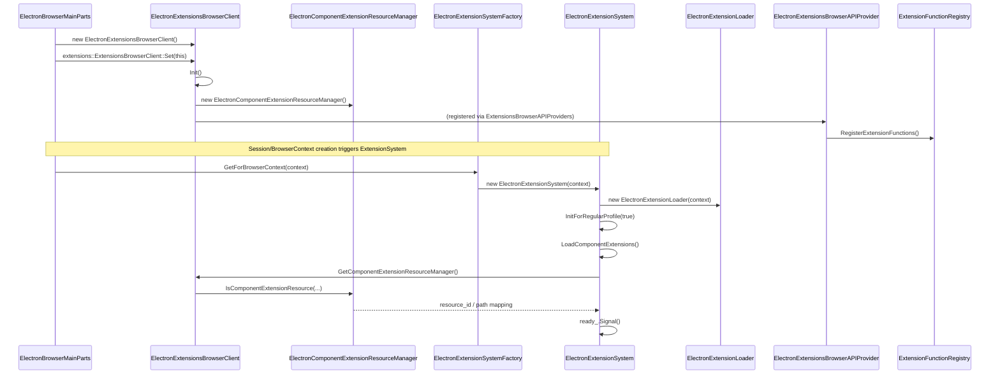
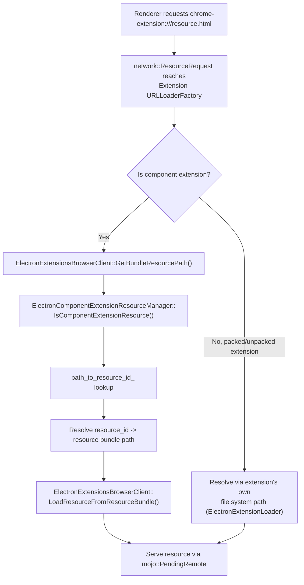

# Extensions Browser Client (`shell_browser_extensions_core_browser_client`)

## Introduction

This module implements the Chromium `extensions::ExtensionsBrowserClient` embedder interface for Electron. It is the single, central "glue" object that the Chromium `//extensions` module library uses to query embedder-specific (Electron-specific) behavior — things such as how to resolve extension resources, whether extensions are running in kiosk/managed mode, how to create per-extension host delegates, and how to wire up API function registration.

The module is composed of three tightly coupled header files:

| Component | Responsibility |
|---|---|
| `ElectronExtensionsBrowserClient` | Concrete implementation of `extensions::ExtensionsBrowserClient`. The primary entry point Chromium's extensions system uses to interact with the embedder (Electron). |
| `ElectronExtensionsBrowserAPIProvider` | Registers the set of extension API functions (`chrome.*` bindings) implemented by Electron with the global `ExtensionFunctionRegistry`. |
| `ElectronComponentExtensionResourceManager` | Resolves "component extension" resources (built-in extensions shipped with Electron, such as the PDF viewer) from GRIT resource maps to file paths/resource IDs. |

Together these classes make it possible for Electron to host Chromium's extensions system with a single, non-incognito `BrowserContext`, without needing all the multi-profile/incognito machinery that a full Chrome browser requires.

This module sits within the larger [Extensions_Subsystem](Extensions_Subsystem.md) area of the codebase and is a direct sibling to [shell_browser_extensions_core_system](shell_browser_extensions_core_system.md) (extension loading/service management), [shell_browser_extensions_core_api_client](shell_browser_extensions_core_api_client.md) (API client & messaging/guest-view delegates), and [shell_browser_extensions_core_delegates](shell_browser_extensions_core_delegates.md) (process manager & kiosk delegates).

---

## Purpose & Core Functionality

### `ElectronExtensionsBrowserClient`

This class is instantiated once (typically owned by [`ElectronBrowserMainParts`](shell_browser_main_parts_client_core_bootstrap.md)) and passed to `extensions::ExtensionsBrowserClient::Set()` during browser startup. Chromium's extensions layer calls back into this object throughout the lifetime of the process to answer questions it cannot answer on its own because the answer is embedder-specific.

Key responsibilities:

- **Context Identity & Lifetime** — `IsValidContext`, `IsSameContext`, `GetOriginalContext`, `GetContextOwnInstance`, etc. Since Electron typically supports a single non-incognito `BrowserContext` per `Session`, most of these are simplified compared to Chrome's multi-profile implementation. `HasOffTheRecordContext`/`GetOffTheRecordContext` handle Electron's persistent vs. in-memory (incognito-like) sessions.
- **Resource Loading** — `GetBundleResourcePath` and `LoadResourceFromResourceBundle` resolve requests for extension resources bundled into the Electron binary (delegating to `ElectronComponentExtensionResourceManager` for component extensions).
- **Cross-Renderer Resource Access Control** — `AllowCrossRendererResourceLoad` enforces web-accessible-resource policy for extension resource requests.
- **Delegate Factories** — Creates/owns embedder-specific delegate objects:
  - `ElectronProcessManagerDelegate` (see [shell_browser_extensions_core_delegates](shell_browser_extensions_core_delegates.md))
  - `ElectronKioskDelegate` (see [shell_browser_extensions_core_delegates](shell_browser_extensions_core_delegates.md))
  - `ElectronComponentExtensionResourceManager` (this module)
  - `extensions::SafeBrowsingDelegate`
  - `CreateExtensionHostDelegate()` → `ElectronExtensionHostDelegate` (see [shell_browser_extensions_core_api_client](shell_browser_extensions_core_api_client.md))
  - `CreateRuntimeAPIDelegate()` → `ElectronRuntimeAPIDelegate` (see [shell_browser_extensions_api](shell_browser_extensions_api.md))
- **Extension System Wiring** — `GetExtensionSystemFactory()` returns the factory for [`ElectronExtensionSystem`](shell_browser_extensions_core_system.md), which is the `KeyedService` that actually loads/manages extensions per `BrowserContext`.
- **Kiosk / Managed-Mode Queries** — `IsRunningInForcedAppMode`, `IsAppModeForcedForApp`, `IsInDemoMode`, `IsScreensaverInDemoMode`, `IsLoggedInAsPublicAccount` — mostly stubbed/simplified since Electron does not implement ChromeOS-style managed kiosk sessions, but required to satisfy the interface contract.
- **Mojo/Renderer Interface Binding** — `RegisterBrowserInterfaceBindersForFrame` wires up any Mojo interfaces extensions expose to renderer frames.
- **Event Broadcasting** — `BroadcastEventToRenderers` dispatches extension events (e.g., `chrome.runtime.onMessage`) to all renderer processes hosting extension contexts.

### `ElectronExtensionsBrowserAPIProvider`

A minimal `extensions::ExtensionsBrowserAPIProvider` implementation whose sole job is `RegisterExtensionFunctions()` — it registers the browser-process `ExtensionFunction` implementations found in [shell_browser_extensions_api](shell_browser_extensions_api.md) (actions, tabs, scripting, management, runtime, pdf-viewer/streams/resources-private, etc.) into the global `ExtensionFunctionRegistry` so that `chrome.*` JS calls from extension contexts can be dispatched to native C++ handlers.

### `ElectronComponentExtensionResourceManager`

Electron ships a handful of built-in ("component") extensions — most notably the Chromium PDF viewer. This class:

- Builds a `path_to_resource_id_` map at construction time from GRIT resource maps (`GritResourceMap` / `webui::ResourcePath` entries) via `AddComponentResourceEntries()`.
- Implements `IsComponentExtensionResource()` to answer "does this (extension_path, resource_path) pair correspond to a bundled component-extension resource, and if so what is its resource ID?" — used by `ElectronExtensionsBrowserClient::GetBundleResourcePath`.
- Implements `GetTemplateReplacementsForExtension()` to supply i18n string replacements (`$i18n{...}`) for component extension HTML templates.

---

## Architecture

```mermaid
graph TB
    subgraph "shell_browser_extensions_core_browser_client"
        EBC["ElectronExtensionsBrowserClient"]
        APIProvider["ElectronExtensionsBrowserAPIProvider"]
        ResMgr["ElectronComponentExtensionResourceManager"]
    end

    subgraph "Chromium extensions:: framework"
        XBC["extensions::ExtensionsBrowserClient (base)"]
        XAPIProvider["extensions::ExtensionsBrowserAPIProvider (base)"]
        XResMgr["extensions::ComponentExtensionResourceManager (base)"]
        FuncRegistry["ExtensionFunctionRegistry"]
    end

    EBC -->|extends| XBC
    APIProvider -->|extends| XAPIProvider
    ResMgr -->|extends| XResMgr
    APIProvider -->|registers functions into| FuncRegistry

    EBC -->|owns| ProcMgrDelegate["ElectronProcessManagerDelegate"]
    EBC -->|owns| KioskDelegate["ElectronKioskDelegate"]
    EBC -->|owns| ResMgr
    EBC -->|owns| SafeBrowsingDelegate["extensions::SafeBrowsingDelegate"]
    EBC -->|owns| APIClient["ElectronExtensionsAPIClient"]
    EBC -->|creates| HostDelegate["ElectronExtensionHostDelegate"]
    EBC -->|creates| RuntimeDelegate["ElectronRuntimeAPIDelegate"]
    EBC -->|factory for| ExtSystem["ElectronExtensionSystem"]

    click ProcMgrDelegate "shell_browser_extensions_core_delegates.md"
    click KioskDelegate "shell_browser_extensions_core_delegates.md"
    click APIClient "shell_browser_extensions_core_api_client.md"
    click HostDelegate "shell_browser_extensions_core_api_client.md"
    click RuntimeDelegate "shell_browser_extensions_api.md"
    click ExtSystem "shell_browser_extensions_core_system.md"
```

---

## Component Relationships within the Extensions Subsystem

---

## Initialization / Bootstrap Flow

`ElectronExtensionsBrowserClient` is created and installed as a global singleton very early during browser startup, as part of [`ElectronBrowserMainParts`](shell_browser_main_parts_client_core_bootstrap.md) pre/main initialization (alongside `ElectronExtensionsClient`, see [Extensions_Common](Extensions_Common.md)). The sequence below shows how the pieces come together the first time an extension is loaded.

---

## Data Flow: Resolving an Extension Resource Request

---

## Key Interfaces & Extension Points

- **`ElectronExtensionsBrowserClient::SetAPIClientForTest`** allows tests to substitute a custom `ExtensionsAPIClient`.
- **`GetExtensionSystemFactory()`** is the seam connecting this module to [shell_browser_extensions_core_system](shell_browser_extensions_core_system.md); any embedder that wants a different extension-loading strategy would override this.
- **`GetProcessManagerDelegate()` / `GetKioskDelegate()` / `GetSafeBrowsingDelegate()`** are lazily-constructed, owned `unique_ptr` members — created on first access and cached for the lifetime of the browser client.
- **Cross-module dependency on `BrowserContext`**: Many methods take/return `content::BrowserContext*`; Electron's concrete browser context implementation lives in [shell_browser_context](shell_browser_context.md) (`ElectronBrowserContext`).
- **Cross-module dependency on `WebContents`**: `CreateExtensionWebContentsObserver` / `GetExtensionWebContentsObserver` connect to `ElectronExtensionWebContentsObserver`, part of [shell_browser_extensions_core_api_client](shell_browser_extensions_core_api_client.md).

---

## Relationship to Sibling Modules

| Related Module | Relationship |
|---|---|
| [shell_browser_extensions_core_system](shell_browser_extensions_core_system.md) | `ElectronExtensionsBrowserClient::GetExtensionSystemFactory()` returns the factory that produces `ElectronExtensionSystem`, the actual extension-loading/service layer. |
| [shell_browser_extensions_core_api_client](shell_browser_extensions_core_api_client.md) | `ElectronExtensionsBrowserClient` owns/creates `ElectronExtensionsAPIClient`, `ElectronExtensionHostDelegate`, and interacts with `ElectronExtensionWebContentsObserver`. |
| [shell_browser_extensions_core_delegates](shell_browser_extensions_core_delegates.md) | Provides `ElectronProcessManagerDelegate` and `ElectronKioskDelegate`, both owned by `ElectronExtensionsBrowserClient`. |
| [shell_browser_extensions_api](shell_browser_extensions_api.md) | `ElectronExtensionsBrowserAPIProvider` registers all `ExtensionFunction` implementations (tabs, actions, scripting, management, runtime, pdf/streams/resources-private) defined here. |
| [Extensions_Common](Extensions_Common.md) | `ElectronExtensionsClient` (the `extensions::ExtensionsClient` embedder implementation) is a sibling singleton set up alongside `ElectronExtensionsBrowserClient` during startup; it governs extension manifest parsing/permissions rather than browser-process behavior. |
| [shell_browser_context](shell_browser_context.md) | `ElectronBrowserContext` is the concrete `content::BrowserContext` this client's methods operate against. |
| [shell_browser_main_parts_client_core_bootstrap](shell_browser_main_parts_client_core_bootstrap.md) | `ElectronBrowserMainParts` is responsible for constructing and registering `ElectronExtensionsBrowserClient` as the global extensions browser client during startup. |

---

## Class Reference Summary

### `ElectronExtensionsBrowserClient`
- Inherits: `extensions::ExtensionsBrowserClient`
- Non-copyable
- Owns: `api_client_`, `process_manager_delegate_`, `extension_cache_`, `kiosk_delegate_`, `safe_browsing_delegate_`, `resource_manager_`
- Notable overrides: context identity/redirection methods, resource loading, cross-renderer resource-load authorization, delegate factories, kiosk/demo-mode queries, Mojo interface binder registration.

### `ElectronExtensionsBrowserAPIProvider`
- Inherits: `extensions::ExtensionsBrowserAPIProvider`
- Non-copyable
- Single method of note: `RegisterExtensionFunctions(ExtensionFunctionRegistry*)`

### `ElectronComponentExtensionResourceManager`
- Inherits: `extensions::ComponentExtensionResourceManager`
- Non-copyable
- Internal state: `path_to_resource_id_` (FilePath → resource ID), `extension_template_replacements_` (extension ID → i18n template replacements)
- Notable methods: `IsComponentExtensionResource()`, `GetTemplateReplacementsForExtension()`, `AddComponentResourceEntries()`
