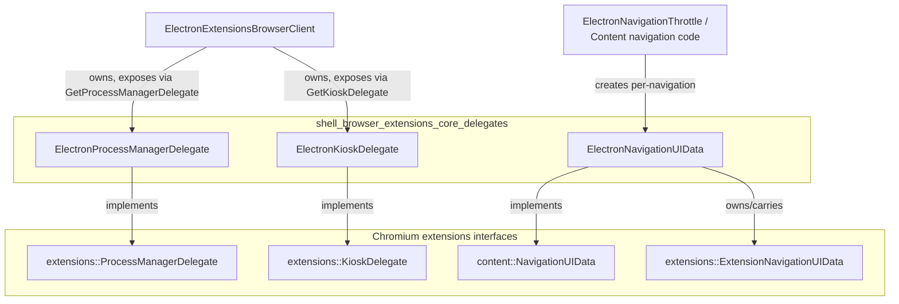
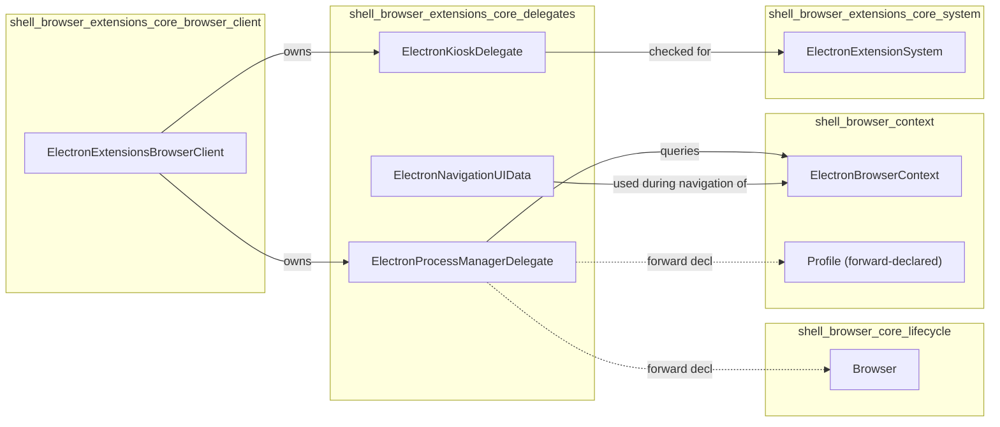
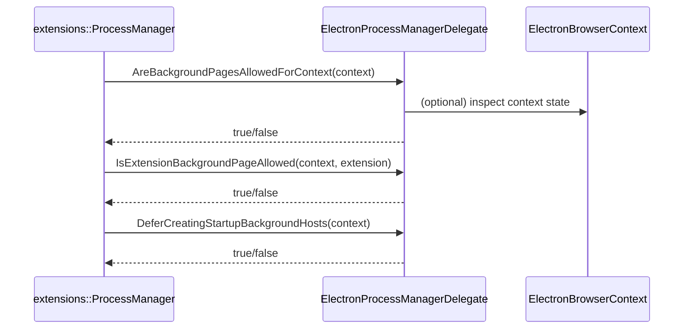
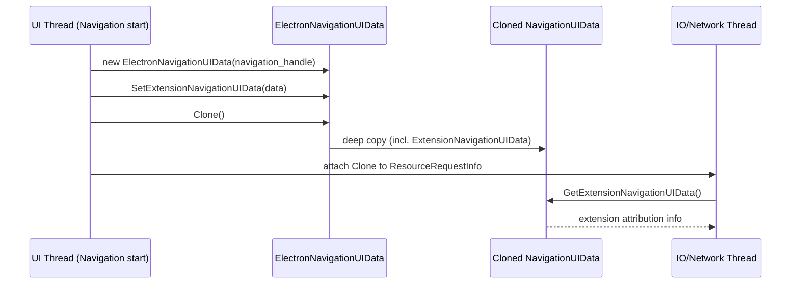
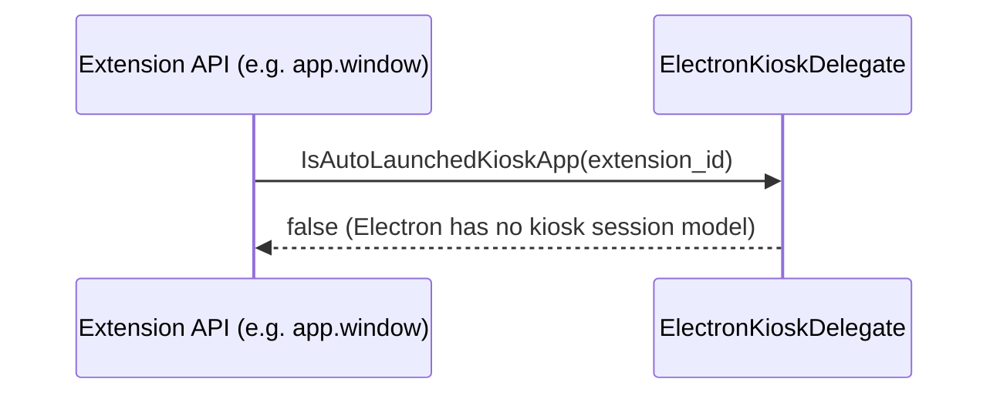
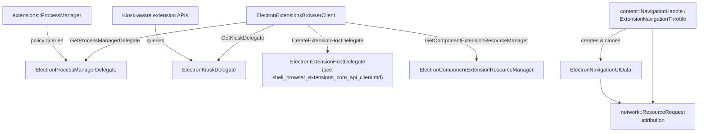
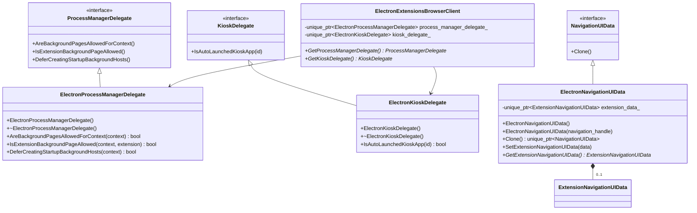

# Extensions Core Delegates (`shell_browser_extensions_core_delegates`)

## Introduction

The **Extensions Core Delegates** module provides a small but essential set of
delegate and data-carrier classes that plug Electron's browser process into
several Chromium `//extensions` subsystems. These classes implement narrow,
well-defined interfaces expected by the upstream extensions code, allowing
Electron to customize (or intentionally restrict) extension behavior without
forking the underlying Chromium extensions machinery.

The module contains three components:

| Component | Base Class (Chromium) | Purpose |
|---|---|---|
| `ElectronProcessManagerDelegate` | `extensions::ProcessManagerDelegate` | Controls whether extension background pages are allowed/created |
| `ElectronKioskDelegate` | `extensions::KioskDelegate` | Reports kiosk-mode/auto-launch status for extensions & apps |
| `ElectronNavigationUIData` | `content::NavigationUIData` | Carries extension-specific navigation metadata from the UI thread to the IO/network thread during navigations |

These delegates are consumed and owned primarily by
[`ElectronExtensionsBrowserClient`](shell_browser_extensions_core_browser_client.md),
which is the central integration point between Electron and the Chromium
extensions system.

---

## 1. Purpose & Core Functionality

### 1.1 `ElectronProcessManagerDelegate`

Implements `extensions::ProcessManagerDelegate`, the hook that Chromium's
`ProcessManager` uses to decide extension background-page policy. Electron
uses this to answer three key questions for any given `BrowserContext`:

- **`AreBackgroundPagesAllowedForContext`** — Are background pages allowed at
  all in this context?
- **`IsExtensionBackgroundPageAllowed`** — Is a specific extension allowed to
  have a background page?
- **`DeferCreatingStartupBackgroundHosts`** — Should creation of background
  hosts be deferred until later in startup?

Because Electron does not have the same profile/session lifecycle as Chrome,
this delegate typically returns conservative/simple answers, essentially
enabling background pages without the additional guardrails Chrome uses for
multi-profile scenarios.

### 1.2 `ElectronKioskDelegate`

Implements `extensions::KioskDelegate`, used by extension APIs (such as
`chrome.app.window` kiosk-related checks) to determine whether a given
extension is an auto-launched kiosk app:

```cpp
bool IsAutoLaunchedKioskApp(const extensions::ExtensionId& id) const override;
```

Electron does not have a native concept of ChromeOS-style kiosk sessions, so
this delegate generally returns `false`, disabling kiosk-specific extension
behavior while still satisfying the interface contract required by the
extensions system.

### 1.3 `ElectronNavigationUIData`

Implements `content::NavigationUIData`, a per-navigation data container that
Chromium clones and threads through the navigation pipeline (UI thread →
IO/network thread). Electron uses it to carry an
`extensions::ExtensionNavigationUIData` payload, which lets the extensions
subsystem correctly attribute a navigation to a `<webview>` guest, tab, or
frame originating from an extension.

Key responsibilities:
- **`Clone()`** — Deep-copies itself (and its `ExtensionNavigationUIData`) so
  that the network stack can safely use it after the original object on the
  UI thread goes away.
- **`SetExtensionNavigationUIData` / `GetExtensionNavigationUIData`** —
  Accessors for attaching/reading the extension-specific navigation context.

---

## 2. Architecture & Component Relationships



`ElectronProcessManagerDelegate` and `ElectronKioskDelegate` are both owned as
`std::unique_ptr` members inside
[`ElectronExtensionsBrowserClient`](shell_browser_extensions_core_browser_client.md)
and exposed through its overrides of `GetProcessManagerDelegate()` and
`GetKioskDelegate()`. `ElectronNavigationUIData` is instantiated on a
per-navigation basis by the content/navigation layer (see
[`shell_browser_main_parts_content_delegates`](shell_browser_main_parts_content_delegates.md)
for related navigation throttle code) rather than being owned long-term by any
single object.

---

## 3. Dependency Diagram



Notes:
- `Browser` and `Profile` are only **forward-declared** in
  `electron_process_manager_delegate.h`; they represent the wider application
  singleton ([`Browser`](shell_browser_core_lifecycle.md)) and the
  Chromium-style profile concept that Electron generally maps onto
  [`ElectronBrowserContext`](shell_browser_context.md).
- The delegate implementations themselves are defined in corresponding `.cc`
  files (not shown in the core snippet) which include the real logic tying
  into `ElectronBrowserContext` and `ElectronExtensionSystem`.

---

## 4. Data Flow

### 4.1 Background Page Decision Flow



### 4.2 Navigation UI Data Lifecycle



### 4.3 Kiosk Check Flow



---

## 5. Component Interaction with the Extensions Subsystem



---

## 6. How This Module Fits Into the Overall System

The `shell_browser_extensions_core_delegates` module is a **leaf-level
implementation module** within the broader Extensions Subsystem
(`shell_browser_extensions_core`). It does not contain business logic of its
own beyond simple policy answers; instead it exists to **satisfy interface
contracts** required by Chromium's extensions and content layers so that:

1. **[`ElectronExtensionsBrowserClient`](shell_browser_extensions_core_browser_client.md)**
   can be fully instantiated — Chromium's `ExtensionsBrowserClient` interface
   requires non-null `ProcessManagerDelegate` and `KioskDelegate` instances.
2. **Navigation code** (throttles, resource request pipelines — see
   [`shell_browser_main_parts_content_delegates`](shell_browser_main_parts_content_delegates.md))
   can correctly propagate extension-specific navigation context across
   thread boundaries.

### Relationship to sibling modules

- **[`shell_browser_extensions_core_browser_client`](shell_browser_extensions_core_browser_client.md)** —
  Direct owner/consumer of `ElectronProcessManagerDelegate` and
  `ElectronKioskDelegate`.
- **[`shell_browser_extensions_core_system`](shell_browser_extensions_core_system.md)** —
  The extension system whose background-page and startup-host creation
  behavior is gated by `ElectronProcessManagerDelegate`.
- **[`shell_browser_extensions_core_api_client`](shell_browser_extensions_core_api_client.md)** —
  Sibling delegate module providing API-client-level delegates
  (`ElectronExtensionHostDelegate`, `ElectronMessagingDelegate`, guest view
  delegates) that work alongside these process/kiosk/navigation delegates.
- **[`shell_browser_context`](shell_browser_context.md)** —
  Supplies the `BrowserContext`/`ElectronBrowserContext` instances passed into
  `ElectronProcessManagerDelegate`'s methods.
- **[`shell_browser_core_lifecycle`](shell_browser_core_lifecycle.md)** —
  Home of the `Browser` singleton forward-declared in this module; represents
  the app-wide lifecycle that extensions indirectly interact with (e.g., quit
  behavior interacting with background pages).
- **[`shell_browser_main_parts_content_delegates`](shell_browser_main_parts_content_delegates.md)** —
  Contains `ElectronNavigationThrottle` and related navigation-pipeline code
  that is the primary creator/consumer of `ElectronNavigationUIData`.

### Design Rationale

Electron intentionally keeps these delegates minimal:

- Electron apps typically run in a **single, developer-controlled process
  model** without Chrome's multi-profile, incognito, or ChromeOS kiosk-session
  concepts. Hence `ElectronKioskDelegate` and much of
  `ElectronProcessManagerDelegate`'s logic reduce to simple/permissive
  defaults.
- `ElectronNavigationUIData` exists purely as **plumbing** — it has no
  Electron-specific policy logic, it just ensures Chromium's own
  `ExtensionNavigationUIData` survives the UI-to-IO thread hop during
  navigation, which downstream extension APIs (e.g., web request blocking,
  `<webview>` attribution) rely on.

---

## 7. Class Diagram



---

## 8. Summary

| Aspect | Detail |
|---|---|
| **Layer** | Browser process, Extensions subsystem (delegate layer) |
| **Pattern** | Delegate / Strategy pattern implementing Chromium interfaces |
| **Lifetime** | `ElectronProcessManagerDelegate` & `ElectronKioskDelegate`: owned by `ElectronExtensionsBrowserClient` (process lifetime). `ElectronNavigationUIData`: per-navigation, cloned across threads. |
| **Key Consumers** | `extensions::ProcessManager`, extension Kiosk-aware APIs, content navigation/network pipeline |
| **Extensibility** | To customize Electron's extension background-page or kiosk policy, modify the `.cc` implementations of these delegates; to add new per-navigation extension metadata, extend `ElectronNavigationUIData` |

For the broader extension bootstrap and client wiring, see
[`shell_browser_extensions_core_browser_client`](shell_browser_extensions_core_browser_client.md)
and [`shell_browser_extensions_core_system`](shell_browser_extensions_core_system.md).
