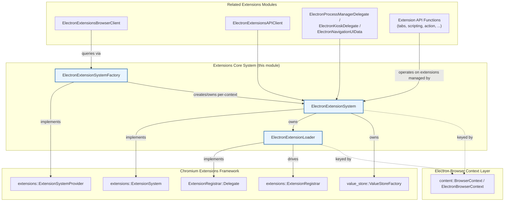
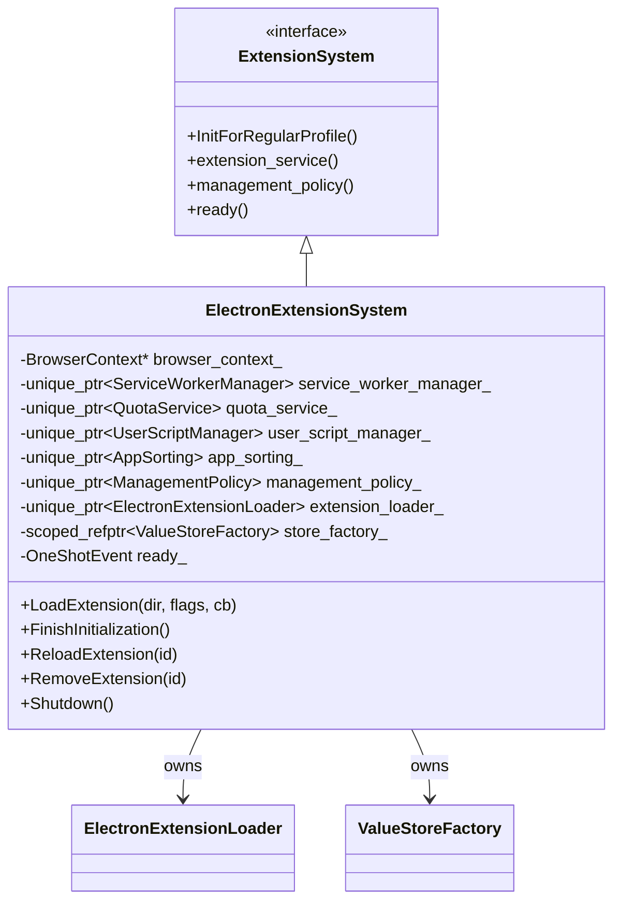
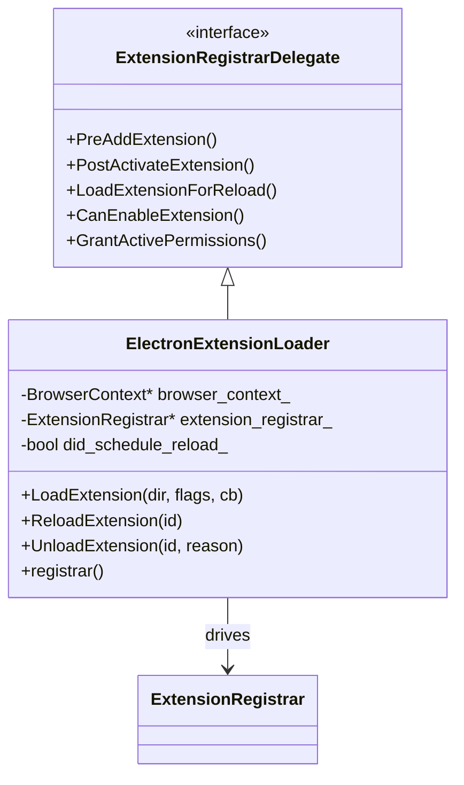
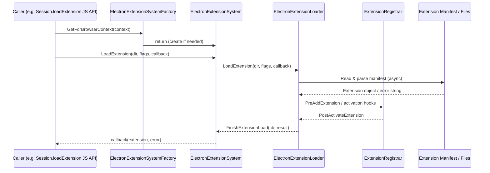
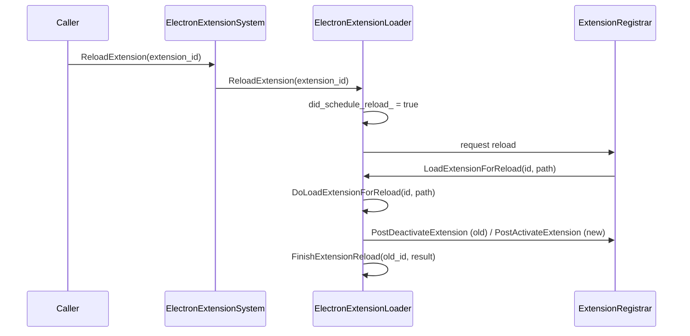
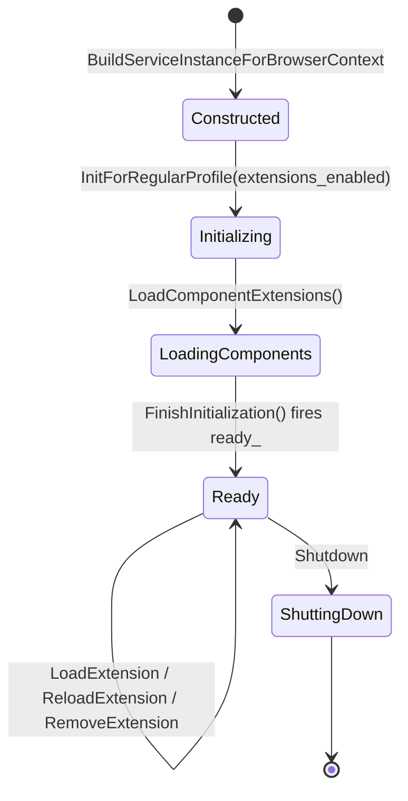
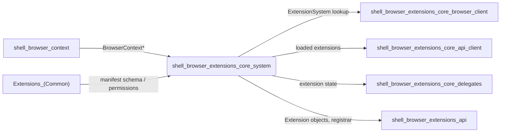

# Shell Browser Extensions Core System

## Introduction

The **Shell Browser Extensions Core System** module is the heart of Electron's Chrome-extension support in the browser process. It provides a lightweight, Electron-specific implementation of Chromium's `extensions::ExtensionSystem` interface, along with the machinery needed to **load, reload, unload, and track** extensions inside a given `content::BrowserContext` (i.e., an Electron `Session`).

This module answers three fundamental questions for the rest of the extensions subsystem:

1. **Where do extensions live for a given browser context?** — `ElectronExtensionSystem` owns per-context extension state (services, stores, quota, user scripts).
2. **How do we get an `ExtensionSystem` for a `BrowserContext`?** — `ElectronExtensionSystemFactory` is the `BrowserContextKeyedServiceFactory`-style provider that creates/retrieves the per-context `ElectronExtensionSystem` singleton.
3. **How does an extension actually get loaded from disk, reloaded, or removed?** — `ElectronExtensionLoader` implements the `ExtensionRegistrar::Delegate` contract and drives the low-level install/activate/deactivate lifecycle.

Together these three components form the minimal, "app_shell-style" extension system that Electron uses instead of the full Chrome browser's `ExtensionSystemImpl`, deliberately omitting services (like update-checking, sync, or management UI wiring) that are not relevant to embedding extensions in an Electron app.

---

## Module Purpose & Responsibilities

| Responsibility | Owner Component |
|---|---|
| Implement `ExtensionSystem` interface for a `BrowserContext` | `ElectronExtensionSystem` |
| Provide/lookup the per-`BrowserContext` `ElectronExtensionSystem` instance | `ElectronExtensionSystemFactory` |
| Load unpacked extensions from disk | `ElectronExtensionLoader` |
| Reload / unload extensions and manage `ExtensionRegistrar` delegate callbacks | `ElectronExtensionLoader` |
| Own supporting services: `ServiceWorkerManager`, `QuotaService`, `UserScriptManager`, `AppSorting`, `ManagementPolicy`, `ValueStoreFactory` | `ElectronExtensionSystem` |
| Signal extension-system readiness (`base::OneShotEvent`) | `ElectronExtensionSystem` |

This module sits at the **core layer** of the broader Extensions Subsystem (see `shell_browser_extensions_core.md`). It does not implement any specific extension API (`chrome.tabs`, `chrome.action`, etc. — see `shell_browser_extensions_api.md`) nor the browser-client glue that wires Chromium's `ExtensionsBrowserClient` (see `shell_browser_extensions_core_browser_client.md`). Instead, it provides the foundational "container" that those layers plug into.

---

## Architecture Overview

---

## Component Details

### 1. `ElectronExtensionSystem`

`ElectronExtensionSystem` (`shell/browser/extensions/electron_extension_system.h`) is Electron's implementation of Chromium's `extensions::ExtensionSystem`. It is a **simplified variant** modeled after Chromium's `app_shell` extension system — it skips services that are irrelevant to embedding extensions (e.g., extension update pinging, sync integration).

Key characteristics:

- **One instance per `BrowserContext`.** Constructed with a `content::BrowserContext*` (not owned — the context outlives or co-terminates with the system via `KeyedService` shutdown).
- **Owns core sub-services** required by the extensions framework:
  - `ServiceWorkerManager`
  - `QuotaService`
  - `UserScriptManager`
  - `AppSorting`
  - `ManagementPolicy`
  - `value_store::ValueStoreFactory` (backing store for extension state/storage APIs)
- **Owns an `ElectronExtensionLoader`** to perform the actual load/reload/unload work.
- **Readiness signaling** via `base::OneShotEvent ready_`, exposed through `ready()` / `is_ready()` — other subsystems (e.g., API handlers) can wait on this before assuming extensions are available.
- **Public operations**:
  - `LoadExtension(dir, load_flags, callback)` — load an unpacked extension asynchronously via the loader.
  - `ReloadExtension(extension_id)` / `RemoveExtension(extension_id)` — lifecycle management, delegated to `ElectronExtensionLoader`.
  - `FinishInitialization()` — completes startup (e.g., firing `ready_`, loading component extensions via `LoadComponentExtensions()`).
- **`ExtensionSystem` overrides** it must satisfy (many return owned sub-service pointers or no-ops for services Electron doesn't need):
  `InitForRegularProfile`, `extension_service()`, `management_policy()`, `service_worker_manager()`, `user_script_manager()`, `state_store()`, `rules_store()`, `dynamic_user_scripts_store()`, `store_factory()`, `quota_service()`, `app_sorting()`, `content_verifier()`, `GetDependentExtensions()`, `InstallUpdate()`, `PerformActionBasedOnOmahaAttributes()`.

### 2. `ElectronExtensionSystemFactory`

`ElectronExtensionSystemFactory` (`shell/browser/extensions/electron_extension_system_factory.h`) implements `extensions::ExtensionSystemProvider`, the Chromium-defined interface used to look up the `ExtensionSystem` for a given `BrowserContext`.

- **Singleton access**: `GetInstance()` returns the process-wide factory (implemented with `base::NoDestructor` to avoid static-destruction-order issues).
- **`GetForBrowserContext(context)`**: returns the `ExtensionSystem` (concretely an `ElectronExtensionSystem`) associated with the given context, creating it on first access.
- **`BuildServiceInstanceForBrowserContext(context)`**: factory method that actually constructs a new `ElectronExtensionSystem` for the context — this is where the `KeyedService` framework plugs in.
- **`GetBrowserContextToUse(context)`**: allows redirecting (e.g., mapping an off-the-record context to its original) — important for guaranteeing a single extension system per logical session.
- **`ServiceIsCreatedWithBrowserContext()`**: controls whether the system is eagerly created alongside the `BrowserContext` or lazily on first request.

This factory is the **entry point** other subsystems use to reach the extension system — e.g., `ElectronExtensionsBrowserClient` (see `shell_browser_extensions_core_browser_client.md`) and extension API implementations (see `shell_browser_extensions_api.md`) call through this factory rather than constructing `ElectronExtensionSystem` directly.

### 3. `ElectronExtensionLoader`

`ElectronExtensionLoader` (`shell/browser/extensions/electron_extension_loader.h`) implements `extensions::ExtensionRegistrar::Delegate`, which is the Chromium-defined callback contract used by `ExtensionRegistrar` to perform environment-specific work during extension activation/deactivation.

Responsibilities:

- **`LoadExtension(extension_dir, load_flags, cb)`** — asynchronously loads an unpacked extension from disk (parses the manifest, validates it, and returns the resulting `Extension` + any error string via callback).
- **`ReloadExtension(extension_id)`** — triggers a reload; the loader keeps track of in-flight reload operations (`did_schedule_reload_`) and coordinates with `ExtensionRegistrar` via `LoadExtensionForReload()` callbacks.
- **`UnloadExtension(extension_id, reason)`** — removes the extension from the running state, delegating final bookkeeping to the registrar.
- **`registrar()`** — exposes the associated `ExtensionRegistrar` for other components to query (owned externally, not by the loader).

`ExtensionRegistrar::Delegate` overrides implemented:

| Delegate Method | Purpose |
|---|---|
| `PreAddExtension` / `PostActivateExtension` | Hooks before/after an extension is added and becomes active |
| `PostDeactivateExtension` | Cleanup hook when an extension stops running |
| `PreUninstallExtension` / `PostUninstallExtension` | Hooks around full uninstallation |
| `LoadExtensionForReload` / `LoadExtensionForReloadWithQuietFailure` | Actual disk reload implementation invoked by the registrar |
| `ShowExtensionDisabledError` | UI/logging hook for disabled-extension errors |
| `CanEnableExtension` / `CanDisableExtension` | Policy checks gating enable/disable transitions |
| `GrantActivePermissions` | Grants runtime permissions upon activation |

Private helpers (`FinishExtensionReload`, `FinishExtensionLoad`, `DoLoadExtensionForReload`) implement the async completion logic that bridges disk I/O results back into `ExtensionRegistrar` state transitions.

---

## Data Flow: Loading an Unpacked Extension

## Data Flow: Reloading an Extension

---

## Lifecycle & Initialization

- The `ElectronExtensionSystem` for a `BrowserContext` is created lazily (or eagerly, depending on `ServiceIsCreatedWithBrowserContext()`) the first time `ElectronExtensionSystemFactory::GetForBrowserContext()` is called for that context.
- `InitForRegularProfile()` is the standard `ExtensionSystem` entry point invoked during `BrowserContext`/profile bring-up; it triggers component extension loading and eventually flips the `ready_` event.
- `Shutdown()` (from `KeyedService`) tears down owned services in reverse order of dependency before the `BrowserContext` itself is destroyed.

---

## Integration with Other Modules

| Related Module | Relationship |
|---|---|
| `shell_browser_context.md` | Supplies the `content::BrowserContext` (`ElectronBrowserContext`) that keys every `ElectronExtensionSystem`/`ElectronExtensionLoader` instance. |
| `shell_browser_extensions_core_browser_client.md` | `ElectronExtensionsBrowserClient` queries `ElectronExtensionSystemFactory` to resolve the extension system for a context, and wires it into Chromium's broader `ExtensionsBrowserClient` framework (process maps, kiosk/safe-browsing delegates, etc.). |
| `shell_browser_extensions_core_api_client.md` | `ElectronExtensionsAPIClient`, guest view delegates, and messaging delegates operate on extensions once loaded/activated by this core system. |
| `shell_browser_extensions_core_delegates.md` | `ElectronProcessManagerDelegate`, `ElectronKioskDelegate`, and `ElectronNavigationUIData` consult extension state managed here (e.g., process assignment, navigation context tagging). |
| `shell_browser_extensions_api.md` | All `chrome.*` API implementations (tabs, scripting, action, management, runtime, etc.) act on extensions that this module loaded and tracks via `ExtensionRegistrar`. |
| `Extensions_(Common).md` | `ElectronExtensionsClient` and `ElectronExtensionsAPIProvider` define the static/common extension configuration (permissions, manifest schema) that the loader validates against when parsing manifests. |

---

## Key Design Notes

- **Minimalism over completeness**: Electron intentionally implements a subset of Chromium's full `ExtensionSystemImpl`. Services like extension auto-updating from the Chrome Web Store, sync, and management-UI-driven uninstall flows are either stubbed, delegated elsewhere (see `ElectronManagementAPIDelegate` in `shell_browser_extensions_api_management.md`), or omitted entirely.
- **Per-context isolation**: Because the factory keys instances by `BrowserContext`, each Electron `Session` (including in-memory/partitioned sessions) gets its own independent extension system, loader, and value store — extensions loaded into one session do not leak into another.
- **Delegate pattern for lifecycle hooks**: By implementing `ExtensionRegistrar::Delegate` rather than reimplementing registration logic, `ElectronExtensionLoader` reuses Chromium's well-tested state machine for extension activation/deactivation/uninstallation while only customizing the environment-specific hooks (disk loading, permission granting, UI error reporting).
- **Async-first API surface**: `LoadExtension` and reload/unload operations are callback/async-oriented, reflecting the disk I/O and multi-step validation involved in turning a directory of files into a running `Extension`.
