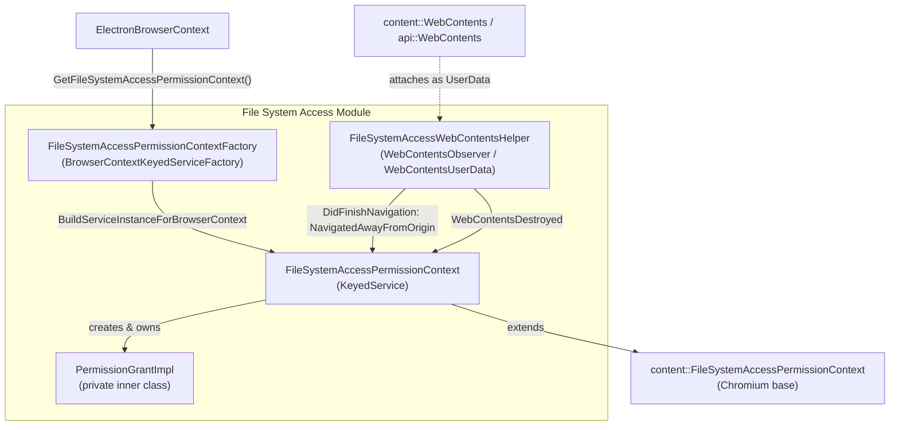
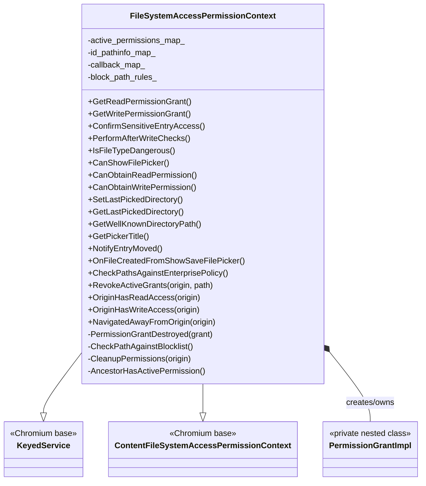
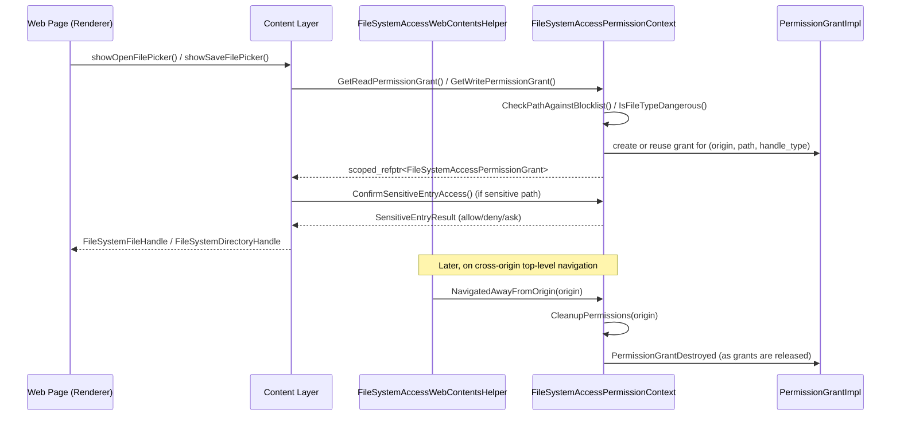

# File System Access Module

## Introduction

The **File System Access** module implements Electron's support for the web platform's [File System Access API](https://wicg.github.io/file-system-access/) (`window.showOpenFilePicker`, `showSaveFilePicker`, `showDirectoryPicker`, and the underlying handle permission model). It is the browser-process component responsible for:

- Deciding whether a given renderer/origin is allowed to read or write a file or directory handle.
- Tracking active (in-memory) read/write permission grants per origin, including "restricted" (sensitive) path confirmation flows.
- Persisting the "last picked directory" per origin/ID so that subsequent file pickers can restore the user's previous location.
- Cleaning up grants when a top-level frame navigates away from the origin that was granted access.
- Exposing this permission logic through Chromium's `KeyedService`/`BrowserContextKeyedServiceFactory` pattern so each `ElectronBrowserContext` (i.e., each `Session`) gets its own isolated permission context.

This module is a thin, Electron-specific specialization of Chromium's `ChromeFileSystemAccessPermissionContext`, adapted to Electron's browser-context and session model, and it is wired into other browser-process components such as the `ElectronBrowserContext` and `WebContents`.

## Purpose & Scope

| Concern | Component |
|---|---|
| Per-origin/per-path grant lifecycle (creation, revocation, eviction) | `FileSystemAccessPermissionContext`, `PermissionGrantImpl` |
| Sensitive/dangerous path & file-type checks, "restricted entry" confirmation UI hook | `FileSystemAccessPermissionContext` |
| Last-picked-directory bookkeeping | `FileSystemAccessPermissionContext` (`id_pathinfo_map_`) |
| Per-`BrowserContext` singleton wiring | `FileSystemAccessPermissionContextFactory` |
| Observing `WebContents` navigation to trigger grant cleanup | `FileSystemAccessWebContentsHelper` |

## Architecture Overview

### Key relationships

- **`FileSystemAccessPermissionContextFactory`** is the standard Chromium factory (`BrowserContextKeyedServiceFactory`) that guarantees a single `FileSystemAccessPermissionContext` instance per `content::BrowserContext`. It is looked up lazily via `GetForBrowserContext()` and is itself a singleton via `base::NoDestructor`.
- **`FileSystemAccessPermissionContext`** implements Chromium's `content::FileSystemAccessPermissionContext` interface (the contract that Content layer calls into when a page uses the File System Access API) plus `KeyedService` for browser-context-scoped lifetime management. It is consumed directly by `ElectronBrowserContext::GetFileSystemAccessPermissionContext()` — see [shell_browser_context.md](shell_browser_context.md) for how the browser context wires up this and other per-session services (cookies, download manager, permission manager, protocol registry, etc.).
- **`PermissionGrantImpl`** is a private nested class (forward-declared as `class PermissionGrantImpl;`) representing an individual read or write grant for an origin+path+handle-type tuple. It implements `content::FileSystemAccessPermissionGrant` reference-counted semantics and notifies the owning context (`PermissionGrantDestroyed`) upon destruction so the context can update its bookkeeping maps.
- **`FileSystemAccessWebContentsHelper`** is a `content::WebContentsUserData` attached to each relevant `WebContents` (see [shell_browser_api_webcontents_core.md](shell_browser_api_webcontents_core.md) for the `WebContents` wrapper that hosts it). It observes navigation events and web contents destruction in order to tell the permission context when a top-level frame has navigated away from an origin, prompting grant cleanup (`NavigatedAwayFromOrigin`).

## Core Components

### `FileSystemAccessPermissionContext`

File: `shell/browser/file_system_access/file_system_access_permission_context.h`

The central class of this module. It is constructed with a `content::BrowserContext*` and an injectable `base::Clock*` (defaulting to the system clock, useful for testing time-based grant eviction). Responsibilities:

- **Grant issuance** — `GetReadPermissionGrant()` / `GetWritePermissionGrant()` return (creating if necessary) a `scoped_refptr<content::FileSystemAccessPermissionGrant>` (backed internally by `PermissionGrantImpl`) for an `(origin, path, handle_type, user_action)` tuple.
- **Sensitive entry / dangerous file checks** — `ConfirmSensitiveEntryAccess()`, `IsFileTypeDangerous()`, `PerformAfterWriteChecks()`, and the blocklist machinery (`CheckPathAgainstBlocklist`, `CheckShouldBlockAccessToPathAndReply`, `block_path_rules_`) gate access to OS-sensitive locations (e.g., system directories) and potentially dangerous file extensions before granting a handle.
- **Picker UX support** — `SetLastPickedDirectory()` / `GetLastPickedDirectory()` persist the most recently used directory per origin and per custom `id` (bounded by `max_ids_per_origin_`), and `GetWellKnownDirectoryPath()` / `GetPickerTitle()` supply well-known directory paths (e.g., Downloads) and localized picker titles.
- **Grant lifecycle & cleanup**:
  - `RevokeActiveGrants(origin, file_path)` revokes some or all grants for an origin.
  - `OriginHasReadAccess()` / `OriginHasWriteAccess()` query current grant state.
  - `NavigatedAwayFromOrigin(origin)` is invoked by `FileSystemAccessWebContentsHelper` and triggers `CleanupPermissions()`.
  - `AncestorHasActivePermission()` supports permission inheritance checks for nested paths.
  - `MaybeEvictEntries()` bounds the size of the last-picked-directory map.
- **Enterprise policy integration** — `CheckPathsAgainstEnterprisePolicy()` validates a set of candidate paths against enterprise-configured block rules (`ChromeFileSystemAccessPermissionContext::BlockPathRules`), asynchronously replying via `EntriesAllowedByEnterprisePolicyCallback`.
- **Entry-move notification** — `NotifyEntryMoved()` and `OnFileCreatedFromShowSaveFilePicker()` keep permission state consistent when files are renamed/moved or newly created via the save picker.

Internal state includes `active_permissions_map_` (per-origin `OriginState`), `id_pathinfo_map_` (last-picked-directory bookkeeping), `callback_map_` (pending restricted-path confirmation callbacks keyed by file path), and `block_path_rules_` (enterprise blocklist rules, lazily initialized and cached via a callback list for callers arriving before initialization completes).

### `FileSystemAccessPermissionContextFactory`

File: `shell/browser/file_system_access/file_system_access_permission_context_factory.h`

A standard Chromium `BrowserContextKeyedServiceFactory` singleton (guarded by `base::NoDestructor`) that:

- Exposes `GetForBrowserContext(content::BrowserContext*)` — the primary entry point used by `ElectronBrowserContext` and other browser-process code to obtain the `FileSystemAccessPermissionContext` for a given session.
- Exposes `GetInstance()` for factory-level access (e.g., registering dependencies during startup).
- Implements `BuildServiceInstanceForBrowserContext()` to lazily construct a new `FileSystemAccessPermissionContext` the first time it's requested for a context.

This mirrors the same factory pattern used by other per-`BrowserContext` services in Electron, such as `HidChooserContextFactory`, `SerialChooserContextFactory`, `UsbChooserContextFactory` — see [shell_browser_hid.md](shell_browser_hid.md), [Serial.md](Serial.md), and [USB.md](USB.md) for the analogous device-permission factories in the sibling `Device_&_Peripheral_Access` group.

### `FileSystemAccessWebContentsHelper`

File: `shell/browser/file_system_access/file_system_access_web_contents_helper.h`

A `content::WebContentsObserver` + `content::WebContentsUserData<FileSystemAccessWebContentsHelper>` attached per-`WebContents`. It bridges WebContents-level navigation lifecycle events into the permission context:

- `DidFinishNavigation(navigation_handle)` — detects top-level, cross-origin navigations and notifies the relevant `FileSystemAccessPermissionContext` via `NavigatedAwayFromOrigin()`, so that grants tied to the previous origin can be cleaned up.
- `WebContentsDestroyed()` — ensures no dangling references remain when the underlying `WebContents` is torn down.

Because it is a `WebContentsUserData`, its constructor is private and instances are created/retrieved through the `WEB_CONTENTS_USER_DATA_KEY_DECL()` machinery (typically via a `CreateForWebContents`-style call made where `WebContents` is initialized). This ties into Electron's own `WebContents` wrapper — see [shell_browser_api_webcontents_core.md](shell_browser_api_webcontents_core.md) — which owns the underlying `content::WebContents` instance that this helper observes.

## Data Flow: Requesting a File Handle

## Integration with the Rest of the System

- **Session / Browser Context** — Each `ElectronBrowserContext` (documented in [shell_browser_context.md](shell_browser_context.md)) exposes `GetFileSystemAccessPermissionContext()`, overriding the Chromium `content::BrowserContext` virtual, and internally delegates to `FileSystemAccessPermissionContextFactory::GetForBrowserContext(this)`. This keeps file-system-access grants scoped to a `Session`, consistent with how cookies, storage, and protocol handlers are scoped per-context.
- **WebContents** — The `FileSystemAccessWebContentsHelper` is attached to the same `content::WebContents` instances wrapped by the Electron `api::WebContents` object (see [shell_browser_api_webcontents_core.md](shell_browser_api_webcontents_core.md)), allowing navigation-driven cleanup without the permission context needing direct knowledge of renderer-side navigation events.
- **UI dialogs** — Sensitive-entry confirmation (`ConfirmSensitiveEntryAccess`) and file-picker title/localization (`GetPickerTitle`) tie into Electron's native file dialog implementation; see the `UI_Dialogs` sub-module of [Desktop_UI_Widgets_&_Dialogs](file_dialog.md) for the picker UI itself (`file_dialog.h`).
- **Other device/permission contexts** — This module follows the exact same `KeyedService` + `BrowserContextKeyedServiceFactory` pattern as the other peripheral permission contexts in the `Device_&_Peripheral_Access` group: [shell_browser_hid.md](shell_browser_hid.md) (HID), [Serial.md](Serial.md) (Serial), and [USB.md](USB.md) (USB). Reviewing those documents alongside this one is useful for understanding Electron's general per-origin device/resource permission-grant architecture.

## Summary

The File System Access module is a small but self-contained subsystem that adapts Chromium's File System Access permission model into Electron's `Session`/`BrowserContext`-scoped architecture. It has three key components:

1. `FileSystemAccessPermissionContext` — the core policy/grant engine.
2. `FileSystemAccessPermissionContextFactory` — per-context singleton lifecycle management.
3. `FileSystemAccessWebContentsHelper` — navigation-driven cleanup glue between `WebContents` and the permission context.

Because all three files are tightly coupled around a single responsibility (file/directory handle permissions) and there is no further natural sub-division, this module is documented as a single unit rather than being split into sub-module pages.
