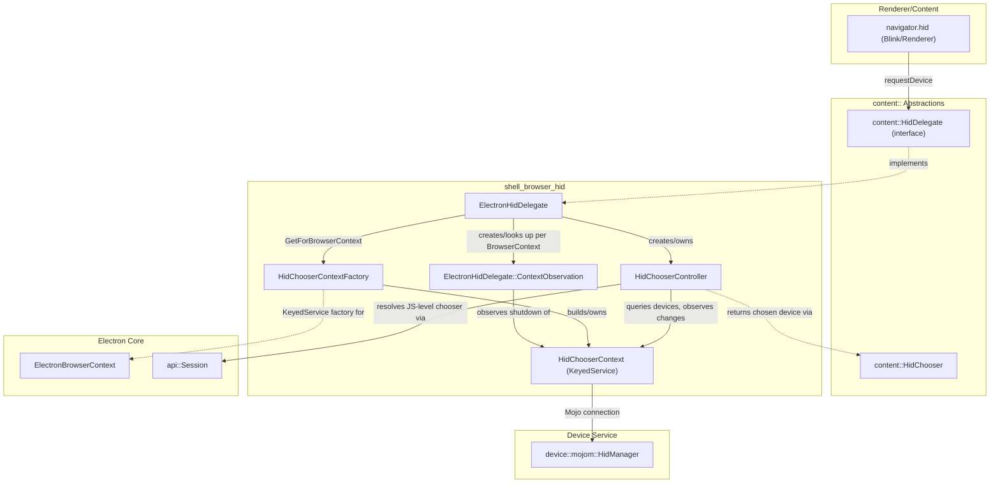
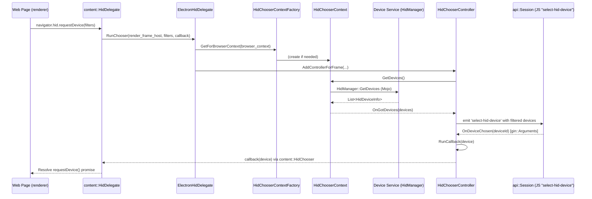
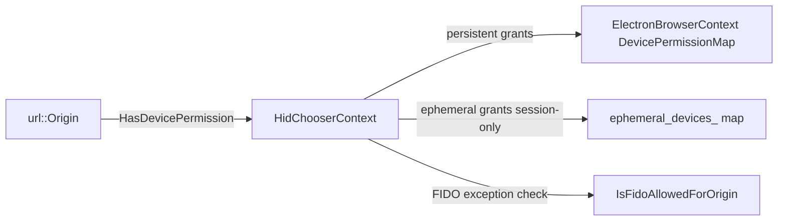

# Shell Browser HID Module

## Introduction

The `shell_browser_hid` module implements Electron's browser-process support for the **WebHID API** — the web platform standard that allows web content (and Electron main-process consumers) to enumerate, request permission for, and communicate with Human Interface Devices (HID) such as game controllers, custom keyboards, and other USB/Bluetooth HID peripherals.

This module is the browser-side bridge between:
- Chromium's `content::HidDelegate` / `content::HidChooser` abstractions (invoked when a renderer calls `navigator.hid.requestDevice()`),
- The Device Service's `device::mojom::HidManager` Mojo interface (the actual OS-level HID device enumeration/communication service), and
- Electron's own permission and session model (`ElectronBrowserContext`, `api::Session`), which lets Electron app developers intercept and customize device selection via JavaScript (`session.on('select-hid-device', ...)`).

It is one of several device-access modules under **Device & Peripheral Access**, alongside [Serial](Serial.md), [USB](USB.md), [WebAuthn](WebAuthn.md), and [shell_browser_bluetooth](shell_browser_bluetooth.md), all of which follow a very similar Delegate → ChooserContext(+Factory) → ChooserController pattern.

## Purpose & Core Functionality

1. **Expose HID capability to the content layer** — `ElectronHidDelegate` implements Chromium's `content::HidDelegate` interface so that the content/renderer layer can request device permission, enumerate devices, and open a device chooser UI/flow without knowing anything about Electron internals.
2. **Track per-BrowserContext HID state** — `HidChooserContext` (a `KeyedService`, created/retrieved via `HidChooserContextFactory`) owns the connection to the Device Service's `HidManager`, maintains the live device list, and manages per-origin device permission grants (persistent and ephemeral).
3. **Drive the device selection UX/flow** — `HidChooserController` orchestrates a single "choose a device" session: filtering candidate devices, listening for device add/remove/change events, and ultimately invoking the completion callback with the device chosen by the user (or by JS-level app logic through Electron's `Session` "select-hid-device" event).

## Architecture Overview

## Component Responsibilities

### `ElectronHidDelegate` (`electron_hid_delegate.h`)
The entry point implementing `content::HidDelegate`. Responsibilities:
- **`RunChooser(...)`** — invoked by content layer when a page calls `requestDevice()`; creates (via `AddControllerForFrame`) and returns a `HidChooserController`-backed `content::HidChooser` handle scoped to the requesting `RenderFrameHost`.
- **Permission queries** — `CanRequestDevicePermission`, `HasDevicePermission`, `RevokeDevicePermission` delegate to the per-context `HidChooserContext`.
- **Device introspection** — `GetDeviceInfo`, `GetHidManager` proxy to `HidChooserContext`.
- **FIDO / service-worker gating** — `IsFidoAllowedForOrigin`, `IsServiceWorkerAllowedForOrigin` implement WebHID's security restrictions (e.g. disallowing access to FIDO U2F HID devices through the general API).
- **Lifecycle management** — maintains `controller_map_` (one `HidChooserController` per active `RenderFrameHost`) and `observations_` (one `ContextObservation` per `BrowserContext`, via the private nested `ContextObservation` class) so that controllers/observers are cleanly torn down when frames or contexts go away (`DeleteControllerForFrame`).

### `HidChooserContext` / `HidChooserContextFactory` (`hid_chooser_context.h`, `hid_chooser_context_factory.h`)
`HidChooserContext` is a `KeyedService` — one instance per `ElectronBrowserContext` — that:
- Owns the `mojo::Remote<device::mojom::HidManager>` connection to the Device Service, lazily establishing it (`EnsureHidManagerConnection`) and handling connection errors.
- Implements `device::mojom::HidManagerClient` to receive `DeviceAdded` / `DeviceRemoved` / `DeviceChanged` notifications and fan them out to registered `DeviceObserver`s.
- Maintains `devices_` (GUID → `HidDeviceInfoPtr`) as the authoritative in-process device cache, and `ephemeral_devices_` for session-scoped, per-origin device grants.
- Exposes static helpers `DisplayNameFromDeviceInfo`, `CanStorePersistentEntry`, and `DeviceInfoToValue` used for permission-prompt UI and persistence.
- Implements permission checks (`HasDevicePermission`, `GrantDevicePermission`, `RevokeDevicePermission`, `IsFidoAllowedForOrigin`) that work in conjunction with `ElectronBrowserContext`'s generic device-permission map (see [shell_browser_context](shell_browser_context.md)).

`HidChooserContextFactory` is the standard Chromium `BrowserContextKeyedServiceFactory` singleton (`base::NoDestructor`) that lazily builds/retrieves the `HidChooserContext` for a given `content::BrowserContext`, ensuring one instance per browsing context and routing off-the-record contexts appropriately via `GetBrowserContextToUse`.

### `HidChooserController` (`hid_chooser_controller.h`)
Represents a single, transient "pick a HID device" operation, mirroring the pattern used by [SerialChooserController](Serial.md) and USB's `UsbChooserController`:
- Constructed with the requesting frame, device filters/exclusion filters, and a completion `callback`; immediately requests the current device list from `HidChooserContext` (`OnGotDevices`) and begins observing further device changes as a `HidChooserContext::DeviceObserver`.
- Applies `FilterMatchesAny` / `IsExcluded` / `DisplayDevice` logic to decide which devices are eligible/visible for this request.
- Maintains `device_map_` (physical-device-id → list of `HidDeviceInfoPtr`, since one physical device can expose multiple HID interfaces) and an ordered `items_` list for presentation.
- Integrates with Electron's JS-level session APIs: `GetSession()` retrieves a `gin::WeakCell<api::Session>` so the chooser flow can be driven by the app's `select-hid-device` handler; `OnDeviceChosen(gin::Arguments*)` receives the JS-selected device id and calls `RunCallback` to resolve the original `content::HidChooser::Callback`.
- Observes `content::WebContentsObserver::RenderFrameDeleted` to self-terminate if the requesting frame disappears mid-flow, and reacts to `OnHidChooserContextShutdown`/`OnHidManagerConnectionError` for robust cleanup.

## Data & Control Flow

## Permission Model

Device permission grants are ultimately backed by `ElectronBrowserContext`'s generic `DevicePermissionMap` (see [shell_browser_context](shell_browser_context.md) for the browser-context-wide model shared across HID/Serial/USB). `HidChooserContext` wraps this generic mechanism with HID-specific semantics:

- **Persistent grants**: stored via `ElectronBrowserContext::GrantDevicePermission`/`RevokeDevicePermission`/`CheckDevicePermission`, keyed by `blink::PermissionType` — persisted across sessions when `CanStorePersistentEntry` allows it.
- **Ephemeral grants**: tracked purely in-memory in `HidChooserContext::ephemeral_devices_`, cleared when the browser context is destroyed.
- **Revocation** can be triggered either from the delegate (`ElectronHidDelegate::RevokeDevicePermission`) or internally (`RevokePersistentDevicePermission` / `RevokeEphemeralDevicePermission`).

## Relationship to Other Modules

| Module | Relationship |
|---|---|
| [Serial](Serial.md) | Sibling device-access module with an almost identical Delegate/ChooserContext/ChooserController shape (`ElectronSerialDelegate`, `SerialChooserContext`, `SerialChooserController`), plus Bluetooth-adapter-aware serial port discovery. |
| [USB](USB.md) | Sibling module (`ElectronUsbDelegate`, `UsbChooserContext`, `UsbChooserController`) following the same architecture for USB devices. |
| [shell_browser_bluetooth](shell_browser_bluetooth.md) | Provides the analogous `ElectronBluetoothDelegate` for Web Bluetooth; HID devices connected over Bluetooth may surface through this path as well as through HID directly. |
| [shell_browser_context](shell_browser_context.md) | Supplies `ElectronBrowserContext`, which HID's factory/context classes are keyed to, and the shared `DevicePermissionMap` used for persistent grants. |
| [shell_browser_api_session_net](shell_browser_api_session_net.md) | Provides `api::Session`, the JS-facing object whose `select-hid-device` event lets app code drive/override the chooser flow initiated by `HidChooserController`. |
| [WebAuthn](WebAuthn.md) | `ElectronWebAuthenticationDelegate` and HID's FIDO-allowance checks (`IsFidoAllowedForOrigin`) intersect where HID-based FIDO security keys are involved. |
| [shell_browser_main_parts](shell_browser_main_parts.md) | `ElectronBrowserClient` (in `shell_browser_main_parts_client_core_browser_client`) wires `ElectronHidDelegate` into content's browser client so it is discoverable as the process-wide `content::HidDelegate`. |

## Key Design Notes

- **Per-frame controllers, per-context state**: `ElectronHidDelegate` deliberately separates transient, per-request state (`HidChooserController`, one per `RenderFrameHost`) from durable, per-`BrowserContext` state (`HidChooserContext`, one per profile/session), mirroring Chromium's own HID delegate design in `//chrome`.
- **Weak pointers everywhere**: Because chooser flows may outlive their originating frame or browser context (e.g. a user takes time to respond to a permission prompt), nearly every cross-object reference (`chooser_context_`, `hid_delegate_`, `Session`) is held via `base::WeakPtr` or `gin::WeakCell`, and explicit `Observer`/`ContextObservation`/`ScopedObservation` patterns guard against use-after-free during shutdown.
- **Testability hook**: `OnHidManagerInitializedForTesting` in `HidChooserContext` indicates the Mojo `HidManager` connection is designed to be substitutable in tests.
