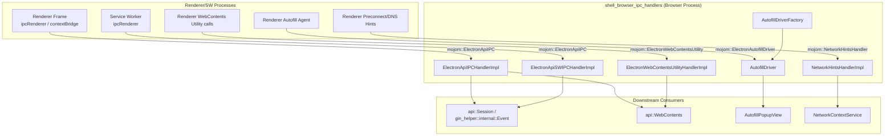
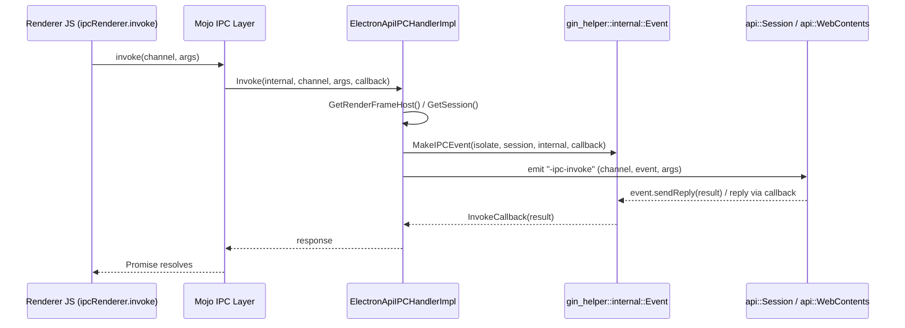

# Shell Browser IPC Handlers

## Introduction

The **Shell Browser IPC Handlers** module implements the browser-process side of Electron's internal Mojo-based
Inter-Process Communication (IPC) surface. It is the glue layer that receives messages sent from renderer
processes (main frames, subframes, and service workers) and from utility-oriented Mojo interfaces (autofill,
network hints, and misc. WebContents utility calls), and routes them into the JavaScript-facing APIs implemented
in [shell_browser_api_webcontents](shell_browser_api_webcontents.md) and
[shell_browser_api_session_net](shell_browser_api_session_net.md).

Rather than exposing IPC directly to embedders, this module provides the C++ `mojom::*` interface implementations
that:

- Accept `mojom::ElectronApiIPC` calls (`Message`, `Invoke`, `MessageSync`, `MessageHost`, `ReceivePostMessage`)
  from ordinary renderer frames and from service workers, and forward them as `Event`-driven callbacks into the
  Session/WebContents JS layer.
- Manage per-frame Autofill driver instances, relaying autofill popup show/hide requests from the renderer to the
  native UI (see [Desktop_UI_Widgets_&_Dialogs](Autofill_Popup.md)).
- Implement small utility Mojo services such as DNS preconnect/prefetch hints and one-off WebContents utility RPCs
  (zoom level, clipboard permission checks, first-layout notification).

This module sits entirely in the **browser process** and acts as the first point of contact for messages that
originate in renderer/utility processes via Mojo, before they are dispatched into higher-level Electron APIs.

## Architecture Overview

## Sub-modules

The module is organized into three cohesive groups of components, each documented in detail in its own file:

| Sub-module | Description | Documentation |
|---|---|---|
| **Frame & Service Worker IPC** | Implements `mojom::ElectronApiIPC` for both renderer frames and service workers, converting incoming Mojo calls into `gin_helper::internal::Event`-driven dispatch against the Electron `Session`/`WebContents` JS objects. | [shell_browser_ipc_handlers_frame_sw_ipc.md](shell_browser_ipc_handlers_frame_sw_ipc.md) |
| **Autofill Driver** | Manages per-frame `AutofillDriver` instances via `AutofillDriverFactory`, bridging renderer-originated autofill popup requests to native UI. | [shell_browser_ipc_handlers_autofill.md](shell_browser_ipc_handlers_autofill.md) |
| **WebContents Utility & Network Hints** | Implements small auxiliary Mojo services: `ElectronWebContentsUtilityHandlerImpl` (zoom, clipboard permission, layout notifications) and `NetworkHintsHandlerImpl` (DNS preconnect hints). | [shell_browser_ipc_handlers_utility_hints.md](shell_browser_ipc_handlers_utility_hints.md) |

## Data Flow: A Typical `ipcRenderer.invoke()` Call

## Relationship to Other Modules

- **[shell_browser_api_webcontents](shell_browser_api_webcontents.md)** — the `api::WebContents` JS wrapper is the
  primary consumer of `ElectronApiIPCHandlerImpl` and `ElectronWebContentsUtilityHandlerImpl`; IPC events dispatched
  by this module are emitted on the corresponding `WebContents` object.
- **[shell_browser_api_session_net](shell_browser_api_session_net.md)** — the `api::Session` object (and its
  `gin::WeakCell<api::Session>`) is where `-ipc-message`, `-ipc-invoke`, and `-ipc-message-sync` events are ultimately
  handled for both frame-based and service-worker-based IPC.
- **[Autofill_Popup](Autofill_Popup.md)** (part of *Desktop_UI_Widgets_&_Dialogs*) — supplies the `AutofillPopupView`
  and platform-specific popup implementation shown/hidden by `AutofillDriver`.
- **[shell_browser_net](shell_browser_net.md)** — `NetworkHintsHandlerImpl` calls into `NetworkContextService`
  (part of the networking layer) to issue DNS preconnects.
- **[Common_Native_Gin_Infrastructure](Gin_Helper.md)** — all handlers rely on `gin_helper::internal::Event` and
  related Gin infrastructure to bridge native Mojo calls into V8/JS callback semantics.

## Key Design Notes

- **Lifetime management**: Both `ElectronApiIPCHandlerImpl` (tied to a `RenderFrameHost`/`WebContents`) and
  `ElectronApiSWIPCHandlerImpl` (tied to a `RenderProcessHost` + service worker version ID) use
  `base::WeakPtr`/`gin::WeakCell` patterns to safely handle asynchronous callbacks across process/frame teardown.
- **Shared mojom contract**: Both frame and service-worker IPC handlers implement the exact same
  `mojom::ElectronApiIPC` interface, allowing the JS-side `ipcRenderer` API to behave uniformly regardless of
  whether it runs in a document context or a service worker context.
- **Separation of transport vs. semantics**: This module only concerns itself with *receiving* and *routing* Mojo
  calls; the actual JS-visible event semantics (e.g., what `ipcMain.on('channel', ...)` does with the event) live
  in the Session/WebContents API layer.
