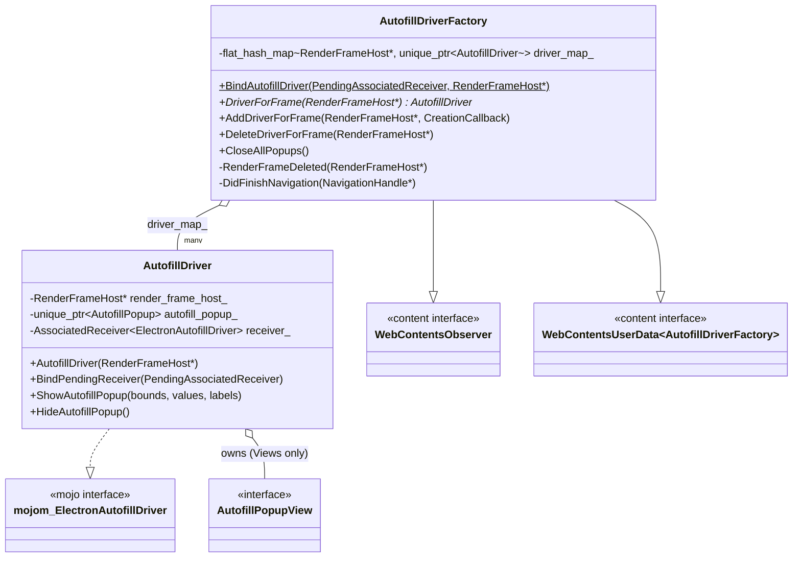
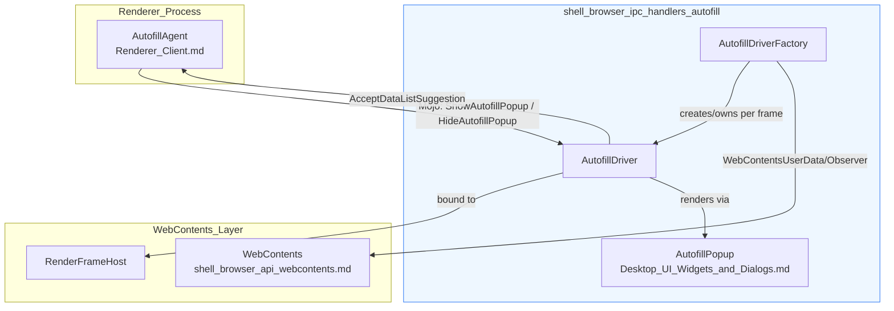
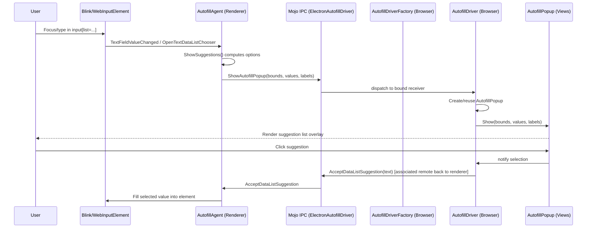
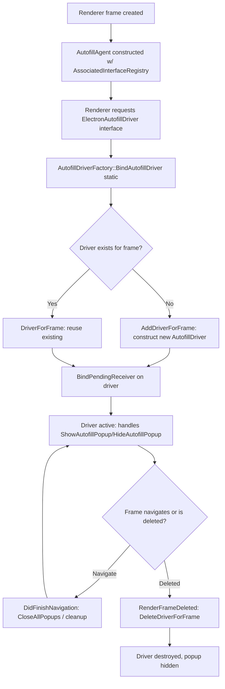

# Shell Browser IPC Handlers: Autofill

## Introduction

The **Shell Browser IPC Handlers: Autofill** module implements the browser-process side of Electron's built-in autofill/form-suggestion feature. It provides the Mojo IPC endpoint (`AutofillDriver`) that renderer processes use to request the browser to display or hide an autofill/datalist suggestion popup, and a per-`WebContents` factory (`AutofillDriverFactory`) that manages the lifecycle of one `AutofillDriver` instance per frame.

This module is a leaf component of the broader IPC handler subsystem (see [shell_browser_ipc_handlers_frame_sw_ipc](shell_browser_ipc_handlers_frame_sw_ipc.md) for sibling handlers), and it is the browser-side counterpart to the renderer-side `AutofillAgent` (see [Renderer_Client](Renderer_Client.md)). Together they implement the classic "input-suggest" UX for `<input>` elements with `list` attributes (HTML datalist) and other autofill-style suggestions inside Electron's `BrowserWindow`/`WebContents`.

Key responsibilities:
- Bridge Mojo messages (`mojom::ElectronAutofillDriver`) from a renderer frame's `AutofillAgent` to the native UI popup implementation.
- Own and manage the lifetime of the native `AutofillPopup` (Views-toolkit only) that visually renders suggestion lists.
- Track one `AutofillDriver` per `RenderFrameHost`, keyed by frame, cleaning up on frame deletion or navigation.
- Provide the static binder (`AutofillDriverFactory::BindAutofillDriver`) used to wire up the associated Mojo interface when the renderer requests it.

---

## Module Architecture

### Component Overview

### Relationship to Adjacent Modules

---

## Core Components

### `AutofillDriver`
Implements the `mojom::ElectronAutofillDriver` Mojo interface on the browser side. One instance exists per `RenderFrameHost` that has an active `AutofillAgent` connection.

Responsibilities:
- **`BindPendingReceiver`** — binds an incoming `PendingAssociatedReceiver<mojom::ElectronAutofillDriver>` (supplied by the renderer via associated interface) to its internal `mojo::AssociatedReceiver`.
- **`ShowAutofillPopup(bounds, values, labels)`** — Mojo call invoked from the renderer's `AutofillAgent` when a form field should show suggestions (e.g., HTML `<datalist>` options). On platforms using the Views toolkit (`TOOLKIT_VIEWS`), this lazily constructs/positions an `AutofillPopup` (see [Desktop_UI_Widgets_and_Dialogs](Desktop_UI_Widgets_and_Dialogs.md)) anchored at the given screen bounds, and populates it with the provided value/label pairs.
- **`HideAutofillPopup`** — dismisses/destroys the active `AutofillPopup`, if any.
- Holds a raw (non-owning) pointer to its associated `content::RenderFrameHost`, used to obtain native window/view geometry needed to position the popup.

Platform notes:
- The `AutofillPopup` member and its usage are compiled only `#if defined(TOOLKIT_VIEWS)`. On macOS (which uses Cocoa, not Views), autofill popup rendering is handled through a different native path; the `AutofillDriver` still exists to satisfy the Mojo contract but the popup view logic is a no-op/absent on non-Views platforms.

### `AutofillDriverFactory`
A `content::WebContentsUserData<AutofillDriverFactory>` and `content::WebContentsObserver` that manages the collection of `AutofillDriver` instances for all frames within a single `WebContents`.

Responsibilities:
- **`BindAutofillDriver` (static)** — entry point called by the content-layer Mojo binder registry when a renderer frame requests the `mojom::ElectronAutofillDriver` associated interface. It resolves the owning `WebContents` from the `RenderFrameHost`, fetches (or lazily creates) the `AutofillDriverFactory` for that `WebContents`, and delegates to `DriverForFrame`/`AddDriverForFrame` and `BindPendingReceiver`.
- **`DriverForFrame`** — looks up the `AutofillDriver` for a given `RenderFrameHost` in `driver_map_`, or `nullptr` if none exists.
- **`AddDriverForFrame`** — inserts a newly created `AutofillDriver` (produced by the supplied `CreationCallback`) into `driver_map_`, keyed by frame. The callback pattern allows deferred/injectable construction (useful for testing).
- **`DeleteDriverForFrame`** — removes and destroys the driver for a frame (implicitly hides any active popup via the driver's destructor path).
- **`CloseAllPopups`** — iterates all drivers and instructs each to hide its popup; used e.g. when the window loses focus, is resized, or navigates.
- **`RenderFrameDeleted`** (override of `WebContentsObserver`) — automatically removes the driver associated with a frame when that frame is destroyed, preventing dangling pointers/popups.
- **`DidFinishNavigation`** (override of `WebContentsObserver`) — closes any lingering popups and/or cleans up drivers when navigation completes, since suggestion state tied to the old page is no longer valid.

The `driver_map_` is an `absl::flat_hash_map<content::RenderFrameHost*, std::unique_ptr<AutofillDriver>>`, giving O(1) driver lookup per frame within a `WebContents`.

---

## Data Flow: Showing an Autofill Popup

## Process Flow: Driver Lifecycle per Frame

---

## Integration Points

| Interaction | Description | Related Module |
|---|---|---|
| Mojo interface `mojom::ElectronAutofillDriver` / `mojom::ElectronAutofillAgent` | Defines the contract between browser (`AutofillDriver`) and renderer (`AutofillAgent`) | [Common_Native_Gin_Infrastructure](Common_Native_Gin_Infrastructure.md) (mojom definitions live alongside `api.mojom`) |
| `AutofillPopup` / `AutofillPopupChildView` (Views) | Native widget rendering the suggestion dropdown | [Desktop_UI_Widgets_and_Dialogs](Desktop_UI_Widgets_and_Dialogs.md) |
| `content::WebContentsUserData` / `WebContentsObserver` | Base classes providing per-`WebContents` storage and lifecycle notifications | [shell_browser_api_webcontents](shell_browser_api_webcontents.md) |
| `AutofillAgent` | Renderer-side counterpart driving `TextFieldValueChanged`, `OpenTextDataListChooser`, etc. | [Renderer_Client](Renderer_Client.md) |
| Sibling IPC handlers (`ElectronApiIPCHandlerImpl`, `ElectronApiSWIPCHandlerImpl`) | Other frame/service-worker scoped Mojo handlers registered similarly | [shell_browser_ipc_handlers_frame_sw_ipc](shell_browser_ipc_handlers_frame_sw_ipc.md) |
| Utility/network-hints handlers | Other content-layer per-frame Mojo handler implementations | [shell_browser_ipc_handlers_utility_hints](shell_browser_ipc_handlers_utility_hints.md) |

---

## Design Notes

- **Per-frame, not per-WebContents, granularity for drivers**: Because a page can contain multiple frames (including OOPIFs), each `RenderFrameHost` gets its own `AutofillDriver`. The factory, however, is a single `WebContentsUserData`, giving one management point per tab/window.
- **Lazy driver creation**: Drivers are created on-demand when the renderer first binds the Mojo interface, avoiding unnecessary allocation for frames that never trigger autofill/datalist behavior.
- **Toolkit-conditional popup rendering**: Only platforms using the Chromium Views toolkit (Windows/Linux) render the popup through `AutofillPopup`. This keeps the Mojo/driver plumbing platform-agnostic while allowing native, toolkit-specific rendering where available.
- **Safety on navigation/frame teardown**: By observing `WebContentsObserver` callbacks (`RenderFrameDeleted`, `DidFinishNavigation`), the factory ensures no stale `AutofillDriver` or dangling popup survives past the frame's lifetime, avoiding use-after-free and orphaned UI overlays.
- **Extensibility via `CreationCallback`**: `AddDriverForFrame` accepts a factory callback rather than constructing `AutofillDriver` directly, enabling test doubles or alternate driver implementations without modifying `AutofillDriverFactory` itself.
