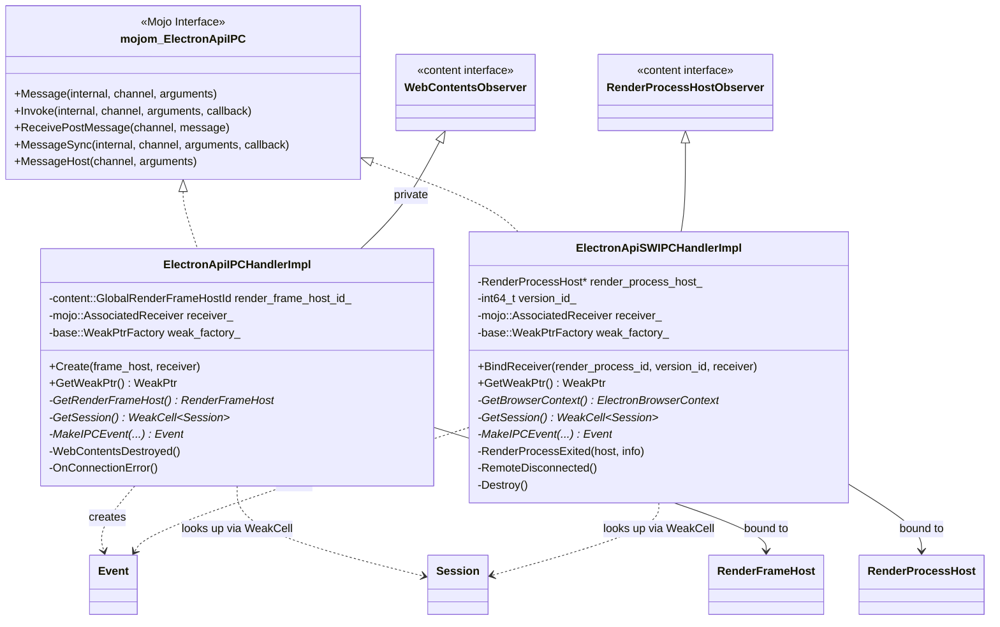
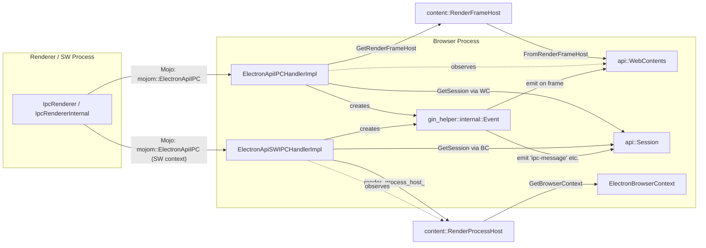
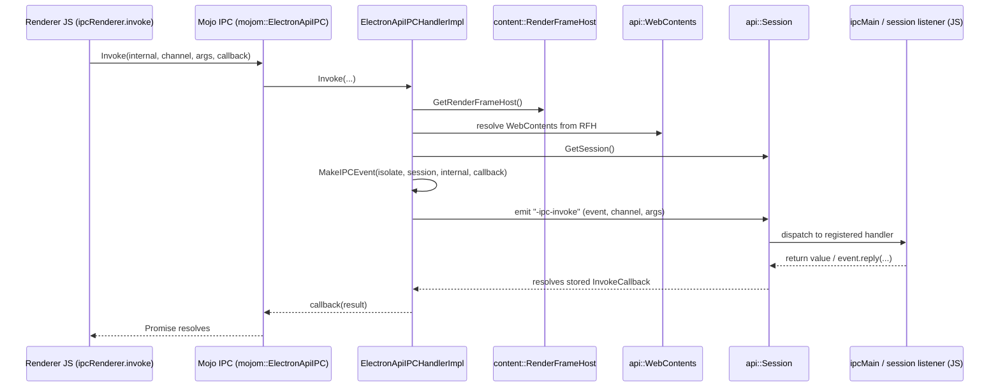
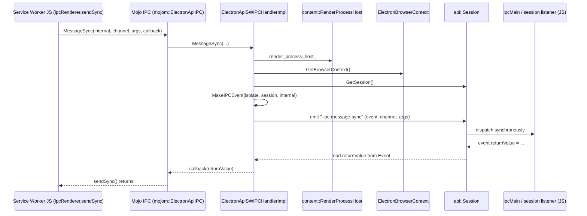
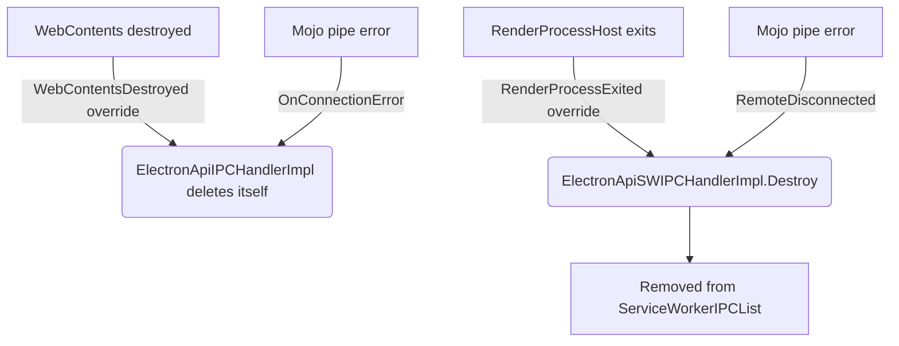

# Frame & Service Worker IPC Handlers

## Introduction

The **Frame & Service Worker IPC Handlers** module implements the browser-process endpoints of Electron's internal `mojom::ElectronApiIPC` Mojo interface. This interface is the low-level transport that powers the public `ipcRenderer` / `ipcMain` APIs (documented in [lib_renderer_ipc](lib_renderer_ipc.md)), allowing JavaScript running in a renderer document (a "frame") or in a Service Worker to send messages to, and receive replies from, the Electron main process.

The module contains two sibling implementations of the same Mojo interface, each tailored to the execution context that originates the IPC call:

| Component | Origin of messages | Lifetime tied to |
|---|---|---|
| `ElectronApiIPCHandlerImpl` | A `RenderFrameHost` (ordinary document / preload script) | The owning `content::WebContents` |
| `ElectronApiSWIPCHandlerImpl` | A Service Worker running inside a `RenderProcessHost` | The owning `content::RenderProcessHost` |

Both classes translate raw Mojo calls into Electron's `gin_helper::internal::Event`-based dispatch mechanism, ultimately surfacing the message on the JavaScript `Session` object (or `WebContents`, for the frame case) so that `ipcMain`/`session` listeners registered in user code can react to it.

This module is a child of [shell_browser_ipc_handlers](shell_browser_ipc_handlers.md), which groups all browser-side IPC glue code, and is a sibling of [shell_browser_ipc_handlers_autofill](shell_browser_ipc_handlers_autofill.md) and [shell_browser_ipc_handlers_utility_hints](shell_browser_ipc_handlers_utility_hints.md).

---

## Purpose & Core Functionality

Electron exposes a rich `ipcRenderer`/`ipcMain` messaging surface to application code. Under the hood, every `ipcRenderer.send`, `invoke`, `sendSync`, or `postMessage` call from a renderer is forwarded through a Mojo associated interface (`mojom::ElectronApiIPC`) to the browser process. The two handler classes in this module are the **only** two places in the codebase that implement that interface on the browser side:

1. **`ElectronApiIPCHandlerImpl`** — bound per `RenderFrameHost`. It backs IPC originating from normal page/preload contexts (see [lib_renderer_ipc](lib_renderer_ipc.md) and [shell_browser_api_webcontents](shell_browser_api_webcontents.md)).
2. **`ElectronApiSWIPCHandlerImpl`** — bound per Service Worker instance (identified by `RenderProcessHost` + `version_id`). It backs IPC originating from Service Worker execution contexts, which have no `RenderFrameHost` and are tracked via [shell_browser_api_session_net_service_workers](shell_browser_api_session_net_service_workers.md) (`ServiceWorkerContext`/`ServiceWorkerMain`).

Both classes implement the identical set of five Mojo methods:

- `Message` — fire-and-forget async message (`ipcRenderer.send`)
- `Invoke` — async message expecting a single reply (`ipcRenderer.invoke`)
- `MessageSync` — synchronous message expecting an immediate reply (`ipcRenderer.sendSync`)
- `ReceivePostMessage` — delivery of a `MessageChannel`-style transferable message (`ipcRenderer.postMessage`), see [lib_browser_api_messaging_and_guestviews](lib_browser_api_messaging_and_guestviews.md)
- `MessageHost` — message destined for the owning `WebContents`/embedder rather than global `ipcMain` listeners (used by `<webview>`)

---

## Architecture

### Class Structure

### Dependency Overview

---

## Component Details

### `ElectronApiIPCHandlerImpl`

Bound once per `RenderFrameHost` that hosts a preload/main-world script capable of sending IPC. Key characteristics:

- **Creation**: `Create(frame_host, receiver)` is invoked by the content layer's interface binder registry when a frame requests the `mojom::ElectronApiIPC` associated interface. The instance is self-owned (deletes itself, see destructor being private and reachable only internally) and tracked implicitly through the `mojo::AssociatedReceiver`.
- **Identity**: Stores a `content::GlobalRenderFrameHostId` rather than a raw `RenderFrameHost*`, since frames may be swapped/destroyed; `GetRenderFrameHost()` re-resolves the pointer on each call and can legitimately return `nullptr`.
- **Lifecycle coupling**: Privately inherits `content::WebContentsObserver` in order to observe `WebContentsDestroyed()`, tearing itself down when the hosting `WebContents` goes away (see [shell_browser_api_webcontents](shell_browser_api_webcontents.md)).
- **Session resolution**: `GetSession()` walks from the resolved `RenderFrameHost` to its `ElectronBrowserContext`/`Session` object (see [shell_browser_api_session_net_session_core](shell_browser_api_session_net_session_core.md)) using a `gin::WeakCell<api::Session>` to safely reference a potentially-GC'd V8 object.
- **Event construction**: `MakeIPCEvent()` builds a `gin_helper::internal::Event` (from [Gin_Helper](Common_Native_Gin_Infrastructure.md)) that is emitted on the `Session`/`WebContents` JS object, carrying `sender`, `frameId`, `internal` flag, and (for `Invoke`) a reply callback.
- **Disconnect handling**: `OnConnectionError()` is registered on the `AssociatedReceiver` to clean up if the renderer-side endpoint disconnects unexpectedly (e.g., crash).

### `ElectronApiSWIPCHandlerImpl`

Bound once per active Service Worker version that calls into the Electron IPC bridge from [Preload_ServiceWorker_(Renderer)](Preload_ServiceWorker_%28Renderer%29.md) contexts.

- **Creation**: `BindReceiver(render_process_id, version_id, receiver)` is a static factory used by the content/service-worker plumbing; it looks up the `RenderProcessHost` by ID and constructs the handler.
- **Identity**: Keyed by the pair `(render_process_host_, version_id_)` since a Service Worker has no associated `RenderFrameHost` — `version_id_` disambiguates multiple workers hosted by the same renderer process.
- **Lifecycle coupling**: Implements `content::RenderProcessHostObserver::RenderProcessExited()` to detect process termination and call `Destroy()`, which removes the instance from an internal "ServiceWorkerIPCList" registry (owned by the browser context / service worker context — see [shell_browser_api_session_net_service_workers](shell_browser_api_session_net_service_workers.md)).
- **Disconnect handling**: `RemoteDisconnected()` plays the analogous role to `OnConnectionError()` in the frame handler, invoked when the Mojo pipe itself is closed (as opposed to the whole process exiting).
- **Session resolution**: `GetBrowserContext()` resolves the `ElectronBrowserContext` from the `RenderProcessHost`, then `GetSession()` fetches the corresponding `Session` JS wrapper — mirroring the frame handler's pattern but without a frame in the chain.

Both classes share the private helper method signature `MakeIPCEvent(v8::Isolate*, api::Session*, bool internal, InvokeCallback)`, intentionally kept symmetric to ease maintenance and to route both paths through the same `Session`-level event-emission logic.

---

## Data Flow / Sequence Diagrams

### `ipcRenderer.invoke` via a normal frame

### `ipcRenderer.sendSync` from a Service Worker

### Teardown Paths

---

## Key Design Notes

- **Weak references over ownership**: Both handlers expose `GetWeakPtr()` (`base::WeakPtr`) so that asynchronous callbacks (e.g., `Invoke`'s reply) can safely no-op if the handler has already been destroyed mid-flight.
- **`gin::WeakCell<Session>`**: Rather than holding a strong reference to the V8-backed `Session` object, both handlers resolve it lazily via `GetSession()`, returning a `WeakCell` pointer. This avoids keeping the JS `Session` wrapper alive artificially and correctly handles isolate/context teardown — consistent with patterns used across [shell_browser_api_session_net_session_core](shell_browser_api_session_net_session_core.md).
- **Symmetric Mojo surface, divergent context resolution**: The two handlers deliberately implement the *same* `mojom::ElectronApiIPC` interface and produce equivalent `Event` objects, but differ entirely in how they resolve "who is sending this" — frame-based traversal vs. process/version-based lookup. This lets the JS-side `ipcMain` and `Session` event contracts stay agnostic to whether traffic originated from a document or a Service Worker.
- **Self-owned lifetime**: Neither handler is owned by a `unique_ptr` held elsewhere; each manages its own lifetime by observing the death of its associated content object (`WebContents` or `RenderProcessHost`) and self-destructing, a common pattern for Mojo-bound browser-side objects in Chromium/Electron.

---

## Related Modules

- [shell_browser_ipc_handlers](shell_browser_ipc_handlers.md) — parent module grouping all browser-side IPC endpoint implementations, including sibling handlers for autofill and network hints.
- [shell_browser_ipc_handlers_autofill](shell_browser_ipc_handlers_autofill.md) — analogous per-frame Mojo handler for autofill-specific messaging.
- [shell_browser_ipc_handlers_utility_hints](shell_browser_ipc_handlers_utility_hints.md) — analogous handlers for utility-process/network-hints messaging.
- [shell_browser_api_webcontents](shell_browser_api_webcontents.md) — defines `api::WebContents`, the JS-facing object that frame IPC events are ultimately emitted against.
- [shell_browser_api_session_net_session_core](shell_browser_api_session_net_session_core.md) — defines `api::Session`, the shared target object for both frame- and worker-originated IPC events, and hosts the `-ipc-*` event contract consumed by `ipcMain`.
- [shell_browser_api_session_net_service_workers](shell_browser_api_session_net_service_workers.md) — `ServiceWorkerContext`/`ServiceWorkerMain`, which track the Service Worker instances that `ElectronApiSWIPCHandlerImpl` represents.
- [lib_renderer_ipc](lib_renderer_ipc.md) — renderer-side `IpcRenderer`/`IpcRendererInternal` APIs that initiate the Mojo calls handled by this module.
- [lib_browser_api_messaging_and_guestviews](lib_browser_api_messaging_and_guestviews.md) — `MessageChannelMain` and guest-view messaging, relevant to `ReceivePostMessage` and `MessageHost` flows.
- [Common_Native_Gin_Infrastructure](Common_Native_Gin_Infrastructure.md) — home of `gin_helper::internal::Event` and related Gin/V8 wrapping utilities used to construct IPC events.
- [shell_browser_context](shell_browser_context.md) — `ElectronBrowserContext`, used by `ElectronApiSWIPCHandlerImpl` to resolve the owning `Session`.
