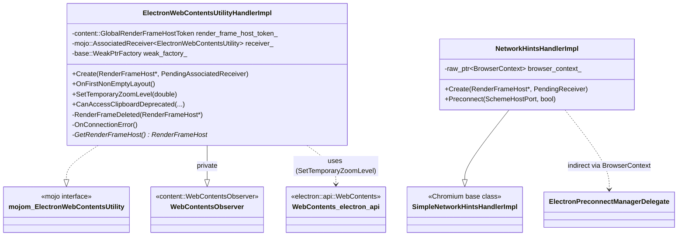
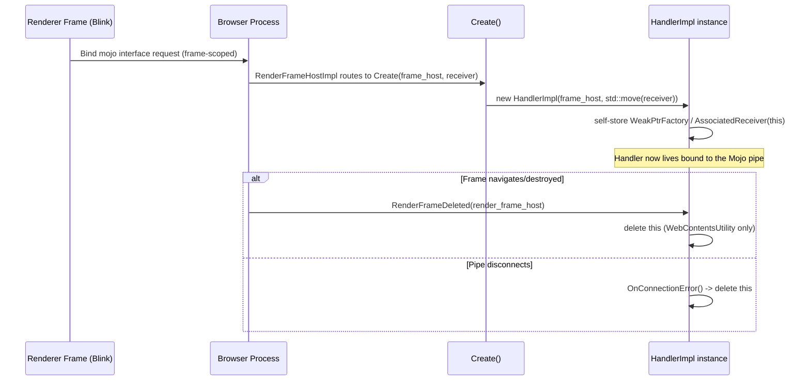
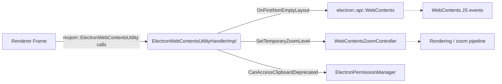
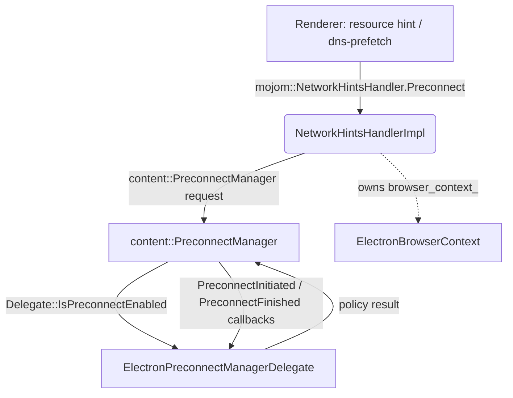
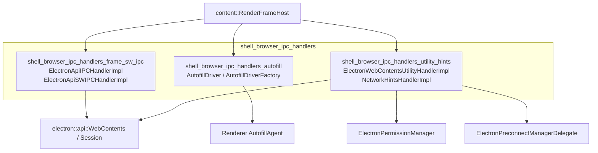
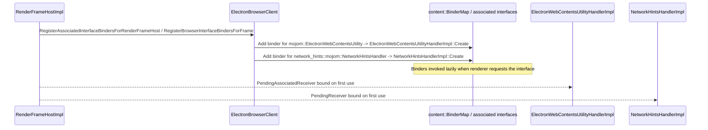

# Shell Browser IPC Handlers – Utility & Network Hints

## Introduction

The **`shell_browser_ipc_handlers_utility_hints`** module provides two small, focused Mojo message handlers that live in the browser process and service requests coming from individual renderer frames:

- **`ElectronWebContentsUtilityHandlerImpl`** — implements the `mojom::ElectronWebContentsUtility` interface, handling miscellaneous per-frame "utility" notifications and requests that don't belong to the main Electron IPC channel (e.g. first-layout notification, temporary zoom-level changes, and a deprecated clipboard permission check).
- **`NetworkHintsHandlerImpl`** — extends Chromium's `network_hints::SimpleNetworkHintsHandlerImpl` to implement DNS/connection preconnect hints (`Preconnect`) issued by a renderer frame (e.g. from `<link rel="preconnect">` or resource hints), scoped to the frame's `BrowserContext`.

Both classes are **per-`RenderFrameHost` Mojo endpoint implementations**: they are constructed via a static `Create()` factory that binds a `mojo::PendingReceiver`/`PendingAssociatedReceiver` originating from a specific frame, and they are torn down automatically when that frame goes away. This module is a sibling to [shell_browser_ipc_handlers_frame_sw_ipc](shell_browser_ipc_handlers_frame_sw_ipc.md) (which handles the primary `ElectronApiIPC`/`ElectronApiSWIPC` channels used for `ipcRenderer`/`ipcMain`) and to [shell_browser_ipc_handlers_autofill](shell_browser_ipc_handlers_autofill.md) (which handles autofill-specific Mojo interfaces). Together these three sibling modules make up the parent [shell_browser_ipc_handlers](shell_browser_ipc_handlers.md) group, itself part of the broader [WebContents_Rendering_&_Communication](Web_Contents.md) area of the Electron browser process.

---

## Purpose & Scope

| Component | Responsibility |
|---|---|
| `ElectronWebContentsUtilityHandlerImpl` | Handles renderer→browser utility notifications tied to `WebContents`/frame lifecycle: first non-empty layout signal, temporary zoom level override, and a deprecated clipboard-access permission check. |
| `NetworkHintsHandlerImpl` | Handles renderer→browser preconnect hints, forwarding them to Chromium's network preconnect machinery using the frame's `BrowserContext`. |

Neither class exposes JavaScript-visible APIs directly; they are internal plumbing that supports higher-level Electron behavior (zoom control, resource-hint based preconnect, clipboard permission gating) invoked implicitly by the renderer/Blink engine, not by app authors calling `electron` APIs directly.

---

## Architecture

### Class Relationships

### Ownership & Lifetime

Both handlers follow the standard Electron/Chromium **self-owned Mojo receiver** pattern: the handler instance owns its own `mojo::(Associated)Receiver`, is heap-allocated in `Create()`, and deletes itself either when the Mojo pipe disconnects or when the owning frame is destroyed.

---

## `ElectronWebContentsUtilityHandlerImpl`

### Responsibilities

1. **`OnFirstNonEmptyLayout()`** — Notified by the renderer when the frame produces its first non-empty layout; used by Electron to signal readiness-related events on the associated `WebContents`.
2. **`SetTemporaryZoomLevel(double level)`** — Allows a renderer frame to request a transient zoom level override, separate from the persisted per-origin zoom level managed by [Web_Contents](Web_Contents.md)'s `WebContentsZoomController`.
3. **`CanAccessClipboardDeprecated(...)`** — A backward-compatibility check gating clipboard read/write access by `mojom::PermissionName` and frame token; routed through the permission-check machinery associated with [shell_browser_context](shell_browser_context.md)'s `ElectronPermissionManager`.

### Key Implementation Details

- Identifies its associated frame via `content::GlobalRenderFrameHostToken` (`render_frame_host_token_`), resolved on demand through `GetRenderFrameHost()` rather than holding a raw pointer — this avoids dangling-pointer issues across navigations.
- Inherits privately from `content::WebContentsObserver` solely to observe `RenderFrameDeleted`, ensuring the handler is destroyed in lockstep with its frame.
- Uses `mojo::AssociatedReceiver` (not a plain `Receiver`) because `mojom::ElectronWebContentsUtility` is associated with another interface's message pipe (typically the frame's main interface bundle) to preserve message ordering.
- Depends on `shell/browser/api/electron_api_web_contents.h` (`electron::api::WebContents`) to apply the zoom level to the correct `WebContents` object — see [shell_browser_api_webcontents_core](shell_browser_api_webcontents_core.md).

### Data Flow

---

## `NetworkHintsHandlerImpl`

### Responsibilities

Implements a single override, `Preconnect(const url::SchemeHostPort& url, bool allow_credentials)`, invoked when a renderer signals a resource/DNS preconnect hint (e.g., `<link rel="preconnect">`, `<link rel="dns-prefetch">` lowered to preconnect, or speculative navigation hints). The implementation forwards the request into Chromium's network preconnect infrastructure, scoped by the frame's `content::BrowserContext` (`browser_context_`).

### Relationship to `ElectronPreconnectManagerDelegate`

`NetworkHintsHandlerImpl` does not itself decide whether preconnect is enabled — that policy decision is delegated to `ElectronPreconnectManagerDelegate` (declared in `shell/browser/electron_preconnect_manager_delegate.h`, part of [shell_browser_context](shell_browser_context.md)):

`ElectronPreconnectManagerDelegate::IsPreconnectEnabled()` reflects Electron-level settings (e.g., disabling preconnect for privacy or session configuration), and the no-op `PreconnectInitiated`/`PreconnectFinished` overrides indicate Electron currently does not collect preconnect statistics/telemetry.

### Construction

- Created via the static `Create(content::RenderFrameHost*, mojo::PendingReceiver<...>)`, mirroring the same self-owned-receiver pattern as the utility handler above, but binding a plain (non-associated) `PendingReceiver` since `NetworkHintsHandler` does not need strict ordering with another interface.
- Caches `browser_context_` as a `raw_ptr<content::BrowserContext>` at construction time from the frame host, used when issuing preconnect requests.

---

## Interaction With Sibling IPC Modules

This module is one of three sibling groups under [shell_browser_ipc_handlers](shell_browser_ipc_handlers.md):

Whereas `ElectronApiIPCHandlerImpl` (in [shell_browser_ipc_handlers_frame_sw_ipc](shell_browser_ipc_handlers_frame_sw_ipc.md)) carries the general-purpose `ipcRenderer.send/invoke/postMessage` traffic exposed to app JavaScript, the handlers in this module carry **engine-internal** hints and utility signals that are not part of the public `ipcRenderer` surface. Both groups, however, share the same registration pattern: they are instantiated per `RenderFrameHost` and are typically wired up in `ElectronBrowserClient`'s interface-binding code (see [shell_browser_main_parts_client_core_browser_client](shell_browser_main_parts_client_core_browser_client.md)).

---

## Registration Flow (Typical)

---

## Related Modules

- [shell_browser_ipc_handlers](shell_browser_ipc_handlers.md) — parent grouping of all per-frame IPC handler implementations.
- [shell_browser_ipc_handlers_frame_sw_ipc](shell_browser_ipc_handlers_frame_sw_ipc.md) — the primary `ElectronApiIPC` / `ElectronApiSWIPC` handlers backing `ipcRenderer`/`ipcMain` and Service Worker IPC.
- [shell_browser_ipc_handlers_autofill](shell_browser_ipc_handlers_autofill.md) — sibling handlers for the Autofill Mojo interfaces.
- [shell_browser_context](shell_browser_context.md) — defines `ElectronPreconnectManagerDelegate`, `ElectronPermissionManager`, and `ElectronBrowserContext` used by these handlers.
- [shell_browser_api_webcontents_core](shell_browser_api_webcontents_core.md) — the `electron::api::WebContents` class affected by `SetTemporaryZoomLevel` and `OnFirstNonEmptyLayout`.
- [Web_Contents](Web_Contents.md) — persistent zoom-level management (`WebContentsZoomController`) that interacts with temporary zoom overrides from this module.
- [shell_browser_main_parts_client_core_browser_client](shell_browser_main_parts_client_core_browser_client.md) — `ElectronBrowserClient`, the typical location where these handlers are registered against incoming frame-scoped Mojo interface requests.
