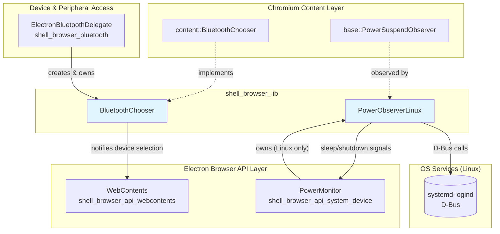
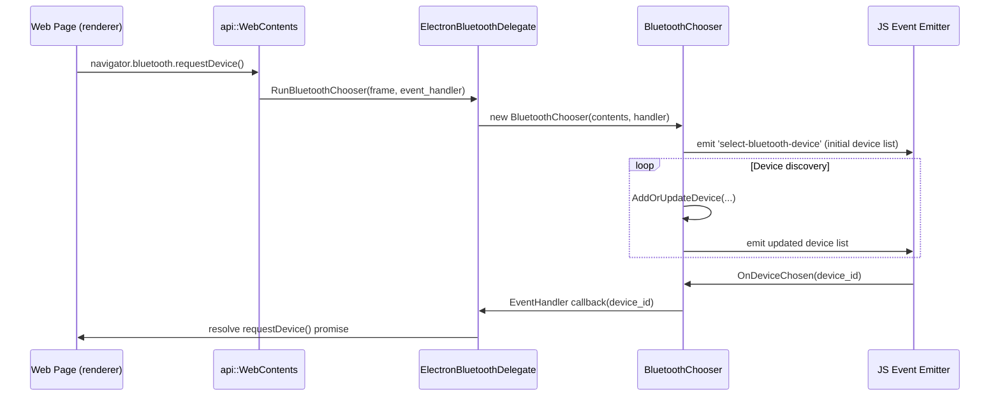
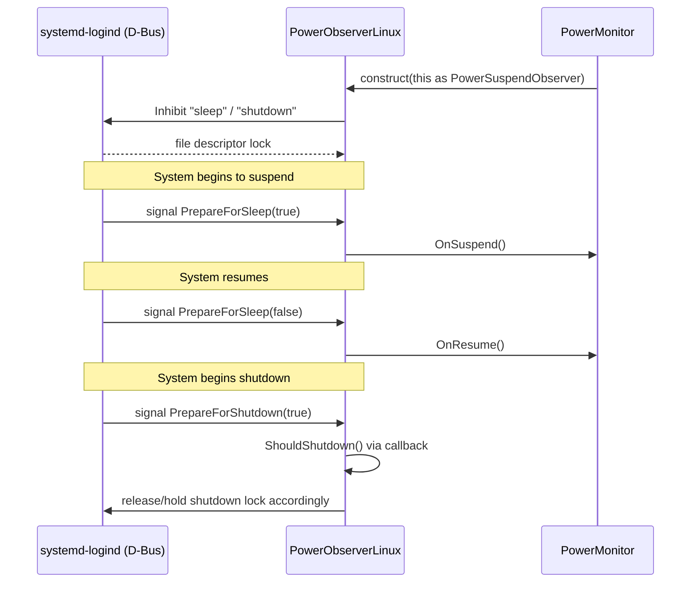
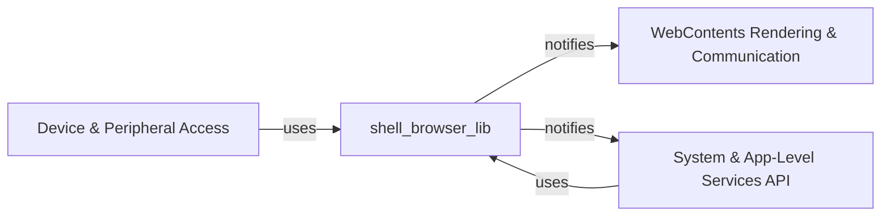

# `shell_browser_lib` — Browser Support Library Utilities

## 1. Purpose & Overview

`shell_browser_lib` is a small collection of low-level, platform-facing helper
classes that live under `shell/browser/lib/` in the Electron codebase. Unlike
the larger, feature-oriented browser subsystems (windowing, sessions,
extensions, etc.), this module contains **narrow, single-responsibility
utility classes** that are consumed by higher-level browser features to
bridge Chromium content-layer APIs and platform-specific system services.

Currently the module consists of two independent components:

| Component | File | Responsibility |
|---|---|---|
| `BluetoothChooser` | `shell/browser/lib/bluetooth_chooser.h` | Implements Chromium's `content::BluetoothChooser` interface to surface a Web Bluetooth device-selection UI backed by Electron's JS `select-bluetooth-device` event. |
| `PowerObserverLinux` | `shell/browser/lib/power_observer_linux.h` | Integrates with the Linux `systemd-logind` D-Bus service to observe and control system sleep/shutdown events, feeding results into Chromium's `base::PowerSuspendObserver` interface. |

Both classes act as **adapters**: they translate host OS / Chromium-internal
events into a form that Electron's higher-level API surface (`WebContents`,
`PowerMonitor`) and Node.js/JS event emitters can consume.

## 2. Architecture Overview

### Key relationships

- **`BluetoothChooser`** is instantiated by
  [`ElectronBluetoothDelegate`](shell_browser_bluetooth.md) (part of the
  [Device & Peripheral Access](shell_browser_bluetooth.md) module) whenever a
  web page requests a Bluetooth device via `navigator.bluetooth.requestDevice`.
  It holds a raw pointer back to the requesting
  [`api::WebContents`](shell_browser_api_webcontents_core.md) so it can emit
  chooser-related JS events (device list updates, adapter presence, etc.)
  through Electron's event emitter machinery
  (see [Gin Helper](Gin_Helper.md)).

- **`PowerObserverLinux`** is composed into the Linux build of
  [`PowerMonitor`](shell_browser_api_system_device.md) (part of
  [System & App-Level Services API](shell_browser_api_system_device.md)).
  It communicates with the `org.freedesktop.login1` D-Bus service to acquire
  sleep/shutdown inhibitor locks and listens for `PrepareForSleep` /
  `PrepareForShutdown` signals, forwarding them to the owning
  `base::PowerSuspendObserver` (implemented by `PowerMonitor`).

## 3. Component Details

### 3.1 `BluetoothChooser`

`BluetoothChooser` (with its nested `DeviceInfo` struct) implements the
Chromium `content::BluetoothChooser` abstract interface. It is the bridge
between the browser's native Bluetooth device-discovery machinery and
Electron's JavaScript-facing `webContents.on('select-bluetooth-device')` API.

**Responsibilities:**
- Maintain an internal map (`device_id_to_name_map_`) of discovered device
  IDs to their human-readable names.
- React to adapter presence/discovery-state changes
  (`SetAdapterPresence`, `ShowDiscoveryState`) forwarded from Chromium.
- Track newly discovered or updated devices (`AddOrUpdateDevice`) including
  signal strength, pairing, and GATT connection state.
- Expose the current device list to JS callers via `GetDeviceList()`.
- Resolve the chooser when the user (or application code) selects a device
  via `OnDeviceChosen(device_id)`, invoking the Chromium-supplied
  `EventHandler` callback.

**Collaborators:**
- `api::WebContents` — the owning web contents that triggered the chooser
  and that ultimately receives/dispatches the selection UI events in JS.
- `content::BluetoothChooser::EventHandler` — the Chromium callback invoked
  once a device is chosen or the chooser is cancelled.

### 3.2 `PowerObserverLinux`

`PowerObserverLinux` provides Linux-specific power-management integration by
talking to `systemd-logind` over D-Bus. It is only compiled/used on Linux
builds and is composed inside the cross-platform `PowerMonitor` API object.

**Responsibilities:**
- Acquire and release **sleep inhibitor locks** (`BlockSleep` /
  `UnblockSleep`) so the application can delay system suspend until it has
  finished necessary work.
- Acquire and release **shutdown inhibitor locks** (`BlockShutdown` /
  `UnblockShutdown`) analogously for system shutdown/reboot.
- Listen for the D-Bus signals `PrepareForSleep` and `PrepareForShutdown`
  emitted by `logind`, translating them into calls on the injected
  `base::PowerSuspendObserver*`.
- Support a user-supplied shutdown handler
  (`SetShutdownHandler(base::RepeatingCallback<bool()>)`) that determines
  whether the shutdown lock should actually be held (e.g., allowing the app
  to veto/delay shutdown for cleanup).

**Collaborators:**
- `dbus::Bus`, `dbus::ObjectProxy`, `dbus::Signal`, `dbus::Response` — the
  D-Bus plumbing used to communicate with `logind`.
- `base::PowerSuspendObserver` — the interface implemented by `PowerMonitor`
  that receives `OnSuspend()` / `OnResume()` notifications.

## 4. How This Module Fits Into the System

`shell_browser_lib` has no sub-modules of its own — it is a thin, leaf-level
utility layer. Its two components are each consumed by exactly one larger
subsystem:

- **Bluetooth**: `BluetoothChooser` is a supporting class for the
  [Device & Peripheral Access](shell_browser_bluetooth.md) module's
  `ElectronBluetoothDelegate`, which in turn is wired into
  `ElectronBrowserClient` (see
  [Browser Process Core & Lifecycle](shell_browser_main_parts_client_core_browser_client.md)).
  The selection UI it drives is surfaced through
  [`WebContents`](shell_browser_api_webcontents_core.md).

- **Power management**: `PowerObserverLinux` is a Linux-only implementation
  detail of the cross-platform
  [`PowerMonitor`](shell_browser_api_system_device.md) JS API, part of the
  broader [System & App-Level Services API](shell_browser_api_system_device.md)
  module.

## 5. Related Documentation

- [Device & Peripheral Access — Bluetooth](shell_browser_bluetooth.md)
- [System & App-Level Services API](shell_browser_api_system_device.md)
- [WebContents Core API](shell_browser_api_webcontents_core.md)
- [Browser Client Core](shell_browser_main_parts_client_core_browser_client.md)
- [Gin Helper (event emitter infrastructure)](Gin_Helper.md)
