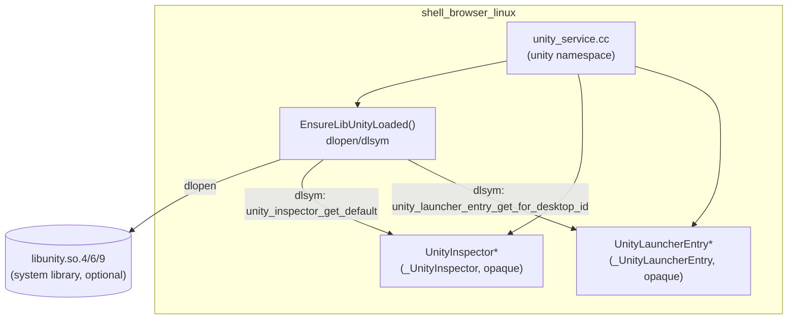
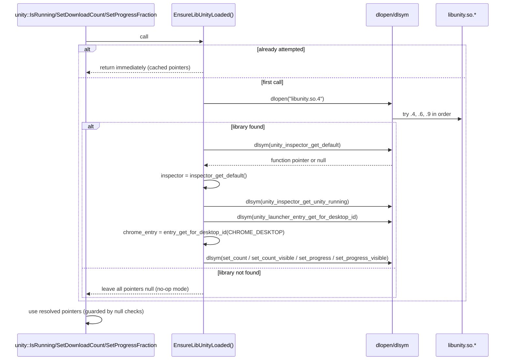
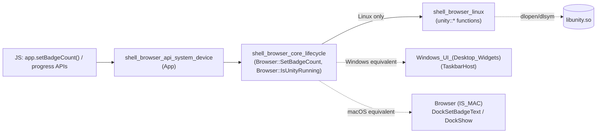
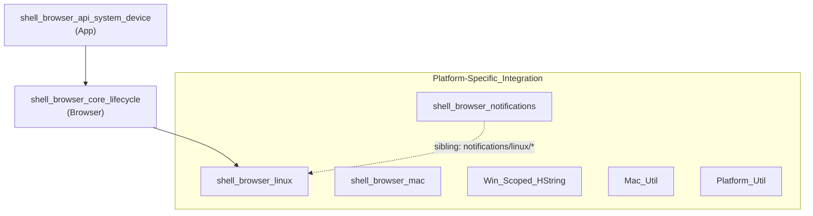

# Shell Browser Linux Module

## Introduction

The `shell_browser_linux` module contains Electron's Linux-specific desktop shell integration
code. In its current form the module is a thin, dynamically-loaded bridge between Electron's
cross-platform `Browser` singleton and the **Unity launcher** API (`libunity`), which powers the
application launcher/dock badge counts and progress indicators on Ubuntu's Unity desktop
environment (and Unity-compatible docks on other Linux desktops, e.g. via `libunity` shims).

This module is the Linux counterpart to the Windows taskbar integration found in
[Windows_UI_(Desktop_Widgets)](Windows_UI_(Desktop_Widgets).md) (`TaskbarHost`, `JumpList`) and the
macOS Dock APIs exposed through `Browser` on macOS. It allows the same public
`app.setBadgeCount()` / progress-bar style JS APIs (implemented in
[shell_browser_api_system_device](shell_browser_api_system_device.md) and consumed by
[shell_browser_core_lifecycle](shell_browser_core_lifecycle.md)) to work transparently on Linux
desktops that support the Unity Launcher protocol.

## Purpose & Scope

* Detect at runtime whether a Unity-compatible launcher is present (`unity::IsRunning()`).
* Forward "badge count" (download count) updates to the launcher icon
  (`unity::SetDownloadCount()`).
* Forward progress-bar updates to the launcher icon (`unity::SetProgressFraction()`).
* Do all of the above **without introducing a hard link-time dependency on `libunity`**, since
  most Linux desktop environments do not ship this library. This is achieved through `dlopen`/
  `dlsym` runtime loading.

Because `libunity` is an optional runtime dependency, all public functions in this module are
designed to fail gracefully (no-op) when the library cannot be located, so Electron apps behave
identically on GNOME, KDE, XFCE, etc. where Unity is absent.

## Core Components

### `_UnityInspector` / `UnityInspector`
Opaque forward-declared struct type representing libunity's singleton inspector object. Electron
never defines this struct's layout — it is only ever accessed through function pointers resolved
via `dlsym`, and only ever passed back into libunity's own API. This opaque-pointer pattern avoids
requiring libunity's headers at Electron build time.

### `_UnityLauncherEntry` / `UnityLauncherEntry`
Opaque forward-declared struct type representing a single Unity Launcher entry (the icon
associated with the running application, keyed by the desktop file id, e.g. `electron.desktop`).
Like `UnityInspector`, this is treated as an opaque pointer sourced entirely from resolved
`dlsym` function pointers.

## Architecture

The module implements the classic **optional runtime dependency** pattern: it declares function
pointer typedefs matching libunity's C ABI, attempts a lazy `dlopen`, and resolves each required
symbol via `dlsym`. All state (whether the load was attempted, the resolved function pointers, and
the resolved `UnityInspector`/`UnityLauncherEntry` instances) is kept in anonymous-namespace
file-static variables, making this file behave as a lazily-initialized singleton service.

## Public API (namespace `unity`)

| Function | Description |
|---|---|
| `bool IsRunning()` | Returns whether a Unity launcher is currently running, by querying the resolved `UnityInspector` singleton. Returns `false` if libunity is unavailable. |
| `void SetDownloadCount(int count)` | Sets the numeric badge (count) on the launcher icon and toggles its visibility based on whether `count != 0`. |
| `void SetProgressFraction(float percentage)` | Sets the progress bar fraction (0.0–1.0) on the launcher icon and toggles its visibility when `0.0 < percentage < 1.0`. |

All three functions call `EnsureLibUnityLoaded()` first, which performs the one-time (memoized via
`attempted_load`) library load and symbol resolution.

### Symbol Resolution Table

| Resolved Symbol | Function Pointer Typedef | Used By |
|---|---|---|
| `unity_inspector_get_default` | `unity_inspector_get_default_func` | Bootstraps `inspector` |
| `unity_inspector_get_unity_running` | `unity_inspector_get_unity_running_func` | `IsRunning()` |
| `unity_launcher_entry_get_for_desktop_id` | `unity_launcher_entry_get_for_desktop_id_func` | Bootstraps `chrome_entry` (keyed by `CHROME_DESKTOP` env var) |
| `unity_launcher_entry_set_count` | `unity_launcher_entry_set_count_func` | `SetDownloadCount()` |
| `unity_launcher_entry_set_count_visible` | `unity_launcher_entry_set_count_visible_func` | `SetDownloadCount()` |
| `unity_launcher_entry_set_progress` | `unity_launcher_entry_set_progress_func` | `SetProgressFraction()` |
| `unity_launcher_entry_set_progress_visible` | `unity_launcher_entry_set_progress_visible_func` | `SetProgressFraction()` |

## Initialization / Lazy Loading Sequence

## Integration with the rest of Electron

`unity::IsRunning()`, `unity::SetDownloadCount()`, and `unity::SetProgressFraction()` are consumed
by the Linux implementation of the cross-platform `Browser` class
(`shell/browser/browser_linux.cc`), documented in
[shell_browser_core_lifecycle](shell_browser_core_lifecycle.md). That file also defines
`LaunchXdgUtilityScopedAllowBaseSyncPrimitives`, a small RAII helper
(`base::ScopedAllowBaseSyncPrimitivesForTesting` subclass) used to permit synchronous blocking
primitives when launching `xdg-*` command-line utilities (e.g. `xdg-open`, `xdg-settings`) from the
UI thread — a separate concern from the Unity launcher bridge, but co-located in the same
Linux-specific `Browser` translation unit.

* **Badge count**: When a `WebContents` download completes/updates on Linux, or when JS calls
  `app.setBadgeCount(count)`, `Browser::SetBadgeCount()` (see
  [shell_browser_core_lifecycle](shell_browser_core_lifecycle.md)) eventually calls into
  `unity::SetDownloadCount()` to reflect the number on the app's launcher icon.
* **Unity detection**: `Browser::IsUnityRunning()` (Linux-only method on `Browser`, guarded by
  `BUILDFLAG(IS_LINUX)`) directly proxies to `unity::IsRunning()`, allowing JS/native code to
  branch on desktop environment capabilities.
* **Progress bar**: Progress-fraction updates (e.g. from download progress) reuse
  `unity::SetProgressFraction()` analogous to `TaskbarHost::SetProgressBar` on Windows
  (see [Windows_UI_(Desktop_Widgets)](Windows_UI_(Desktop_Widgets).md)) and `Browser::DockSetIcon`
  progress overlays on macOS.

## Dependency Relationships

## Design Notes & Rationale

1. **No compile-time libunity dependency.** All structs are opaque and all functions are resolved
   via `dlsym`, so Electron binaries do not need libunity development headers/libs at build time,
   and run correctly on systems where the library is entirely absent.
2. **Memoized, one-shot loading.** The `attempted_load` flag ensures `dlopen`/`dlsym` calls happen
   at most once per process, regardless of how many times `IsRunning()`, `SetDownloadCount()`, or
   `SetProgressFraction()` are invoked.
3. **Fail-safe no-op behavior.** Every public function guards on the resolved function pointers
   being non-null before calling into libunity, so missing symbols (e.g. an older/newer libunity
   ABI) degrade gracefully instead of crashing.
4. **Desktop id lookup via environment variable.** The Unity Launcher entry is looked up using the
   `CHROME_DESKTOP` environment variable (inherited from Chromium's shared desktop integration
   code), which is expected to hold the `.desktop` file id of the running Electron application.

## Related Modules

* [shell_browser_core_lifecycle](shell_browser_core_lifecycle.md) — Defines the `Browser` class
  whose Linux translation unit (`browser_linux.cc`) is the primary consumer of this module's
  `unity::*` functions, and also hosts `LaunchXdgUtilityScopedAllowBaseSyncPrimitives`.
* [shell_browser_api_system_device](shell_browser_api_system_device.md) — Exposes the JS-facing
  `app` API (badge count, etc.) that ultimately triggers calls into this module on Linux.
* [Windows_UI_(Desktop_Widgets)](Windows_UI_(Desktop_Widgets).md) — Windows equivalent
  functionality (taskbar progress/badges) via `TaskbarHost`.
* [shell_browser_notifications](shell_browser_notifications.md) — Sibling Linux desktop
  integration code (`notifications/linux/*`) for desktop notifications, following a similar
  platform-abstraction pattern.
* [shell_browser_mac](shell_browser_mac.md) — macOS sibling module under
  `Platform-Specific_Integration` covering in-app purchase observers/products.
