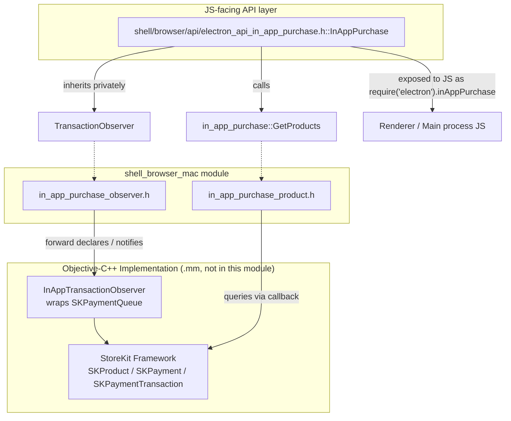
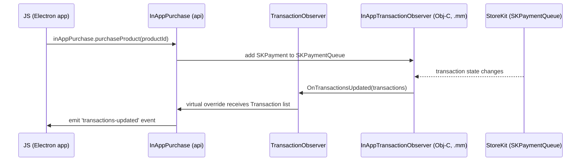
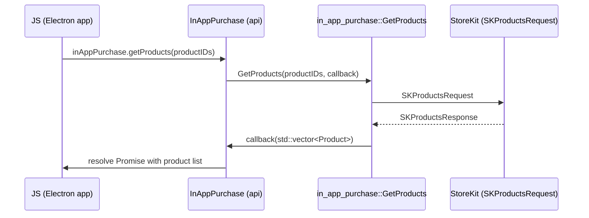

# Shell Browser Mac Module

## Introduction

The `shell_browser_mac` module contains the macOS-specific native (C++/Objective-C++) bridge code that powers Electron's **In-App Purchase (IAP)** support on macOS. It wraps Apple's StoreKit APIs (`SKPaymentQueue`, `SKProduct`, `SKPaymentTransaction`, etc.) into plain C++ data structures and an observer interface that the rest of the Electron browser process can consume without depending directly on Objective-C types.

This module is one of the platform-specific leaves of the broader **Platform-Specific Integration** area of the codebase (see sibling modules such as [shell_browser_linux](shell_browser_linux.md), [Win_Scoped_HString](win_scoped_hstring.md), [Mac_Util](mac_util.md), [Platform_Util](platform_util.md), and [shell_browser_notifications](shell_browser_notifications.md)). Its primary consumer is the JavaScript-facing `InAppPurchase` API object exposed to Electron app developers.

## Purpose

- Provide a **C++-only surface** (usable from both `.cc` and Objective-C++ `.mm` translation units) to describe StoreKit payments, products, discounts, and transactions.
- Decouple StoreKit's Objective-C object model from the rest of Electron's C++ browser process code, so headers like `electron_api_in_app_purchase.h` can be compiled by files that are not Objective-C++.
- Define the **Observer pattern** used to propagate transaction state changes (purchase started, purchased, failed, restored, deferred) from the native StoreKit payment queue up into JavaScript-visible events.
- Provide an asynchronous product-lookup facility (`GetProducts`) that queries the App Store for product metadata (price, discounts, subscription periods) and returns results via a callback.

## Architecture Overview

The module is intentionally small and split into two headers, each covering one StoreKit concern:

1. **Transactions & Observation** (`in_app_purchase_observer.h`) — models a purchase attempt and its lifecycle, and defines the observer interface used to be notified of transaction updates.
2. **Products & Pricing** (`in_app_purchase_product.h`) — models App Store product metadata (price, discounts, subscription periods) and exposes the `GetProducts` async lookup function.

Both headers use the forward-declared Objective-C class `InAppTransactionObserver` as the actual StoreKit-facing implementation (defined in the corresponding `.mm` file, not part of this documented core), while exposing only plain C++ structs/classes to the rest of the codebase.

### Data Flow: Purchasing a Product

### Data Flow: Fetching Products

## Core Components

### Transaction & Observer Model (`in_app_purchase_observer.h`)

| Component | Description |
|---|---|
| `PaymentDiscount` | Mirrors `SKPaymentDiscount`: identifier, key identifier, nonce, signature, and timestamp used for promotional/subscription offers applied to a payment. |
| `Payment` | Mirrors `SKPayment`: product identifier, quantity, application username, and an optional `PaymentDiscount`. Represents a purchase request. |
| `Transaction` | Mirrors `SKPaymentTransaction`: transaction identifier, date, original transaction identifier (for restores), error code/message, state string (e.g. purchasing, purchased, failed, restored, deferred), and the originating `Payment`. |
| `TransactionObserver` | Abstract base class with pure virtual `OnTransactionsUpdated(const std::vector<Transaction>&)`. Non-copyable. Holds a raw (excluded from pointer tracking) reference to the Objective-C `InAppTransactionObserver` that drives it, plus a `base::WeakPtrFactory` for safe async callbacks. This is the extension point implemented by `shell::api::InAppPurchase` (see [System_&_App-Level_Services_API](shell_browser_api_system_device.md)) to receive purchase lifecycle events in C++/JS-friendly form. |

### Product & Pricing Model (`in_app_purchase_product.h`)

| Component | Description |
|---|---|
| `ProductSubscriptionPeriod` | Mirrors `SKProductSubscriptionPeriod`: number of units and unit type (day/week/month/year) describing a subscription's billing period. |
| `ProductDiscount` | Mirrors `SKProductDiscount`: identifier, discount type, price, price locale, payment mode, number of periods, and optional `ProductSubscriptionPeriod`. Represents introductory or promotional pricing. |
| `Product` | Mirrors `SKProduct`: identifier, localized title/description, pricing (raw + formatted + currency), optional introductory price, list of `ProductDiscount`s, subscription group id and period, and downloadable-content metadata (version, content lengths). |
| `InAppPurchaseProductsCallback` | `base::OnceCallback<void(std::vector<Product>)>` type alias used to deliver asynchronous product lookup results. |
| `GetProducts(productIDs, callback)` | Free function that asynchronously queries the App Store for the given product identifiers and invokes `callback` with the resulting `Product` list. Implemented against `SKProductsRequest` in the corresponding `.mm` file. |

## Relationship to the Public API

The plain C++ types defined here are consumed by `shell/browser/api/electron_api_in_app_purchase.h::InAppPurchase`, which is part of the [System_&_App-Level_Services_API](shell_browser_api_system_device.md) module. `InAppPurchase`:

- Privately inherits `in_app_purchase::TransactionObserver` to receive `OnTransactionsUpdated` callbacks and re-emit them as JS events (via `gin_helper::EventEmitterMixin`).
- Exposes `purchaseProduct()` and `getProducts()` methods (returning V8 Promises) that internally build `Payment` objects and call `in_app_purchase::GetProducts`.
- Is registered as a `gin_helper::DeprecatedWrappable` so it can be surfaced to JavaScript as `require('electron').inAppPurchase`.

This mirrors the general pattern used throughout Electron's native layer: platform-specific glue (this module) stays free of scripting-engine (V8/Gin) concerns, while a separate `api::*` class (documented alongside the rest of the [System & App-Level Services API](shell_browser_api_system_device.md)) handles JS binding using the [Common Native Gin Infrastructure](gin_helper.md).

## Platform Context

`shell_browser_mac` is one of several OS-specific integration points alongside:

- [shell_browser_linux](shell_browser_linux.md) — Unity launcher integration for Linux.
- [Win_Scoped_HString](win_scoped_hstring.md) — Windows `HSTRING` RAII wrapper.
- [Mac_Util](mac_util.md) — General macOS bundle/NSData utilities.
- [Platform_Util](platform_util.md) — Cross-platform OS shell utilities (trash, open external, etc.).
- [shell_browser_notifications](shell_browser_notifications.md) — Native notification presenters per platform (mac/linux/win).

These modules collectively implement the platform abstraction layer that lets Electron's cross-platform C++ core (see [Browser_Process_Core_&_Lifecycle](shell_browser_main_parts_content_delegates.md) and related) delegate OS-specific behavior to dedicated, focused components.

## Notes for Maintainers

- This module has no sub-modules; both headers are tightly scoped and small enough to document together.
- The actual StoreKit interaction (`InAppTransactionObserver` Objective-C class, `SKProductsRequest` delegate implementation) lives in `.mm` implementation files that are not part of the documented core component set, but their C++-visible contracts are fully captured by the types described here.
- Because `TransactionObserver` uses `RAW_PTR_EXCLUSION`, care must be taken regarding the lifetime of the Objective-C observer relative to the C++ `TransactionObserver` instance; the `base::WeakPtrFactory` is used to guard against use-after-free during async StoreKit callbacks.
