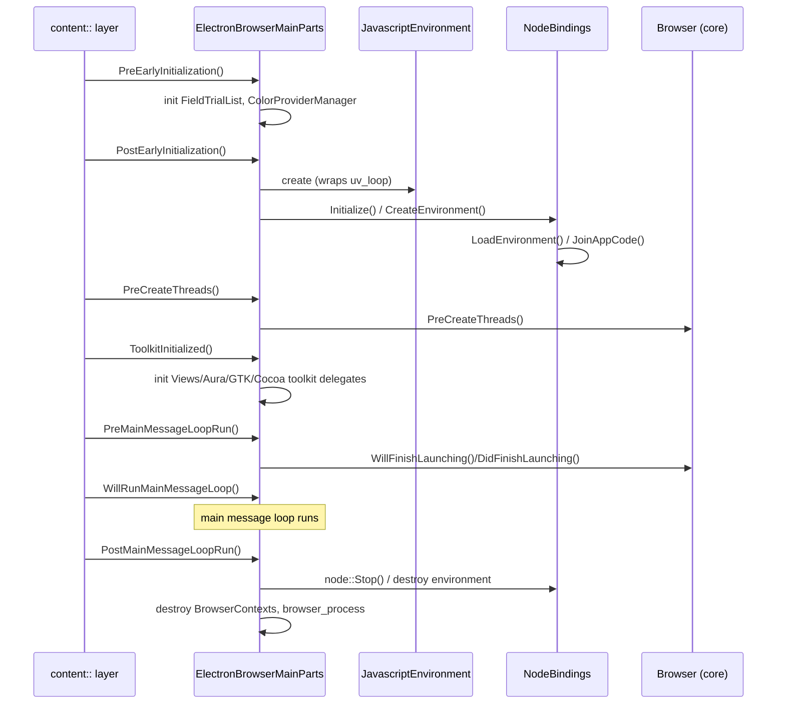

# Browser Process Core & Lifecycle: `shell_browser_main_parts`

## 1. Introduction and Purpose

The `shell_browser_main_parts` module is the **central nervous system of Electron's browser (main) process**. It contains the two most important integration points between Chromium's `//content` layer and Electron's own runtime:

- **`ElectronBrowserClient`** — Electron's implementation of `content::ContentBrowserClient`. It is the single hook Chromium uses to ask embedder-specific questions ("which delegate handles Bluetooth/HID/USB/WebAuthn?", "how should navigation/URL-loading be intercepted?", "what is the user agent?", etc).
- **`ElectronBrowserMainParts`** — Electron's implementation of `content::BrowserMainParts`. It drives the ordered startup/shutdown sequence of the browser process: initializing the V8/Node.js environment, loading the user's main script, wiring up platform UI toolkits (Views/Aura/GTK/Cocoa), and tearing everything down cleanly on exit.

Around these two classes the module also bundles a set of smaller, focused helpers that `ElectronBrowserMainParts`/`ElectronBrowserClient` depend on or delegate to: the V8 isolate/context wrapper (`JavascriptEnvironment`), Chromium content-layer glue classes (GPU client, navigation throttle, speech recognition delegate, WebUI factory, plugin-info host), and supporting utilities for font defaults, NSS certificate password prompts, and PDF viewer wiring.

Because `ElectronBrowserMainParts`/`ElectronBrowserClient` sit at the root of the object graph, almost every other module in the codebase (Browser Context & Session Management, Native Window & Menu Management, WebContents Rendering, Extensions, Device & Peripheral Access, Networking, Desktop UI, etc.) is either instantiated by, or is queried through, this module.

## 2. Architecture Overview

```mermaid
flowchart TB
    subgraph Chromium_Content_Layer["Chromium //content layer"]
        CBC["content::ContentBrowserClient"]
        BMP["content::BrowserMainParts"]
    end

    subgraph shell_browser_main_parts["shell_browser_main_parts module"]
        EBC["ElectronBrowserClient"]
        EBMP["ElectronBrowserMainParts"]
        JSENV["JavascriptEnvironment / MicrotasksRunner"]
        GPU["ElectronGpuClient"]
        NAVTHROTTLE["ElectronNavigationThrottle"]
        SPEECH["ElectronSpeechRecognitionManagerDelegate"]
        WEBUIFACTORY["ElectronWebUIControllerFactory"]
        PLUGININFO["ElectronPluginInfoHostImpl"]
        FONTDEF["SetFontDefaults (font_defaults)"]
        NSSDELEGATE["ElectronNSSCryptoModuleDelegate"]
        PDFCLIENT["ElectronPDFDocumentHelperClient"]
    end

    CBC -.implements.-> EBC
    BMP -.implements.-> EBMP

    EBMP -->|owns| JSENV
    EBMP -->|creates| NodeBindingsRef["NodeBindings (Common_Native_Gin_Infrastructure)"]
    EBMP -->|creates| ElectronBindingsRef["ElectronBindings (Common_Native_Gin_Infrastructure)"]
    EBMP -->|owns| BrowserRef["Browser (shell_browser_core)"]
    EBMP -->|owns| BrowserProcessImplRef["BrowserProcessImpl (shell_browser_core)"]

    EBC -->|delegates Bluetooth| BTDelegate["ElectronBluetoothDelegate (Device_&_Peripheral_Access)"]
    EBC -->|delegates HID| HIDDelegate["ElectronHidDelegate (Device_&_Peripheral_Access)"]
    EBC -->|delegates Serial| SerialDelegate["ElectronSerialDelegate (Device_&_Peripheral_Access)"]
    EBC -->|delegates USB| USBDelegate["ElectronUsbDelegate (Device_&_Peripheral_Access)"]
    EBC -->|delegates WebAuthn| WebAuthnDelegate["ElectronWebAuthenticationDelegate (Device_&_Peripheral_Access)"]
    EBC -->|creates| EBMP
    EBC -->|creates| NotifPresenter["PlatformNotificationService (Platform-Specific_Integration)"]
    EBC -->|creates throttles via| NAVTHROTTLE
    EBC -->|creates delegate via| SPEECH

    EBMP -->|registers| WEBUIFACTORY
    EBMP -->|reads/writes| FONTDEF

    style shell_browser_main_parts fill:#eef6ff,stroke:#3a7bd5
```

## 3. Sub-modules

The module is organized into four cohesive groups of components:

| Sub-module | Focus | Documentation |
|---|---|---|
| Browser Client & Main Parts Core | The two central embedder classes: `ElectronBrowserClient` and `ElectronBrowserMainParts` | [shell_browser_main_parts_client_core.md](shell_browser_main_parts_client_core.md) |
| JavaScript/V8 Environment | V8 isolate/context lifecycle and microtask flushing used by the main process's embedded Node.js runtime | [shell_browser_main_parts_js_environment.md](shell_browser_main_parts_js_environment.md) |
| Content-Layer Delegates | Small `content::` interface implementations for GPU process setup, navigation throttling, speech recognition, WebUI routing and plugin info | [shell_browser_main_parts_content_delegates.md](shell_browser_main_parts_content_delegates.md) |
| Rendering & Security Support Utilities | Font-default computation, NSS client-certificate password prompting, and PDF viewer helper wiring | [shell_browser_main_parts_support_utils.md](shell_browser_main_parts_support_utils.md) |

### 3.1 Browser Client & Main Parts Core
`ElectronBrowserClient` and `ElectronBrowserMainParts` form the backbone of the browser process. `ElectronBrowserClient` answers Chromium's embedder queries (delegates for Bluetooth/HID/Serial/USB/WebAuthn, navigation throttle creation, URL loader factory configuration, client certificate selection, etc.) while `ElectronBrowserMainParts` drives the ordered startup sequence (`PreEarlyInitialization` → `PostEarlyInitialization` → `PreCreateThreads` → `ToolkitInitialized` → `PreMainMessageLoopRun` → ... → `PostMainMessageLoopRun`) that bootstraps V8/Node.js, the platform UI toolkit, and Electron's `Browser` singleton. See [shell_browser_main_parts_client_core.md](shell_browser_main_parts_client_core.md).

### 3.2 JavaScript/V8 Environment
`JavascriptEnvironment` wraps the V8 `Isolate`/`IsolateHolder` and `node::MultiIsolatePlatform` used by the browser process's embedded Node.js runtime, while `MicrotasksRunner` is a `base::TaskObserver` that flushes V8 microtasks (promise callbacks) between browser-process tasks since Node uses the `kExplicit` microtasks policy. See [shell_browser_main_parts_js_environment.md](shell_browser_main_parts_js_environment.md).

### 3.3 Content-Layer Delegates
A collection of narrowly-scoped `content::` interface implementations instantiated by `ElectronBrowserClient`/`ElectronBrowserMainParts`: `ElectronGpuClient` (GPU process content client), `ElectronNavigationThrottle` (navigation gating), `ElectronSpeechRecognitionManagerDelegate` (Web Speech API), `ElectronWebUIControllerFactory` (routes `chrome://`-style WebUI URLs), and `ElectronPluginInfoHostImpl` (legacy NPAPI/PPAPI plugin info lookups). See [shell_browser_main_parts_content_delegates.md](shell_browser_main_parts_content_delegates.md).

### 3.4 Rendering & Security Support Utilities
Support code used while rendering pages or handling security prompts: `SetFontDefaults`/`FontDefault` (computes default per-script font family preferences, ported from Chromium's `prefs_tab_helper.cc`), `ElectronNSSCryptoModuleDelegate` (prompts for NSS crypto module/token passwords on Linux), and `ElectronPDFDocumentHelperClient` (wires up the built-in Chromium PDF viewer's content-restriction and save/searchify hooks). See [shell_browser_main_parts_support_utils.md](shell_browser_main_parts_support_utils.md).

## 4. Startup / Shutdown Sequence

## 5. Relationship to Other Modules

- **[shell_browser_core](shell_browser_core.md) / [shell_browser_core_lifecycle](shell_browser_core_lifecycle.md) / [shell_browser_core_services](shell_browser_core_services.md)**: `ElectronBrowserMainParts` owns and initializes the `Browser` singleton and the fake `BrowserProcessImpl`, which are documented in the sibling "Browser Process Core" module.
- **Common_Native_Gin_Infrastructure**: `NodeBindings` and `ElectronBindings` (created by `ElectronBrowserMainParts`) live in this module and provide the Node.js/V8 glue and Gin object wrapping used across all of Electron's native APIs.
- **Device_&_Peripheral_Access**: `ElectronBrowserClient` exposes and owns instances of `ElectronBluetoothDelegate`, `ElectronHidDelegate`, `ElectronSerialDelegate`, `ElectronUsbDelegate`, and `ElectronWebAuthenticationDelegate`, all defined in that module.
- **Platform-Specific_Integration**: `ElectronBrowserClient::GetPlatformNotificationService()` returns a `PlatformNotificationService` defined in that module's notifications sub-tree.
- **Browser_Context_&_Session_Management**: `ElectronBrowserMainParts::PostMainMessageLoopRun()` shuts down `ElectronBrowserContext` instances defined in that module.
- **Extensions_Subsystem**: When extensions are enabled, `ElectronBrowserMainParts` constructs `ElectronExtensionsClient` and `ElectronExtensionsBrowserClient` from that module during `PreMainMessageLoopRun()`.
- **Desktop_UI_Widgets_&_Dialogs**: `ElectronBrowserMainParts::ToolkitInitialized()` constructs `ViewsDelegate`/`ViewsDelegateMac` and (on Linux) `DarkModeManagerLinux`, defined in that module.
