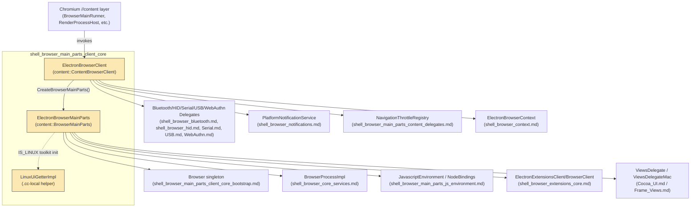
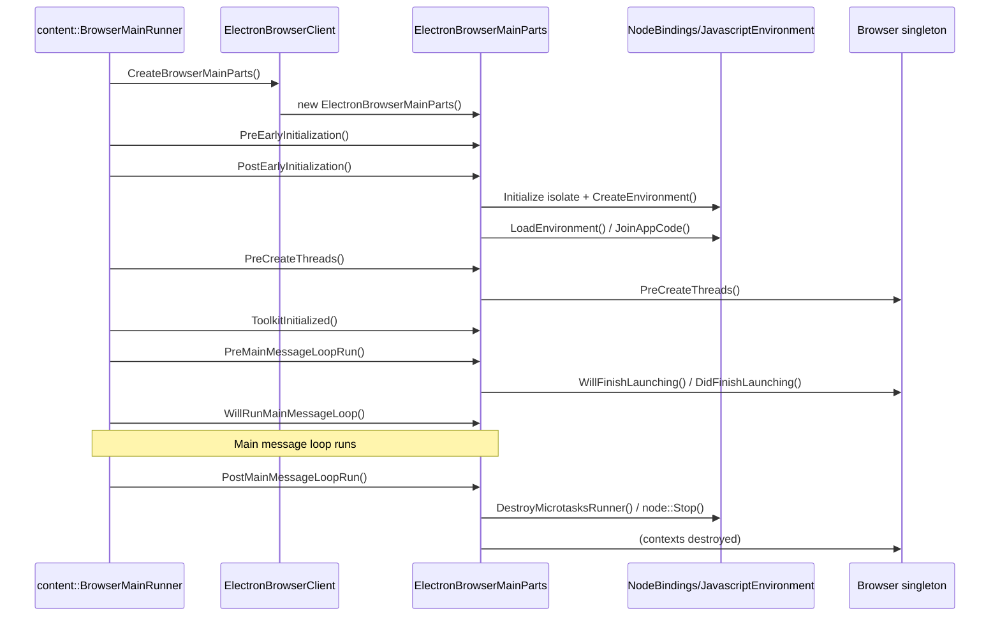

# Shell Browser Main Parts & Client Core

## Introduction

The **Shell Browser Main Parts & Client Core** module contains the two most central classes that glue Electron's browser process into the Chromium `//content` layer:

- **`ElectronBrowserClient`** — Electron's implementation of `content::ContentBrowserClient`, the primary extension point Chromium provides for embedders to customize browser-process behavior (network stack wiring, permission delegates, navigation throttles, process lifecycle hooks, etc.).
- **`ElectronBrowserMainParts`** — Electron's implementation of `content::BrowserMainParts`, which drives the ordered startup/shutdown sequence of the browser process (locale setup, toolkit initialization, Node.js/V8 environment bring-up, extension subsystem registration, and graceful teardown).

Together these two classes form the "root" of the browser process: `ElectronBrowserClient::CreateBrowserMainParts()` instantiates `ElectronBrowserMainParts`, which in turn owns/bootstraps most of the other browser-process subsystems documented elsewhere in this wiki (Node.js bindings, `Browser` singleton, `BrowserProcessImpl`, extensions, toolkit/views delegates, etc.).

This module is a direct child of [shell_browser_main_parts](shell_browser_main_parts.md) (the parent grouping for browser-main-parts related code), which itself sits under the broader [Browser Process Core & Lifecycle](shell_browser_core_lifecycle.md) area of the codebase.

## Architecture Overview

## Sub-modules

This module is split into two focused sub-modules, one per core class family:

| Sub-module | Documentation | Scope |
|---|---|---|
| Browser Client | [shell_browser_main_parts_client_core_browser_client.md](shell_browser_main_parts_client_core_browser_client.md) | `ElectronBrowserClient` and the `content::ContentBrowserClient` extension points it implements: certificate/permission delegates, device delegates hookup, network/URL-loader factory wiring, process lifecycle observation. |
| Bootstrap / Main Parts | [shell_browser_main_parts_client_core_bootstrap.md](shell_browser_main_parts_client_core_bootstrap.md) | `ElectronBrowserMainParts` and its staged startup/shutdown sequence (`PreEarlyInitialization` → `PostMainMessageLoopRun`), including the Linux-only `LinuxUiGetterImpl` helper and ownership of the Node.js/V8 bring-up, `Browser`, and toolkit delegates. |

## High-level Functionality

### `ElectronBrowserClient`

`ElectronBrowserClient` is a singleton (`ElectronBrowserClient::Get()`) that Chromium's `//content` layer calls into at well-defined extension points throughout the life of the browser process. Its main responsibilities include:

- Supplying device/permission delegates: Bluetooth, HID, Serial, USB, WebAuthn (see [Device & Peripheral Access](shell_browser_bluetooth.md)).
- Creating the `content::BrowserMainParts` instance (`ElectronBrowserMainParts`) via `CreateBrowserMainParts()`.
- Configuring network context parameters and URL loader factories (see [shell_browser_net](shell_browser_net.md)).
- Handling certificate errors/selection and client certificate stores.
- Registering Mojo interface binders for renderer/service-worker frames.
- Tracking pending render processes and their associated `WebContents`.
- Providing the `PlatformNotificationService` and `NotificationPresenter` (see [shell_browser_notifications](shell_browser_notifications.md)).
- Creating navigation throttles (`CreateThrottlesForNavigation`) delegated to [shell_browser_main_parts_content_delegates](shell_browser_main_parts_content_delegates.md).

Full details: [shell_browser_main_parts_client_core_browser_client.md](shell_browser_main_parts_client_core_browser_client.md).

### `ElectronBrowserMainParts`

`ElectronBrowserMainParts` implements the ordered set of virtual hooks that `content::BrowserMainParts` defines, driving the browser process from cold start to shutdown. It:

- Owns the `NodeBindings` / `ElectronBindings` / `JavascriptEnvironment` used to run Electron's Node.js main process environment (see [shell_browser_main_parts_js_environment](shell_browser_main_parts_js_environment.md)).
- Owns the `Browser` singleton (app lifecycle, see [shell_browser_core_lifecycle](shell_browser_core_lifecycle.md)) and the fake `BrowserProcessImpl` (see [shell_browser_core_services](shell_browser_core_services.md)).
- Initializes platform toolkits: `views::LayoutProvider`, `ViewsDelegate`/`ViewsDelegateMac`, `wm::WMState`, `display::Screen`/`ScopedNativeScreen`, and (on Linux) `ui::DarkModeManagerLinux` / `ui::LinuxUiGetter` (via the local `LinuxUiGetterImpl`).
- Sets up the extensions subsystem (`ElectronExtensionsClient`, `ElectronExtensionsBrowserClient`) when extensions are enabled (see [shell_browser_extensions_core](shell_browser_extensions_core.md) and [Extensions_(Common)](Extensions_(Common).md)).
- Manages locale/resource-bundle loading, field trials, signal handlers, and OS-crypt configuration.
- Cleanly shuts down Node.js, utility processes, and browser contexts on `PostMainMessageLoopRun`.

Full details: [shell_browser_main_parts_client_core_bootstrap.md](shell_browser_main_parts_client_core_bootstrap.md).

## Process Lifecycle Data Flow

## Relationship to Other Modules

- **Parent module:** [shell_browser_main_parts](shell_browser_main_parts.md) — groups this module with [shell_browser_main_parts_js_environment](shell_browser_main_parts_js_environment.md), [shell_browser_main_parts_content_delegates](shell_browser_main_parts_content_delegates.md), and [shell_browser_main_parts_support_utils](shell_browser_main_parts_support_utils.md).
- **Sibling area:** [shell_browser_core_lifecycle](shell_browser_core_lifecycle.md) and [shell_browser_core_services](shell_browser_core_services.md) provide the `Browser` and `BrowserProcessImpl` objects owned by `ElectronBrowserMainParts`.
- **Consumed by:** [shell_app](shell_app.md) (`ElectronMainDelegate`) which drives process entry and ultimately reaches `ElectronBrowserClient`/`ElectronBrowserMainParts` for the browser process type.
- **Delegates out to:** device subsystems ([shell_browser_bluetooth](shell_browser_bluetooth.md), [shell_browser_hid](shell_browser_hid.md), [Serial](Serial.md), [USB](USB.md), [WebAuthn](WebAuthn.md)), notifications ([shell_browser_notifications](shell_browser_notifications.md)), networking ([shell_browser_net](shell_browser_net.md)), and extensions ([shell_browser_extensions_core](shell_browser_extensions_core.md), [Extensions_(Common)](Extensions_(Common).md)).
