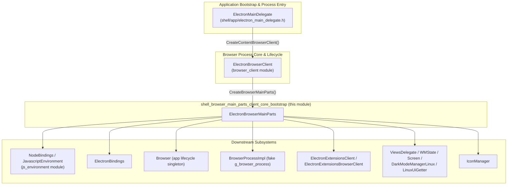
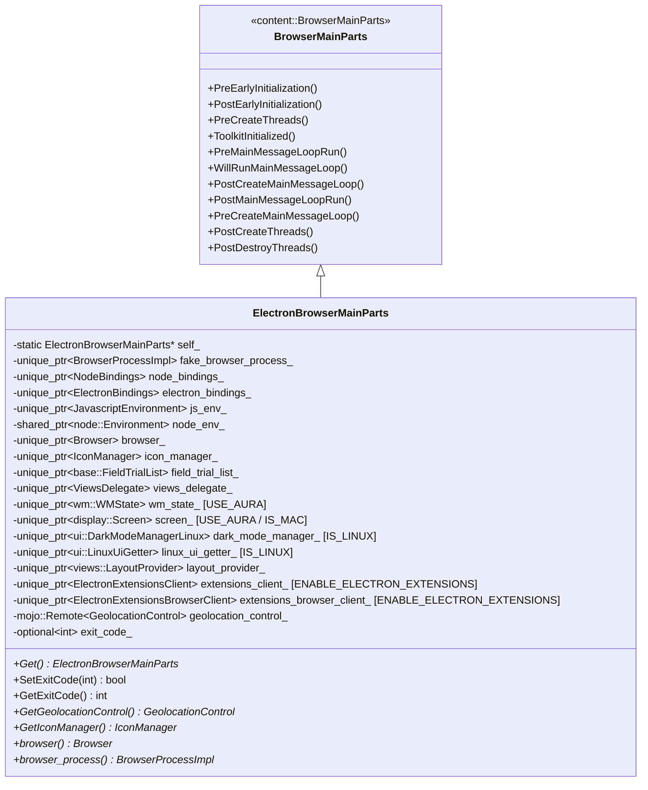
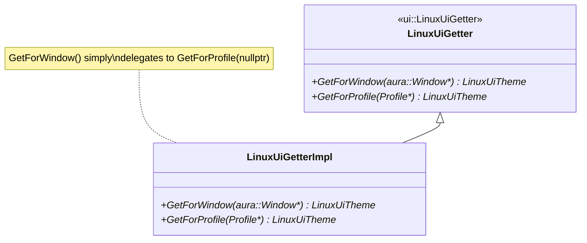
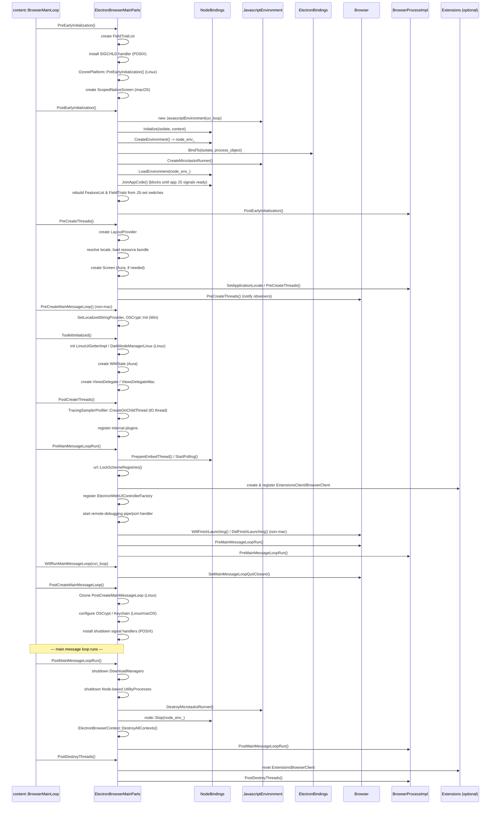
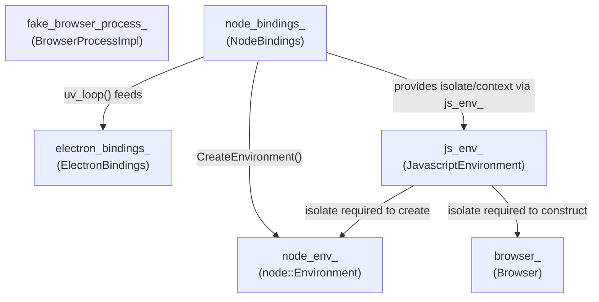
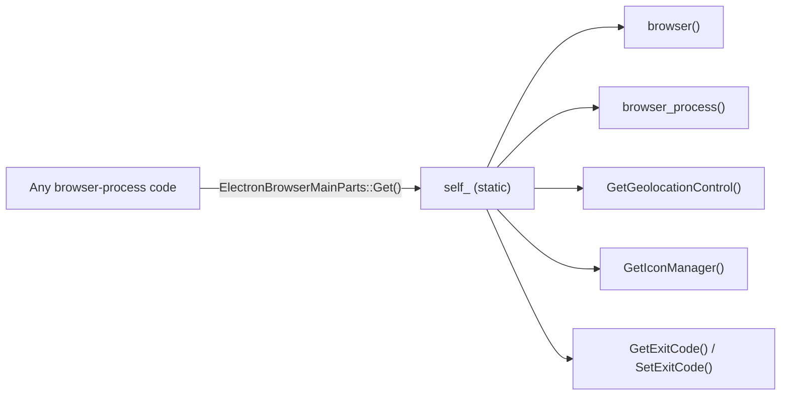

# Browser Process Bootstrap (`ElectronBrowserMainParts`)

## Introduction

The **Browser Process Bootstrap** module is the heart of Electron's main-process
startup sequence. It is implemented by the `electron::ElectronBrowserMainParts`
class (`shell/browser/electron_browser_main_parts.h` /
`electron_browser_main_parts.cc`), which subclasses Chromium's
`content::BrowserMainParts` interface.

This module is responsible for orchestrating, in the correct dependency order,
the initialization of:

- The V8/Node.js JavaScript environment used to run the Electron main process
  script.
- Platform UI toolkits (Views, Aura, GTK/Linux UI, macOS AppKit helpers).
- Chromium subsystems that Electron "fakes" or re-implements outside of
  `//chrome` (via `BrowserProcessImpl`).
- Extensions subsystem bootstrapping (when built with
  `ENABLE_ELECTRON_EXTENSIONS`).
- Platform locale/resource bundle loading, dark-mode detection, OS crypt
  configuration, and signal handling.
- Clean, ordered teardown of all of the above when the application quits.

Because `content::BrowserMainParts` exposes a strict, ordered set of virtual
"phase" callbacks (`PreEarlyInitialization`, `PostEarlyInitialization`,
`PreCreateThreads`, `ToolkitInitialized`, `PreMainMessageLoopRun`,
`WillRunMainMessageLoop`, `PostCreateMainMessageLoop`,
`PostMainMessageLoopRun`, `PreCreateMainMessageLoop`, `PostCreateThreads`,
`PostDestroyThreads`), `ElectronBrowserMainParts` acts as the **single
choreographer** that decides what happens, and in what order, at each stage of
process startup and shutdown.

This module is a child of [shell_browser_main_parts](shell_browser_main_parts.md)
and a sibling of
[shell_browser_main_parts_client_core_browser_client](shell_browser_main_parts_client_core_browser_client.md)
(which documents `ElectronBrowserClient`, the `content::ContentBrowserClient`
implementation that *creates* `ElectronBrowserMainParts` via
`CreateBrowserMainParts()`).

---

## Responsibilities & Position in the System

`ElectronBrowserMainParts` sits between Chromium's process-entry layer and the
rest of Electron's browser-process subsystems:

- **Upstream**: `ElectronMainDelegate` (see
  [Application_Bootstrap_&_Process_Entry](Application_Bootstrap_%26_Process_Entry.md))
  drives Chromium's `content::ContentMainRunner`, which eventually calls
  `ElectronBrowserClient::CreateBrowserMainParts()` to construct an
  `ElectronBrowserMainParts` instance for the browser process.
- **Downstream**: Once constructed, `ElectronBrowserMainParts` owns/creates the
  objects that the rest of the browser process depends on: the Node.js/V8
  environment, the `Browser` app-lifecycle singleton (see
  [shell_browser_core_lifecycle](shell_browser_core_lifecycle.md)), the fake
  `BrowserProcessImpl` (see
  [shell_browser_core_services](shell_browser_core_services.md)), the
  extensions subsystem (see
  [Extensions_Subsystem](Extensions_Subsystem.md)), and platform UI toolkit
  singletons.

---

## Core Component: `ElectronBrowserMainParts`

### Class Overview

### Local Helper: `LinuxUiGetterImpl`

Defined only on Linux, in the anonymous namespace of
`electron_browser_main_parts.cc`. It implements `ui::LinuxUiGetter`, mapping
both per-window and per-profile lookups to a single GTK-themed
`ui::LinuxUiTheme` instance (Electron does not support per-profile theming):

`ElectronBrowserMainParts::ToolkitInitialized()` instantiates
`LinuxUiGetterImpl` and installs it as the active `ui::LinuxUiGetter`, enabling
GTK-themed native widgets (menus, dialogs) throughout the Linux browser
process.

### Referenced External Types (owned or used, not defined here)

| Type | Defined in | Role |
|---|---|---|
| `Browser` | [shell_browser_core_lifecycle](shell_browser_core_lifecycle.md) | App-level lifecycle singleton (`will-finish-launching`, `ready`, etc.) |
| `BrowserProcessImpl` | [shell_browser_core_services](shell_browser_core_services.md) | Electron's stand-in for Chromium's global `g_browser_process` |
| `ElectronBindings` | [Common_API](Common_Native_Gin_Infrastructure.md) | Native Node.js bindings exposed to the main-process JS script |
| `JavascriptEnvironment` | [shell_browser_main_parts_js_environment](shell_browser_main_parts_js_environment.md) | Owns the V8 isolate & microtasks runner used by the main process |
| `IconManager` | Chromium `//chrome/browser` | Extracts file/folder icons for native UI |
| `ElectronExtensionsClient` / `ElectronExtensionsBrowserClient` | [Extensions_Subsystem](Extensions_Subsystem.md) | Enables the `chrome.*` extensions API surface, gated by `ENABLE_ELECTRON_EXTENSIONS` |
| `ViewsDelegate` / `ViewsDelegateMac` | [Desktop_UI_Widgets_&_Dialogs](Desktop_UI_Widgets_%26_Dialogs.md) | `views::ViewsDelegate` implementation for native window/menu widgets |
| `DarkModeManagerLinux` / `LinuxUiGetter` | Chromium `//chrome` / `//ui/linux` | Linux system theme & dark-mode tracking |
| `WMState`, `Screen`, `ScopedNativeScreen` | `//ui/wm`, `//ui/display` | Aura window-manager state & display/screen singletons |
| `LayoutProvider` | `//ui/views/layout` | Global spacing/typography constants for Views widgets |
| `FieldTrialList` | `//base/metrics` | Backing store for Chromium A/B experiment (field trial) state |

---

## Lifecycle: Ordered Startup & Shutdown Phases

`content::BrowserMainParts` defines a fixed sequence of callbacks that
Chromium's `content::BrowserMainLoop` invokes. `ElectronBrowserMainParts`
overrides essentially all of them, making this class the definitive reference
for "what happens when, during startup."

### Phase-by-Phase Summary

| Phase | Key actions |
|---|---|
| `PreEarlyInitialization` | Create `base::FieldTrialList`; install `SIGCHLD` handler (POSIX); `OzonePlatform::PreEarlyInitialization()` (Linux); create `ScopedNativeScreen` (macOS); register Chrome color mixers. |
| `PostEarlyInitialization` | **Boots the JS/Node environment**: constructs `JavascriptEnvironment`, initializes `NodeBindings`, creates the `node::Environment`, binds `ElectronBindings`, creates the microtasks runner, loads and runs the main-process script, and blocks (`JoinAppCode`) until the app signals readiness. Rebuilds `FeatureList`/field trials with switches set by app JS. Re-initializes logging. |
| `PreCreateThreads` | Creates `views::LayoutProvider`; resolves the system/app locale and loads the localized resource bundle; creates the Aura `Screen` if needed; forces `MediaCaptureDevicesDispatcher` creation; notifies `Browser::PreCreateThreads()`. |
| `PreCreateMainMessageLoop` (non-macOS) | Sets localized media strings and initializes `OSCrypt` from local state (Windows). |
| `ToolkitInitialized` | Sets up Linux UI: `LinuxUiGetterImpl`, GTK pixbuf init, `DarkModeManagerLinux`, cursor theme observation. Creates `wm::WMState` (Aura). Creates the platform `ViewsDelegate`/`ViewsDelegateMac`. |
| `PostCreateThreads` | Schedules `TracingSamplerProfiler` creation on the IO thread; registers internal browser plugins. |
| `PreMainMessageLoopRun` | Starts Node's embed/polling thread; locks URL scheme registries; **initializes the Extensions subsystem** (`ElectronExtensionsClient`, `ElectronExtensionsBrowserClient`) when enabled; registers `ElectronWebUIControllerFactory`; starts remote-debugging pipe/port handling; fires `Browser::WillFinishLaunching`/`DidFinishLaunching` (non-macOS — macOS does this via the app delegate); notifies `Browser` and `BrowserProcessImpl`. |
| `WillRunMainMessageLoop` | Records the default exit code and wires the `Browser` quit closure to the main `RunLoop`. |
| `PostCreateMainMessageLoop` | Linux: finishes Ozone setup, initializes D-Bus/Bluez, configures `OSCrypt` backend selection; macOS: sets Keychain service/account names; POSIX: installs shutdown signal handlers tied to `Browser::Quit()`. |
| `PostMainMessageLoopRun` | Orderly teardown: frees the macOS app delegate; shuts down all `DownloadManager`s; shuts down Node-based `UtilityProcessWrapper`s so `exit` events fire; destroys the microtasks runner and stops the Node environment; destroys all `ElectronBrowserContext`s; notifies `BrowserProcessImpl`; stops the remote-debugging pipe handler; Ozone `PostMainMessageLoopRun` (Linux). |
| `PostDestroyThreads` | Resets the extensions browser client; shuts down Bluetooth adapter/D-Bus manager (Linux); notifies `BrowserProcessImpl`. |

---

## Dependency & Ownership Graph

The class carefully documents ownership order via inline `// depends-on:`
comments, because C++ member destruction order (reverse of declaration) is
safety-critical here (e.g., the V8 isolate must outlive objects holding V8
handles).

Declaration order in the header (and therefore destruction order, reversed)
is:

1. `views_delegate_`
2. `wm_state_` / `screen_` (Aura)
3. `dark_mode_manager_` / `linux_ui_getter_` (Linux)
4. `layout_provider_`
5. `fake_browser_process_`
6. `exit_code_`
7. `node_bindings_`
8. `electron_bindings_` *(depends on `node_bindings_`)*
9. `js_env_` *(depends on `node_bindings_`)*
10. `node_env_` *(depends on `js_env_`'s isolate)*
11. `browser_` *(depends on `js_env_`'s isolate)*
12. `icon_manager_`
13. `field_trial_list_`
14. `extensions_client_` / `extensions_browser_client_`
15. `geolocation_control_`
16. `screen_` (macOS `ScopedNativeScreen`)

This ordering guarantees that, during destruction, dependents are destroyed
before their dependencies (e.g. `node_env_`/`browser_` are destroyed before
`js_env_` and `node_bindings_`).

---

## Singleton Access Pattern

`ElectronBrowserMainParts` maintains a process-wide singleton pointer (`self_`)
set in the constructor and asserted unique via `DCHECK`. This lets any code in
the browser process reach shared infrastructure without needing to plumb a
reference through:

- `browser()` → returns the `Browser` singleton (see
  [shell_browser_core_lifecycle](shell_browser_core_lifecycle.md)).
- `browser_process()` → returns the `BrowserProcessImpl` fake global process
  object (see [shell_browser_core_services](shell_browser_core_services.md)).
- `GetGeolocationControl()` → lazily binds a Mojo remote to the Device
  Service's `GeolocationControl` interface, used to gate OS-level location
  permission prompts once per app run.
- `GetIconManager()` → lazily creates/returns the `IconManager` used for
  native file-icon extraction (must be called on the UI thread).
- `SetExitCode()` / `GetExitCode()` → coordinate the process's final exit
  code between JS-level `app.exit(code)` calls and Chromium's
  `content::BrowserMainLoop`.

---

## Platform-Specific Behavior Matrix

| Concern | Windows | macOS | Linux |
|---|---|---|---|
| Views delegate | `ViewsDelegate` | `ViewsDelegateMac` | `ViewsDelegate` |
| Screen singleton | `display::Screen` via Aura `CreateDesktopScreen()` | `display::ScopedNativeScreen` (created in `PreEarlyInitialization`) | `display::Screen` via Aura `CreateDesktopScreen()` |
| Dark mode / theme | n/a (handled by `ElectronBrowserClient`/native theme) | n/a (native `NSAppearance`) | `ui::DarkModeManagerLinux` + `LinuxUiGetterImpl` + GTK pixbuf init |
| OS crypt setup | `OSCrypt::Init(local_state)` in `PreCreateMainMessageLoopCommon` | `KeychainPassword` service/account names in `PostCreateMainMessageLoop` | Full `os_crypt::Config` + backend selection (`SelectBackend`) in `PostCreateMainMessageLoop` |
| Signal handling | n/a | `InstallShutdownSignalHandlers` (POSIX branch) + `HandleSIGCHLD` | Same POSIX signal handling; additionally Bluetooth/D-Bus init/shutdown |
| Locale resolution | `l10n_util` + Win-specific font callbacks | Cocoa locale override before resource bundle load | `LC_ALL` env manipulation around resource bundle load |
| Select-file dialog | `ChromeSelectFileDialogFactory` registered in `PreMainMessageLoopRun` | n/a here (native panel used elsewhere) | n/a here |

---

## Relationship to Other Modules

- **[shell_browser_main_parts_client_core_browser_client](shell_browser_main_parts_client_core_browser_client.md)** —
  `ElectronBrowserClient::CreateBrowserMainParts()` is the factory entry point
  that instantiates `ElectronBrowserMainParts`. That module also owns
  content-layer delegate hooks (permissions, navigation throttles, network
  context) that operate *after* this module's startup phases complete.
- **[shell_browser_main_parts_js_environment](shell_browser_main_parts_js_environment.md)** —
  Defines `JavascriptEnvironment` and `MicrotasksRunner`, which
  `ElectronBrowserMainParts` creates and destroys during
  `PostEarlyInitialization`/`PostMainMessageLoopRun`.
- **[shell_browser_main_parts_content_delegates](shell_browser_main_parts_content_delegates.md)** —
  Sibling module housing `ElectronGpuClient`, `ElectronNavigationThrottle`,
  `ElectronWebUIControllerFactory` (registered here in
  `PreMainMessageLoopRun`), and plugin info helpers.
- **[shell_browser_main_parts_support_utils](shell_browser_main_parts_support_utils.md)** —
  Sibling module with `font_defaults`, the NSS crypto module delegate, and the
  PDF document helper client — smaller utility pieces invoked from browser
  startup/preferences code adjacent to this bootstrap sequence.
- **[shell_browser_core_lifecycle](shell_browser_core_lifecycle.md)** —
  `Browser`, the app-lifecycle singleton whose `PreCreateThreads`,
  `PreMainMessageLoopRun`, `WillFinishLaunching`/`DidFinishLaunching`, and quit
  closure are all driven from this module.
- **[shell_browser_core_services](shell_browser_core_services.md)** —
  `BrowserProcessImpl`, the fake `g_browser_process` whose phase methods
  (`PostEarlyInitialization`, `PreCreateThreads`, `PreMainMessageLoopRun`,
  `PostMainMessageLoopRun`, `PostDestroyThreads`) mirror and are invoked
  alongside this class's own phases.
- **[Extensions_Subsystem](Extensions_Subsystem.md)** —
  `ElectronExtensionsClient`/`ElectronExtensionsBrowserClient` are constructed
  and registered here (gated by `ENABLE_ELECTRON_EXTENSIONS`), and reset
  during `PostDestroyThreads`.
- **[Common_Native_Gin_Infrastructure](Common_Native_Gin_Infrastructure.md)** —
  `ElectronBindings` and `NodeBindings` (the Node.js embedding layer) are
  created and driven directly by this module to boot the main-process
  JavaScript runtime.
- **[Desktop_UI_Widgets_&_Dialogs](Desktop_UI_Widgets_%26_Dialogs.md)** —
  `ViewsDelegate`/`ViewsDelegateMac`, `LayoutProvider`, and Linux GTK/theme
  helpers instantiated during `ToolkitInitialized` live in this module.
- **[Application_Bootstrap_&_Process_Entry](Application_Bootstrap_%26_Process_Entry.md)** —
  Upstream: `ElectronMainDelegate` drives the overall `content::ContentMain`
  flow that eventually results in this class being constructed for the
  browser process.

---

## Key Design Notes

- **Single source of truth for boot order.** Because Chromium's main-loop
  callback names (`PreCreateThreads`, `ToolkitInitialized`, etc.) are fixed by
  the `content::BrowserMainParts` interface, this class is the canonical place
  to look up *exactly* when any given browser-process subsystem is
  initialized relative to others.
- **Blocking on app code.** `PostEarlyInitialization()` calls
  `node_bindings_->JoinAppCode()`, which blocks the browser process's main
  thread until the main-process JavaScript signals it has finished its
  synchronous top-level execution (important for ESM, which loads
  asynchronously). This is what allows `app.whenReady()` / synchronous
  `require()` calls in the main script to run before most of Electron's
  native subsystems are fully initialized.
- **Feature list re-initialization.** The `base::FeatureList` is initialized
  twice: once early (before JS runs) and once again after
  `JoinAppCode()` returns, so that command-line switches set by the app's
  main script (e.g. via `app.commandLine.appendSwitch`) can affect feature
  flags.
- **Utility process shutdown ordering.** `PostMainMessageLoopRun()` manually
  iterates `content::BrowserChildProcessHostIterator` for
  `PROCESS_TYPE_UTILITY` processes running the Node service and shuts down
  their `UtilityProcessWrapper` *before* Node is stopped in the main process,
  ensuring JS `exit` events on `UtilityProcess` objects still fire.
- **Platform conditionals throughout.** Nearly every method contains
  `BUILDFLAG(IS_WIN)` / `IS_MAC` / `IS_LINUX` / `USE_AURA` /
  `ENABLE_ELECTRON_EXTENSIONS` / `ENABLE_BUILTIN_SPELLCHECKER` /
  `ENABLE_PLUGINS` branches, reflecting Electron's cross-platform,
  buildflag-driven architecture.
