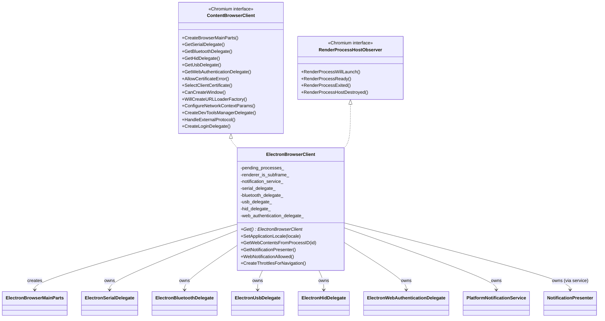
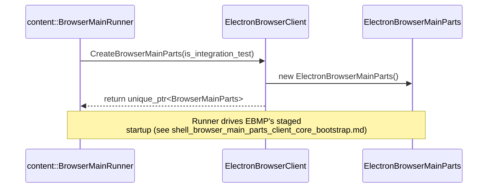
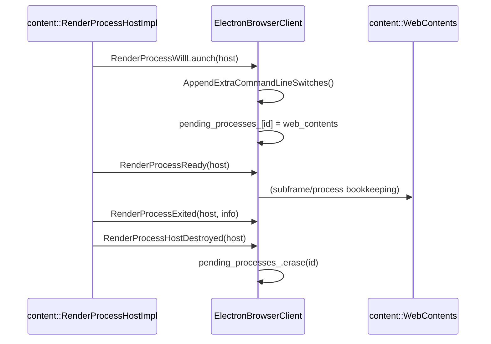
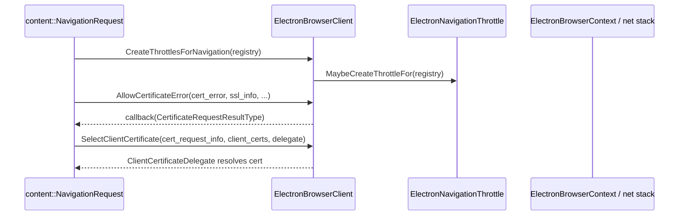
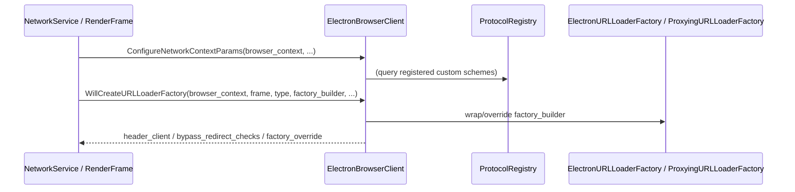

# Shell Browser Main Parts — Browser Client (`ElectronBrowserClient`)

## Introduction

This module documents **`ElectronBrowserClient`**, Electron's concrete implementation of Chromium's `content::ContentBrowserClient` interface. This class is the single most important extension seam between the Chromium `//content` layer and Electron: nearly every browser-process customization point that Chromium exposes to embedders — network stack configuration, permission/device delegate creation, navigation throttling, certificate handling, process lifecycle observation, and Mojo interface exposure — is implemented here.

`ElectronBrowserClient` is a process-wide singleton (`ElectronBrowserClient::Get()`) constructed early during browser startup and referenced throughout the lifetime of the Electron browser process. It is the direct sibling of [`ElectronBrowserMainParts`](shell_browser_main_parts_client_core_bootstrap.md) within the [shell_browser_main_parts_client_core](shell_browser_main_parts_client_core.md) module — together they form the root of Electron's browser-process integration with Chromium.

## Role & Responsibilities

`ElectronBrowserClient` acts as a **facade/dispatcher** that Chromium's content layer calls into. Its responsibilities fall into several broad categories:

1. **Process bootstrap** — `CreateBrowserMainParts()` instantiates [`ElectronBrowserMainParts`](shell_browser_main_parts_client_core_bootstrap.md), which drives the rest of browser-process startup.
2. **Device & permission delegates** — lazily constructs and owns the Bluetooth/HID/Serial/USB/WebAuthn delegates that content queries via `GetXxxDelegate()`.
3. **Navigation & security** — creates navigation throttles, handles SSL certificate errors/selection, external protocol handling, and login delegate creation.
4. **Network stack wiring** — configures `NetworkContextParams`, creates/overrides `URLLoaderFactory` instances (both network and non-network schemes), and creates `URLLoaderThrottle`s.
5. **Renderer process lifecycle** — observes `RenderProcessHost` events (`RenderProcessWillLaunch`, `RenderProcessReady`, `RenderProcessExited`, `RenderProcessHostDestroyed`) and tracks pending processes and their `WebContents`.
6. **Mojo interface exposure** — registers browser-interface binders for render frames and service workers, and exposes interfaces to renderers.
7. **Notifications & speech** — supplies `PlatformNotificationService`/`NotificationPresenter` and `SpeechRecognitionManagerDelegate`.
8. **Miscellaneous embedder hooks** — user agent, application locale, default download directory, code cache settings, geolocation API key, WebUI schemes, etc.

## Architecture

```mermaid
graph TB
    subgraph "shell_browser_main_parts_client_core_browser_client"
        EBC["ElectronBrowserClient<br/>(content::ContentBrowserClient,<br/>content::RenderProcessHostObserver)"]
    end

    Content["Chromium //content layer<br/>(BrowserMainRunner, RenderProcessHostImpl,<br/>NavigationRequest, NetworkService glue)"]

    Content -->|"virtual dispatch"| EBC

    EBC -->|"CreateBrowserMainParts()"| EBMP["ElectronBrowserMainParts"]
    EBC -->|"owns"| SerialD["ElectronSerialDelegate"]
    EBC -->|"owns"| BtD["ElectronBluetoothDelegate"]
    EBC -->|"owns"| UsbD["ElectronUsbDelegate"]
    EBC -->|"owns"| HidD["ElectronHidDelegate"]
    EBC -->|"owns"| WebAuthnD["ElectronWebAuthenticationDelegate"]
    EBC -->|"owns"| NotifSvc["PlatformNotificationService"]
    EBC -->|"owns"| NotifPresenter["NotificationPresenter"]

    EBC -->|"CreateThrottlesForNavigation()"| NavThrottle["ElectronNavigationThrottle"]
    EBC -->|"CreateSpeechRecognitionManagerDelegate()"| Speech["ElectronSpeechRecognitionManagerDelegate"]
    EBC -->|"WillCreateURLLoaderFactory() /<br/>ConfigureNetworkContextParams()"| Net["shell_browser_net<br/>(ElectronURLLoaderFactory,<br/>ProxyingURLLoaderFactory,<br/>SystemNetworkContextManager)"]
    EBC -->|"CreateLoginDelegate()"| LoginH["LoginHandler"]
    EBC -->|"OverrideWebPreferences()"| Prefs["WebContentsPreferences"]
    EBC -->|"GetMediaDeviceIDSalt()"| MediaSalt["MediaDeviceIDSalt"]
    EBC -->|"tracks"| WC["content::WebContents<br/>(pending_processes_)"]

    classDef core fill:#fce8b2,stroke:#333;
    class EBC core;
```

## Key Members & Data

| Member | Purpose |
|---|---|
| `pending_processes_` | Maps `ChildProcessId` → `WebContents*` for render processes that have not yet fully launched, allowing lookups via `GetWebContentsFromProcessID()`. |
| `renderer_is_subframe_` | Tracks which renderer processes host only OOPIF sub-frames (used by `IsRendererSubFrame()`). |
| `notification_service_` / `notification_presenter_` | Owns the `PlatformNotificationService` and its underlying `NotificationPresenter` (see [shell_browser_notifications](shell_browser_notifications.md)). |
| `serial_delegate_`, `bluetooth_delegate_`, `usb_delegate_`, `hid_delegate_`, `web_authentication_delegate_` | Lazily-created device/permission delegates handed out via `GetSerialDelegate()`, `GetBluetoothDelegate()`, etc. See [Device & Peripheral Access](shell_browser_bluetooth.md), [shell_browser_hid](shell_browser_hid.md), [Serial](Serial.md), [USB](USB.md), [WebAuthn](WebAuthn.md). |
| `delegate_` | An optional `content::ContentBrowserClient*` delegate (used in some embedding/testing scenarios) that calls can be forwarded to via `set_delegate()`. |
| `user_agent_override_` | Custom user-agent string set via `app.userAgentFallback` in the JS API, returned from `GetUserAgent()`. |
| `next_id_` | Shared monotonically-increasing ID generator used by `ProxyingURLLoaderFactory` and `ProxyingWebSocket` (see [shell_browser_net](shell_browser_net.md)). |

## Component Interactions

## Data & Control Flow

### Browser process startup

### Render process launch & teardown

### Navigation & certificate handling

### URL loader factory / network context wiring

## Key APIs

### Lifecycle & singleton access
- `static ElectronBrowserClient* Get()` — returns the process-wide instance.
- `static void SetApplicationLocale(const std::string&)` — sets the locale used by `GetApplicationLocale()`.
- `void set_delegate(Delegate* delegate)` — allows forwarding certain calls to an external `ContentBrowserClient` delegate.

### Process/WebContents tracking
- `content::WebContents* GetWebContentsFromProcessID(content::ChildProcessId)` — used to resolve a render process ID back to its owning `WebContents`, important for permission prompts and IPC routing.
- `bool IsRendererSubFrame(content::ChildProcessId) const` (private) — used internally to classify processes.

### Notifications
- `NotificationPresenter* GetNotificationPresenter()` — lazily creates the platform-specific presenter (see [shell_browser_notifications](shell_browser_notifications.md)).
- `void WebNotificationAllowed(RenderFrameHost*, callback)` — checks web-notification permission via [`ElectronPermissionManager`](shell_browser_context.md).

### Device delegates
- `GetSerialDelegate()`, `GetBluetoothDelegate()`, `GetHidDelegate()`, `GetUsbDelegate()`, `GetWebAuthenticationDelegate()` — each lazily instantiates and returns the corresponding delegate class. See [Device & Peripheral Access](shell_browser_bluetooth.md) for the delegate implementations themselves.

### Navigation & security
- `CreateThrottlesForNavigation(content::NavigationThrottleRegistry&)` — registers `ElectronNavigationThrottle` (see [shell_browser_main_parts_content_delegates](shell_browser_main_parts_content_delegates.md)).
- `AllowCertificateError(...)`, `SelectClientCertificate(...)`, `CreateClientCertStore(...)` — SSL/TLS certificate handling hooks.
- `HandleExternalProtocol(...)` — routes non-http(s) navigations (e.g. `mailto:`) out to the OS or a custom protocol handler.
- `CreateLoginDelegate(...)` — creates a [`LoginHandler`](WebContents_Rendering_&_Communication.md) for HTTP auth challenges.

### Network stack
- `ConfigureNetworkContextParams(...)`, `GetSystemNetworkContext()`, `GetSystemSharedURLLoaderFactory()` — see [shell_browser_net](shell_browser_net.md) / [`SystemNetworkContextManager`](shell_browser_net.md).
- `WillCreateURLLoaderFactory(...)`, `CreateNonNetworkNavigationURLLoaderFactory(...)`, `RegisterNonNetworkSubresourceURLLoaderFactories(...)`, `RegisterNonNetworkServiceWorkerUpdateURLLoaderFactories(...)` — wire up custom-protocol and proxying URL loader factories (`ElectronURLLoaderFactory`, `ProxyingURLLoaderFactory`, `AsarURLLoaderFactory`); see [shell_browser_net](shell_browser_net.md).
- `CreateURLLoaderThrottles(...)`, `WillCreateURLLoaderRequestInterceptors(...)` — request interception hooks.
- `CreateWebSocket(...)`, `WillInterceptWebSocket(...)` — WebSocket proxying (`ProxyingWebSocket`).

### Mojo interface exposure
- `ExposeInterfacesToRenderer(...)`, `RegisterBrowserInterfaceBindersForFrame(...)`, `RegisterBrowserInterfaceBindersForServiceWorker(...)`, `RegisterAssociatedInterfaceBindersForRenderFrameHost(...)`, `RegisterAssociatedInterfaceBindersForServiceWorker(...)`, `BindHostReceiverForRenderer(...)` — register Mojo binders for IPC handlers such as `ElectronApiIPCHandlerImpl` and `ElectronApiSWIPCHandlerImpl` (see [shell_browser_ipc_handlers](shell_browser_ipc_handlers.md)).

### Misc embedder hooks
- `GetUserAgent()` / `SetUserAgent()` / `GetUserAgentMetadata()`
- `OverrideWebPreferences(...)` — applies [`WebContentsPreferences`](Web_Contents.md) and [font defaults](shell_browser_main_parts_support_utils.md) to `blink::web_pref::WebPreferences`.
- `CreateSpeechRecognitionManagerDelegate()` — returns `ElectronSpeechRecognitionManagerDelegate` (see [shell_browser_main_parts_content_delegates](shell_browser_main_parts_content_delegates.md)).
- `CreateDevToolsManagerDelegate()` — returns a `DevToolsManagerDelegate` (see [DevTools UI](DevTools_UI.md)).
- `GetMediaDeviceIDSalt(...)` — delegates to [`MediaDeviceIDSalt`](shell_browser_media.md).
- `GetPluginMimeTypesWithExternalHandlers(...)`, `CreateBrowserMainParts(...)`, `GetDefaultDownloadDirectory()`, `GetGeolocationApiKey()`, `GetGeneratedCodeCacheSettings(...)`.

## Relationship to Other Modules

- **Sibling within parent module:** [`ElectronBrowserMainParts`](shell_browser_main_parts_client_core_bootstrap.md) — created by `ElectronBrowserClient::CreateBrowserMainParts()`; both live under [shell_browser_main_parts_client_core](shell_browser_main_parts_client_core.md).
- **Parent module:** [shell_browser_main_parts_client_core](shell_browser_main_parts_client_core.md), itself part of [shell_browser_main_parts](shell_browser_main_parts.md) under [Browser Process Core & Lifecycle](shell_browser_core_lifecycle.md).
- **Invoked by:** [shell_app](shell_app.md) — `ElectronMainDelegate` constructs/associates `ElectronBrowserClient` with the browser process during application entry.
- **Delegates to device subsystems:** [shell_browser_bluetooth](shell_browser_bluetooth.md), [shell_browser_hid](shell_browser_hid.md), [Serial](Serial.md), [USB](USB.md), [WebAuthn](WebAuthn.md).
- **Delegates to notifications:** [shell_browser_notifications](shell_browser_notifications.md) (`PlatformNotificationService`, `NotificationPresenter`).
- **Delegates to networking:** [shell_browser_net](shell_browser_net.md) (`ElectronURLLoaderFactory`, `ProxyingURLLoaderFactory`, `ProxyingWebSocket`, `SystemNetworkContextManager`, `CertVerifierClient`) and [Protocol_Registry](Protocol_Registry.md).
- **Delegates to navigation/content helpers:** [shell_browser_main_parts_content_delegates](shell_browser_main_parts_content_delegates.md) (`ElectronNavigationThrottle`, `ElectronSpeechRecognitionManagerDelegate`, `ElectronWebUIControllerFactory`, `ElectronGpuClient`, `ElectronPluginInfoHostImpl`).
- **Uses browser context:** [shell_browser_context](shell_browser_context.md) (`ElectronBrowserContext`, `ElectronPermissionManager`) for permission checks and network context configuration.
- **Uses IPC handlers:** [shell_browser_ipc_handlers](shell_browser_ipc_handlers.md) for Mojo interface registration on render frames and service workers.
- **Uses WebContents infrastructure:** [Web_Contents](Web_Contents.md) and [shell_browser_api_webcontents](shell_browser_api_webcontents.md) — `WebContentsPreferences`, `WebContents` tracking, login handling (`LoginHandler`).
