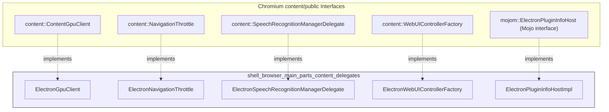
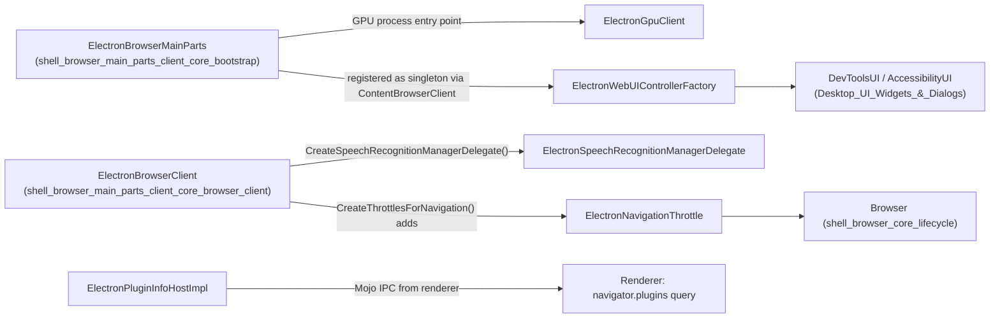
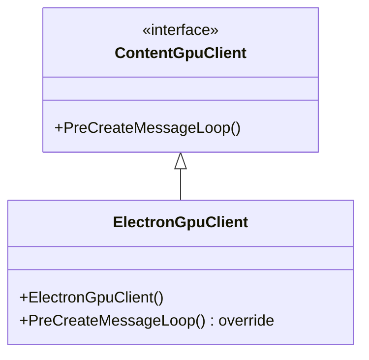
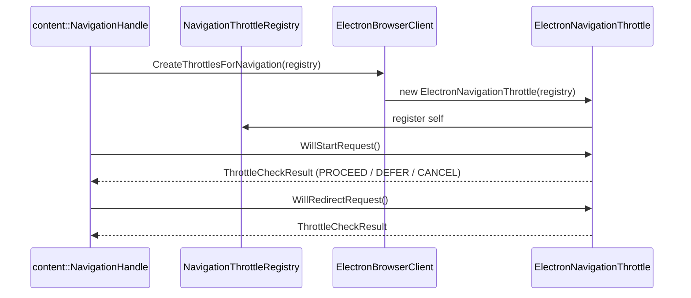
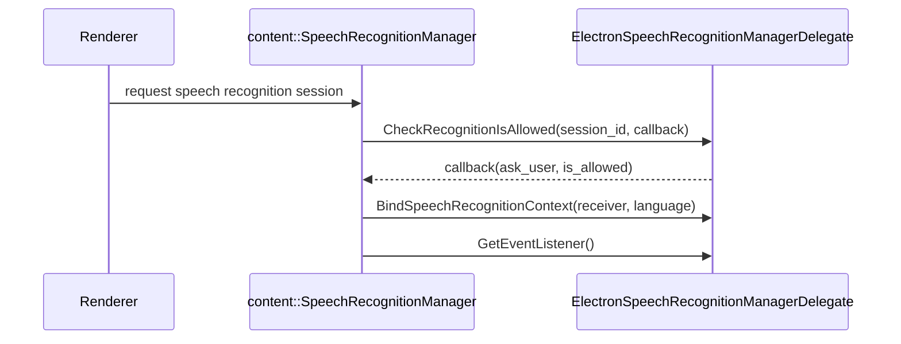
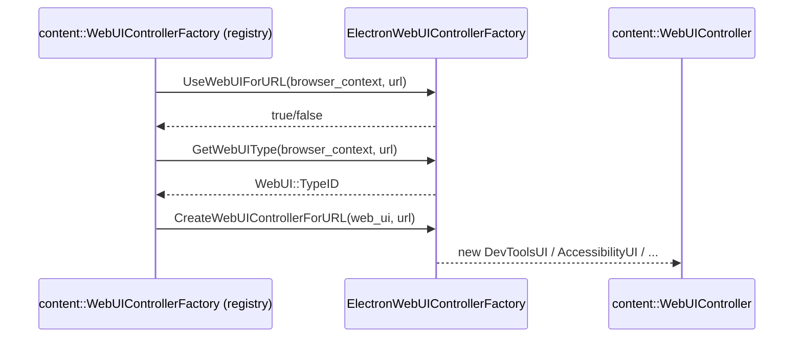
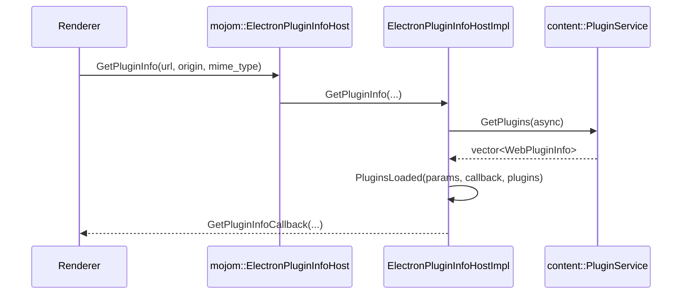
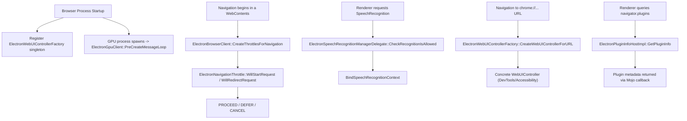

# Shell Browser Main Parts – Content Delegates

## Introduction

The **Content Delegates** module is a collection of small, focused adapter classes that implement Chromium `content/public` interfaces on behalf of Electron's browser process. Each class in this module plugs Electron-specific behavior into a well-defined extension point of the Content API — GPU process bootstrapping, navigation throttling, speech recognition permissioning, WebUI page routing, and legacy NPAPI plugin metadata lookups.

These delegates are lightweight by design: they contain little state and mostly forward or gate calls from Chromium's content layer into Electron's own subsystems (or simply provide safe no-op/default behavior where Electron does not need the underlying Chromium feature). They are instantiated and wired together primarily by [`ElectronBrowserClient`](shell_browser_main_parts_client_core_browser_client.md) and [`ElectronBrowserMainParts`](shell_browser_main_parts_client_core_bootstrap.md), which together make up the broader [`shell_browser_main_parts`](shell_browser_main_parts.md) module.

This document covers:

- `ElectronGpuClient` (`shell/browser/electron_gpu_client.h`)
- `ElectronNavigationThrottle` (`shell/browser/electron_navigation_throttle.h`)
- `ElectronSpeechRecognitionManagerDelegate` (`shell/browser/electron_speech_recognition_manager_delegate.h`)
- `ElectronWebUIControllerFactory` (`shell/browser/electron_web_ui_controller_factory.h`)
- `ElectronPluginInfoHostImpl` (`shell/browser/electron_plugin_info_host_impl.h`)

---

## Module Purpose

Chromium's `//content` layer defines many "delegate" and "factory" interfaces that embedders (like Electron) must implement to customize browser process behavior without forking Chromium code. This module groups the delegates that are:

1. **Process/feature bootstrapping** — `ElectronGpuClient` hooks into GPU process startup.
2. **Navigation policy** — `ElectronNavigationThrottle` intercepts and can defer/cancel/redirect main-frame navigations.
3. **Permission gating** — `ElectronSpeechRecognitionManagerDelegate` decides whether a renderer may use the Web Speech API.
4. **WebUI routing** — `ElectronWebUIControllerFactory` maps `chrome://`-style internal URLs to their corresponding `WebUIController` (e.g. DevTools UI, accessibility UI).
5. **Legacy plugin metadata** — `ElectronPluginInfoHostImpl` answers Mojo IPC requests for NPAPI/PPAPI plugin info (mostly vestigial, retained for Chromium API compatibility).

None of these classes own significant business logic on their own — they are the "seams" where Electron's browser process intercepts Chromium's generic behavior. Business logic that they trigger (e.g. actual window creation, actual speech recognition allow/deny decisions) generally lives in [`Browser`](shell_browser_core_lifecycle.md), [`ElectronBrowserClient`](shell_browser_main_parts_client_core_browser_client.md), or the [UI/DevTools subsystem](Desktop_UI_Widgets_%26_Dialogs.md).

---

## Architecture Overview

Each class overrides a small, fixed vtable of virtual methods defined by its parent interface. This is the standard Chromium "delegate injection" pattern: the generic Content layer calls into embedder-supplied objects at well-defined points, without needing to know that "Electron" exists.

---

## Component Relationships

- `ElectronBrowserClient::CreateSpeechRecognitionManagerDelegate()` returns a new `ElectronSpeechRecognitionManagerDelegate`.
- `ElectronBrowserClient::CreateThrottlesForNavigation()` (via `content::NavigatorDelegate`) constructs `ElectronNavigationThrottle` instances and registers them with the `NavigationThrottleRegistry` passed in.
- `ElectronBrowserMainParts` (and the browser process bootstrap sequence more generally) registers the `ElectronWebUIControllerFactory` singleton with content so that internal `chrome://`-scheme pages resolve to Electron-provided `WebUIController`s such as those defined in the [DevTools UI](Desktop_UI_Widgets_%26_Dialogs.md#devtools-ui) and [WebUI Accessibility](Desktop_UI_Widgets_%26_Dialogs.md#webui-accessibility) subsections.
- `ElectronGpuClient` is instantiated by the GPU process's main delegate path (related to [`ElectronMainDelegate`](shell_app_main_delegate.md)) and its `PreCreateMessageLoop()` hook runs before the GPU process message loop starts.
- `ElectronPluginInfoHostImpl` answers `mojom::ElectronPluginInfoHost` Mojo requests originating from renderer processes (part of the broader [Networking Layer](Networking_Layer.md) IPC plumbing), asynchronously loading plugin lists via `content::PluginService` before invoking `PluginsLoaded()`.

---

## Component Details

### 1. `ElectronGpuClient`

- **Purpose**: Entry point for GPU-process-specific initialization that must run before the GPU process's message loop is created.
- **Lifecycle**: Instantiated once per GPU process, generally from the process's `ContentMainDelegate` (see [`Application_Bootstrap_&_Process_Entry`](shell_app.md)).
- **Key override**: `PreCreateMessageLoop()` — a hook for any setup (e.g. platform sandboxing tweaks) required prior to message loop startup.

### 2. `ElectronNavigationThrottle`

- **Purpose**: Intercepts navigation lifecycle events (`WillStartRequest`, `WillRedirectRequest`) to allow Electron (or user code via events like `will-navigate` / `will-redirect`, surfaced through [`WebContents`](shell_browser_api_webcontents.md)) to observe or affect navigation decisions.
- **Registration**: Created and registered inside `ElectronBrowserClient::CreateThrottlesForNavigation`, which is itself invoked by Chromium's navigation code as part of `content::NavigatorDelegate`.
- **Naming**: `GetNameForLogging()` supplies a human-readable identifier used in Chromium's navigation logging/tracing.

### 3. `ElectronSpeechRecognitionManagerDelegate`

- **Purpose**: Central permission/binding point for the Web Speech API (`SpeechRecognition` JS interface) inside the browser process.
- **Key overrides**:
  - `CheckRecognitionIsAllowed` — decides (synchronously or asynchronously via callback) whether a given session may proceed, and whether the user should be prompted.
  - `GetEventListener` — supplies the object that receives low-level speech recognition engine events.
  - `BindSpeechRecognitionContext` — binds the Mojo `media::mojom::SpeechRecognitionContext` receiver used by the renderer to actually stream audio, for a given `language`.
- **Related interception point**: This class is returned by `ElectronBrowserClient::CreateSpeechRecognitionManagerDelegate()`.

### 4. `ElectronWebUIControllerFactory`

- **Purpose**: Singleton factory (`GetInstance()`) that maps privileged internal URLs (e.g. DevTools frontend pages, accessibility inspection pages) to concrete `content::WebUIController` subclasses.
- **Consumers of the produced controllers**: See [`DevTools UI`](Desktop_UI_Widgets_%26_Dialogs.md#devtools-ui) (`DevToolsUI`, `BundledDataSource`, `ThemeDataSource`) and [`WebUI Accessibility`](Desktop_UI_Widgets_%26_Dialogs.md#webui-accessibility) (`ElectronAccessibilityUI`).
- **Registration point**: Registered globally with Chromium's content layer, typically during startup in `ElectronBrowserMainParts`/`ElectronBrowserClient` initialization.
- **Singleton pattern**: Uses `base::DefaultSingletonTraits` via `friend struct` — standard Chromium idiom for lazily-constructed, leaked-on-purpose singletons.

### 5. `ElectronPluginInfoHostImpl`

- **Purpose**: Implements the `mojom::ElectronPluginInfoHost` Mojo interface, servicing renderer-side plugin metadata lookups (largely legacy NPAPI/PPAPI compatibility surface retained from upstream Chromium).
- **Async pattern**: `GetPluginInfo` triggers an asynchronous plugin list load; results are delivered to the private `PluginsLoaded` handler (bundling parameters into `GetPluginInfo_Params` because `base::Bind`/callback arity limitations prevent passing them directly — a historical Chromium workaround noted in the source comments).
- **Weak pointer safety**: Uses `base::WeakPtrFactory` to guard against use-after-free if the host is destroyed while an async plugin load is in flight.

---

## Data Flow Summary

---

## Relationship to Other Modules

| Related Module | Relationship |
|---|---|
| [`shell_browser_main_parts_client_core_browser_client`](shell_browser_main_parts_client_core_browser_client.md) | Owns/creates `ElectronNavigationThrottle` and `ElectronSpeechRecognitionManagerDelegate`; is the primary `content::ContentBrowserClient` implementation these delegates plug into. |
| [`shell_browser_main_parts_client_core_bootstrap`](shell_browser_main_parts_client_core_bootstrap.md) | `ElectronBrowserMainParts` drives overall browser-process startup sequencing, during which `ElectronWebUIControllerFactory` is registered. |
| [`shell_app_main_delegate`](shell_app_main_delegate.md) | `ElectronMainDelegate` is responsible for selecting per-process content clients, including the GPU process path that constructs `ElectronGpuClient`. |
| [`Desktop_UI_Widgets_&_Dialogs`](Desktop_UI_Widgets_%26_Dialogs.md) | Supplies the concrete `WebUIController` implementations (`DevToolsUI`, `ElectronAccessibilityUI`) that `ElectronWebUIControllerFactory` instantiates. |
| [`shell_browser_api_webcontents`](shell_browser_api_webcontents.md) | Navigation events gated by `ElectronNavigationThrottle` surface as JS-visible events (e.g. `will-navigate`) on `WebContents`. |
| [`Networking_Layer`](Networking_Layer.md) | Broader Mojo/IPC and URL-loading infrastructure that `ElectronPluginInfoHostImpl`'s Mojo interface pattern parallels. |
| [`shell_browser_main_parts_support_utils`](shell_browser_main_parts_support_utils.md) | Sibling module of smaller browser-process support utilities (font defaults, NSS crypto delegate, PDF helper client) that round out `ElectronBrowserMainParts`' dependency set. |
| [`shell_browser_main_parts_js_environment`](shell_browser_main_parts_js_environment.md) | Sibling module providing the V8/Node.js environment (`JavascriptEnvironment`, `MicrotasksRunner`) that the browser process's main parts also depend on. |

---

## Design Notes

- **Minimal state, maximal indirection**: Every class here follows the Chromium embedder pattern of pure interface implementation with as little owned state as possible (e.g. `ElectronPluginInfoHostImpl` only owns a `WeakPtrFactory`; `ElectronGpuClient` and `ElectronNavigationThrottle` own no state at all beyond what their base classes require).
- **Copy-disabled by convention**: All classes explicitly delete copy constructor/assignment, consistent with Chromium/Electron code style for classes managing process- or request-scoped resources.
- **Singleton vs. per-request lifetime**: `ElectronWebUIControllerFactory` is a process-wide singleton (one instance total), while `ElectronNavigationThrottle` and `ElectronPluginInfoHostImpl` are created per-navigation / per-IPC-request respectively. `ElectronGpuClient` and `ElectronSpeechRecognitionManagerDelegate` sit in between — one instance per GPU process, and one instance per speech-recognition-manager-delegate request (typically one per browser process lifetime), respectively.
- **Legacy surface area**: `ElectronPluginInfoHostImpl` exists mainly for API-compatibility with Chromium's plugin infrastructure; Electron does not support NPAPI plugins in the traditional sense, so this code path is largely vestigial but retained to avoid breaking the Mojo interface contract inherited from upstream `//content`.
