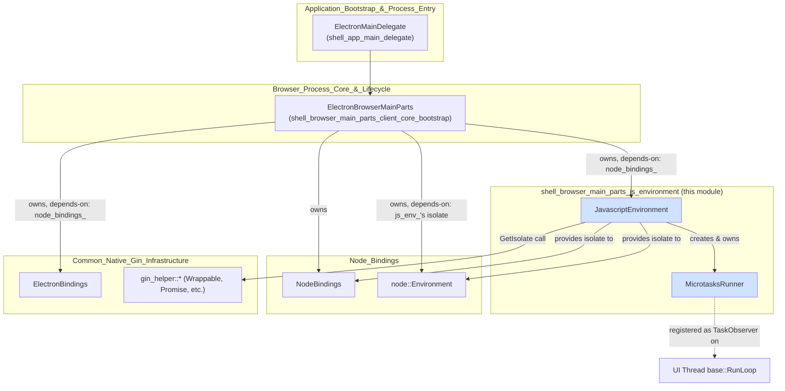
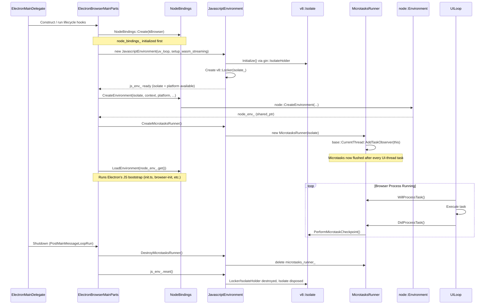
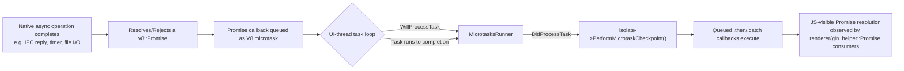

# JavaScript Environment (Browser Process)

## Introduction

The **JavaScript Environment** module is a small, focused subsystem of Electron's browser-process bootstrap sequence. It owns and manages the lifetime of the **V8 isolate**, its associated **`node::MultiIsolatePlatform`**, and the **microtask flushing** mechanism that keeps promises and other queued microtasks running correctly inside Chromium's `base::MessageLoop`/`base::RunLoop` task system.

It is composed of two tightly coupled classes:

| Component | File | Responsibility |
|---|---|---|
| `JavascriptEnvironment` | `shell/browser/javascript_environment.h` | Creates/owns the V8 `Isolate`, the `node::MultiIsolatePlatform`, the `gin::IsolateHolder`, and a `v8::Locker`. Provides isolate access to the rest of the browser process. |
| `MicrotasksRunner` | `shell/browser/microtasks_runner.h` | A `base::TaskObserver` that flushes V8 microtasks (e.g., Promise callbacks) after every task processed on the UI thread's message loop, since Node uses the `kExplicit` microtasks policy. |

This module sits directly beneath [shell_browser_main_parts_client_core_bootstrap](shell_browser_main_parts_client_core_bootstrap.md) (specifically `ElectronBrowserMainParts`), which is responsible for orchestrating the browser process startup sequence, and it depends on Node's isolate/platform infrastructure documented in [Node_Bindings](Node_Bindings.md).

---

## Purpose & Core Functionality

Electron embeds Node.js inside Chromium's multi-process architecture. Both the browser process and Node.js need to share (or at least coordinate) a V8 isolate, and Node.js requires special initialization (via `node::MultiIsolatePlatform`) to interoperate with Chromium's own V8 usage (Blink renderer, etc.).

`JavascriptEnvironment` is the single point of truth for:

1. **Isolate creation** — Initializes a V8 isolate using `gin::IsolateHolder`, configured with a `node::MultiIsolatePlatform` so Node and Chromium share tasking/threading semantics.
2. **Isolate locking** — Holds a `v8::Locker` to guard concurrent access, since the browser process may run V8 operations from multiple contexts.
3. **Microtask policy management** — Node.js processes microtasks explicitly (`kExplicit` policy) rather than automatically after each JS callback. Because the browser process runs its own `base::RunLoop`-based task scheduling (not V8's normal callback-based microtask checkpoints), `JavascriptEnvironment` creates a `MicrotasksRunner` task observer that explicitly flushes microtasks between browser UI-thread tasks.
4. **Global isolate access** — Exposes a static `JavascriptEnvironment::GetIsolate()` for code across the browser process that needs V8 isolate access without threading it through every call site.

---

## Component Details

### `JavascriptEnvironment`

```cpp
class JavascriptEnvironment {
 public:
  JavascriptEnvironment(uv_loop_t* event_loop, bool setup_wasm_streaming = false);
  ~JavascriptEnvironment();

  void CreateMicrotasksRunner();
  void DestroyMicrotasksRunner();

  node::MultiIsolatePlatform* platform() const;
  v8::Isolate* isolate() const;
  size_t max_young_generation_size_in_bytes() const;

  static v8::Isolate* GetIsolate();

 private:
  v8::Isolate* Initialize(uv_loop_t* event_loop, bool setup_wasm_streaming);

  std::unique_ptr<node::MultiIsolatePlatform> platform_;
  size_t max_young_generation_size_ = 0;
  std::unique_ptr<gin::IsolateHolder> isolate_holder_;
  const raw_ptr<v8::Isolate> isolate_;         // owned by isolate_holder_
  std::unique_ptr<v8::Locker> locker_;         // depends on isolate_
  std::unique_ptr<MicrotasksRunner> microtasks_runner_;
};
```

Key design points:

- **Ownership chain**: `isolate_holder_` owns the actual `v8::Isolate*`; `isolate_` is a non-owning `raw_ptr` cached for convenience. `locker_` depends on `isolate_` being valid, and must be destroyed before the isolate is torn down — enforced by declaration order (C++ destroys members in reverse declaration order).
- **`event_loop` parameter**: Takes the libuv event loop (`uv_loop_t*`) used by [Node_Bindings](Node_Bindings.md)'s `NodeBindings`, so that the V8 platform's task queues can properly interleave with libuv's I/O polling.
- **`setup_wasm_streaming`**: Optional flag to enable WebAssembly streaming compilation support in the isolate — relevant when the browser process needs to compile/stream Wasm modules (e.g., via `fetch`/`WebAssembly.compileStreaming` semantics).
- **Copy-disabled**: The class explicitly disables copy construction/assignment, since it manages unique low-level V8/Node resources.
- **`CreateMicrotasksRunner()` / `DestroyMicrotasksRunner()`**: Explicit lifecycle methods (rather than doing this unconditionally in the constructor) allow `ElectronBrowserMainParts` to control *when* microtask flushing begins/ends relative to other startup/shutdown steps (see [Process Flow](#process-flow-startup-sequence) below).
- **`GetIsolate()`**: A static accessor, implying a process-wide singleton-like pattern (`ElectronBrowserMainParts::Get()` holds the single `JavascriptEnvironment` instance in the browser process — see [shell_browser_main_parts_client_core_bootstrap](shell_browser_main_parts_client_core_bootstrap.md)).

### `MicrotasksRunner`

```cpp
class MicrotasksRunner : public base::TaskObserver {
 public:
  explicit MicrotasksRunner(v8::Isolate* isolate);

  void WillProcessTask(const base::PendingTask& pending_task,
                        bool was_blocked_or_low_priority) override;
  void DidProcessTask(const base::PendingTask& pending_task) override;

 private:
  raw_ptr<v8::Isolate> isolate_;
};
```

- Implements Chromium's `base::TaskObserver` interface, which is registered with the current thread's task executor (`base::CurrentThread::Get()->AddTaskObserver(...)`, done internally when `CreateMicrotasksRunner()` is called).
- `DidProcessTask()` is where the actual microtask checkpoint (`isolate->PerformMicrotaskCheckpoint()` or equivalent) is triggered after each browser UI-thread task completes — mirroring the `EndOfTaskRunner` pattern used in Blink's renderer main loop.
- This ensures that any JS Promises resolved by native code running in the browser process (e.g., resolving `ipcRenderer.invoke` promises, native API promises) get their `.then()` callbacks correctly scheduled, since Node's `kExplicit` policy means V8 does **not** flush microtasks automatically.

---

## Architecture



### Dependency Notes

- **Upstream owner**: `ElectronBrowserMainParts` (in [shell_browser_main_parts_client_core_bootstrap](shell_browser_main_parts_client_core_bootstrap.md)) declares:
  ```cpp
  const std::unique_ptr<NodeBindings> node_bindings_;
  const std::unique_ptr<ElectronBindings> electron_bindings_;  // depends-on: node_bindings_
  std::unique_ptr<JavascriptEnvironment> js_env_;              // depends-on: node_bindings_
  std::shared_ptr<node::Environment> node_env_;                // depends-on: js_env_'s isolate
  std::unique_ptr<Browser> browser_;                           // depends-on: js_env_'s isolate
  ```
  This establishes the explicit dependency order: `NodeBindings` → `JavascriptEnvironment` → `node::Environment` → `Browser`.
- **Downstream consumers**: Any browser-process code performing V8 operations (gin wrappables, promises, converters in [Gin_Helper](Gin_Helper.md) and [Gin_Converters](Gin_Converters.md)) relies indirectly on `JavascriptEnvironment::GetIsolate()` to obtain the active isolate.
- **Node integration**: `node::MultiIsolatePlatform`, obtained via `JavascriptEnvironment::platform()`, is passed into `NodeBindings::CreateEnvironment(...)` (see [Node_Bindings](Node_Bindings.md)) so that the created `node::Environment` shares the same V8 platform abstraction used by the browser process's isolate.

---

## Process Flow: Startup Sequence

The following sequence diagram shows how `JavascriptEnvironment` fits into `ElectronBrowserMainParts`' staged Chromium `BrowserMainParts` lifecycle (`PreCreateThreads`, `PostCreateThreads`, etc.):



### Key ordering guarantees

1. `NodeBindings` (and its `uv_loop_t`) must exist **before** `JavascriptEnvironment` is constructed, since the isolate is initialized with that event loop.
2. `JavascriptEnvironment`'s isolate must exist **before** `NodeBindings::CreateEnvironment()` is called (Node needs an isolate + context to build its `node::Environment`).
3. `CreateMicrotasksRunner()` is called explicitly by `ElectronBrowserMainParts` at an appropriate point in `PreMainMessageLoopRun`/`PostCreateThreads`, ensuring microtask flushing is active before any JS-driven async work (Promises, `process.nextTick`, etc.) begins executing on the UI thread.
4. Teardown mirrors construction in reverse: microtasks runner destroyed first, then the isolate/environment, preventing use-after-free of V8 objects during shutdown.

---

## Data Flow: Microtask Checkpoint



This flow is critical for any browser-process API that returns a JS Promise, e.g., `gin_helper::Promise` used extensively across [Gin_Helper](Gin_Helper.md) (`shell/common/gin_helper/promise.h`) and consumed by API surfaces such as `dialog.showOpenDialog()`, `session.resolveProxy()`, `webContents.print()`, etc.

---

## Relationship to Other Modules

| Related Module | Relationship |
|---|---|
| [shell_browser_main_parts_client_core_bootstrap](shell_browser_main_parts_client_core_bootstrap.md) | Owns the single `JavascriptEnvironment` instance (`js_env_`) as part of `ElectronBrowserMainParts`; drives its lifecycle through `BrowserMainParts` stage callbacks. |
| [Node_Bindings](Node_Bindings.md) | Supplies the `uv_loop_t*` used to initialize the isolate, and consumes the isolate + `node::MultiIsolatePlatform` to construct the `node::Environment`. |
| [Gin_Helper](Gin_Helper.md) | Uses `JavascriptEnvironment::GetIsolate()` implicitly through gin's isolate-scoped APIs (`Wrappable`, `Promise`, `Locker`, etc.) when constructing V8 objects from native code. |
| [Gin_Converters](Gin_Converters.md) | Type converters operate within the isolate/context managed by this module. |
| [shell_browser_main_parts_client_core_browser_client](shell_browser_main_parts_client_core_browser_client.md) | `ElectronBrowserClient` and related content-layer hooks execute within the same isolate lifetime managed here. |
| [V8_Node_Common_Utils](V8_Node_Common_Utils.md) | `shell/common/node_util.h`'s `ExplicitMicrotasksScope` complements `MicrotasksRunner` for cases needing scoped (rather than per-task) microtask flushing. |

---

## Summary

The `shell_browser_main_parts_js_environment` module is intentionally minimal in surface area but foundational: it guarantees a single, correctly-scoped V8 isolate exists for the entire lifetime of the browser process, integrated with Node's threading/platform model, and ensures Promise-based JS code behaves correctly under Chromium's task-queue-driven execution model via explicit microtask checkpointing. All higher-level JS-facing browser APIs (documented across the `shell_browser_api_*` and `Common_Native_Gin_Infrastructure` modules) implicitly depend on the isolate this module manages.
