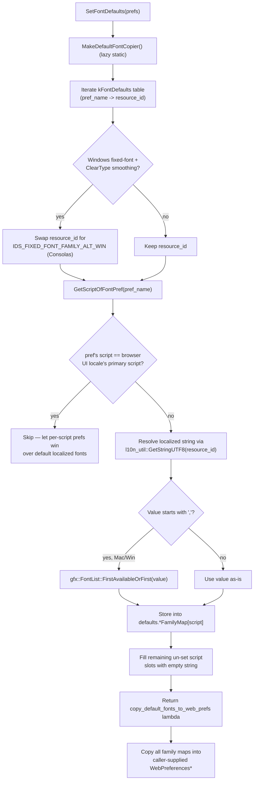
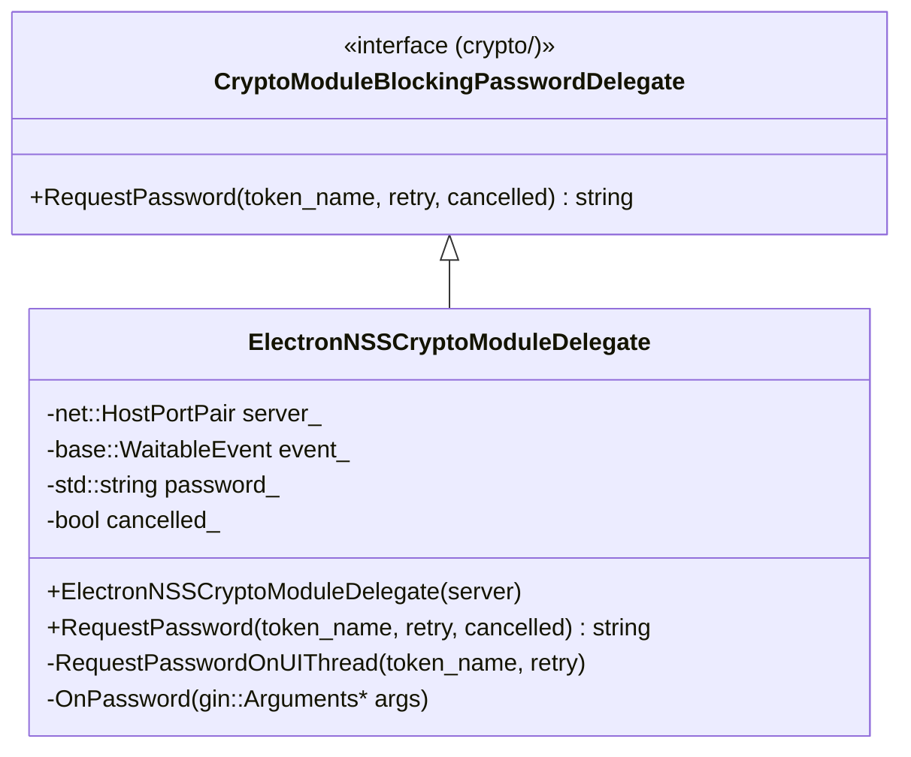
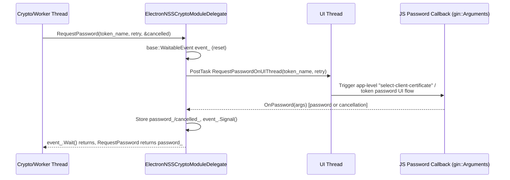
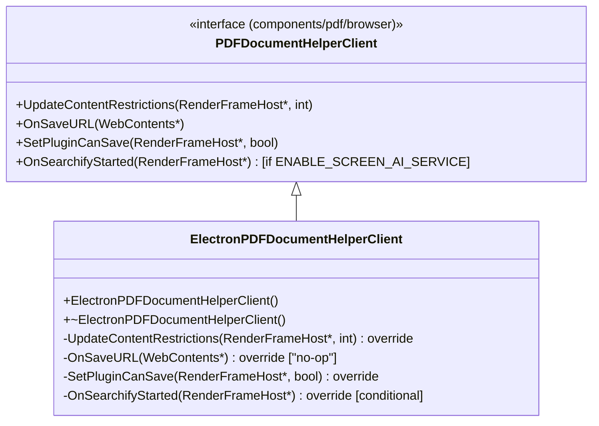
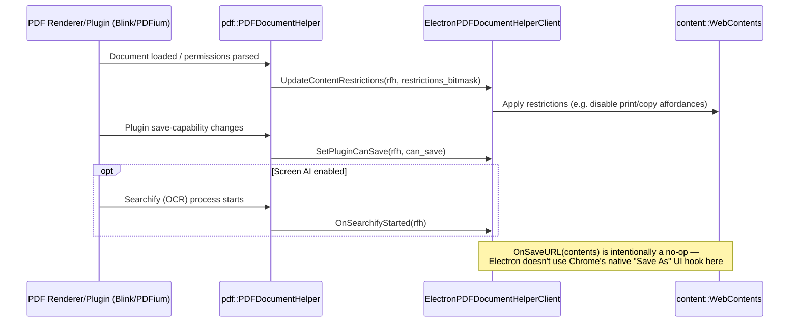
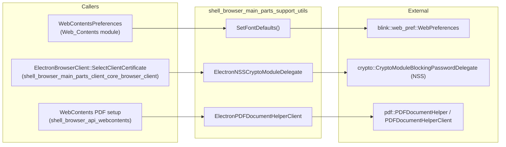

# Shell Browser Main Parts — Support Utilities

## Introduction

This module gathers a small set of **independent, single-purpose helper classes and functions** that are consumed by the browser process bootstrap and by individual `WebContents` instances, but which do not belong to the core lifecycle (`ElectronBrowserMainParts`), the content embedder client (`ElectronBrowserClient`), or the V8/Node.js environment setup. Each utility solves one narrowly-scoped problem:

| Component | Purpose |
|---|---|
| `electron::SetFontDefaults` (`font_defaults.cc/h`) | Populates Chromium's `blink::web_pref::WebPreferences` font-family maps with platform/locale-appropriate default fonts, without requiring a full Chrome-style `PrefService`. |
| `ElectronNSSCryptoModuleDelegate` (`electron_crypto_module_delegate_nss.h`) | Provides a blocking password-prompt delegate for unlocking NSS crypto modules/tokens (client-certificate private keys) on Linux. |
| `ElectronPDFDocumentHelperClient` (`electron_pdf_document_helper_client.h`) | Implements the `pdf::PDFDocumentHelperClient` interface so Electron's built-in Chromium PDF viewer can update content restrictions, control "Save As" availability, and (optionally) react to Screen AI "searchify" events. |

These utilities are structurally part of the [Browser Process Core & Lifecycle](shell_browser_main_parts.md) area but are deliberately decoupled from it — they have no dependency on `ElectronBrowserMainParts` internals and can be understood, tested, and modified in isolation.

---

## 1. Module Position in the System

```mermaid
graph TB
    subgraph BP["Browser_Process_Core_&_Lifecycle"]
        MP["shell_browser_main_parts<br/>(ElectronBrowserMainParts)"]
        subgraph SU["shell_browser_main_parts_support_utils (this module)"]
            FD["font_defaults.cc/h<br/>SetFontDefaults()"]
            NSS["electron_crypto_module_delegate_nss.h<br/>ElectronNSSCryptoModuleDelegate"]
            PDF["electron_pdf_document_helper_client.h<br/>ElectronPDFDocumentHelperClient"]
        end
        BC["shell_browser_main_parts_client_core_browser_client<br/>(ElectronBrowserClient)"]
        BOOT["shell_browser_main_parts_client_core_bootstrap<br/>(ElectronBrowserMainParts.h)"]
        JS["shell_browser_main_parts_js_environment"]
        CD["shell_browser_main_parts_content_delegates"]
    end

    WCP["Web_Contents<br/>(WebContentsPreferences)"]
    WC["shell_browser_api_webcontents<br/>(WebContents)"]

    WCP -->|"calls to fill WebPreferences"| FD
    BC -->|"creates for SelectClientCertificate"| NSS
    WC -->|"constructs for PDF viewer WebContents"| PDF

    BOOT -.->|"sibling, no direct dependency"| SU
    BC -.->|"sibling, no direct dependency"| SU

    style SU fill:#eef7ff,stroke:#4477aa,stroke-width:2px
```



**Key point:** unlike `ElectronBrowserMainParts` (process-wide startup/shutdown orchestration, see [shell_browser_main_parts_client_core_bootstrap](shell_browser_main_parts_client_core_bootstrap.md)) or `ElectronBrowserClient` (the content-layer embedder hook, see [shell_browser_main_parts_client_core_browser_client](shell_browser_main_parts_client_core_browser_client.md)), the components here are **called into** by other subsystems rather than driving the application lifecycle themselves.

---

## 2. Font Defaults (`font_defaults.cc/h`)

### Purpose

Chromium normally derives default font-family preferences (standard, fixed, serif, sans-serif, cursive, fantasy, math — per script) from a `PrefService` populated by `chrome/browser/ui/prefs/prefs_tab_helper.cc`. Electron does not use Chrome's full preference/pref-registration pipeline for these prefs, so `SetFontDefaults()` reimplements the relevant logic to fill a `blink::web_pref::WebPreferences` struct directly, in-memory, once per process (cached via a static lambda).

### Core Function

```cpp
namespace electron {
void SetFontDefaults(blink::web_pref::WebPreferences* prefs);
}
```

### Internal Data Flow



### Key Design Points

- **Static caching**: `MakeDefaultFontCopier()` builds the defaults table once (`static const auto copy_default_fonts_to_web_prefs = ...`) and reuses the copier lambda on every call to `SetFontDefaults`, avoiding repeated ICU/locale lookups.
- **Locale-script suppression**: if a font default's script matches the primary script of the browser's UI locale, the default is intentionally *not* applied, so it doesn't clobber a user's OS/locale font choice with a English-oriented default.
- **Platform gating**: font tables for Japanese/Korean/Han/Cyrillic/Greek/Arabic scripts are compiled in only for `IS_CHROMEOS`, `IS_MAC`, or `IS_WIN` as appropriate, mirroring upstream Chromium's `prefs_tab_helper.cc` (the code comments explicitly mark this table as "DO NOT EDIT" except to sync with Chromium upstream changes).
- **Windows ClearType special case**: swaps Courier New for Consolas as the default fixed-width font when ClearType antialiasing is active.

### Consumers

`SetFontDefaults` is invoked when building `blink::web_pref::WebPreferences` for a renderer/`WebContents`, most notably from `WebContentsPreferences` in the [Web_Contents](Web_Contents.md) module, which owns the broader per-`WebContents` preferences pipeline (zoom, autoplay, etc.). This module documents only the font-defaults algorithm; see [Web_Contents](Web_Contents.md) for how/when `WebPreferences` is constructed and applied to a renderer.

---

## 3. NSS Crypto Module Delegate (`electron_crypto_module_delegate_nss.h`)

### Purpose

On Linux, private keys for client TLS certificates may be stored in NSS-managed security tokens/modules that are password (PIN) protected. `ElectronNSSCryptoModuleDelegate` implements Chromium's `crypto::CryptoModuleBlockingPasswordDelegate` interface to synchronously obtain that password from the user, bridging a blocking crypto-thread call to an asynchronous UI-thread password prompt.

### Class Overview



### Request/Response Sequence



### Key Design Points

- **Thread bridging**: `RequestPassword` runs on a thread that must block (crypto worker), while the actual UI prompt (`RequestPasswordOnUIThread`) must run on the UI thread. A `base::WaitableEvent` synchronizes the two.
- **Ref-counted lifetime**: friended to `base::RefCountedThreadSafe<ElectronNSSCryptoModuleDelegate>` with a private destructor, so instances are managed via ref-counted smart pointers and safely destroyed once no thread holds a reference.
- **Cancellation-aware**: both `retry` (whether this is a repeated prompt after a wrong password) and `cancelled` (out-param signaling user cancellation) are threaded through to the caller.

### Consumers

Instances of this delegate are created by the browser-process client certificate/NSS integration path, typically invoked from `ElectronBrowserClient`'s certificate selection machinery (see `ClientCertificateDelegate` in [shell_browser_main_parts_client_core_browser_client](shell_browser_main_parts_client_core_browser_client.md)) when a client certificate backed by an NSS token requires unlocking before use in TLS handshakes.

---

## 4. PDF Document Helper Client (`electron_pdf_document_helper_client.h`)

### Purpose

Electron embeds Chromium's PDF viewer component (`components/pdf/browser`). That component depends on an embedder-supplied `pdf::PDFDocumentHelperClient` to receive callbacks about content restrictions (e.g., disable printing/copying per the PDF's permissions) and save/plugin capability toggles. `ElectronPDFDocumentHelperClient` is Electron's minimal implementation of this contract.

### Class Overview



### Interaction Flow



### Key Design Points

- **Minimal surface**: Electron does not need Chrome's native "Save As" dialog integration (`OnSaveURL` is a no-op `{}` implementation), since Electron apps typically handle downloads/saving through their own APIs (see [Downloads/Session APIs](shell_browser_api_session_net.md)).
- **Conditional Screen AI support**: `OnSearchifyStarted` is compiled only when `BUILDFLAG(ENABLE_SCREEN_AI_SERVICE)` is set, keeping the class lean on builds without the Screen AI/OCR feature.
- **Content-restriction propagation**: `UpdateContentRestrictions` is the primary integration point, letting Electron's `WebContents`/UI layer know when a loaded PDF disallows printing, copying, etc., due to its embedded permissions.

### Consumers

An `ElectronPDFDocumentHelperClient` is instantiated when Electron wires up the PDF viewer for a `WebContents` (typically alongside `pdf::PDFDocumentHelper::CreateForWebContentsWithClient`). See [shell_browser_api_webcontents](shell_browser_api_webcontents.md) for the `WebContents` API surface and [Web_Contents](Web_Contents.md) for preference wiring that governs whether the PDF viewer is enabled for a given page.

---

## 5. Combined Component Interaction Diagram



---

## 6. Summary Table

| Aspect | Font Defaults | NSS Crypto Delegate | PDF Helper Client |
|---|---|---|---|
| **Files** | `font_defaults.cc`, `font_defaults.h` | `electron_crypto_module_delegate_nss.h` | `electron_pdf_document_helper_client.h` |
| **Type** | Free function + internal struct (`FontDefault`) | Ref-counted delegate class | Small override class |
| **Threading** | Single-threaded, called on demand (result cached in a static lambda) | Crosses crypto-worker ↔ UI thread via `WaitableEvent` | Invoked on UI thread by PDF component callbacks |
| **Platform scope** | All platforms, with `#if BUILDFLAG(...)` branches for CrOS/Mac/Win font tables | Primarily relevant where NSS-backed certs are used (Linux) | All platforms where the PDF viewer is enabled |
| **Upstream mirror** | Ported/adapted from Chromium's `prefs_tab_helper.cc` (explicitly marked "DO NOT EDIT" for the data table) | Adapted from Chromium's NSS crypto module delegate pattern | Implements Chromium's `pdf::PDFDocumentHelperClient` interface |
| **Primary caller module** | [Web_Contents](Web_Contents.md) | [shell_browser_main_parts_client_core_browser_client](shell_browser_main_parts_client_core_browser_client.md) | [shell_browser_api_webcontents](shell_browser_api_webcontents.md) |

## Related Documentation

- [shell_browser_main_parts_client_core_bootstrap](shell_browser_main_parts_client_core_bootstrap.md) — `ElectronBrowserMainParts`, the process-wide startup orchestrator that this module's utilities support indirectly.
- [shell_browser_main_parts_client_core_browser_client](shell_browser_main_parts_client_core_browser_client.md) — `ElectronBrowserClient`, consumer of `ElectronNSSCryptoModuleDelegate` for client-certificate flows.
- [shell_browser_main_parts_js_environment](shell_browser_main_parts_js_environment.md) — sibling module covering the V8/Node.js environment setup (`JavascriptEnvironment`, `MicrotasksRunner`).
- [shell_browser_main_parts_content_delegates](shell_browser_main_parts_content_delegates.md) — sibling module covering other content-layer delegates (GPU client, navigation throttle, speech recognition, plugin info, WebUI factory).
- [Web_Contents](Web_Contents.md) — owns `WebContentsPreferences`, the primary caller of `SetFontDefaults`.
- [shell_browser_api_webcontents](shell_browser_api_webcontents.md) — `WebContents` API surface where the PDF viewer (and thus `ElectronPDFDocumentHelperClient`) is wired up.
