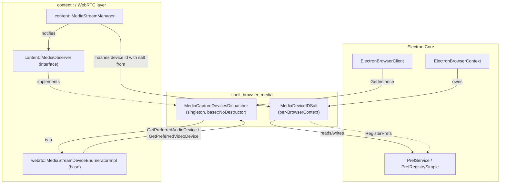
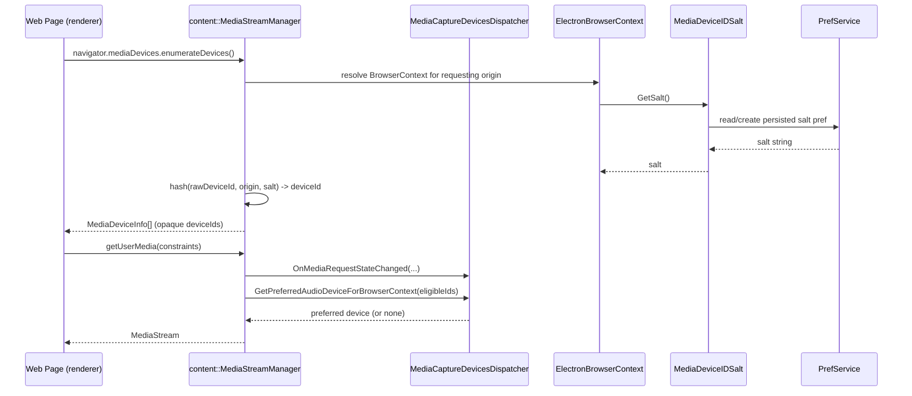

# Shell Browser Media Module

## Introduction

The `shell_browser_media` module provides Electron's browser-process integration points for Chromium's **media capture** subsystem. It is a small but structurally important module consisting of two singleton/utility classes:

- **`MediaCaptureDevicesDispatcher`** — the process-wide `content::MediaObserver` implementation that Chromium's media-capture pipeline (`getUserMedia()`, screen/tab capture, `getDisplayMedia()`) calls into for device-selection and lifecycle notifications.
- **`MediaDeviceIDSalt`** — a per-`BrowserContext` helper that generates and persists the random "salt" string used to produce stable-but-unlinkable `MediaDeviceInfo.deviceId` values exposed to web content via `navigator.mediaDevices.enumerateDevices()`.

Together these two classes satisfy the extension points that `content::BrowserContext` and `content::WebContentsDelegate`/`ElectronBrowserClient` must supply for WebRTC and media-device APIs to function, while keeping actual device I/O inside Chromium/WebRTC and the OS-level media stack.

This module is one of several **Device & Peripheral Access** modules — sibling to [shell_browser_hid](shell_browser_hid.md), [Serial](Serial.md), [USB](USB.md), [WebAuthn](WebAuthn.md), and [shell_browser_bluetooth](shell_browser_bluetooth.md) — but unlike those chooser-based device modules, media capture in Electron does not implement its own permission-prompt/chooser UI here; instead it plugs into Chromium's existing `MediaStreamRequest`/`MediaObserver` machinery and defers UI decisions to app-level JS handlers (`session.setPermissionCheckHandler`, `setDisplayMediaRequestHandler`, etc.) that live in [shell_browser_context](shell_browser_context.md) and [shell_browser_api_session_net](shell_browser_api_session_net.md).

## Purpose & Core Functionality

1. **Report media request/device-change events to the browser process.** `MediaCaptureDevicesDispatcher` implements `content::MediaObserver`, the interface Chromium's `MediaStreamManager` uses to notify the embedder about audio/video capture device changes, request-state transitions, audio-stream creation, and "capturing link secured" status (relevant for tab/screen capture indicators).
2. **Select preferred audio/video devices per `BrowserContext`.** Via `webrtc::MediaStreamDeviceEnumeratorImpl`, it supplies `GetPreferredAudioDeviceForBrowserContext` / `GetPreferredVideoDeviceForBrowserContext`, letting Electron influence which device Chromium picks by default among the eligible devices reported by the enumerator.
3. **Generate a stable per-session device-ID salt.** `MediaDeviceIDSalt` owns a `StringPrefMember` bound to a preference registered via `RegisterPrefs(PrefRegistrySimple*)`. `GetSalt()` returns (creating if necessary) a random string that Chromium's media device enumeration hashes together with the raw device id and the requesting origin to produce the opaque `deviceId` seen by web content — preventing cross-origin device-id correlation while remaining stable for a given origin+session.
4. **Support salt invalidation.** The static `Reset(PrefService*)` method allows clearing the persisted salt (e.g. when a user clears site data/storage), which effectively invalidates all previously issued `deviceId` values for that context, mirroring Chromium's own privacy model.

## Architecture Overview

## Component Responsibilities

### `MediaCaptureDevicesDispatcher` (`media_capture_devices_dispatcher.h`)

A process-wide singleton (`GetInstance()`, backed by `base::NoDestructor`) that:

- Implements `content::MediaObserver` — the majority of its overrides (`OnAudioCaptureDevicesChanged`, `OnVideoCaptureDevicesChanged`, `OnMediaRequestStateChanged`, `OnCreatingAudioStream`, `OnSetCapturingLinkSecured`) are currently no-ops in Electron, since Electron does not render Chrome-style capture indicator UI by default; they exist purely to satisfy the `MediaObserver` contract so Chromium's `MediaStreamManager` can call into the embedder without special-casing Electron.
- Implements `webrtc::MediaStreamDeviceEnumeratorImpl`, overriding `GetPreferredAudioDeviceForBrowserContext` and `GetPreferredVideoDeviceForBrowserContext` so that, given a set of eligible device IDs for a `BrowserContext`, Electron can return a preferred device (defaulting to standard "pick first/eligible" behavior inherited from the base enumerator unless customized).
- Is non-copyable, and privately constructed/destructed — only reachable through `GetInstance()`, guaranteeing a single dispatcher for the whole browser process.
- Is registered as the embedder's `MediaObserver` from `ElectronBrowserClient::GetMediaObserver` (or equivalent hook) in [shell_browser_main_parts](shell_browser_main_parts.md), which is how the content layer discovers it.

### `MediaDeviceIDSalt` (`media_device_id_salt.h`)

A lightweight, per-`BrowserContext`-owned helper that:

- Is constructed with a `PrefService*` (the context's preference store) and immediately binds an internal `StringPrefMember media_device_id_salt_` to the registered pref path.
- Exposes `GetSalt()`, which returns the current salt value, lazily generating a new random string on first access if none is persisted yet.
- Exposes the static `RegisterPrefs(PrefRegistrySimple*)`, called during `ElectronBrowserContext` construction/pref-registration to declare the salt preference with a sensible default.
- Exposes the static `Reset(PrefService*)`, used to explicitly clear/regenerate the salt — typically wired to "clear browsing data" / `session.clearStorageData()` flows so that device IDs are rotated when a user (or app) purges site data.
- Is non-copyable, consistent with the rest of the codebase's ownership conventions for context-scoped singletons.

## Data & Control Flow

## Relationship to Other Modules

| Module | Relationship |
|---|---|
| [shell_browser_context](shell_browser_context.md) | `ElectronBrowserContext` owns a `MediaDeviceIDSalt` instance and registers its prefs alongside other per-context state (cookies, permissions, downloads). It also exposes the `getDisplayMedia`/device-selection surface that ties into `MediaCaptureDevicesDispatcher`'s preferred-device logic. |
| [shell_browser_main_parts](shell_browser_main_parts.md) | `ElectronBrowserClient` wires `MediaCaptureDevicesDispatcher::GetInstance()` into content's `MediaObserver` hook so the content layer can reach it; it also owns the `ElectronBrowserMainParts` startup sequence during which media-related prefs get registered. |
| [shell_browser_api_session_net](shell_browser_api_session_net.md) | The JS-facing `Session` object exposes `setDisplayMediaRequestHandler` and permission-check handlers that app code uses to approve/deny/select media streams; these JS-level decisions ultimately interact with the same `BrowserContext` that owns the `MediaDeviceIDSalt`. |
| [shell_browser_hid](shell_browser_hid.md), [Serial](Serial.md), [USB](USB.md), [shell_browser_bluetooth](shell_browser_bluetooth.md) | Sibling **Device & Peripheral Access** modules; unlike these, media capture does not use a Delegate/ChooserContext/ChooserController pattern — permission and selection UX for `getUserMedia`/`getDisplayMedia` is handled entirely at the JS/session level rather than through a native chooser controller. |
| Gin converters (`media_converter.h` in `shell/common/gin_converters`, part of [Common Native/Gin Infrastructure](Common_API.md)) | Converts `blink::MediaStreamRequest` and related structures to/from JS values, enabling `Session`'s permission and device-request handlers to interoperate with the native media-request objects that `MediaCaptureDevicesDispatcher` and `MediaStreamManager` operate on. |

## Key Design Notes

- **Minimal footprint by design.** Both classes are intentionally small: `MediaCaptureDevicesDispatcher` mostly satisfies interface contracts with no-op overrides, and `MediaDeviceIDSalt` is a thin wrapper around a single preference. Electron delegates the actual UX/policy decisions (which device to use, whether to allow capture) to JavaScript-level `Session` handlers rather than building native chooser UI, unlike the HID/Serial/USB modules.
- **Singleton vs. per-context lifetime.** `MediaCaptureDevicesDispatcher` is a single, process-wide singleton (mirroring Chromium's own `MediaCaptureDevicesDispatcher` in `//chrome`), whereas `MediaDeviceIDSalt` is deliberately scoped per `BrowserContext` so that different sessions/partitions get independent, unlinkable device-id salts.
- **Privacy-preserving device IDs.** The salt mechanism follows the same approach used by upstream Chromium/Chrome: raw hardware device identifiers are never exposed directly to web content; only a salted hash (unique per origin and per context) is exposed, and that hash can be invalidated via `Reset()` to align with "clear site data" semantics.
- **No direct device I/O.** Neither class talks to hardware or OS media APIs directly — actual device enumeration and streaming happens inside Chromium/WebRTC and the OS-level capture stack; this module only supplies the browser-process policy/identity hooks those layers require.
