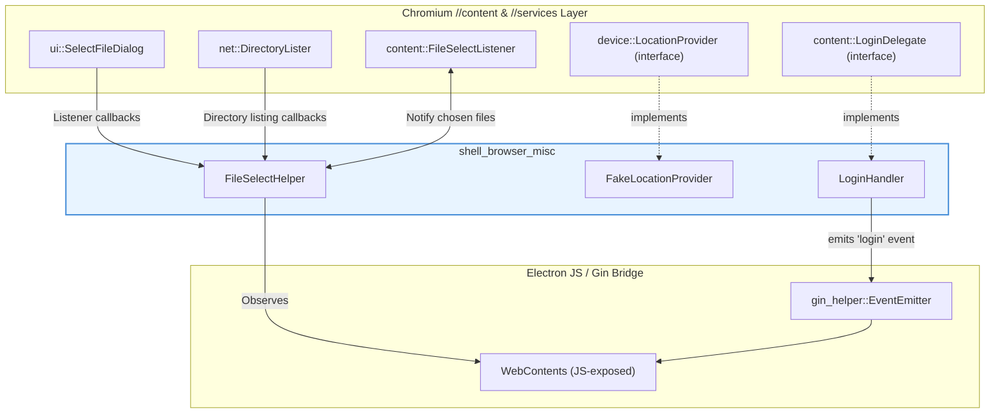
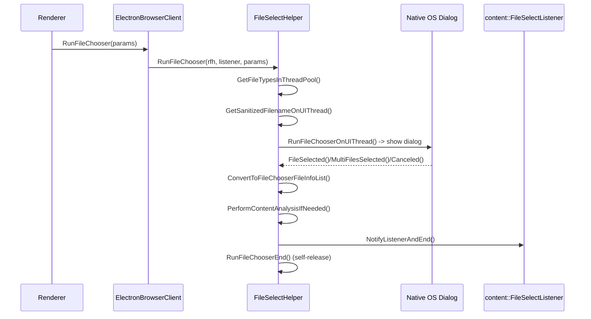
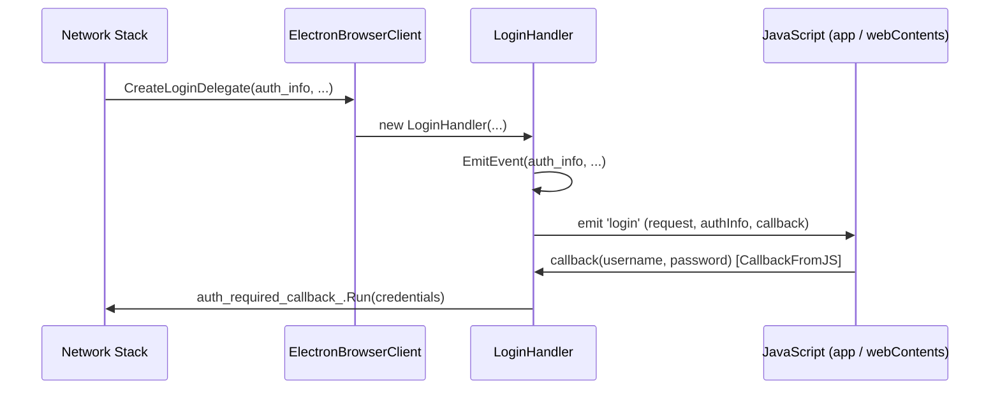
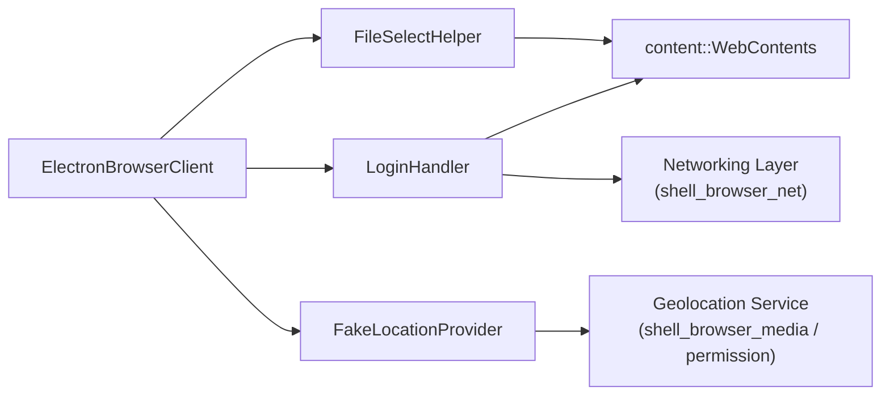

# Shell Browser Misc

## Introduction

`shell_browser_misc` is a small collection of **independent browser-process utility components** in Electron's C++ codebase (`shell/browser/`). Unlike the larger, cohesive subsystems (session management, native windows, networking, etc.), this module groups together standalone helper classes that each solve a narrow, self-contained problem on behalf of a `content::WebContents` or the browser process as a whole. They do not share code with one another, but they are all thin adapters between Chromium's `//content` layer and Electron-specific behavior (JS event emission, dialog UX, and test/stub infrastructure).

The three components covered by this module are:

| Component | File | Responsibility |
|---|---|---|
| `FileSelectHelper` | `shell/browser/file_select_helper.h` | Drives native "Open File" / "Save File" / directory-enumeration dialogs triggered by `<input type="file">` and similar renderer requests. |
| `FakeLocationProvider` | `shell/browser/fake_location_provider.h` | A no-op/stub implementation of Chromium's `device::LocationProvider`, used to satisfy the Geolocation service when no real provider is wired in. |
| `LoginHandler` | `shell/browser/login_handler.h` | Implements `content::LoginDelegate` to surface HTTP Basic/Digest/NTLM authentication challenges to JavaScript (`app`/`webContents` `login` event) and relay the user's credentials back to the network stack. |

Because each class implements a specific Chromium browser-embedder interface (`ui::SelectFileDialog::Listener`, `device::LocationProvider`, `content::LoginDelegate`), this module acts as a set of **integration points** — bridges connecting Chromium's content/service layer callbacks to Electron's own object model and JavaScript event system.

## Architecture Overview

Each component is instantiated by Chromium (via `content::ContentBrowserClient` overrides in [`shell_browser_main_parts_client_core_browser_client`](shell_browser_main_parts_client_core_browser_client.md), specifically `ElectronBrowserClient`) at the point where content needs browser-embedder behavior:

- `FileSelectHelper::RunFileChooser` is called when a renderer requests a file chooser (`ContentBrowserClient::RunFileChooser` path).
- `LoginHandler` is created by `ElectronBrowserClient::CreateLoginDelegate` whenever the network stack encounters an HTTP auth challenge.
- `FakeLocationProvider` is returned by a location-provider factory to stub out real GPS/geolocation hardware access when the platform provider is unavailable or not required.

## Component Details

### FileSelectHelper

**Purpose**: Implements the file-open/save/upload-folder dialog flow requested by web content (e.g. `<input type="file">`), and directory enumeration for drag-and-drop folder uploads.

**Key characteristics**:
- Reference-counted (`base::RefCountedThreadSafe`) and pinned to the UI thread for destruction (`content::BrowserThread::DeleteOnUIThread`), since it observes a `WebContents` and drives UI dialogs.
- Implements three Chromium interfaces:
  - `ui::SelectFileDialog::Listener` — receives `FileSelected`, `MultiFilesSelected`, `FileSelectionCanceled` callbacks from the native OS file dialog.
  - `content::WebContentsObserver` (private) — tracks the lifetime of the requesting page (`RenderFrameHostChanged`, `RenderFrameDeleted`, `WebContentsDestroyed`) so the dialog can be aborted safely if the page navigates away or closes.
  - `net::DirectoryLister::DirectoryListerDelegate` (private) — used for folder-upload enumeration (`OnListFile`, `OnListDone`).
- Public static entry points:
  - `RunFileChooser(render_frame_host, listener, params)` — main entry for renderer-triggered file choosers.
  - `EnumerateDirectory(tab, listener, path)` — used for drag-and-drop folder uploads.
- Internal flow: determines accepted MIME types/extensions off the UI thread pool (`GetFileTypesInThreadPool`), sanitizes suggested filenames, shows the native dialog (`RunFileChooserOnUIThread`), and on selection converts results into `blink::mojom::FileChooserFileInfoPtr` list (`ConvertToFileChooserFileInfoList`) — optionally routed through content-analysis/DLP scanning hooks (`PerformContentAnalysisIfNeeded`) before notifying the renderer (`NotifyListenerAndEnd`).
- On macOS, package directories (e.g. `.app` bundles) selected as files are transparently zipped (`ProcessSelectedFilesMac`, `ZipPackage`) before being handed to the renderer, and the temporary zip files are cleaned up later (`DeleteTemporaryFiles`).
- Nested private struct `ActiveDirectoryEnumeration` tracks at most one in-flight directory enumeration per helper instance.

**Relationships**:
- Consumes `content::WebContents` and `content::RenderFrameHost` from [`shell_browser_api_webcontents`](shell_browser_api_webcontents.md).
- Complements the native OS file/save dialog wrappers documented under **UI Dialogs** in [Desktop_UI_Widgets_&_Dialogs](UI_Dialogs.md) (`shell/browser/ui/file_dialog.h`), though `FileSelectHelper` specifically serves *renderer-initiated* choosers (HTML forms), while `file_dialog.h` serves the `dialog` JS API used directly by app code.

### FakeLocationProvider

**Purpose**: A minimal stand-in implementation of `device::LocationProvider` used by Electron's geolocation service integration when no functional platform location provider is configured. It always reports "stopped" state and never actually resolves a real position, but satisfies the interface contract so the Geolocation Service can operate without crashing or requiring platform-specific location APIs.

**Key characteristics**:
- Maintains a `ProviderState` (`state_`, defaulting to `kStopped`), a cached `device::mojom::GeopositionResultPtr` (`result_`), and the registered `LocationProviderUpdateCallback`.
- Implements the full `LocationProvider` interface surface:
  - `FillDiagnostics` — reports diagnostic state for `chrome://location-internals`-style tooling.
  - `SetUpdateCallback` / `StartProvider` / `StopProvider` — lifecycle management, all effectively no-ops beyond bookkeeping.
  - `GetPosition` — returns the (always null/empty) cached result.
  - `OnPermissionGranted` — hook invoked once the user has granted geolocation permission.

**Relationships**:
- Used as a fallback within the Geolocation permission/service plumbing that also touches [`shell_browser_media`](shell_browser_media.md) and permission infrastructure in [`shell_browser_context`](shell_browser_context.md) (`ElectronPermissionManager`).
- Has no direct dependency on the other two components in this module; it is grouped here purely because it is a small, standalone browser-side stub class.

### LoginHandler

**Purpose**: Bridges Chromium's HTTP authentication challenge flow (`content::LoginDelegate`) to Electron's JavaScript layer, allowing app code to listen for the `login` event on `app`/`webContents` and supply credentials (or cancel) programmatically.

**Key characteristics**:
- Constructed by the browser client with the full challenge context: `net::AuthChallengeInfo`, the requesting `content::WebContents`, whether the request is for the primary main frame / a navigation, the process id, the request `GURL`, response headers, and whether this is the first auth attempt.
- Holds a `content::LoginDelegate::LoginAuthRequiredCallback` (`auth_required_callback_`) that must eventually be invoked with either credentials or `std::nullopt` (cancel).
- `EmitEvent(...)` packages the challenge parameters and fires the `login` JS event (via Electron's gin/event-emitter bridge) so application code can inspect the challenge and supply a username/password asynchronously.
- `CallbackFromJS(gin::Arguments* args)` is the JS-side callback invoked once app code decides how to respond (call `callback(username, password)` or no-op to cancel), which in turn resolves `auth_required_callback_`.
- Uses `base::WeakPtrFactory` to guard against the handler being destroyed while a JS callback is still pending.

**Relationships**:
- Depends on `content::WebContents` from [`shell_browser_api_webcontents`](shell_browser_api_webcontents.md).
- Works in concert with the networking layer's auth-challenge plumbing, e.g. `net::AuthChallengeInfo` used similarly in [`shell_browser_net`](shell_browser_net.md) (`cert_verifier_client.h`, `proxying_url_loader_factory.h`) and the `net_converter.h` gin converter (`AuthChallengeInfo`) documented under [Gin_Converters](Gin_Converters.md).
- Relies on gin argument marshaling (`gin::Arguments`) from [Gin_Helper](Gin_Helper.md) for `CallbackFromJS`.

## How This Module Fits Into the Overall System

`shell_browser_misc` sits within the broader **WebContents Rendering & Communication** area of the browser process. Its siblings in that parent grouping include:

- [`shell_browser_api_webcontents`](shell_browser_api_webcontents.md) — the core `WebContents` JS API wrapper that owns/observes the `content::WebContents` instances that `FileSelectHelper` and `LoginHandler` act upon.
- **Web_Contents** (zoom, preferences, permission helpers) — related browser-side `WebContents` behavior extensions.
- **Web_View** (`WebViewGuestDelegate`, `WebViewManager`) — guest view management for `<webview>` tags.
- [`shell_browser_ipc_handlers`](shell_browser_ipc_handlers.md) — Mojo/IPC endpoint implementations for renderer-to-browser communication.
- **OSR (Offscreen Rendering)**, **Printing**, **Plugins** — other specialized `WebContents`-adjacent feature areas.

All of these, together with `shell_browser_misc`, are invoked/orchestrated by `ElectronBrowserClient` and `ElectronBrowserMainParts`, documented in [Browser_Process_Core_&_Lifecycle](shell_browser_main_parts_client_core_browser_client.md) and [shell_browser_main_parts_client_core_bootstrap](shell_browser_main_parts_client_core_bootstrap.md).

## Summary

`shell_browser_misc` is intentionally lightweight: it does not introduce a sub-architecture of its own, but rather documents three focused, single-responsibility bridge classes that plug Electron's JS-facing behavior into specific Chromium content-layer extension points (file choosers, login prompts, and geolocation stubbing). Because each class is small and self-contained with no cross-dependencies among the three, this module is documented as a single flat page rather than being split into sub-module documents. For related, more extensive subsystems, see [`shell_browser_api_webcontents`](shell_browser_api_webcontents.md), [`shell_browser_net`](shell_browser_net.md), and [`shell_browser_media`](shell_browser_media.md).
