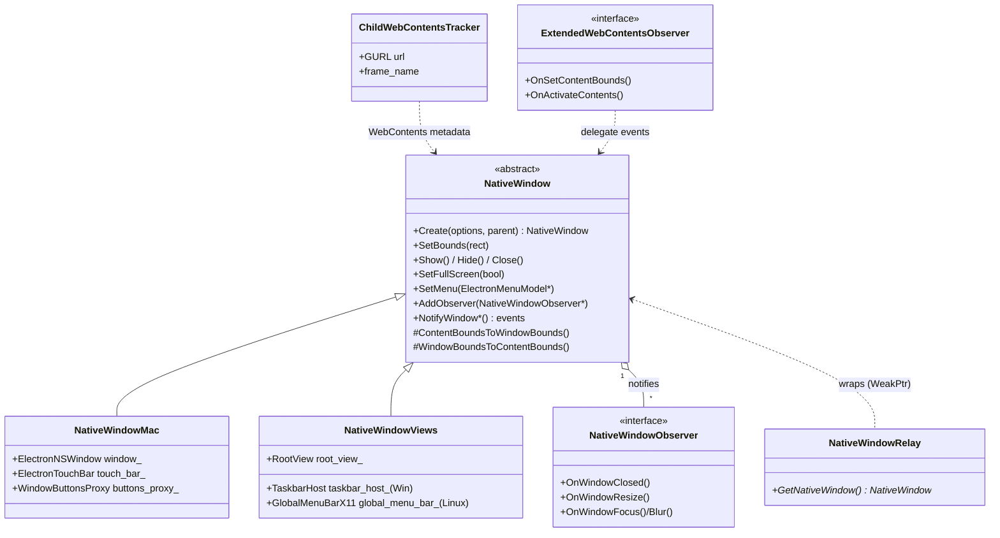
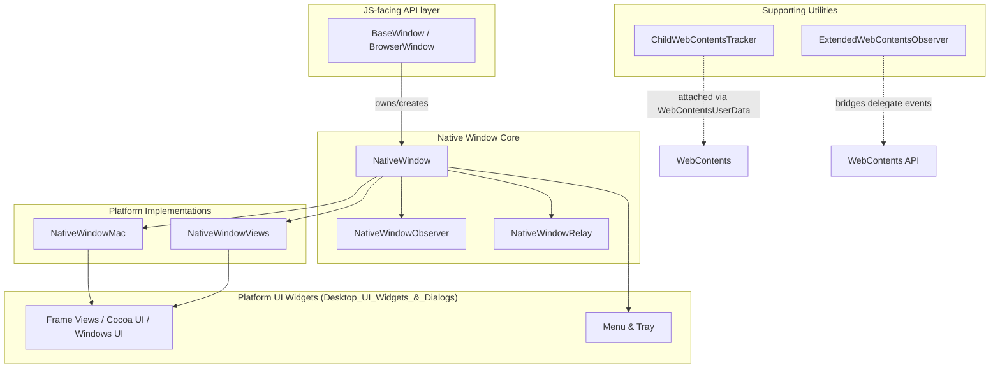
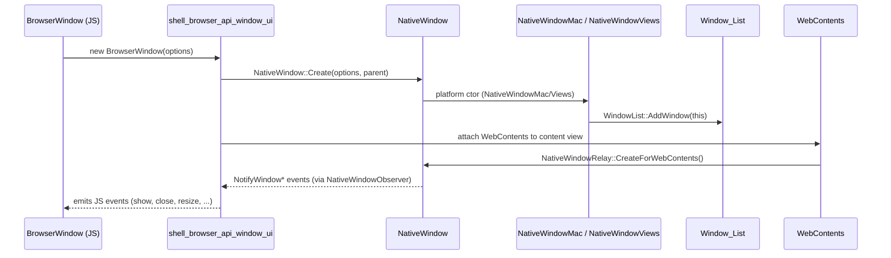

# Native Window Module

## Introduction

The **Native Window** module implements Electron's cross-platform abstraction over native OS windows. It defines the `NativeWindow` base class — the C++ engine behind the JavaScript `BrowserWindow`/`BaseWindow` APIs — along with its two concrete platform back-ends:

- **`NativeWindowMac`** — a Cocoa (`NSWindow`)-backed implementation used on macOS.
- **`NativeWindowViews`** — a Chromium `views::Widget`-backed implementation used on Windows and Linux.

The module also provides supporting infrastructure for:
- Observing window lifecycle/state-change events (`NativeWindowObserver`).
- Tracking child `WebContents` created via `window.open()` (`ChildWebContentsTracker`).
- Bridging `WebContentsDelegate`-only events into observer notifications (`ExtendedWebContentsObserver`).
- Associating a `NativeWindow` with its hosting `WebContents` (`NativeWindowRelay`).

This module sits at the heart of Electron's windowing subsystem: nearly every UI-facing feature (menus, tray icons, frame views, drag & drop, fullscreen, taskbar/dock integration) is built on top of the `NativeWindow` interface it defines.

## Role in the System

`NativeWindow` is a foundational, platform-abstracted class consumed by many other modules:

- **[shell_browser_api_window_ui](shell_browser_api_window_ui.md)** — the Gin/V8 JS bindings (`BaseWindow`, `BrowserWindow`, `Menu`, `Tray`, `View`) wrap and drive a `NativeWindow` instance.
- **[Window_List](Window_List.md)** — maintains the global registry of all live `NativeWindow` instances and notifies listeners when windows are added/removed.
- **[Desktop_UI_Widgets_&_Dialogs](Desktop_UI_Widgets_%26_Dialogs.md)** (Cocoa UI, Frame Views, Windows UI, Menu, Tray Icon sub-modules) — supplies the platform widgets (frame views, window buttons, taskbar hosts, menu bars) that `NativeWindowMac`/`NativeWindowViews` compose.
- **[shell_browser_api_webcontents](shell_browser_api_webcontents.md)** — `WebContents` uses `NativeWindowRelay` to look up its owning window and receives `HandleKeyboardEvent` callbacks from it.
- **[Common_Native_Gin_Infrastructure](Common_Native_Gin_Infrastructure.md)** (Gin Helper / Gin Converters) — supplies `gin_helper::Dictionary`/`PersistentDictionary` used for window creation options and native<->JS value conversion (e.g. `LoginItemSettings`, images, rects).
- **[Browser_Process_Core_&_Lifecycle](Browser_Process_Core_%26_Lifecycle.md)** — `ElectronBrowserMainParts`/`Browser` orchestrate window creation during app startup and shutdown.

## Architecture Overview

### Component Layers

## Sub-modules

This module is documented in the following focused sub-module pages:

| Sub-module | Description | Doc |
|---|---|---|
| **Core Abstraction** | The platform-agnostic `NativeWindow` base class and the `NativeWindowObserver` notification interface that define the contract all platform windows implement. | [shell_browser_native_window_core.md](shell_browser_native_window_core.md) |
| **macOS Implementation** | `NativeWindowMac`, the Cocoa/`NSWindow`-backed concrete implementation, including vibrancy, traffic lights, touch bar, tabs, and fullscreen handling. | [shell_browser_native_window_mac.md](shell_browser_native_window_mac.md) |
| **Windows/Linux (Views) Implementation** | `NativeWindowViews`, the `views::Widget`-backed implementation shared by Windows and Linux, including per-platform frame, taskbar, and menu-bar integration. | [shell_browser_native_window_views.md](shell_browser_native_window_views.md) |
| **Support Utilities** | `ChildWebContentsTracker` and `ExtendedWebContentsObserver`, small helper types used to track `window.open()`-spawned contents and bridge `WebContentsDelegate`-only events. | [shell_browser_native_window_support.md](shell_browser_native_window_support.md) |

## Key Cross-Module Interactions

## See Also

- [shell_browser_api_window_ui](shell_browser_api_window_ui.md) — JS/Gin bindings for `BaseWindow`, `BrowserWindow`, `Menu`, `Tray`, `View`.
- [Window_List](Window_List.md) — global window registry and lifecycle notifications.
- [Desktop_UI_Widgets_&_Dialogs](Desktop_UI_Widgets_%26_Dialogs.md) — frame views, menu bars, tray icons, and dialogs consumed by the platform implementations.
- [shell_browser_api_webcontents](shell_browser_api_webcontents.md) — `WebContents` and related APIs hosted inside a `NativeWindow`.
- [Common_Native_Gin_Infrastructure](Common_Native_Gin_Infrastructure.md) — Gin helper/converter types (`Dictionary`, `PersistentDictionary`, image/rect converters) used throughout window option parsing.
- [Browser_Process_Core_&_Lifecycle](Browser_Process_Core_%26_Lifecycle.md) — application/browser lifecycle that creates and manages windows.
